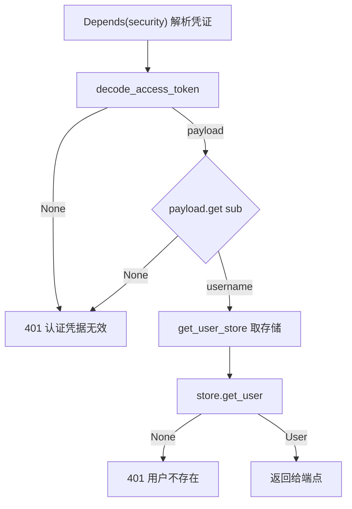
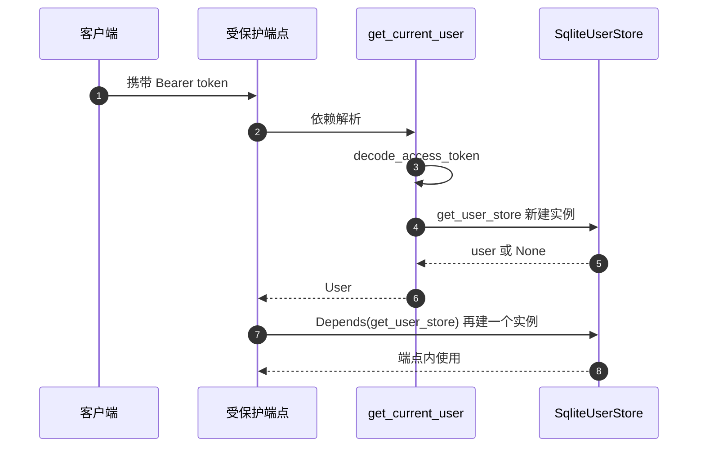

# 鉴权依赖与存储依赖

受保护的端点在签名里声明 `current_user: User = Depends(get_current_user)`，请求进入业务逻辑之前，框架会先解析 `Authorization` 头、校验 token、查出用户对象。这条链的实现在 `backend/routes/auth.py`，token 的签发与解析在 `backend/auth/jwt.py`，密码校验在 `backend/auth/password.py`。

鉴权与存储在依赖链上配合。`Depends` 的通用机制在 `03-Depends的工作方式.md`，装配层在 `01-应用装配与中间件.md`。

## 1. HTTPBearer 实例与凭证对象

模块顶部创建一个 `HTTPBearer`（`backend/routes/auth.py:20`），它是 FastAPI 提供的安全方案类，负责从请求头里取出 `Bearer` 凭证。`get_current_user` 通过 `Depends(security)` 接收解析结果（`:29`），类型是 `HTTPAuthorizationCredentials`，两个有用字段是 `scheme` 与 `credentials`。

`HTTPBearer` 默认 `auto_error=True`：请求缺少 `Authorization` 头时由它直接抛出异常，端点函数不会执行；token 本身无效时由 `get_current_user` 抛出 401（`:34-39`）。两种失败因此对应两个不同状态码，这一点在 `05-易错点与排查.md` 里展开。

## 2. get_current_user 的四段校验

函数体只有二十多行，处理四种失败与一种成功（`backend/routes/auth.py:28-55`）：

| 顺序 | 检查 | 失败处理 | 行号 |
| --- | --- | --- | --- |
| 1 | 取 `credentials.credentials` 作为 token | 无，取字段本身不失败 | `:32` |
| 2 | `decode_access_token` 返回 `None` | 401 `认证凭据无效` | `:33-39` |
| 3 | `payload.get("sub")` 为 `None` | 401 `认证凭据无效` | `:40-46` |
| 4 | `store.get_user(username)` 为 `None` | 401 `用户不存在` | `:47-54` |
| 成功 | 返回 `User` 对象 | 无 | `:55` |

三次 401 都带 `WWW-Authenticate: Bearer` 头。第 3 步与第 2 步的 detail 文本相同，因此调用方无法从响应区分「签名校验失败」与「payload 缺少 sub 字段」。



## 3. token 签发与解析的分工

签发在 `backend/auth/jwt.py:18-35`：复制传入的 `data`、按 `expires_delta` 或默认过期时间算出 `exp`、用 `JWT_SECRET` 与 `HS256` 编码。解析在 `:38-51`：用同一密钥与算法解码，捕 `JWTError` 后返回 `None`，不向调用方抛异常。

调用点有两处，注册与登录各一次，都把用户名放进 `sub`（`backend/routes/auth.py:70`、`:89`）：

```python
access_token = create_access_token(data={"sub": user.username})
```

解析侧用 `payload.get("sub")` 取回用户名（`:40`），与签发侧形成字面对应。中间没有额外的会话表或吊销机制：token 自带过期时间，服务端不记录已签发集合。

| 环节 | 位置 | 行为 |
| --- | --- | --- |
| 签发 | `auth/jwt.py:18-35` | 写入 `sub` 与 `exp`，HS256 签名 |
| 调用 | `routes/auth.py:70`、`:89` | 注册与登录成功后返回给客户端 |
| 解析 | `auth/jwt.py:38-51` | 失败返回 `None`，不抛异常 |
| 使用 | `routes/auth.py:32-46` | 取 `sub` 作为用户名，失败抛 401 |

## 4. 用户存储的每次请求构造

`get_user_store` 只有两行，直接返回新建的 `SqliteUserStore()`（`backend/routes/auth.py:23-25`）。它作为依赖被注册、登录、个人信息、头像与升级等端点使用，也被 `get_current_user` 在函数体内直接调用（`:47`）。

`get_current_user` 里的调用是直接函数调用而不是 `Depends`，因此不受依赖缓存影响：一次受保护请求里，框架解析 `get_current_user` 时会构造一个用户存储，端点若又声明 `store: SqliteUserStore = Depends(get_user_store)`，框架会再解析一次 `get_user_store`。两个实例指向同一数据库，行为一致，只是多了一次对象构造。



## 5. 端点侧的三种依赖组合

`backend/routes/auth.py` 的五个端点点出了三种组合：

| 组合 | 端点 | 行号 |
| --- | --- | --- |
| 只用存储依赖 | `register`、`login` | `:60`、`:76` |
| 用户加存储 | `get_me`、`upgrade`、`avatar` | `:94`、`:153-154`、`:125-126` |
| 不用依赖 | `get_avatar` | `:139` |

注册与登录是未认证端点，只需要存储；个人信息、升级与头像上传需要当前用户；按用户名取头像是公开读，签名里只有一个路径参数（`:139`）：

```python
@router.get("/api/auth/avatar/{username}")
async def get_avatar(username: str):
```

这个端点是本模块里唯一不带任何 `Depends` 的业务端点，它按路径参数直接读文件，见 `05-易错点与排查.md` 的访问面讨论。

## 6. 跨模块复用同一依赖

其他模块从 `routes/auth.py` 导入 `get_current_user`：卡片路由（`backend/routes/cards.py:21`）、会话路由（`backend/routes/sessions.py:13`）、Agent 路由（`backend/agent/routes/agent.py:18` 的使用处）。导入的是函数对象，所以 `Depends` 缓存仍然按同一对象生效。

各模块的鉴权写法一致：把 `current_user` 放在最后一个参数位置，业务参数在前。这个顺序不是框架要求，但仓库里没有反例。

## 7. 令牌有效期与模块注释的差异

`backend/auth/jwt.py:5` 的模块注释写「默认有效期 24 小时」，而有效期实际来自配置：

```python
ACCESS_TOKEN_EXPIRE_MINUTES = 60 * JWT_EXPIRATION_HOURS
```

`JWT_EXPIRATION_HOURS` 的默认值是 `4`（`backend/config.py:172`），因此默认过期时间是 240 分钟，即 4 小时。注释里的 24 小时与实际默认值不一致，部署时若通过环境变量调整，注释也不会同步。

## 8. 易错点

| 易错点 | 现象 | 位置 |
| --- | --- | --- |
| 以为缺 `Authorization` 头返回 401 | `HTTPBearer` 默认先抛错，状态码与 token 无效不同 | `routes/auth.py:20` |
| 用响应文本区分两类 401 | 两类 detail 都是 `认证凭据无效` | `:34-46` |
| 认为 `get_user_store` 每请求只调用一次 | `get_current_user` 内是直接调用，端点再声明依赖会再建一个 | `:47` 与 `:94` |
| 按注释判断 token 有效期 | 注释写 24 小时，默认值是 4 小时 | `auth/jwt.py:5`、`backend/config.py:172` |
| 以为所有 auth 端点都受保护 | `get_avatar` 无依赖 | `:139` |
| 认为 token 可服务端吊销 | 无签发记录，只有过期时间 | `auth/jwt.py:18-51` |

## 小结

核心概念：

| 概念 | 内容 |
| --- | --- |
| 凭证解析 | `HTTPBearer` 取 `Authorization` 头，函数依赖里拿到 `credentials.credentials` |
| 四段校验 | 解码、取 `sub`、查用户，任一失败抛 401，成功返回 `User` |
| 签发与解析 | 都在 `auth/jwt.py`，用 `sub` 字段对应，失败解析返回 `None` |
| 存储依赖 | `get_user_store` 每次调用新建 `SqliteUserStore`，被端点与 `get_current_user` 共用 |
| 端点组合 | 未认证端点只用存储；受保护端点加 `get_current_user` |

设计权衡：

| 决策 | 选择 | 收益 | 代价 |
| --- | --- | --- | --- |
| 鉴权方式 | 无状态 JWT | 无需服务端会话表 | 无法主动吊销，只能等过期 |
| 用户存储 | 依赖内直接构造 | 提供者极简 | 一次请求可能建两个实例 |
| 失败提示 | 两类失败共用同一文案 | 不泄露校验细节 | 排查时要看日志或加日志 |
| 公开头像 | 不挂鉴权依赖 | 头像可直接展示 | 用户名枚举面扩大 |
| 密码哈希 | bcrypt 加 72 字节截断 | 兼容长密码输入 | 截断边界要读实现才知道 |

## 练习

基础题：

1. 写出 `get_current_user` 的四段校验与各自的失败响应。
2. `HTTPBearer` 在请求缺少凭证时会怎样？与 token 无效的响应有何差别？
3. token 里的用户名放在哪个字段？签发与解析各在什么位置？
4. `get_avatar` 为什么不需要 `Depends`？这样做有什么访问面影响？

挑战题：

5. 让 `get_current_user` 复用端点已声明的 `get_user_store` 实例，说明改动方式与依赖缓存能否生效。
6. 设计一个 token 吊销方案，要求保留无状态校验路径，说明需要新增的存储与请求开销。
7. 模块注释与实际有效期不一致。给出一份防止配置说明与默认值漂移的检查方案，并说明接入 CI 的成本。

---

### 附：本页引用的路径

| 路径 | 用途 |
| --- | --- |
| `backend/routes/auth.py` | `HTTPBearer` 实例（:20）、`get_user_store`（:23-25）、`get_current_user`（:28-55）、签发调用（:70、:89）、端点依赖组合（:60、:76、:94、:125-126、:139、:153-154） |
| `backend/auth/jwt.py` | 模块注释（:5）、有效期计算（:15）、签发（:18-35）、解析（:38-51） |
| `backend/auth/password.py` | 哈希与校验（:46-48、:51） |
| `backend/config.py` | `JWT_*` 配置与校验（:168-172） |
| `backend/routes/cards.py` | 跨模块导入 `get_current_user`（:21） |
| `backend/routes/sessions.py` | 跨模块导入（:13）与组合依赖（:19-21） |
| `backend/agent/routes/agent.py` | Agent 端点的鉴权依赖（:18） |
