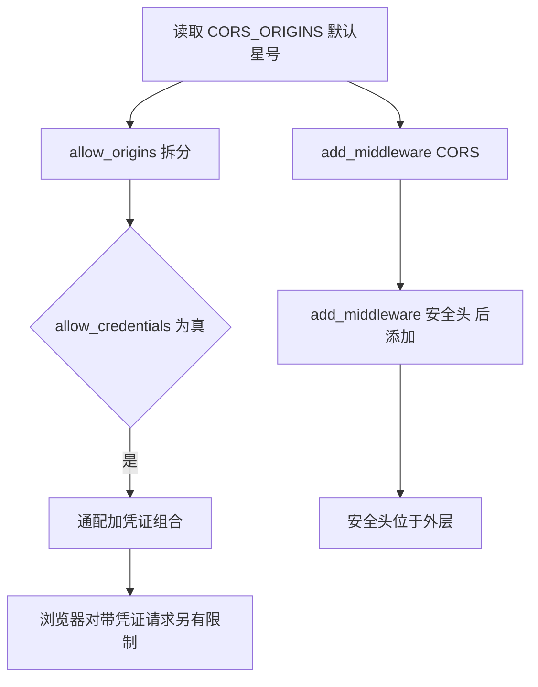
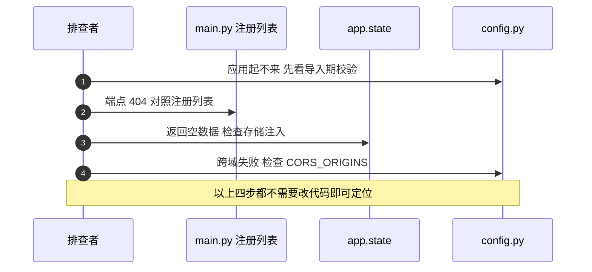

# 装配与依赖的易错点与排查

装配层的代码少，出错时却常常表现为「应用根本起不来」或「端点静默变空」，两类现象都远离出错的那一行。风险按「启动期、请求期、配置期」分组，每条给出位置、现象与确认方式。

模块组织见 `02-路由模块与路径注册.md`，依赖机制见 `03-Depends的工作方式.md`，鉴权链见 `04-鉴权依赖与存储依赖.md`。

## 1. 风险清单

| 编号 | 风险 | 位置 | 现象 |
| --- | --- | --- | --- |
| R1 | 敏感配置在导入期校验并抛异常 | `backend/config.py` | 缺 `JWT_SECRET` 时应用无法启动 |
| R2 | CORS 通配来源与凭证同时开启 | `backend/config.py`、`backend/main.py` | 浏览器拒绝带凭证的跨域请求 |
| R3 | 安全头中间件在 CORS 之后添加 | `backend/main.py` | 执行顺序为后添加者在外层 |
| R4 | 限流装饰器要求端点带 `request` 形参 | `backend/routes/auth.py` | 缺参数时装饰器不生效或报错 |
| R5 | 存储依赖缺失时回退空实例 | `backend/routes/export.py` | 端点返回 200 与空数据 |
| R6 | 受保护端点每次请求新建存储 | `backend/routes/auth.py` | 重复构造，首次还会触发向量索引 |
| R7 | 头像配置项未被任何代码使用 | `backend/config.py` | 改配置不生效，真实限制在服务模块 |
| R8 | 两个路由模块创建了实例但未注册 | `backend/routes/scraper.py`、`backend/routes/search.py` | 端点 404 |
| R9 | 缺凭证与凭证无效返回不同状态码 | `backend/routes/auth.py` | 客户端需要处理两种失败 |

## 2. 启动期：配置校验的位置

`backend/config.py` 在模块顶层读取 `JWT_SECRET`，为空时直接 `raise RuntimeError`。这个文件被 `main.py`、`jwt.py`、`rate_limit.py` 等多处导入，任何一处导入都会触发校验，所以缺配置的表现是应用启动失败，而不是某个接口报错。

| 配置项 | 读取方式 | 缺省表现 |
| --- | --- | --- |
| `JWT_SECRET` | `os.getenv` 后判空并抛异常 | 启动失败 |
| `CORS_ORIGINS` | `os.getenv("CORS_ORIGINS", "*")` | 使用通配来源 |
| `RATE_LIMIT_DEFAULT` | `os.getenv(..., "30/minute")` | 使用默认限值 |
| `AI_API_KEY` | `os.getenv(..., "")` | 空字符串，调用 AI 时才失败 |

同一文件里两类风格并存：安全相关的 `JWT_SECRET` 缺失即失败，其余配置给空串或默认值。`load_dotenv()` 在文件第 19 行执行，所以 .env 里的值在导入期就已生效。

## 3. 请求期：CORS 与中间件顺序

CORS 中间件把 `CORS_ORIGINS` 按逗号拆分，同时设置 `allow_credentials=True`（`backend/main.py`）。`CORS_ORIGINS` 默认 `"*"`（`backend/config.py`）。通配来源加凭证的组合在浏览器侧有额外限制，配置里没有针对这种组合的检查或告警。

安全头中间件在 CORS 之后添加（`backend/main.py`）。Starlette 的中间件栈按添加顺序反向包裹，后添加的在外层，所以安全头最先执行、最后写回；这一条属框架行为，仓库未做额外说明。



## 4. 请求期：限流与依赖

限流器带默认限值（`backend/rate_limit.py`），装配层把它挂到 `app.state.limiter` 并注册异常处理器（`backend/main.py`）。显式装饰器只出现在注册与登录上（`backend/routes/auth.py`），两个端点的签名里都有 `request: Request`。

`slowapi` 的装饰器需要从请求对象取客户端地址，端点上没有 `request` 形参时装饰器无法工作，这一点按该库文档理解。仓库里带装饰器的两个端点都满足这个前提；其余端点是否受默认限值约束取决于库对 `default_limits` 的处理，未在本地实测。

依赖侧的风险集中在「拿不到实例时怎么办」。导出路由的取值逻辑先读 `app.state.card_store`，读不到就新建空存储并写回（`backend/routes/export.py`），端点因此永远不因为缺少存储而失败。排查空文档时，先确认 `app.state.card_store` 是否被设置过。

## 5. 请求期：存储依赖的构造成本

`get_user_store` 每次调用新建 `SqliteUserStore`（`backend/routes/auth.py`），`cards.py` 的端点在函数体内新建 `SqliteCardStore`（`backend/routes/cards.py`）。卡片存储在构造时可以自动建向量索引（`backend/storage/sqlite_card_store.py`），索引按用户名与会话的键缓存在模块级集合里，所以只有首次构造会实际建索引。

| 依赖 | 构造点 | 是否带索引 |
| --- | --- | --- |
| `SqliteUserStore` | 三个提供者与 `get_current_user` 内 | 否 |
| `SqliteCardStore` | 卡片端点内 | 是，首次触发，之后命中缓存 |
| `SessionStore` | 三份 `get_session_store` | 否 |

排查请求变慢时，先确认是否命中了索引缓存；会话或用户新建后的首个请求会比其他请求慢。

## 6. 配置期：一个未被使用的配置项

`backend/config.py` 定义了两个头像相关常量：

```python
AVATAR_MAX_SIZE: int = 5 * 1024 * 1024  # 5MB
AVATAR_ALLOWED_EXTENSIONS: List[str] = field(default_factory=lambda: [".png", ".jpg", ".jpeg", ".gif", ".webp"])
```

第二行在数据类之外使用了 `dataclasses.field`。它不是数据类字段声明，模块导入后得到的是一个 `Field` 对象而不是列表。真实的头像限制写在服务模块里（`backend/services/avatar.py`），两个配置项在后端代码里没有任何引用点。修改 `config.py` 里的这两个值不会改变头像校验行为。

## 7. 排查顺序

按「能不能启动、端点在不在、依赖有没有拿到、配置有没有生效」四层推进：

1. 应用启动失败。先看日志里的 `RuntimeError`，确认 `JWT_SECRET` 等导入期校验项。
2. 端点 404。对照 `backend/main.py` 的注册列表，确认模块是否注册；未注册的模块包括 `scraper.py` 与 `search.py`。
3. 端点返回空数据。检查 `app.state` 上的存储是否被注入，特别是导出路由的回退分支。
4. 跨域失败。确认 `CORS_ORIGINS` 的取值，以及是否同时开了凭证。
5. 限流不生效。确认端点是否有 `request` 形参、是否加了 `@limiter.limit`。
6. 请求偏慢。确认新建存储后的首个请求是否触发了索引构建。



## 8. 容易走错的方向

| 现象 | 容易先怀疑 | 实际应先查 |
| --- | --- | --- |
| 应用启动即退出 | 路由代码语法 | `backend/config.py` 的导入期校验 |
| 浏览器跨域失败 | 前端请求写法 | `CORS_ORIGINS` 与凭证开关的组合 |
| 导出为空 | 导出器渲染 | `app.state.card_store` 是否注入 |
| 修改头像限制无效 | 服务模块代码 | 配置项根本没有被引用 |
| 全部端点限流不生效 | 库版本 | 装饰器与 `request` 形参是否齐备 |

## 小结

核心概念：

| 概念 | 内容 |
| --- | --- |
| 启动期校验 | `JWT_SECRET` 缺失即抛异常，影响所有导入 `config` 的模块 |
| CORS 组合 | 通配来源与 `allow_credentials=True` 并存，浏览器侧另有限制 |
| 中间件顺序 | 后添加者在外层，安全头最后写回 |
| 限流前提 | 装饰器需要端点带 `request` 形参 |
| 静默回退 | 存储缺失时端点返回空数据而不是错误 |
| 配置漂移 | 头像两个常量未被引用，真实限制在 `services/avatar.py` |

设计权衡：

| 决策 | 选择 | 收益 | 代价 |
| --- | --- | --- | --- |
| 配置校验时机 | 导入期抛异常 | 缺配置立刻暴露 | 应用无法以降级方式启动 |
| CORS 默认值 | `"*"` | 本地开发方便 | 生产需显式配置 |
| 依赖回退 | 建空实例 | 端点始终可用 | 配置问题被掩盖 |
| 存储构造 | 每请求新建 | 无长生命周期状态 | 首次请求有索引构建成本 |
| 限流 | 全局默认加两处显式 | 认证端点保护更严 | 其余端点的限流依赖库默认行为 |

## 练习

基础题：

1. 列出启动期会抛异常的配置项，并说明它为什么影响整个应用。
2. `CORS_ORIGINS` 默认值是什么？与 `allow_credentials=True` 组合会有什么问题？
3. 限流装饰器对端点签名有什么要求？仓库里哪两个端点满足？
4. 头像相关的两个配置项为什么修改无效？真实限制在哪里？

挑战题：

5. 为 `JWT_SECRET` 设计一个既能早期暴露又允许测试环境降级的校验方案，说明实现位置与安全边界。
6. 给出一次完整的排查记录模板，覆盖启动失败、端点 404、空数据、跨域与限流五类现象，每类写清观测点与判定依据。
7. `config.py` 的 `field` 用法在数据类之外。列出仓库中所有受影响的引用点，并给出两种修复方式及其兼容性影响。

---

### 附：本页引用的路径

| 路径 | 用途 |
| --- | --- |
| `backend/config.py` | 导入期校验、CORS 默认值、限流默认值、头像常量、dotenv 载入 |
| `backend/main.py` | CORS 与安全头、限流挂载、注册列表 |
| `backend/rate_limit.py` | `limiter` 与默认限值 |
| `backend/routes/auth.py` | `HTTPBearer`、提供者、401 分支、限流装饰器 |
| `backend/routes/export.py` | `app.state` 回退 |
| `backend/routes/cards.py` | 端点内构造存储 |
| `backend/storage/sqlite_card_store.py` | 构造与索引缓存 |
| `backend/services/avatar.py` | 真实头像限制 |
| `backend/routes/scraper.py`、`backend/routes/search.py` | 未注册的路由实例 |
