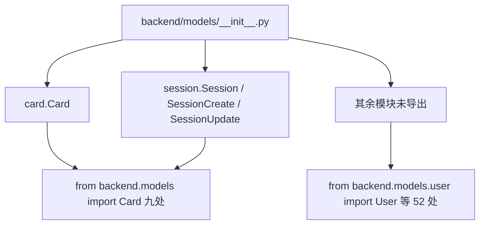
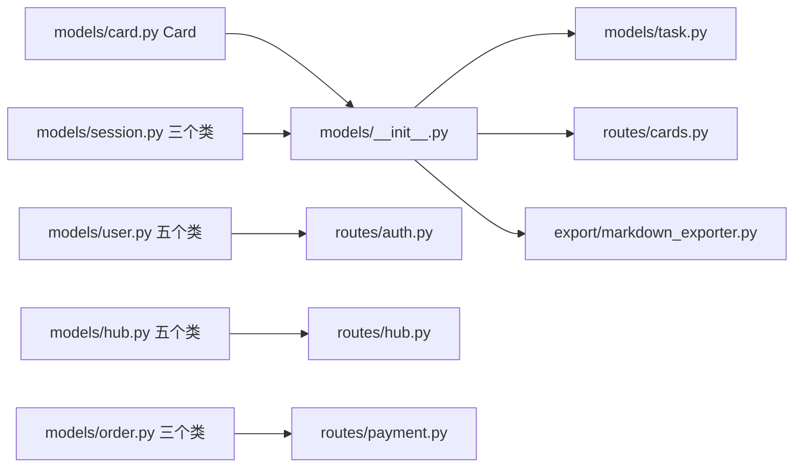

# 模型清单与导出约定

后端的数据模型集中在 `backend/models/`，六个模块共 585 行，定义了卡片、会话、用户、Hub、订单与任务相关的结构。模型既用于请求与响应，也用于存储层的读写，因此字段约定同时受 HTTP 契约与数据库结构约束。

先理清模型清单与导入路径。校验规则在 `02-字段约束与校验器.md`，请求与响应的分工在 `03-请求与响应模型.md`，枚举与序列化在 `04-枚举与序列化.md`。

## 1. 六个模块与类清单

| 模块 | 行数 | 定义的类 |
| --- | --- | --- |
| `models/card.py` | 63 | `Card` |
| `models/session.py` | 63 | `Session`、`SessionCreate`、`SessionUpdate` |
| `models/user.py` | 64 | `User`、`UserCreate`、`UserLogin`、`Token`、`TokenData` |
| `models/hub.py` | 65 | `HubComment`、`HubManifest`、`HubSessionSummary`、`HubSessionDetail`、`HubCommentCreate` |
| `models/order.py` | 51 | `OrderStatus`、`OrderProduct`、`Order` |
| `models/task.py` | 272 | `TaskType`、`TaskStatus`、`TaskProgress`、`TaskEvent`、`Task`、`TaskManager` |

卡片是唯一的单类模块，任务模块最长但其中只有四个 Pydantic 类，`Task` 与 `TaskManager` 是普通 Python 类。

## 2. 包导出只覆盖两个模块

`backend/models/__init__.py` 只有 7 行，导出两张卡片相关的类与两个会话请求模型：

```python
from .card import Card  # noqa: F401
from .session import Session, SessionCreate, SessionUpdate  # noqa: F401
```

用户、Hub、订单、任务的模型都没有进入包级导出。于是仓库里出现两种导入路径：`from backend.models import Card` 出现在九处（如 `backend/routes/cards.py:19`、`backend/export/markdown_exporter.py:14`），而 `from backend.models.user import ...` 这类逐模块导入有 52 处。

| 导入方式 | 例子 | 适用对象 |
| --- | --- | --- |
| 包级 | `from backend.models import Card` | `Card`、会话三件套 |
| 模块级 | `from backend.models.user import User` | 其余全部模型 |

两种路径都能工作，但风格不统一。新增模型时若忘记补 `__init__.py`，包级导入会报 `ImportError`，模块级导入不受影响。



## 3. 必填字段与默认值的分布

三类模型对待默认值的方式不同。`Card` 把身份、正文与来源相关信息设为必填（`backend/models/card.py:23-34`），`User` 把会员与积分设为带默认值的字段（`backend/models/user.py:14-23`），`HubManifest` 则几乎每个字段都有默认值（`backend/models/hub.py:28-40`）。

| 模型 | 必填字段 | 带默认值字段 |
| --- | --- | --- |
| `Card` | `id`、`title`、`content`、`metadata`、`created_at`、`updated_at`、`confidence` | `links`、`backlinks`、`parent_id`、`sources`、`tags` |
| `User` | `username`、`hashed_password`、`created_at` | `avatar_url`、`membership`、`membership_expiry`、`points`、`last_points_refill` |
| `Session` | `id`、`name`、`created_at`、`updated_at` | `card_count` |
| `HubManifest` | `name`、`creator` | 其余九个字段 |

默认值的写法也有两种：不可变默认值直接赋值，如 `card_count: int = 0`（`models/session.py:44`）；可变默认值用 `Field(default_factory=...)`，如 `links` 与 `topics`（`models/card.py:27`、`models/hub.py:34`）。直接给列表或字典赋值会在 Pydantic 中被复制，但仓库统一使用 `default_factory`。

## 4. 默认值里的时间来源

Hub 模型用 `Field(default_factory=datetime.utcnow)` 生成时间戳（`backend/models/hub.py:20`、`:31-32`），`Card` 与 `Session` 的 `created_at` 则是必填，由调用方传入。

| 模型 | 时间字段 | 来源 |
| --- | --- | --- |
| `HubComment` | `created_at` | `default_factory=datetime.utcnow` |
| `HubManifest` | `created_at`、`updated_at` | 同上 |
| `Card` | `created_at`、`updated_at` | 调用方传入 |
| `Session` | `created_at`、`updated_at` | 调用方传入 |

`datetime.utcnow()` 在较新的 Python 中已被标记为遗留接口，仓库仍在使用；这一条属语言层面的提示，不影响当前行为。

## 5. 模型与存储层的字段重合

模型字段直接决定存储写入内容。卡片存储把 `Card` 序列化后落盘（文件系统实现写 frontmatter 与正文，SQLite 实现写列），会话存储围绕 `Session` 的五个字段组织。Hub 与订单模块各自还有独立的存储实现。

存储层读取时会重新构造模型，因此字段改名会同时影响接口与历史数据。`TaskProgress` 与 `TaskEvent` 是例外：它们只用于 SSE 推送，不落库（`backend/models/task.py:45-59`）。

## 6. 模型数量与模块边界

六个模块按业务划分，模块内不互相导入，只有 `task.py` 例外：它从 `backend.models` 导入 `Card`（`backend/models/task.py:22`），用于保存任务生成的卡片列表。这条例外让 `task.py` 依赖包级导出，若 `__init__.py` 调整，任务模块会一并受影响。



## 7. 与第三方版本的关系

运行时使用 `pydantic==2.12.5` 与 `fastapi==0.135.3`（`requirements.txt`）。卡片的校验器仍用 v1 风格写法，其余模块使用 v2 写法，两种风格在同一版本下共存，细节见 `02-字段约束与校验器.md`。

## 8. 易错点

| 易错点 | 现象 | 位置 |
| --- | --- | --- |
| 以为 `backend.models` 导出全部模型 | 导入 `User` 报错 | `models/__init__.py:6-7` |
| 用包级路径导入未导出的类 | `ImportError` | 同上 |
| 以为 `Card.metadata` 可省略 | 构造时报缺字段 | `models/card.py:26` |
| 用可变对象直接作默认值 | 与仓库现有写法不一致 | 统一用 `default_factory`（`:27`） |
| 认为 `Task` 是 Pydantic 模型 | 没有 `model_dump` 方法 | `models/task.py:62` |
| 忽略 `task.py` 对包级导出的依赖 | 调整 `__init__.py` 后任务模块受影响 | `models/task.py:22` |

## 小结

核心概念：

| 概念 | 内容 |
| --- | --- |
| 模块划分 | 卡片、会话、用户、Hub、订单、任务六个模块 |
| 包导出 | `__init__.py` 只导出 `Card` 与三个会话类 |
| 导入路径 | 包级九处、模块级五十二处，两种并存 |
| 默认值写法 | 不可变值直接赋值，可变值用 `Field(default_factory=...)` |
| 非 Pydantic 类 | `Task`、`TaskManager` 是普通类，不参与模型序列化 |

设计权衡：

| 决策 | 选择 | 收益 | 代价 |
| --- | --- | --- | --- |
| 包级导出 | 只导出最常用的两个模块 | 常用类导入短 | 其余类路径冗长且风格不统一 |
| 默认值策略 | 身份与时间必填、展示字段可选 | 缺失身份时立即报错 | 调用方需要自己生成时间戳 |
| 时间默认值 | Hub 用 `utcnow` 工厂 | 模型可在无参时构造 | 使用了遗留接口 |
| 模块内聚 | 按业务分文件互不导入 | 边界清晰 | `task.py` 的例外依赖需要记住 |

## 练习

基础题：

1. 列出六个模型模块与各自定义的类，指出哪些不是 Pydantic 模型。
2. `backend.models` 包级导出了哪些名字？还有哪些模型必须用模块级路径导入？
3. `Card` 与 `User` 的必填字段各有哪些？
4. Hub 模型的时间字段用什么方式生成默认值？

挑战题：

5. 把六类模型全部补进 `__init__.py`，列出需要新增的导入行与可能影响的现有代码。
6. 为 `task.py` 去掉对包级导出的依赖，给出改动方式与对循环导入的影响分析。
7. 若要统一所有模型的导入风格，比较「全部走包级」与「全部走模块级」两种方案的成本。

---

### 附：本页引用的路径

| 路径 | 用途 |
| --- | --- |
| `backend/models/__init__.py` | 包级导出（:6-7） |
| `backend/models/card.py` | 必填与默认字段（:23-34） |
| `backend/models/user.py` | 用户字段与默认值（:14-23） |
| `backend/models/session.py` | 会话字段（:35-44） |
| `backend/models/hub.py` | Hub 字段与时间工厂（:16-40） |
| `backend/models/order.py` | 订单模型与枚举（:15-51） |
| `backend/models/task.py` | 类清单与包级依赖（:22、:27-80） |
| `backend/routes/cards.py` | 包级导入示例（:19） |
| `backend/export/markdown_exporter.py` | 包级导入示例（:14） |
| `requirements.txt` | 依赖版本（pydantic 2.12.5、fastapi 0.135.3） |
