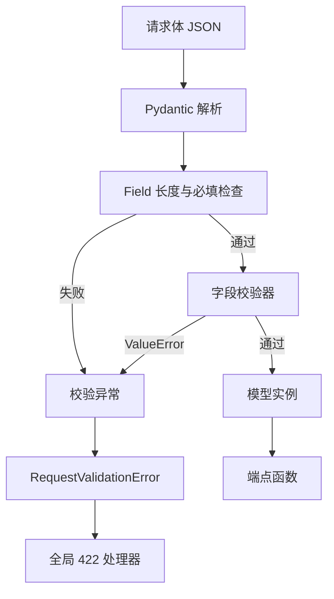
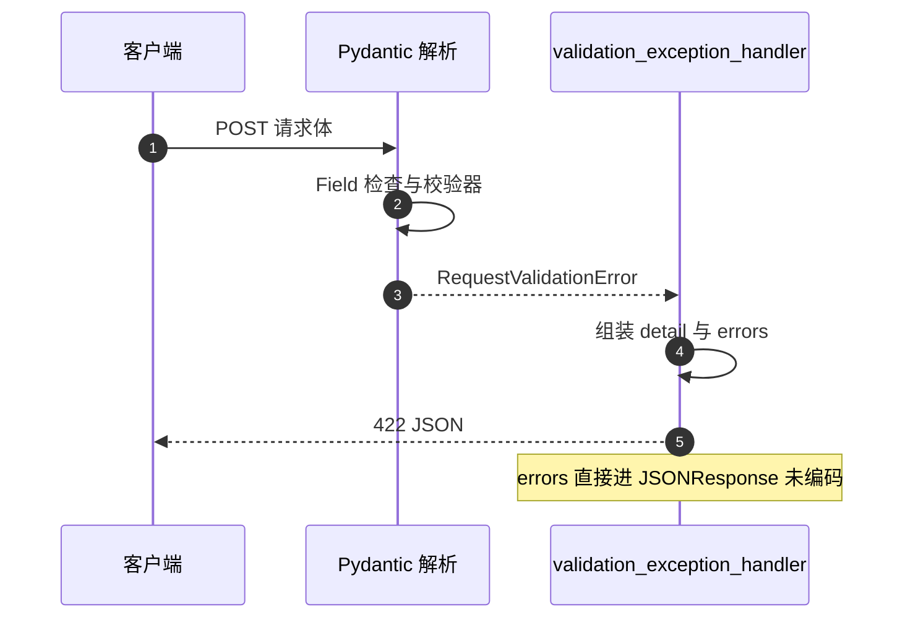

# 字段约束与校验器

模型层的校验分两处：字段声明上的 `Field` 约束负责长度与必填，类里的校验器函数负责格式规则。请求体进入端点之前，FastAPI 会先用模型解析一次，解析失败直接走全局的 422 处理器（`backend/main.py:103-114`），端点函数不会执行。

约束与校验器在仓库里的分布与写法有差异。模型清单在 `01-模型清单与导出约定.md`，请求与响应模型的分工在 `03-请求与响应模型.md`。

## 1. Field 约束的三种用法

`Field` 在仓库里只用于请求模型，且都带 `description`：

| 模型 | 字段 | 约束 | 位置 |
| --- | --- | --- | --- |
| `UserCreate` | `username` | 长度 1 到 16 | `models/user.py:28` |
| `UserCreate` | `password` | 长度 1 到 20 | `models/user.py:29` |
| `SessionCreate` | `name` | 长度 1 到 100 | `models/session.py:49` |
| `SessionUpdate` | `name` | 长度 1 到 100 | `models/session.py:59` |
| `HubCommentCreate` | `content` | 长度 1 到 2000 | `models/hub.py:65` |

三处都写成 `Field(..., min_length=..., max_length=..., description=...)`，第一个位置参数 `...` 表示必填。域模型（`Card`、`User`、`Session`）不使用 `Field` 做长度约束，只对可变默认值用 `default_factory`。

```python
username: str = Field(..., min_length=1, max_length=16, description="用户名，1-16个字符")
password: str = Field(..., min_length=1, max_length=20, description="密码，1-20个字符")
```

长度约束与校验器并不重复：长度在解析阶段先判定，格式规则在校验器里补充。用户名长度 16 的上限由 `Field` 保证，字符集由校验器保证。

## 2. 校验器的两种写法

仓库同时存在两代写法。`UserCreate` 与 `SessionCreate` 使用 `@field_validator` 加 `@classmethod`（`models/user.py:31-32`、`models/session.py:51-52`），`Card` 使用 v1 风格的 `@validator`（`models/card.py:36`、`:45`、`:58`）。

| 写法 | 出现位置 | 版本风格 |
| --- | --- | --- |
| `@field_validator("字段")` 加 `@classmethod` | `user.py`、`session.py` | Pydantic v2 |
| `@validator("字段")` | `card.py` | Pydantic v1 风格 |

当前依赖是 `pydantic==2.12.5`。v2 仍兼容 `@validator`，运行时可用，但属于遗留接口。两种写法在仓库里共存，读代码时要按模块区分。



## 3. 用户名与密码的规则

`UserCreate` 两个校验器的规则都可以用一行读出来（`backend/models/user.py:31-47`）：

| 字段 | 规则 | 失败提示 |
| --- | --- | --- |
| `username` | 只允许字母、数字、下划线、短横线、点；且不能是 `.` 或 `..` | 用户名只能包含字母、数字、下划线、短横线和点 |
| `password` | 每个字符的码点在 32 到 126 之间 | 密码只能包含ASCII可见字符 |

用户名规则里的正则允许点号，所以单独挡掉 `.` 与 `..` 两个路径穿越敏感值（`:37-38`）。密码只检查可见 ASCII，没有长度以外的强度要求，长度上限由 `Field` 的 20 承担。

## 4. 会话名的共享校验函数

会话的 `SessionCreate` 与 `SessionUpdate` 字段完全相同，校验逻辑抽成模块级函数 `_validate_name`（`backend/models/session.py:17-32`），两个校验器都调用它（`:53-54`、`:63-64`）。函数做四件事：判类型、去首尾空白、把连续空白折叠成单空格、判空与长度上限。

| 步骤 | 行为 | 失败条件 |
| --- | --- | --- |
| 类型检查 | 非字符串直接报错 | 输入非字符串 |
| `strip()` | 去首尾空白 | 无 |
| 折叠空白 | 连续空白变单空格 | 无 |
| 判空 | 折叠后为空则报错 | 名称全是空白 |
| 长度 | 超过 100 报错 | 折叠后仍超长 |

注意顺序：长度判断在折叠之后，所以 `"   a   b   "` 这类输入会先被压缩再检查长度。`Session` 域模型本身没有这个名字校验，直接构造 `Session(name="  ")` 不会报错，只有经过 `SessionCreate` 的请求路径才受约束。

## 5. Card 的三处校验

`Card` 的校验器覆盖身份、元数据与置信度（`backend/models/card.py:36-63`）：

| 校验器 | 检查内容 | 依据 |
| --- | --- | --- |
| `id_must_be_uuid` | `uuid.UUID(str(v))` 能否解析 | `:36-43` |
| `metadata_munsure` | 键为字符串，值为字符串、数值或字符串列表 | `:45-56` |
| `confidence_in_range` | 0.0 到 1.0 之间 | `:58-63` |

元数据校验器对列表值还检查元素类型（`:53-55`），保证 `metadata` 的结构在写库前一致。置信度用闭区间判断，0 与 1 都合法。

这三个校验器在构造 `Card` 时生效，因此存储层读回数据时也会走一遍。历史数据里若有越界值，读取会直接失败，而不是被静默修正。

## 6. 校验失败后的响应

FastAPI 把解析失败包装成 `RequestValidationError`，全局处理器返回 422、固定中文文案与 `exc.errors()`（`backend/main.py:103-114`）：

```python
return JSONResponse(
    status_code=422,
    content={
        "detail": "输入数据验证失败，请检查后重试",
        "errors": exc.errors(),
    },
)

```

这里把 `exc.errors()` 直接放进 `JSONResponse`，没有经过 `jsonable_encoder`。Pydantic v2 的错误项里可能带 `ctx` 上下文（例如原始 `ValueError` 对象），这类值不是所有版本都可直接序列化。是否会在某个错误类型上抛二次异常，属推理，未在本仓库实测；若要消除这个不确定性，可以改用 `jsonable_encoder(exc.errors())`。



## 7. 校验边界与模型分工

仓库把校验集中在 Create 类型上：`UserCreate`、`SessionCreate`、`SessionUpdate`、`HubCommentCreate` 都带校验器或 `Field` 约束，而 `UserLogin` 是纯字段模型（`models/user.py:50-53`），没有长度或字符集限制。登录场景下用户名与密码只要类型是字符串就能通过解析，格式判断留给存储层的凭据校验。

| 模型 | 长度约束 | 格式校验器 |
| --- | --- | --- |
| `UserCreate` | 有 | 用户名与密码各一个 |
| `UserLogin` | 无 | 无 |
| `SessionCreate` | 有 | 会话名一个 |
| `HubCommentCreate` | 有 | 无 |

## 8. 易错点

| 易错点 | 现象 | 位置 |
| --- | --- | --- |
| 以为所有请求模型都有校验器 | 登录模型无任何约束 | `models/user.py:50-53` |
| 直接构造域模型期望被校验 | `Session(name="  ")` 不报错 | 校验只在 `SessionCreate`（`session.py:51-54`） |
| 混用两代校验器写法 | 新增代码风格不一致 | `card.py` 用 v1，其余用 v2 |
| 认为 422 的 detail 能区分字段 | detail 是固定文案 | `backend/main.py:111` |
| 忽略折叠后长度检查 | 超长空白串被压缩后通过 | `session.py:26-31` |
| 依赖 errors 一定可序列化 | 未经过 `jsonable_encoder` | `backend/main.py:112` |

## 小结

核心概念：

| 概念 | 内容 |
| --- | --- |
| 两层校验 | `Field` 管必填与长度，校验器管格式 |
| 校验器写法 | `@field_validator` 加 `@classmethod` 为主，`card.py` 仍用 `@validator` |
| 共享逻辑 | 会话名规则抽成 `_validate_name`，两个模型共用 |
| 卡片校验 | UUID、元数据类型、置信度区间三处 |
| 失败响应 | 统一 422，固定中文文案加 `errors` 列表 |

设计权衡：

| 决策 | 选择 | 收益 | 代价 |
| --- | --- | --- | --- |
| 约束位置 | 请求模型承担主要校验 | 端点代码不必重复检查 | 直接构造域模型可绕过 |
| 校验器版本 | 新旧两种并存 | 存量代码不用改写 | 风格不统一，迁移要分批 |
| 错误输出 | 固定 detail 加原始 errors | 前端可展示字段级错误 | errors 未编码，存在序列化不确定性 |
| 登录模型 | 不做格式校验 | 登录路径简单 | 输入格式错误留到凭据校验阶段 |

## 练习

基础题：

1. 列出仓库里使用 `Field` 长度约束的模型与字段。
2. `@validator` 与 `@field_validator` 各出现在哪些文件？当前依赖是哪个大版本？
3. 写出 `_validate_name` 的五步处理顺序。
4. `Card` 的三个校验器分别检查什么？

挑战题：

5. 把 `backend/main.py:112` 的 `exc.errors()` 换成编码后的形式，说明需要引入的导入与对响应体的影响。
6. 为 `UserLogin` 补上与 `UserCreate` 一致的用户名规则，评估对现有客户端的影响。
7. 设计一个把 `card.py` 迁移到 v2 校验器写法的方案，列出需要改写的三处与回归测试要点。

---

### 附：本页引用的路径

| 路径 | 用途 |
| --- | --- |
| `backend/models/user.py` | `Field` 约束（:28-29）、两个校验器（:31-47）、登录模型（:50-53） |
| `backend/models/session.py` | `_validate_name`（:17-32）、两个校验器（:51-54、:61-64）、`Field` 约束（:49、:59） |
| `backend/models/hub.py` | 评论长度约束（:65） |
| `backend/models/card.py` | 三个 v1 校验器（:36-63） |
| `backend/main.py` | 422 处理器（:103-114） |
| `requirements.txt` | `pydantic==2.12.5` |
