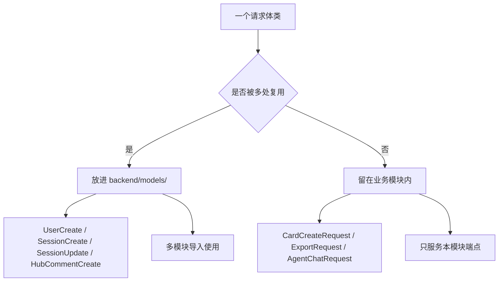
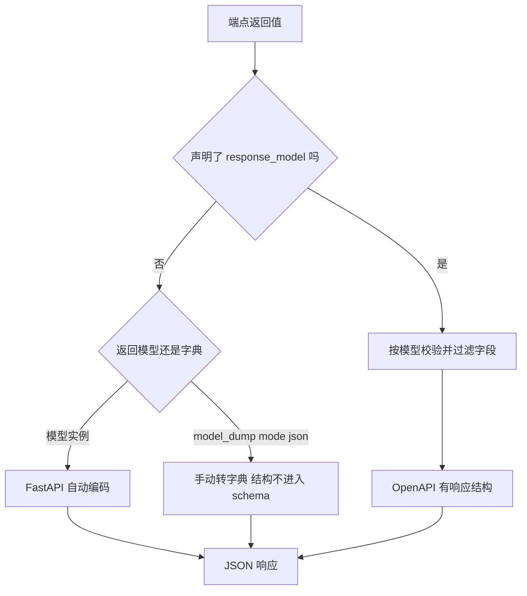

# 请求与响应模型

模型在 HTTP 层有两个方向：进站方向由请求模型约束输入，出站方向由 `response_model` 描述输出。仓库对进站方向的划分比较细，每个业务模块都定义自己的请求类；出站方向只在部分端点声明响应模型，其余端点靠手动序列化。

请求与响应两个方向的分布与写法在这里对照。模型清单在 `01-模型清单与导出约定.md`，校验过程在 `02-字段约束与校验器.md`，枚举序列化在 `04-枚举与序列化.md`。

## 1. 请求模型的两种放置位置

请求模型共十六个，分布在两类位置：五个放进 `backend/models/`，十一个留在各自的业务模块里。

| 位置 | 模型 | 数量 |
| --- | --- | --- |
| `models/` | `UserCreate`、`UserLogin`、`SessionCreate`、`SessionUpdate`、`HubCommentCreate` | 5 |
| 路由与业务模块 | `CardCreateRequest`、`CardUpdateRequest`、`ExportRequest`、`LinkRequest`、`UnlinkRequest`、`SuggestRequest`、`ReclassifyRequest`、`GeneratePayload`、`AgentChatRequest`、`ScrapeRequest`、`SearchRequest` | 11 |

放进 `models/` 的是被多个模块或存储层复用的结构：`SessionCreate` 会被会话路由与 Hub 导入使用，`UserCreate` 与登录注册直接相关。留在路由模块里的是只服务单组端点的请求体，例如卡片的两个请求类就定义在 `backend/routes/cards.py`。

两种位置都能被 FastAPI 用作端点参数类型，区别在复用范围与导入成本。



## 2. 请求模型的命名与默认值

命名有三种后缀，含义基本一致：

| 后缀 | 含义 | 例子 |
| --- | --- | --- |
| `*Create` | 创建请求 | `UserCreate`、`SessionCreate`、`HubCommentCreate` |
| `*Update` | 更新请求 | `SessionUpdate`、`CardUpdateRequest` |
| `*Request` | 通用请求体 | `ExportRequest`、`LinkRequest`、`AgentChatRequest` |

同一个模块内出现 `*Request` 后缀时，字段的可选性差异明显。`CardCreateRequest` 三个字段都有默认值（`backend/routes/cards.py`），`CardUpdateRequest` 四个字段全是 `Optional` 且默认为 `None`：

```python
class CardUpdateRequest(BaseModel):
    """更新卡片请求体。"""
    title: Optional[str] = None
    content: Optional[str] = None
    metadata: Optional[dict] = None
    links: Optional[List[str]] = None
```

全可选的更新模型带来一个语义问题：区分「字段没传」与「字段传了空值」要靠 `exclude_unset` 或端点里的显式判断，仓库在端点侧处理这一区分。

## 3. 带嵌套的请求模型

`ExportRequest` 的 `options` 字段类型是另一个 Pydantic 模型（`backend/routes/export.py`）：

```python
class ExportRequest(BaseModel):
    """导出请求体。"""
    root_id: Optional[str] = None
    options: Optional[ExportOptions] = None
```

嵌套模型让客户端可以只传要覆盖的选项，未传的字段由 `ExportOptions` 的默认值补齐。这一类嵌套在仓库里较少，多数请求体是扁平的。

## 4. response_model 的使用分布

声明了响应模型的端点共十一处，集中在三个模块：

| 模块 | 端点 | 响应模型 |
| --- | --- | --- |
| `routes/auth.py` | 注册、登录 | `Token` |
| `routes/sessions.py` | 列表、创建、详情、更新 | `Session` 或 `List[Session]` |
| `routes/hub.py` | 列表、详情 | `HubSessionSummary`、`HubSessionDetail` |
| `routes/scraper.py` | 单条、批量 | `ScrapedContent` |
| `routes/search.py` | 搜索 | `SearchResponse` |

声明响应模型后，FastAPI 会按模型过滤返回值中的多余字段，并在 OpenAPI 里生成响应结构。`Token` 只有两个字段，其中 `token_type` 有默认值 `"bearer"`（`backend/models/user.py`）。

## 5. 没有响应模型时的返回形态

卡片路由没有声明 `response_model`，而是把模型逐条转成字典（`backend/routes/cards.py`）：

```python
return [card.model_dump(mode="json") for card in cards]
```

`mode="json"` 让 `datetime` 等类型转成 JSON 可用的字符串，`UUID` 也会转成字符串。同样的写法出现在语义搜索端点、流水线的卡片返回（`backend/pipeline/api.py`）与质量评分的序列化（`backend/quality/scorer.py`）。

| 写法 | 返回类型 | 是否过滤字段 | 是否生成响应 schema |
| --- | --- | --- | --- |
| 返回模型加 `response_model` | 模型实例 | 是 | 是 |
| 返回 `model_dump(mode="json")` | 字典列表 | 否 | 端点自己标注 `List[dict]` |

`cards.py` 的端点签名标注 `List[dict]`，文档里因此只显示通用对象结构，字段说明丢失。



## 6. 两个方向的模型是否共用

请求模型与响应模型要不要共用，本质上是输入校验与输出裁剪要不要分成两层：共用一个模型省一层定义，但模型新增字段会同时影响写入与读取两侧，也容易把内部字段暴露出去。本项目的做法是两者大多分开，只有少数模型身兼两职——`Session` 既是域模型也是响应模型，会话端点在创建与更新时直接把 `Session` 作为 `response_model`（`backend/routes/sessions.py`）。`Card` 没有进入响应模型，卡片响应走字典路径。`User` 也没有被声明为响应模型，个人信息端点返回的是手动组装的结构。

| 模型 | 用作请求 | 用作响应 |
| --- | --- | --- |
| `Session` | 否（用 `SessionCreate` / `SessionUpdate`） | 是 |
| `SessionCreate` | 是 | 否 |
| `Card` | 否（用路由内的两个请求类） | 否 |
| `User` | 否 | 否 |
| `Token` | 否 | 是 |

共用时要注意模型新增必填字段会同时影响写入与读取两侧；`Session` 的 `card_count` 有默认值 0，读取时会用存储层给出的值覆盖。

## 7. 请求模型与域模型的字段差异

请求模型是域模型的子集或变体，不继承关系。例如 `CardCreateRequest` 只有标题、正文与父卡三个字段，而 `Card` 有十一个字段（`backend/models/card.py`）。端点负责把请求模型的字段映射到域模型，并补齐 `id`、时间戳与置信度等必填项。

这种手工映射的好处是域模型的必填字段不必全部暴露给客户端；代价是映射代码分散在各端点里，字段增删要同时改两处。

## 8. 易错点

| 易错点 | 现象 | 位置 |
| --- | --- | --- |
| 在 `models/` 里找卡片的请求类 | 它定义在路由模块内 | `routes/cards.py` |
| 认为更新请求能区分未传字段 | 四个字段默认都是 `None` | — |
| 以为所有端点都有响应模型 | 卡片路径返回字典 | — |
| 用 `model_dump()` 不带 `mode` | `datetime` 不转字符串 | 对照  |
| 认为 `Token.token_type` 必传 | 有默认值 `"bearer"` | `models/user.py` |
| 以为请求模型继承域模型 | 各自独立定义 | 字段要手工映射 |

## 小结

核心概念：

| 概念 | 内容 |
| --- | --- |
| 请求模型位置 | 五个在 `models/`，十一个在业务模块内 |
| 命名后缀 | `*Create`、`*Update`、`*Request` 三种 |
| 响应模型 | 十一处声明，集中在 auth、sessions、hub、scraper、search |
| 手动序列化 | `model_dump(mode="json")` 用于卡片与流水线返回 |
| 映射方式 | 请求模型与域模型之间手工映射，不继承 |

设计权衡：

| 决策 | 选择 | 收益 | 代价 |
| --- | --- | --- | --- |
| 请求模型位置 | 按复用范围分裂 | 单模块请求体就近定义 | 同类模型分散，查找成本高 |
| 更新模型 | 全字段可选 | 支持部分更新 | 需要额外逻辑区分未传与传空 |
| 响应声明 | 部分端点声明 | 声明处字段过滤与 schema 完整 | 未声明处文档信息少 |
| 序列化 | 端点内 `model_dump` | 返回结构完全可控 | 字段改名不会引起类型检查告警 |

## 练习

基础题：

1. 说出请求模型的两种放置位置，各举两个例子。
2. `CardCreateRequest` 与 `CardUpdateRequest` 的字段可选性有何不同？
3. 列出声明了 `response_model` 的模块与响应类型。
4. `model_dump(mode="json")` 相比默认调用多做了什么？

挑战题：

5. 为卡片路由补上响应模型，说明需要定义的结构、对现有前端字段的影响，以及 `Card` 中哪些字段应被排除。
6. 设计一个能区分「未传字段」与「显式传空」的部分更新流程，给出模型与端点两侧的改动。
7. 把十一个模块内请求模型上收到 `models/`，列出收益与需要同步修改的导入点数量。

---

### 附：本页引用的路径

| 路径 | 用途 |
| --- | --- |
| `backend/routes/cards.py` | 两个请求类、字典返回、端点签名 |
| `backend/routes/export.py` | 嵌套请求模型 |
| `backend/routes/sessions.py` | 响应模型声明 |
| `backend/routes/auth.py` | `Token` 响应 |
| `backend/routes/hub.py` | Hub 响应模型 |
| `backend/routes/scraper.py` | `ScrapedContent` 响应 |
| `backend/routes/search.py` | `SearchResponse` 响应 |
| `backend/models/user.py` | `UserCreate` 与 `Token` |
| `backend/models/session.py` | 会话请求模型 |
| `backend/models/card.py` | `Card` 字段 |
| `backend/pipeline/api.py` | 卡片序列化 |
| `backend/agent/schemas.py` | `AgentChatRequest` |
