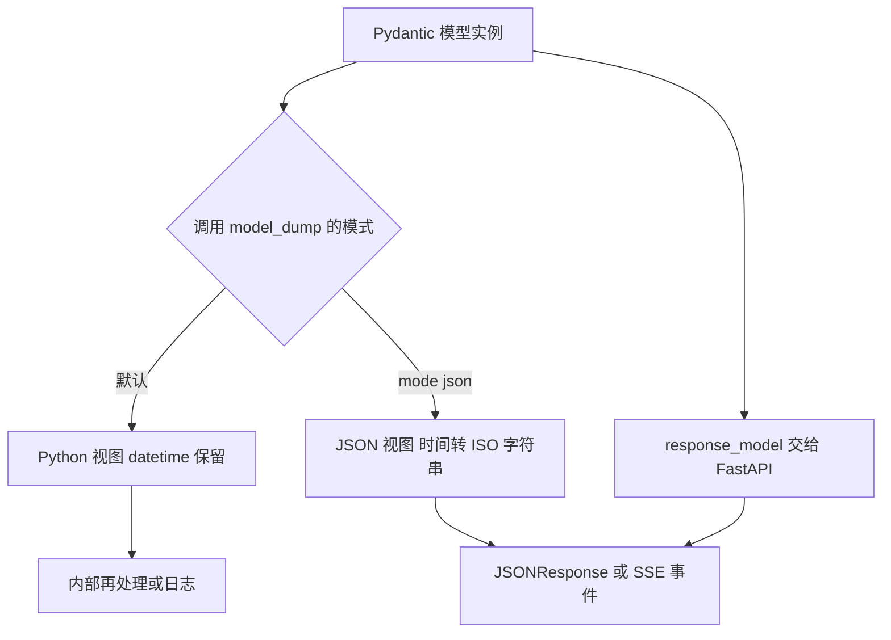
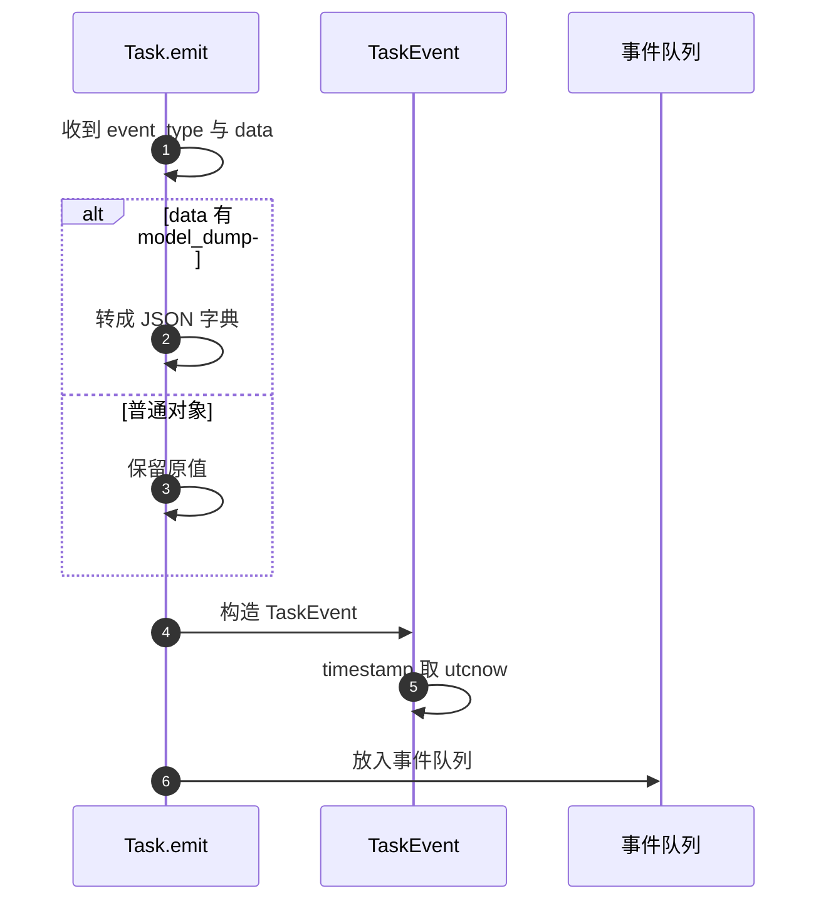

# 枚举与序列化

订单与任务模块用枚举表达固定集合，卡片、会话与用户模块则一律用 `str` 字段。枚举类都继承 `str` 与 `Enum`，因此既能在 Python 里比较，也能直接进 JSON。序列化侧有两套写法：带 `response_model` 的端点交给框架编码，其余端点在代码里调用 `model_dump`。

枚举定义与序列化路径在这里对照。请求与响应模型的分工在 `03-请求与响应模型.md`，模型清单在 `01-模型清单与导出约定.md`。

## 1. 四个 str 枚举

`backend/models/order.py:15-28` 与 `backend/models/task.py:27-42` 各定义两个枚举：

```python
class OrderStatus(str, Enum):
    PENDING = "pending"
    PAYING = "paying"
    PAID = "paid"
    CANCELLED = "cancelled"
    EXPIRED = "expired"
```

| 枚举 | 成员数 | 取值 | 位置 |
| --- | --- | --- | --- |
| `OrderStatus` | 5 | pending、paying、paid、cancelled、expired | `order.py:15-21` |
| `OrderProduct` | 3 | pro、plus、points_24 | `order.py:24-28` |
| `TaskType` | 5 | collect、expand、refresh、document、gap_driven | `task.py:27-34` |
| `TaskStatus` | 5 | pending、running、completed、error、cancelled | `task.py:36-42` |

继承 `str` 的作用有两个：成员可以直接与字符串比较，FastAPI 编码时会输出其字符串值而不是枚举对象。四个枚举都用在后端内部，没有出现在请求或响应模型里：订单接口传的是商品字符串，任务状态在 SSE 事件里以字符串发送。

## 2. 状态字段存字符串

`Order` 的 `status` 字段类型是 `str`，默认值取枚举的值（`backend/models/order.py:43`）：

```python
status: str = OrderStatus.PENDING.value   # 订单状态
```

同类情况出现在 `product`（`:39`，注释列出三个取值）与 `Task.status`（`backend/models/task.py:78` 初始化为 `TaskStatus.PENDING` 成员）。字段类型与枚举类型不一致，意味着模型层面不校验取值范围，写入非法状态不会报错。

端点侧的判断方式也不统一。支付路由有一半用枚举值比较，另一半直接用字符串字面量：

| 判断 | 写法 | 位置 |
| --- | --- | --- |
| 已支付 | `order.status == OrderStatus.PAID.value` | `backend/routes/payment.py:170`、`:251` |
| 待支付或支付中 | `order.status in (OrderStatus.PENDING.value, OrderStatus.PAYING.value)` | `:246` |
| 积分包 | `order.product == "points_24"` | `:196`、`:262` |

字符串字面量与 `OrderProduct.POINTS_24.value` 等价，但字面量绕过了枚举的集中定义，改值时容易漏改。

## 3. 枚举值的序列化位置

任务模块把枚举序列化集中在 `Task.to_dict`：状态取 `.value`，进度用 `model_dump()`，时间用 `isoformat()`（`backend/models/task.py:95-104`）：

```python
"status": self.status.value,
"progress": self.progress.model_dump() if self.progress else None,
"created_at": self.created_at.isoformat(),
"card_count": len(self.generated_cards),
```

这里 `model_dump()` 不带 `mode`，因为任务快照里没有 `datetime` 字段（时间已经手动 `isoformat`），返回的字典只含基本类型。

| 序列化点 | 写法 | 位置 |
| --- | --- | --- |
| 任务快照 | `self.status.value`、`isoformat()` | `task.py:99-101` |
| SSE 事件数据 | `data.model_dump(mode="json")` | `task.py:109` |
| 卡片响应 | `card.model_dump(mode="json")` | `routes/cards.py:54` |
| 语义搜索响应 | `card.model_dump(mode="json")` | `routes/cards.py:80` |

## 4. 两种 model_dump 模式的差别

`model_dump()` 返回 Python 对象视图，`datetime` 仍是 `datetime`；`model_dump(mode="json")` 返回可直接进 JSON 的结构，时间变成 ISO 字符串。是否带 `mode` 取决于结果去往哪里：

| 去向 | 建议用法 | 仓库实例 |
| --- | --- | --- |
| 放进 SSE 事件体或 HTTP JSON | `mode="json"` | `task.py:109`、`cards.py:54` |
| 只用于日志或内部再处理 | 默认 | `task.py:100` |

若把默认模式的字典直接交给 `JSONResponse`，`datetime` 会成为编码错误；仓库在需要 JSON 的位置都显式带了 `mode="json"`。



## 5. 任务事件的载荷处理

`TaskEvent` 的 `data` 字段类型是 `Any`（`backend/models/task.py:55-59`），事件类型决定载荷形态：进度事件是 `TaskProgress`，卡片事件是卡片字典或模型，错误事件是字符串。`Task.emit` 用一个 `hasattr` 判断统一处理（`:106-112`）：

```python
data=data.model_dump(mode="json") if hasattr(data, "model_dump") else data,
```

传模型时转成 JSON 字典，传普通对象时原样保留。这个判断让 `emit` 能接受多种入参，代价是 `data` 的实际结构只能从调用点推断，模型层不再提供保证。



## 6. 任务状态机的状态取值

`TaskStatus` 的五个成员覆盖任务的完整生命周期（`backend/models/task.py:36-42`）。任务对象初始化为 `PENDING`（`:78`），运行、完成、出错与取消分别对应另外四个。状态迁移的代码在 `TaskManager` 与流水线模块里，模型层只定义取值集合。

状态以字符串形式进入 SSE 事件与快照，因此前端无需枚举知识，按字符串判断即可。这一约定让枚举成为后端内部约定，跨端契约是字符串。

## 7. 与 Pydantic 校验的关系

枚举类型字段在 Pydantic 里会自动校验取值，非法成员会被拒绝。仓库里四个枚举都没有用作字段类型，唯一接近的是 `TaskProgress.stage`：它是 `str`，注释列出四个合法阶段（`backend/models/task.py:47`），同样没有取值校验。

| 字段 | 类型 | 是否有取值校验 |
| --- | --- | --- |
| `Order.status` | `str` | 否 |
| `Order.product` | `str` | 否 |
| `TaskProgress.stage` | `str` | 否 |
| 若改为枚举类型 | 枚举 | 是，解析期拒绝非法值 |

把字段类型从 `str` 换成枚举可以免费获得取值校验，同时需要处理历史数据与字符串比较处的兼容，这条权衡写在 `05-易错点与排查.md`。

## 8. 易错点

| 易错点 | 现象 | 位置 |
| --- | --- | --- |
| 以为 `Order.status` 是枚举类型 | 它是 `str`，非法值不报错 | `models/order.py:43` |
| 用枚举比较却忘了取值 | `order.status == OrderStatus.PAID` 永远为假 | `routes/payment.py:170` 用的是 `.value` |
| 混用字面量与枚举 | 改枚举值时漏改字面量 | `:196`、`:262` |
| 给 `JSONResponse` 传默认模式字典 | `datetime` 无法编码 | 需要 `mode="json"` |
| 认为 `TaskEvent.data` 有固定结构 | 类型是 `Any` | `models/task.py:58` |
| 依赖 `stage` 自动校验 | 它是 `str`，无约束 | `models/task.py:47` |

## 小结

核心概念：

| 概念 | 内容 |
| --- | --- |
| 枚举写法 | 四个 `str` 加 `Enum` 类，成员值即 JSON 取值 |
| 字段类型 | 状态与商品字段都是 `str`，模型层不校验取值 |
| 序列化入口 | 任务快照手动取 `.value` 与 `isoformat()`，SSE 用 `model_dump(mode="json")` |
| 两种模式 | 默认保留 Python 类型，`json` 模式转成 JSON 可用结构 |
| 事件载荷 | `TaskEvent.data` 为 `Any`，靠 `hasattr` 判断是否转换 |

设计权衡：

| 决策 | 选择 | 收益 | 代价 |
| --- | --- | --- | --- |
| 状态字段类型 | `str` 加枚举常量 | 存储与比较直接 | 失去取值校验 |
| 枚举继承 `str` | 是 | 可直接比较并序列化 | 枚举与字符串边界模糊，容易漏 `.value` |
| SSE 数据 | 统一走 `model_dump(mode="json")` | 事件体可直接发送 | `Any` 字段结构无模型保证 |
| 手动序列化 | 端点内调用 `model_dump` | 响应结构可控 | 字段改名无类型检查保护 |

## 练习

基础题：

1. 列出四个枚举类与各自的成员取值。
2. `Order.status` 的字段类型是什么？默认值如何得到？
3. `model_dump()` 与 `model_dump(mode="json")` 在时间字段上的差别是什么？
4. `Task.emit` 如何判断载荷是否需要转换？

挑战题：

5. 把 `Order.status` 改成枚举类型，列出需要修复的比较点与历史数据兼容方案。
6. 统一支付路由里商品判断的写法，说明改动点与回归验证方式。
7. 为 `TaskEvent.data` 设计一个带类型的载荷方案（例如多个具体事件模型加联合类型），并说明对 `emit` 调用点的影响。

---

### 附：本页引用的路径

| 路径 | 用途 |
| --- | --- |
| `backend/models/order.py` | 两个订单枚举（:15-28）、订单模型与状态字段（:31-51） |
| `backend/models/task.py` | 两个任务枚举（:27-42）、`TaskProgress` 与 `TaskEvent`（:45-59）、状态初始化（:78）、快照与事件（:95-112） |
| `backend/routes/payment.py` | 状态比较（:170、:246、:251、:284）与商品字面量（:196、:262） |
| `backend/routes/cards.py` | 卡片序列化（:54、:80） |
| `backend/pipeline/api.py` | 卡片返回序列化（:490-493） |
| `backend/quality/scorer.py` | 模型展开序列化（:512） |
