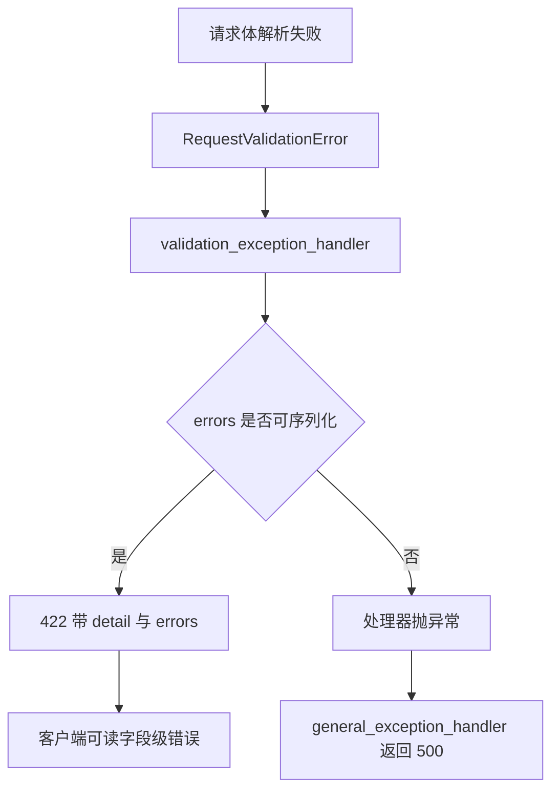
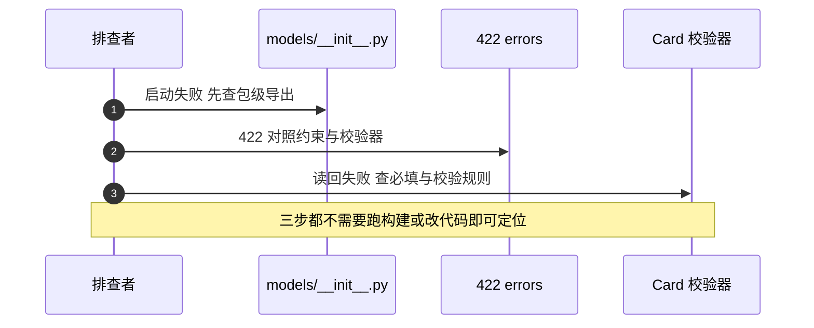

# 模型层的易错点与排查

模型层的问题往往在别处爆发：导入路径不通表现为启动失败，必填字段变化表现为历史数据读不出来，枚举与字符串混用表现为判断永远为假。风险按「导入期、解析期、运行期」分组，并给出一条从报错反推到模型定义的排查顺序。

模型清单见 `01-模型清单与导出约定.md`，校验规则见 `02-字段约束与校验器.md`，序列化见 `04-枚举与序列化.md`。

## 1. 风险清单

| 编号 | 风险 | 位置 | 现象 |
| --- | --- | --- | --- |
| R1 | 两代校验器写法并存 | `models/card.py:36` 与 `models/user.py:31` | 迁移时容易只改一处 |
| R2 | 域模型不校验，校验只在请求模型 | `models/session.py:35-44` 与 `:51-54` | 直接构造可绕过规则 |
| R3 | `models/__init__.py` 只导出两个模块 | `models/__init__.py:6-7` | 包级导入其余类报 `ImportError` |
| R4 | `TokenData` 定义后无引用 | `models/user.py:62-64` | 易被误当成在用结构 |
| R5 | 会员与积分字段是 `str` 与 `int` | `models/user.py:20-22` | 取值不受约束，默认值与配置重复 |
| R6 | `Card` 必填字段多且无默认 | `models/card.py:23-34` | 历史数据缺字段时构造失败 |
| R7 | 422 处理器直接输出 `exc.errors()` | `backend/main.py:112` | 某些错误项可能无法序列化 |
| R8 | 状态比较依赖 `.value` 与字面量混用 | `backend/routes/payment.py:170`、`:196` | 改枚举值时遗漏 |
| R9 | `Task` 是普通类 | `models/task.py:62` | 不能作为 `response_model`，没有 `model_dump` |

## 2. 导入期：包级导出不完整

`backend/models/__init__.py` 只导出 `Card` 与三个会话类（`:6-7`），而用户、Hub、订单、任务的模型各有自己的模块路径。包级导入出现在九处，全部是 `Card`（如 `backend/routes/cards.py:19`）；其余模型走模块级导入。

新增模型时若按包级方式导入而未补 `__init__.py`，错误发生在模块导入阶段，应用直接启动失败。排查这类报错时先看 `ImportError` 指向的名字在 `__init__.py` 里是否存在。

| 导入形式 | 覆盖对象 | 失败时机 |
| --- | --- | --- |
| `from backend.models import X` | 仅 `Card` 与三个会话类 | 导入该模块时 |
| `from backend.models.user import X` | 对应模块的全部类 | 导入该模块时 |

## 3. 解析期：校验只覆盖请求路径

校验器挂在 `UserCreate`、`SessionCreate` 等请求模型上，域模型 `User`、`Session` 本身没有格式校验。直接构造域模型的代码路径不受约束，例如会话存储读回一行数据后构造 `Session`，名称里的空白不会被清理。

`Card` 是例外：它的三个校验器挂在域模型上（`models/card.py:36-63`），因此构造 `Card` 的任何路径都会走校验，包括从数据库读回。历史数据里若有非 UUID 的 `id`、越界的 `confidence` 或结构不符的 `metadata`，读取会抛校验错误而不是返回对象。

| 模型 | 校验位置 | 直接构造是否校验 |
| --- | --- | --- |
| `User` | 请求模型 `UserCreate` | 否 |
| `Session` | 请求模型 `SessionCreate` | 否 |
| `Card` | 域模型自身 | 是 |
| `Order` | 无 | 否 |

## 4. 解析期：422 响应体的不确定性

全局处理器把 `exc.errors()` 直接放进 `JSONResponse`（`backend/main.py:108-113`）。Pydantic 的错误列表里通常只有字符串与数字，但自定义校验器抛出的 `ValueError` 可能以 `ctx` 形式进入错误项。这一条属推理，未在本仓库实测；表现会是处理器自身抛序列化异常，最终由全局 `Exception` 处理器返回 500 而不是 422。

## 5. 运行期：枚举与字符串

订单状态在模型里是 `str`，枚举只提供候选值。支付路由里的比较分两类（`backend/routes/payment.py:170` 用 `OrderStatus.PAID.value`，`:196` 用 `"points_24"` 字面量）。改动枚举定义时，字面量不会跟着变，因此判断会静默失效。

排查判断失效的步骤：先确认字段里的实际字符串，再确认比较右侧的来源是枚举值还是字面量，最后确认两侧大小写一致。

| 比较写法 | 是否随枚举改动 | 位置 |
| --- | --- | --- |
| `OrderStatus.PAID.value` | 是 | `:170`、`:251` |
| `OrderStatus.PENDING.value` 等元组 | 是 | `:246` |
| `"points_24"` | 否 | `:196`、`:262` |

## 6. 运行期：序列化模式

需要把模型放进 JSON 的地方要带 `mode="json"`。仓库里所有发往 HTTP 或 SSE 的转换都带了（`backend/routes/cards.py:54`、`backend/models/task.py:109`），只有任务快照里的进度转换使用默认模式（`:100`），因为那条路径里的时间已经单独 `isoformat`。

排查编码错误时先确认失败对象的字段类型，再看 `model_dump` 的调用是否带模式。

## 7. 运行期：非模型类

`Task` 与 `TaskManager` 是普通 Python 类（`backend/models/task.py:62`、`:193`），没有 Pydantic 基类。它们不能被用作 `response_model`，也没有 `model_dump`。任务相关的输出靠 `to_dict` 手工组装（`:95-104`），因此字段增减要在这个方法里同步。

| 类 | 基类 | 能否作为响应模型 |
| --- | --- | --- |
| `TaskProgress` | `BaseModel` | 能 |
| `TaskEvent` | `BaseModel` | 能 |
| `Task` | 无 | 不能 |
| `TaskManager` | 无 | 不能 |

## 8. 排查顺序

1. 启动报 `ImportError`。检查 `models/__init__.py` 是否导出目标名。
2. 请求返回 422。读响应里的 `errors`，对照 `Field` 约束与校验器规则。
3. 请求返回 500 且日志里有序列化异常。检查 `errors` 的内容与 `JSONResponse` 的输入。
4. 构造模型时缺字段。对照必填字段列表，确认调用点是否补齐 `id`、时间与置信度。
5. 数据读回失败。确认 `Card` 的三个校验器是否拒绝了历史数据。
6. 状态判断恒为假。确认比较右侧是 `.value` 还是字面量。

## 9. 容易走错的方向

| 现象 | 容易先怀疑 | 实际应先查 |
| --- | --- | --- |
| 启动即失败 | 端点代码 | `models/__init__.py` 的导出列表 |
| 校验不生效 | 校验器写错 | 该路径是否经过请求模型 |
| 状态判断失效 | 数据写错 | 比较右侧是否带 `.value` |
| JSON 编码报错 | 字段类型 | `model_dump` 是否带 `mode="json"` |
| 响应模型报错 | 业务逻辑 | `Task` 一类非模型对象混入 |

## 小结

核心概念：

| 概念 | 内容 |
| --- | --- |
| 导入期风险 | 包级导出只覆盖两个模块，新增类要补 `__init__.py` |
| 校验范围 | 请求模型带校验，域模型只有 `Card` 自带 |
| 422 路径 | 处理器直接输出 `errors`，序列化能力未做保护 |
| 枚举风险 | 状态字段是字符串，比较依赖 `.value` 或字面量 |
| 非模型类 | `Task` 与 `TaskManager` 走手工序列化 |

设计权衡：

| 决策 | 选择 | 收益 | 代价 |
| --- | --- | --- | --- |
| 包级导出 | 只导出常用两类 | 常用导入短 | 新增模型容易漏补 |
| 校验位置 | 请求模型为主 | 端点代码简洁 | 域模型构造可绕过 |
| 状态类型 | `str` | 存储简单 | 取值校验交给调用方 |
| 错误输出 | 原样返回 `errors` | 客户端拿到细节 | 未经过编码，存在不确定性 |

## 练习

基础题：

1. 列出模型层的三条导入期风险与两条运行期风险。
2. 为什么直接构造 `Session` 不会被校验，而构造 `Card` 会？
3. `Task` 能否作为 `response_model`？给出依据。
4. 422 响应体的两个字段分别来自哪里？

挑战题：

5. 为 `errors` 增加编码保护，说明改动位置与对现有前端解析逻辑的影响。
6. 给 `User.membership` 与 `Order.status` 设计取值约束方案，比较枚举字段与校验器两种做法的成本。
7. 设计一组模型层的回归测试清单，覆盖包级导入、必填字段、校验器拒绝、序列化模式与枚举比较五类情形，并写出每条的断言点。

---

### 附：本页引用的路径

| 路径 | 用途 |
| --- | --- |
| `backend/models/__init__.py` | 包级导出（:6-7） |
| `backend/models/card.py` | 必填字段（:23-34）与三个校验器（:36-63） |
| `backend/models/session.py` | 域模型（:35-44）与请求模型校验（:51-54） |
| `backend/models/user.py` | 会员与积分字段（:20-22）、校验器（:31-47）、`TokenData`（:62-64） |
| `backend/models/order.py` | 枚举与状态字段（:15-51） |
| `backend/models/task.py` | 非模型类（:62、:193）、快照与事件（:95-112） |
| `backend/main.py` | 422 处理器（:103-114） |
| `backend/routes/payment.py` | 状态与商品比较（:170、:196、:246、:262） |
| `backend/routes/cards.py` | 包级导入（:19）与序列化（:54） |
