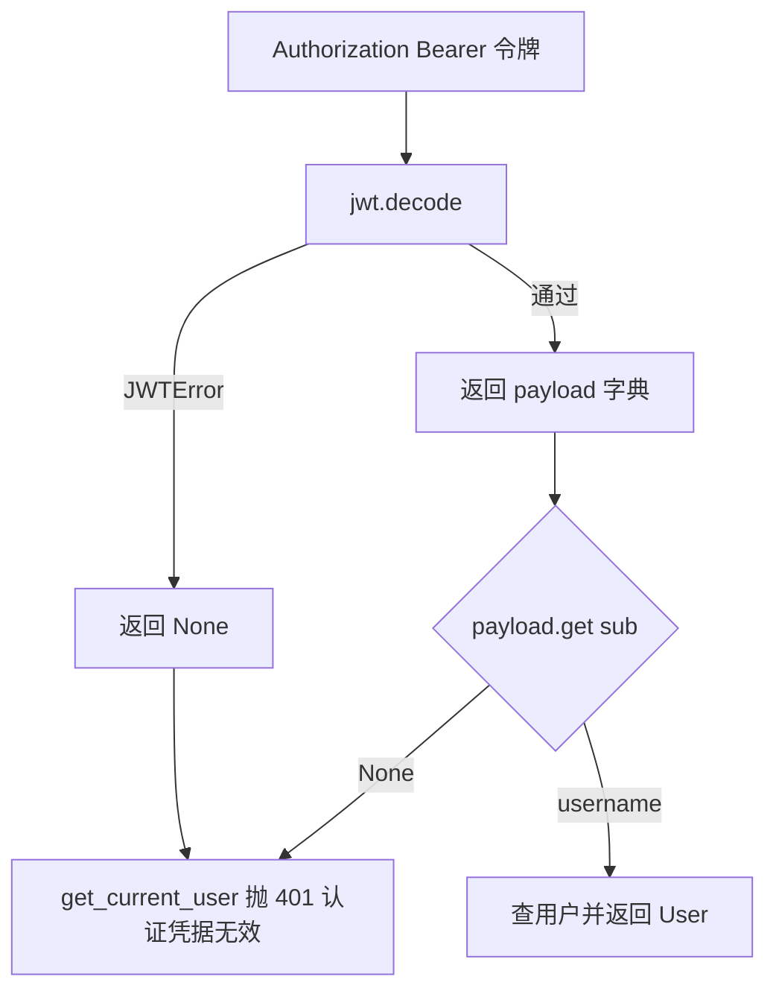
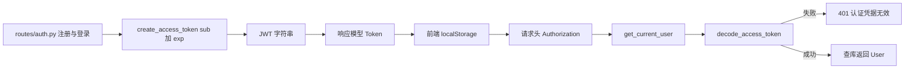

# JWT 的签发与校验

鉴权的凭据是一枚无状态 JWT：登录成功后服务端签发，后续请求把它放进 `Authorization: Bearer` 头。签发与解析都在 `backend/auth/jwt.py`，共 51 行；解码结果直接给 `get_current_user` 使用（`backend/routes/auth.py:28-55`）。

令牌本身的构成与生命周期在这里展开。密码一侧在 `02-密码哈希与截断.md`，用户存储在 `03-用户存储与凭据校验.md`，端点上的鉴权面在 `04-受保护端点的鉴权面.md`。

## 1. 令牌的载荷与签名

`create_access_token` 接收一个字典，复制后补上过期时间再编码（`backend/auth/jwt.py:18-35`）：

```python
to_encode = data.copy()
if expires_delta:
    expire = datetime.utcnow() + expires_delta
else:
    expire = datetime.utcnow() + timedelta(minutes=ACCESS_TOKEN_EXPIRE_MINUTES)
to_encode.update({"exp": expire})
encoded_jwt = jwt.encode(to_encode, JWT_SECRET, algorithm=ALGORITHM)
```

载荷只有两个声明：调用方传入的 `sub` 与内部写入的 `exp`。没有 `iss`、`aud`、`jti`，也没有自定义的角色声明。签名算法来自配置（`:14` 的 `ALGORITHM = JWT_ALGORITHM`），密钥同样来自配置（`backend/config.py:168-171`）。

| 声明 | 来源 | 用途 |
| --- | --- | --- |
| `sub` | 调用方传入的用户名 | 解析后定位用户 |
| `exp` | `utcnow` 加有效期 | 过期校验由库完成 |

两个调用点都在 `backend/routes/auth.py`，注册与登录成功各一次（`:70`、`:89`），传入的都是 `{"sub": user.username}`。

## 2. 有效期与配置来源

有效期的计算是 `60 * JWT_EXPIRATION_HOURS` 分钟（`backend/auth/jwt.py:15`），`JWT_EXPIRATION_HOURS` 默认 4（`backend/config.py:172`），所以默认有效期是 240 分钟。

`backend/auth/jwt.py:5` 的模块注释写「默认有效期 24 小时」，与默认配置不一致。注释没有随配置变化更新，读文档不如读配置。

| 来源 | 值 | 位置 |
| --- | --- | --- |
| 模块注释 | 24 小时 | `auth/jwt.py:5` |
| 配置默认值 | 4 小时 | `backend/config.py:172` |
| 实际计算 | 240 分钟 | `auth/jwt.py:15` |

## 3. 解码与失败处理

`decode_access_token` 用同一密钥与算法解码，捕获 `JWTError` 后返回 `None`（`backend/auth/jwt.py:38-51`）：

```python
try:
    payload = jwt.decode(token, JWT_SECRET, algorithms=[ALGORITHM])
    return payload
except JWTError:
    return None
```

过期、签名不符、结构损坏都会落进 `JWTError`，统一返回 `None`。调用方拿到的只是一个空值，无法区分过期与其他原因；若需要区分，要在这一层保留异常信息。



## 4. 令牌与用户对象的对应

`get_current_user` 用 `payload.get("sub")` 取用户名（`backend/routes/auth.py:40`），再查库返回 `User`。签名与有效期由库校验，用户是否仍然存在由这一层校验：令牌未过期但用户被删除时，返回 401 `用户不存在`（`:49-54`）。

令牌本身不携带权限信息，权限判断依赖查到的用户记录（会员等级、积分等）。这一设计让权限变更立即生效，不需要等令牌过期。

| 校验项 | 执行者 | 失败响应 |
| --- | --- | --- |
| 签名与有效期 | `jwt.decode` | 401 `认证凭据无效` |
| `sub` 存在性 | `get_current_user` | 401 `认证凭据无效` |
| 用户存在性 | `get_current_user` | 401 `用户不存在` |

## 5. 模型层对令牌的声明

`backend/models/user.py` 定义了两个与令牌相关的模型：`Token`（`:56-59`）是登录与注册的响应模型，两个字段中 `token_type` 默认 `"bearer"`；`TokenData`（`:62-64`）是解码后载荷的声明，字段为可选的 `username`。

`TokenData` 在仓库里没有任何引用点。`decode_access_token` 的返回类型标注是 `Optional[dict]`（`auth/jwt.py:38`），调用方按字典取值，不构造 `TokenData`。这个模型目前是一条未接线的声明。



## 6. 前端侧的保存与携带

前端把令牌存在 `localStorage`，键名是 `knowledgeDiver.token`（`frontend/src/api/auth.ts:3-15`）。登录成功立即写入（`:55`），请求时若存在就补上 `Authorization` 头（`:23-25`）。这套写法集中在 `api/auth.ts` 的 `authFetch` 里，Agent 模块另有自己的取令牌逻辑（`frontend/src/api/agent.ts:50-54`）。

| 环节 | 位置 | 行为 |
| --- | --- | --- |
| 存储键 | `api/auth.ts:3` | `knowledgeDiver.token` |
| 写入 | `:55` | 登录成功后 `setToken` |
| 携带 | `:23-25` | 有令牌才加 `Authorization` |
| 清除 | `:13-15` | `clearToken` 移除键 |

存放在 `localStorage` 意味着同源脚本可以读取，页面出现脚本注入时令牌可被外带。换成 `HttpOnly` Cookie 需要后端改造认证入口，属另一种权衡。

## 7. 无状态带来的边界

服务端不记录已签发的令牌，因此没有主动吊销接口，也没有刷新令牌。要让一枚令牌提前失效，只能更换 `JWT_SECRET`，这会同时使所有已签发令牌失效，代价是所有人重新登录。

| 能力 | 是否具备 | 说明 |
| --- | --- | --- |
| 过期校验 | 有 | `exp` 声明 |
| 主动吊销 | 无 | 无签发记录 |
| 刷新令牌 | 无 | 到期后重新登录 |
| 权限即时生效 | 有 | 每次请求查库取用户 |

## 8. 易错点

| 易错点 | 现象 | 位置 |
| --- | --- | --- |
| 按注释判断有效期 | 注释 24 小时，实际默认 4 小时 | `auth/jwt.py:5` 与 `backend/config.py:172` |
| 期望解码失败有具体原因 | 统一返回 `None` | `auth/jwt.py:50-51` |
| 认为 `TokenData` 在用 | 无引用点 | `models/user.py:62-64` |
| 以为可以吊销单个令牌 | 无记录，只能换密钥 | `auth/jwt.py:18-51` |
| 依赖令牌携带权限 | 权限从库里的用户记录读取 | `routes/auth.py:47-55` |
| 忘记登录后写入令牌 | 请求缺少 `Authorization` 头 | `frontend/src/api/auth.ts:55` |

## 小结

核心概念：

| 概念 | 内容 |
| --- | --- |
| 载荷构成 | 只有 `sub` 与 `exp` 两个声明 |
| 签名 | HS256，密钥与算法都来自配置 |
| 有效期 | 默认 4 小时，模块注释写的 24 小时已过期 |
| 解码失败 | 统一返回 `None`，由调用方转成 401 |
| 前端保存 | `localStorage` 键 `knowledgeDiver.token`，请求头携带 |

设计权衡：

| 决策 | 选择 | 收益 | 代价 |
| --- | --- | --- | --- |
| 无状态令牌 | 不记录签发 | 服务端无需会话存储 | 无法吊销单个令牌 |
| 载荷精简 | 只放用户名 | 令牌小，权限实时 | 每次请求多一次查库 |
| 失败统一 | `None` | 调用方处理简单 | 丢失失败原因 |
| 存储位置 | `localStorage` | 前端实现简单 | 存在脚本读取风险 |
| 默认有效期 | 4 小时 | 暴露窗口较短 | 用户需要更频繁登录 |

## 练习

基础题：

1. 写出令牌载荷的两个声明与各自的来源。
2. 默认有效期是多少分钟？模块注释与配置是否一致？
3. `decode_access_token` 在哪些情况下返回 `None`？
4. 前端把令牌存在哪里？请求时怎么携带？

挑战题：

5. 为解码失败增加原因区分（过期、签名错误、结构损坏），说明需要保留的异常信息与调用方的改动。
6. 设计一个支持吊销的方案，要求保留无状态校验路径并能定位到单枚令牌，说明需要新增的存储与请求开销。
7. 把令牌改为 `HttpOnly` Cookie 保存，列出后端与前端各自的改动点及对现有脚本调用方的影响。

---

### 附：本页引用的路径

| 路径 | 用途 |
| --- | --- |
| `backend/auth/jwt.py` | 模块注释（:5）、有效期计算（:15）、签发（:18-35）、解析（:38-51） |
| `backend/config.py` | `JWT_*` 配置与校验（:168-172） |
| `backend/routes/auth.py` | 签发调用（:70、:89）、`get_current_user`（:28-55） |
| `backend/models/user.py` | `Token` 与 `TokenData`（:56-64） |
| `frontend/src/api/auth.ts` | 令牌键与读写（:3-15）、登录写入（:55）、请求头（:23-25） |
| `frontend/src/api/agent.ts` | Agent 模块的取令牌与携带（:50-54） |
