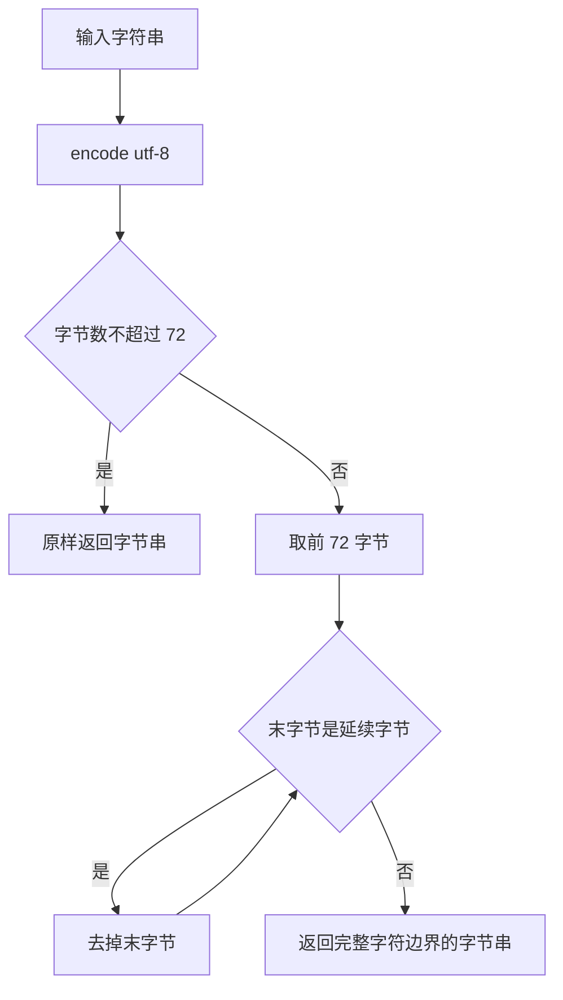
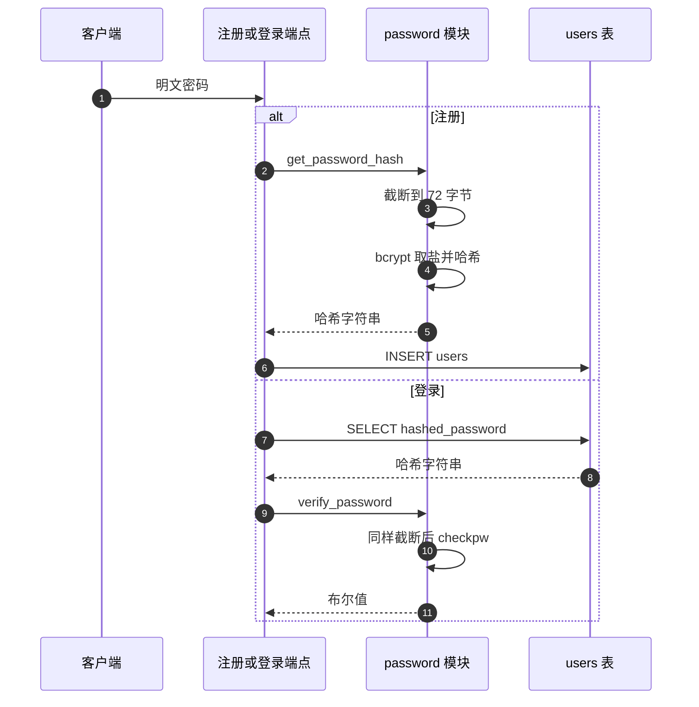

# 密码哈希与截断

密码在仓库里只以 bcrypt 哈希的形式出现：注册时哈希入库，登录时比对。`backend/auth/password.py` 共 63 行，除两个公开函数外还有一个处理 72 字节边界的截断函数，它解决的问题是多字节字符被切在中间。

哈希与截断的实现是这里的重点。令牌一侧在 `01-JWT的签发与校验.md`，用户存储与凭据查询在 `03-用户存储与凭据校验.md`。

## 1. 三个函数的职责

| 函数 | 输入 | 输出 | 位置 |
| --- | --- | --- | --- |
| `_truncate_utf8` | 字符串与上限字节数 | UTF-8 字节串 | `backend/auth/password.py` |
| `verify_password` | 明文与哈希字符串 | 布尔值 | `backend/auth/password.py` |
| `get_password_hash` | 明文 | 哈希字符串 | `backend/auth/password.py` |

模块注释直接写明约束来源：bcrypt 内部按 C 字符串处理，超过 72 字节的部分会被静默忽略。截断函数的存在是为了在这个限制下保持确定性：同一段明文截断后再哈希，结果稳定；若让库自己截断，边界行为依赖实现。

## 2. 72 字节截断的字节级处理

`_truncate_utf8` 的处理分四步（`backend/auth/password.py`）：

```python
encoded = text.encode('utf-8')
if len(encoded) <= max_bytes:
    return encoded
truncated = encoded[:max_bytes]
while truncated and (truncated[-1] & 0xC0) == 0x80:
    truncated = truncated[:-1]
return truncated
```

先编码为 UTF-8，未超限直接返回；超限则先按字节数切，再从尾部逐个移除延续字节。UTF-8 的延续字节以 `10` 开头，用 `& 0xC0 == 0x80` 判断，去掉它们就能保证剩下的字节序列以某个字符的首字节收尾。

| 步骤 | 判定 | 结果 |
| --- | --- | --- |
| 编码 | `text.encode('utf-8')` | 字节串 |
| 早退 | 长度不超过上限 | 原样返回 |
| 切分 | 取前 `max_bytes` 字节 | 可能切在多字节字符中间 |
| 回退 | 尾部是延续字节就去掉 | 停在完整字符边界 |



## 3. 哈希与校验的调用链

`get_password_hash` 先截断再取盐、哈希、解码成字符串（`backend/auth/password.py`）：

```python
password_bytes = _truncate_utf8(password, 72)
salt = bcrypt.gensalt()
hashed = bcrypt.hashpw(password_bytes, salt)
return hashed.decode('utf-8')
```

`verify_password` 对明文做同样截断，再把哈希字符串编码回字节后比对。两侧截断规则一致是比对成功的前提：若只在哈希侧截断，超长密码会永远验证不通过。

`gensalt()` 没有传成本参数，使用库的默认值。bcrypt 的默认轮数是 12，哈希一次需要可观的 CPU 时间；注册与登录端点是 `async def`，这段计算在事件循环里同步执行，并发登录时会互相排队。这一条属实现观察，具体耗时依机器与库版本而定。



## 4. 请求模型的长度约束与截断的关系

`UserCreate` 给密码设了长度上限 20（`backend/models/user.py`），并有一条只允许可见 ASCII 的校验器。两个约束叠加后，经过接口的密码最多 20 字节，离 72 字节的截断线很远。

| 约束 | 位置 | 作用 |
| --- | --- | --- |
| 长度 1 到 20 | `models/user.py` | 限制字符数 |
| 仅 ASCII 可见字符 | — | 每个字符 1 字节 |
| 72 字节截断 | `auth/password.py` | 防御性处理 |

因此截断函数对接口路径几乎不触发，它保护的是绕过接口直接调用 `get_password_hash` 或 `create_user` 的代码路径。

## 5. 校验失败时的统一返回

登录端点在凭据不匹配时抛 401，文案是 `用户名或密码错误`（`backend/routes/auth.py`）。存储层的 `verify_user` 在用户不存在与密码错误两种情况下都返回 `None`（`backend/storage/sqlite_user_store.py`），端点无法区分，也就不会把差异暴露给客户端。

| 情况 | 存储层返回 | 端点响应 |
| --- | --- | --- |
| 用户不存在 | `None` | 401 `用户名或密码错误` |
| 密码错误 | `None` | 同上 |
| 哈希字符串损坏 | `checkpw` 抛异常 | 由全局处理器转 500 |

第三行是一条边界：`verify_password` 只捕获不到异常，损坏的哈希会让请求以 500 结束，而不是 401。这一行为来自实现路径，未做专门的兼容处理。

## 6. 注册路径的重复用户名

注册端点把 `create_user` 的 `ValueError` 转成 400（`backend/routes/auth.py`），重复用户名的判断在存储层完成（`backend/storage/sqlite_user_store.py`）。错误信息里带用户名（`用户名「x」已存在`），与登录侧的不区分策略不同：注册场景需要告诉用户换个名字，登录场景需要避免账号枚举。

| 场景 | 是否区分原因 | 文案 |
| --- | --- | --- |
| 注册重名 | 区分 | 用户名「x」已存在 |
| 登录失败 | 不区分 | 用户名或密码错误 |

## 7. 与积分初始化的衔接

登录成功后端点还会读取原始用户记录、补齐积分字段再写回（`backend/routes/auth.py`）。这一步用的是 `get_user_raw` 与 `save_user_raw`（`backend/storage/sqlite_user_store.py`），不涉及密码。把积分初始化放在登录路径上，保证老账号在首次登录时获得积分字段，代价是每次登录都会走一次读加写。

## 8. 易错点

| 易错点 | 现象 | 位置 |
| --- | --- | --- |
| 只在一侧截断 | 超长密码永远验证失败 | `auth/password.py` 与  都要截断 |
| 以为接口能传 72 字节密码 | 请求模型限制 20 字符且仅 ASCII | `models/user.py` |
| 认为登录失败能区分原因 | 存储层统一返回 `None` | `sqlite_user_store.py` |
| 依赖 bcrypt 自动截断 | 库会静默忽略超出部分，行为不确定 | `auth/password.py` |
| 忽略哈希的 CPU 开销 | `async def` 里同步计算会阻塞事件循环 | `routes/auth.py` |
| 把损坏哈希当成密码错误 | 会返回 500 而不是 401 | `auth/password.py` 未捕获异常 |

## 小结

核心概念：

| 概念 | 内容 |
| --- | --- |
| 哈希算法 | bcrypt，输出字符串直接入库 |
| 截断规则 | UTF-8 编码后取前 72 字节，再回退到完整字符边界 |
| 双侧一致 | 哈希与校验都调用同一个截断函数 |
| 长度约束 | 请求模型限制 20 字符且仅 ASCII，截断属防御 |
| 失败口径 | 登录不区分用户不存在与密码错误 |

设计权衡：

| 决策 | 选择 | 收益 | 代价 |
| --- | --- | --- | --- |
| 截断实现 | 自己处理字节边界 | 行为确定，可跨版本复现 | 多一个需要同步维护的函数 |
| 哈希成本 | 库默认轮数 | 无需调参 | 单次哈希耗时较高 |
| 执行位置 | 端点内同步调用 | 代码路径短 | 并发登录时事件循环被占用 |
| 登录口径 | 统一文案 | 防止账号枚举 | 排查登录问题时缺少线索 |
| 注册口径 | 区分重名 | 用户可自助改名 | 暴露用户名是否已存在 |

## 练习

基础题：

1. 写出 `_truncate_utf8` 的四步处理。
2. 为什么哈希与校验两侧都要截断？
3. 请求模型对密码的两条约束是什么？它们与 72 字节限制的关系如何？
4. 登录失败时存储层返回什么？端点如何响应？

挑战题：

5. 把 bcrypt 哈希移出事件循环，说明可选方案与对现有端点签名的改动。
6. 设计一套密码强度规则（含长度、字符集与重复字符），说明放在 `Field` 与校验器两侧的分工。
7. 为损坏哈希设计降级路径，要求返回 401 而不是 500，并说明日志中应记录哪些信息。

---

### 附：本页引用的路径

| 路径 | 用途 |
| --- | --- |
| `backend/auth/password.py` | 截断、校验、哈希 |
| `backend/models/user.py` | 密码长度与字符集约束 |
| `backend/routes/auth.py` | 注册错误转换、登录失败、积分初始化 |
| `backend/storage/sqlite_user_store.py` | `verify_user`、`get_user_raw` / `save_user_raw` |
