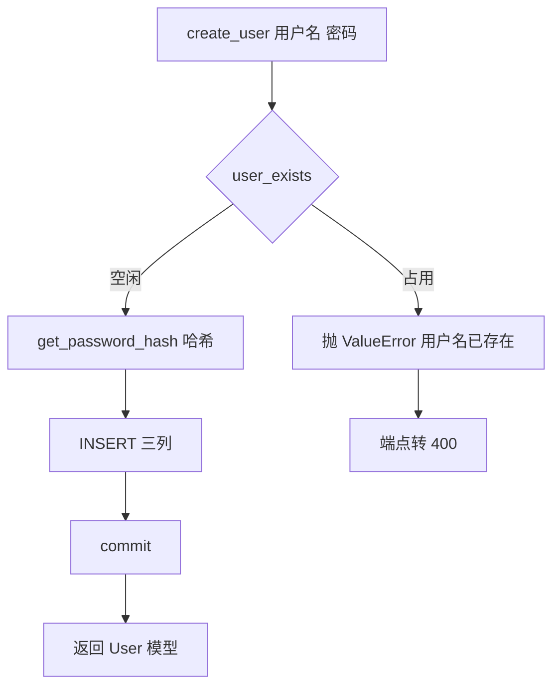
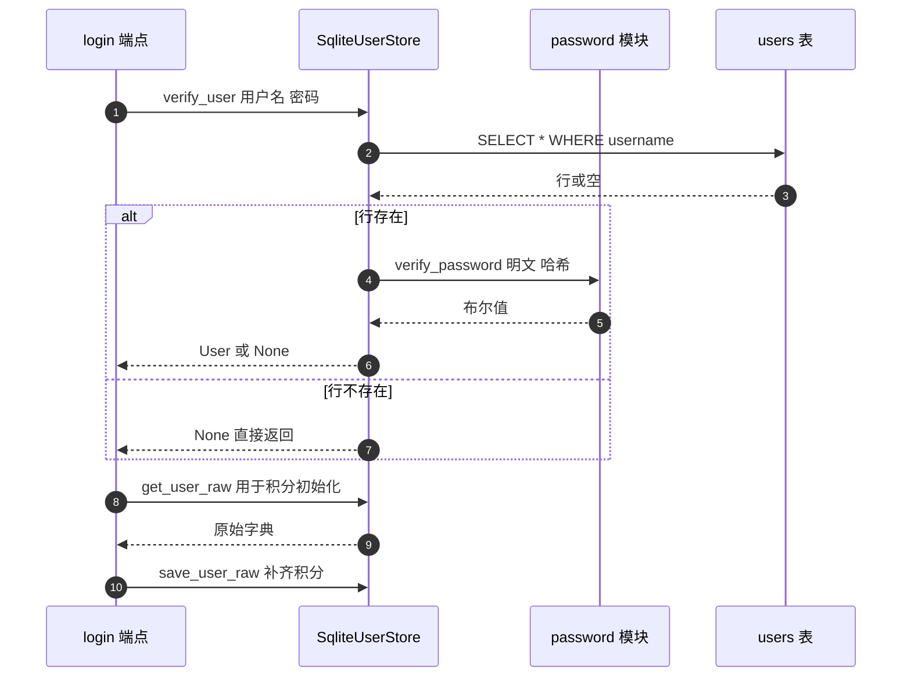

# 用户存储与凭据校验

凭据校验分两层：密码比对在 `backend/auth/password.py`，用户记录读写在 `backend/storage/sqlite_user_store.py`。存储层实现 `BaseUserStore` 的八个方法，其中与鉴权直接相关的是 `create_user`、`get_user` 与 `verify_user`。

存储层的接口与数据流在这里展开。哈希实现在 `02-密码哈希与截断.md`，端点如何调用这些方法在 `04-受保护端点的鉴权面.md`。

## 1. 八个方法的分工

存储层接口的目标是让端点拿到数据、把 SQL 细节关在模块内。方法按"读什么、写什么"划分，避免出现一个通用 get/set 让调用方在端点里自己拼条件。`BaseUserStore` 定义了八个抽象方法（`backend/storage/base.py`），SQLite 实现逐一落地：

| 方法 | 用途 | 实现位置 |
| --- | --- | --- |
| `user_exists` | 判断用户名是否占用 | `sqlite_user_store.py` |
| `create_user` | 建用户并返回模型 | — |
| `get_user` | 按用户名取模型 | — |
| `verify_user` | 校验密码并返回模型 | — |
| `update_user` | 按关键字参数更新列 | — |
| `get_user_raw` | 取原始字典 | — |
| `save_user_raw` | 写回原始字典 | 同文件后段 |
| `get_user_cards_dir` | 返回用户卡片目录 | 同文件后段 |

`get_user` 与 `verify_user` 都会被请求路径调用：前者用于解析令牌后的用户查询，后者用于登录。`get_user_raw` 与 `save_user_raw` 走字典，主要给积分模块使用（模块注释写明这一点）。

## 2. 建表语句里的默认值

用户表的列定义决定了哪些字段可以不写（`backend/storage/database.py`）：

```sql
CREATE TABLE IF NOT EXISTS users (
    username            TEXT PRIMARY KEY,
    hashed_password     TEXT NOT NULL,
    created_at          TEXT NOT NULL,
    avatar_url          TEXT,
    membership          TEXT NOT NULL DEFAULT 'free',
    membership_expiry   TEXT,
    points              INTEGER NOT NULL DEFAULT 48,
    last_points_refill  TEXT
);
```

`create_user` 的 `INSERT` 只写三列（`sqlite_user_store.py`），其余五列由建表默认值与 `NULL` 补齐。`membership` 的 `'free'` 与 `points` 的 `48` 在两处各写了一遍：建表语句与 `User` 模型（`backend/models/user.py`），配置里还有 `MAX_POINTS_FREE = 48`（`backend/config.py`）。同一个数值出现在三个文件里。

| 常量 | 位置 | 值 |
| --- | --- | --- |
| `MAX_POINTS_FREE` | `backend/config.py` | 48 |
| `User.points` 默认值 | `backend/models/user.py` | 48 |
| 建表默认值 | `backend/storage/database.py` | 48 |
| `membership` 默认值 | `models/user.py`、`database.py` | `"free"` |

## 3. 创建用户的流程

`create_user` 先查重、再哈希、后插入（`backend/storage/sqlite_user_store.py`）：

```python
def create_user(self, username: str, password: str) -> User:
    if self.user_exists(username):
        raise ValueError(f"用户名「{username}」已存在")
    hashed_password = get_password_hash(password)
    now = datetime.utcnow().isoformat()
    self.db.execute(
        "INSERT INTO users (username, hashed_password, created_at) VALUES (?, ?, ?)",
        (username, hashed_password, now),
    )
    self.db.commit()
    return User(username=username, hashed_password=hashed_password, created_at=datetime.utcnow())
```

入库的时间是 `isoformat()` 字符串，返回模型用的是 `datetime` 对象，两者表示同一时刻。查重与插入分成两句执行，中间没有事务或唯一约束兜底之外的检查：主键约束会在并发注册同一用户名时拒绝第二次插入，但异常类型是数据库异常而不是 `ValueError`，端点的处理分支只捕获 `ValueError`（`backend/routes/auth.py`）。



## 4. 凭据校验的流程

`verify_user` 只做两步：取用户，比对密码（`backend/storage/sqlite_user_store.py`）。用户不存在或密码不匹配都返回 `None`，端点统一抛 401。



登录成功后端点还会做一次积分初始化读写（`backend/routes/auth.py`），因此一次登录最少访问用户表三次：一次 `verify_user` 的查询、一次 `get_user_raw`、一次 `save_user_raw`。

## 5. 模型与行的双向转换

存储层用两个静态方法完成转换：`_row_to_user` 把行字典喂给 `User` 构造器（`sqlite_user_store.py`），`_row_to_dict` 直接 `dict(row)`。字段名与列名一一对应，没有映射表。

`User` 的 `created_at` 是 `datetime` 类型，数据库里存的是文本，构造时由 Pydantic 解析 ISO 字符串。这条路径依赖 Pydantic 的宽松解析，若把列改成其他格式的文本，构造会失败。

## 6. 更新接口的写法

`update_user` 接受关键字参数，用键拼 `SET` 子句（`backend/storage/sqlite_user_store.py`）：

```python
sets = ", ".join(f"{k} = ?" for k in kwargs)
values = list(kwargs.values()) + [username]
self.db.execute(f"UPDATE users SET {sets} WHERE username = ?", values)
```

列名来自调用方的关键字参数名，值走参数占位符。仓库里的调用点传的是固定列名（`backend/routes/auth.py`），因此不存在外部可控的列名。若将来有代码把用户输入当关键字参数传入，这条路径会成为注入面，加白名单列名可以彻底消除这个隐患。

## 7. 原始字典接口的用途

`get_user_raw` 与 `save_user_raw` 绕开 `User` 模型，直接读写字典（`backend/storage/sqlite_user_store.py`）。积分模块需要处理模型里没有的中间状态，因此走字典更直接。`save_user_raw` 的 `UPDATE` 只覆盖六个列：哈希、头像、会员、到期时间、积分与上次恢复时间。

| 接口 | 形态 | 使用方 |
| --- | --- | --- |
| `get_user` / `create_user` | `User` 模型 | 认证端点 |
| `get_user_raw` / `save_user_raw` | 字典 | 登录后的积分初始化、积分模块 |

模型接口与字典接口并存，意味着同一行数据有两条读写路径。字段增删时两条路径都要检查。

## 8. 易错点

| 易错点 | 现象 | 位置 |
| --- | --- | --- |
| 修改积分默认值只改一处 | 配置、模型、建表三处不一致 | `config.py`、`user.py`、`database.py` |
| 以为并发注册重名会走 `ValueError` | 主键冲突是数据库异常 | `sqlite_user_store.py` |
| 忘记登录路径的额外读写 | 一次登录三次访问用户表 | `routes/auth.py` |
| 认为 `update_user` 列名安全由语句保证 | 列名直接拼接 | `sqlite_user_store.py` |
| 改动时间列格式 | 构造函数解析失败 | — |
| 只维护模型接口 | 字典接口漏改，积分字段失联 | — |

## 小结

核心概念：

| 概念 | 内容 |
| --- | --- |
| 接口面 | 基类八个方法，SQLite 实现逐一落地 |
| 建表默认值 | 会员 `free`、积分 48，与模型和配置重复定义 |
| 创建流程 | 查重、哈希、插入三列、返回模型 |
| 校验流程 | 取用户加比对密码，失败统一返回 `None` |
| 双接口 | 模型接口与原始字典接口并存 |

设计权衡：

| 决策 | 选择 | 收益 | 代价 |
| --- | --- | --- | --- |
| 默认值位置 | 建表、模型、配置各写一份 | 各层可独立运行 | 改值要同步三处 |
| 查重方式 | 先查后插 | 错误信息友好 | 并发下的冲突类型不同 |
| 更新接口 | 关键字参数拼列名 | 调用灵活 | 列名缺少白名单校验 |
| 字典接口 | 保留给积分模块 | 兼容中间状态 | 同一行有两条读写路径 |

## 练习

基础题：

1. 列出 `BaseUserStore` 的八个方法与各自用途。
2. 建表语句里 `membership` 与 `points` 的默认值是什么？与模型是否一致？
3. `create_user` 向 `users` 表写入哪三列？
4. 为什么 `verify_user` 无法区分用户不存在与密码错误？

挑战题：

5. 把三处积分默认值收敛到一处，说明放置位置与建表语句的迁移方式。
6. 为 `update_user` 增加列名白名单，评估对现有调用点的影响。
7. 设计一个并发注册的测试用例，说明在主键冲突路径上端点应返回什么状态码，并给出代码改动点。

---

### 附：本页引用的路径

| 路径 | 用途 |
| --- | --- |
| `backend/storage/sqlite_user_store.py` | 转换、查重与创建、查询、校验、更新、字典接口 |
| `backend/storage/base.py` | `BaseUserStore` 抽象方法 |
| `backend/storage/database.py` | `users` 建表语句 |
| `backend/models/user.py` | 字段与默认值 |
| `backend/config.py` | `MAX_POINTS_FREE` |
| `backend/routes/auth.py` | 注册错误转换、登录流程、头像更新 |
