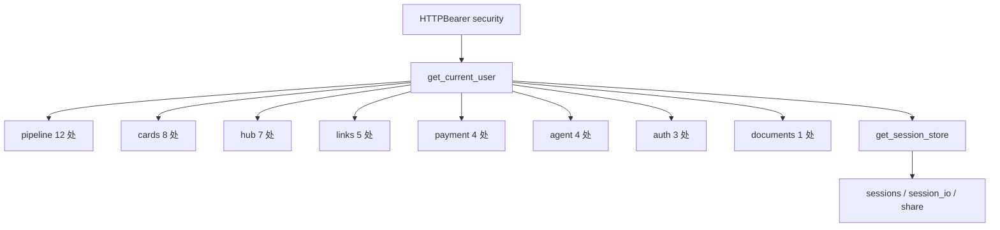
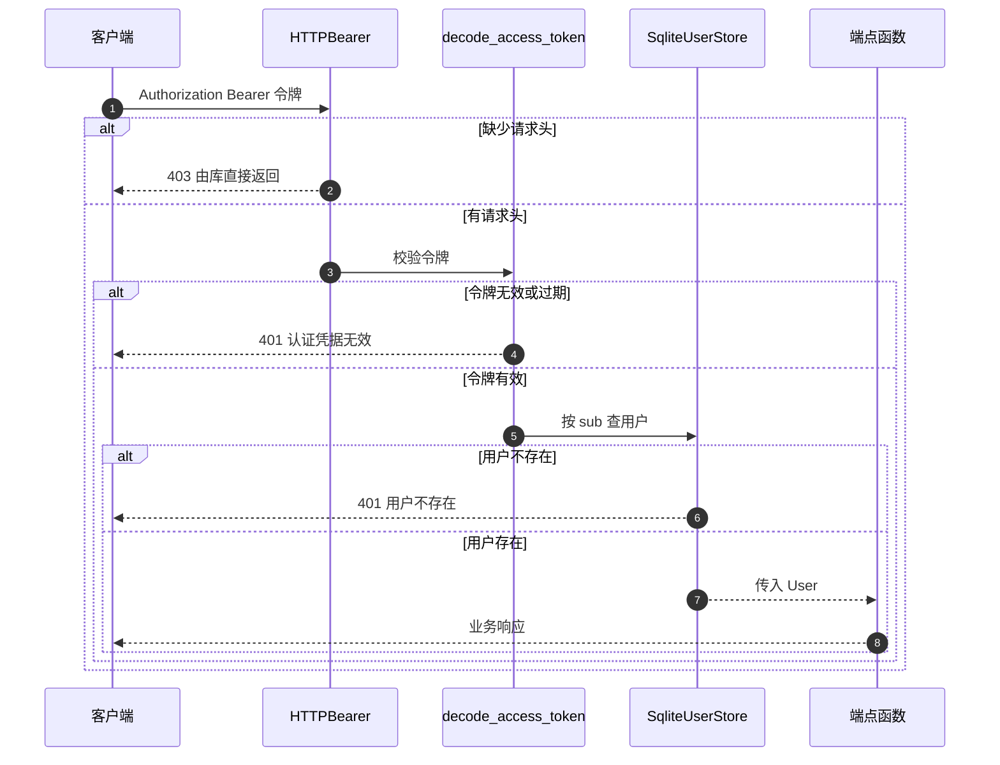

# 受保护端点的鉴权面

鉴权的接线方式只有一种：端点在签名里声明 `current_user: User = Depends(get_current_user)`。全仓库这样的声明有 47 处，分布在 11 个模块；另有三个模块把用户依赖藏在存储提供者后面，端点签名里看不到 `get_current_user`。

保护面与例外在这里逐一对照。依赖机制本身在 `28-FastAPI 后端/01-路由与依赖注入/03-Depends的工作方式.md`，用户存储在 `03-用户存储与凭据校验.md`，令牌在 `01-JWT的签发与校验.md`。

## 1. HTTPBearer 的接入

`HTTPBearer` 实例在认证模块创建一次（`backend/routes/auth.py:20`），`get_current_user` 通过 `Depends(security)` 拿到凭证对象（`:29`）。它负责从 `Authorization` 头里解析出 `Bearer` 方案与令牌字符串，不负责校验令牌内容。

| 环节 | 执行者 | 结果 |
| --- | --- | --- |
| 取头 | `HTTPBearer` | 得到 `credentials.credentials` |
| 校验令牌 | `decode_access_token` | 通过或 `None` |
| 查用户 | `SqliteUserStore.get_user` | `User` 或 `None` |

`HTTPBearer` 默认 `auto_error=True`，请求缺少 `Authorization` 头时由它直接结束请求。因此「没带令牌」与「带了无效令牌」的响应不同，具体差异见第 5 节。

## 2. 十一个模块的保护面

按直接声明 `Depends(get_current_user)` 的次数统计，各模块的保护面如下：

| 模块 | 直接声明次数 | 说明 |
| --- | --- | --- |
| `agent/routes/agent.py` | 4 | 对话与工具调用端点 |
| `routes/pipeline.py` | 12 | 收集与延申搜索、任务管理 |
| `routes/cards.py` | 8 | 卡片 CRUD 与搜索 |
| `routes/hub.py` | 7 | 论坛浏览与交互 |
| `routes/links.py` | 5 | 双向链接操作 |
| `routes/payment.py` | 4 | 订单创建、回调、查询 |
| `routes/auth.py` | 3 | 个人信息、头像上传、会员升级 |
| `routes/documents.py` | 1 | 文档上传 |
| `routes/sessions.py` | 1 | 会话存储提供者内部使用 |
| `routes/session_io.py` | 1 | 会话导入导出 |
| `routes/share.py` | 1 | 分享令牌 |

`sessions`、`session_io`、`share` 三个模块的端点大多不直接写 `get_current_user`，而是依赖 `get_session_store`，后者内部依赖它（`backend/routes/sessions.py:19-21`）。因此这三个模块的实际保护面比计数更大。

## 3. 公开端点清单

有些端点在设计的开放面上：认证入口必须在未登录时可访问，头像文件需要能被直接引用，健康检查需要无凭据探测。

| 端点 | 位置 | 是否带鉴权依赖 |
| --- | --- | --- |
| `POST /api/auth/register` | `routes/auth.py:58` | 否，仅存储依赖 |
| `POST /api/auth/login` | `:74` | 否，仅存储依赖 |
| `GET /api/auth/avatar/{username}` | `:139` | 否 |
| `GET /` | `backend/main.py:147` | 否 |
| `POST /api/export` 与 `GET /api/export/download` | `routes/export.py:39`、`:48` | 否 |

前四个属于有意公开，导出两个端点属于未接入鉴权。`routes/export.py` 的导入列表里没有鉴权符号，两个端点也没有 `Depends`（`:8-17`、`:39-58`），任何能访问后端的人都可以导出全部卡片。

## 4. 受保护请求的完整路径

一次受保护请求要经过凭证解析、令牌校验、用户查询三段，任何一段失败都会在端点函数执行前结束：

## 5. 缺凭证与凭证无效的状态码差异

两类失败的响应不同，客户端需要分别处理：

| 情况 | 触发者 | 状态码 | 响应体 |
| --- | --- | --- | --- |
| 未带 `Authorization` 头 | `HTTPBearer` | 403 | 框架默认文案 |
| 令牌无效或过期 | `get_current_user` | 401 | `认证凭据无效` |
| `sub` 缺失 | `get_current_user` | 401 | `认证凭据无效` |
| 用户已不存在 | `get_current_user` | 401 | `用户不存在` |

后三种都带 `WWW-Authenticate: Bearer` 头（`backend/routes/auth.py:38`、`:45`、`:53`）。403 那一条来自库的默认行为，属框架层处理，仓库未自定义。

前端在收到 401 或 403 时的处理取决于调用方。`frontend/src/api/auth.ts` 的 `authFetch` 只按 `response.ok` 判断并抛出错误信息（`:32-36`），未区分状态码，因此令牌过期后用户看到的是通用错误提示，需要跳转登录页的逻辑另行判断。

## 6. 端点签名的两种保护写法

直接依赖与间接依赖的写法差异会出现在 OpenAPI 文档里：直接声明的端点会在参数列表中显示安全方案，间接依赖的端点通过存储提供者传递，文档上的表现取决于 FastAPI 的依赖展开。

| 写法 | 例子 | 端点签名可见性 |
| --- | --- | --- |
| 直接声明用户依赖 | `routes/cards.py:49` | 参数列表中出现 `current_user` |
| 依赖会话存储 | `routes/sessions.py:24-26` | 只出现 `store` |
| 依赖用户存储 | `routes/auth.py:94` | 出现 `current_user` 与 `store` |

## 7. 前端侧的携带一致性

前端有两套取令牌逻辑。`api/auth.ts` 在 `authFetch` 里统一补 `Authorization` 头（`frontend/src/api/auth.ts:23-25`），`api/agent.ts` 自己在多处取令牌并拼头（`frontend/src/api/agent.ts:50-54`、`:199-213`、`:234-246`）。两处读取的是同一个 `localStorage` 键，但拼接逻辑各写一遍，新增请求方式时容易漏加。

| 模块 | 取令牌位置 | 是否统一封装 |
| --- | --- | --- |
| `api/auth.ts` | `:5-7` | 是，集中在 `authFetch` |
| `api/agent.ts` | `:50`、`:199`、`:234` | 否，多处重复 |

## 8. 易错点

| 易错点 | 现象 | 位置 |
| --- | --- | --- |
| 以为所有端点都受保护 | 导出两个端点无鉴权 | `routes/export.py:39-58` |
| 把 403 当成令牌问题 | 缺请求头才是 403 | `routes/auth.py:20` |
| 用响应体区分两种 401 | 文案相同 | `:34-46` |
| 认为会话模块没有鉴权 | 保护藏在 `get_session_store` 里 | `routes/sessions.py:19-21` |
| 以为头像端点需要登录 | 取头像公开 | `routes/auth.py:139` |
| 只给部分前端模块补令牌头 | Agent 模块自写一套 | `frontend/src/api/agent.ts:50-54` |

## 小结

核心概念：

| 概念 | 内容 |
| --- | --- |
| 接线方式 | 端点声明 `Depends(get_current_user)`，共 47 处 |
| 覆盖模块 | 十一个模块直接使用，三个模块经存储提供者间接使用 |
| 公开端点 | 注册、登录、取头像、健康检查、导出两个端点 |
| 失败状态码 | 缺头 403，令牌无效与用户不存在 401 |
| 前端携带 | `auth.ts` 统一封装，`agent.ts` 多处重复 |

设计权衡：

| 决策 | 选择 | 收益 | 代价 |
| --- | --- | --- | --- |
| 保护方式 | 函数依赖 | 端点自解释、可组合 | 每个端点都要写一遍 |
| 间接保护 | 存储提供者内依赖用户 | 端点签名更短 | 保护范围不易一眼看出 |
| 缺头处理 | 交给库默认 | 无自定义代码 | 状态码与令牌无效不一致 |
| 开放端点 | 注册、登录、头像公开 | 使用顺畅 | 用户名可被枚举探测 |
| 导出端点 | 未接入鉴权 | 调用方便 | 数据可被无凭据导出 |

## 练习

基础题：

1. `HTTPBearer` 负责什么，不负责什么？
2. 列出公开端点清单，并指出哪些属于有意公开。
3. 缺 `Authorization` 头与令牌无效分别返回什么状态码？
4. 为什么 `sessions` 模块的保护面比直接计数更大？

挑战题：

5. 把三个 401 分支的文案区分开，说明对客户端与安全性的影响。
6. 为导出端点补鉴权，列出改动点与对现有调用脚本的兼容处理。
7. 统一前端两套取令牌逻辑，说明封装位置与需要修改的调用点，并给出漏加请求头的检测方式。

---

### 附：本页引用的路径

| 路径 | 用途 |
| --- | --- |
| `backend/routes/auth.py` | `HTTPBearer` 与提供者（:20、:28-55）、公开端点（:58、:74、:139）、受保护端点（:94、:122-126、:150-154） |
| `backend/routes/sessions.py` | 存储提供者的间接依赖（:19-21） |
| `backend/routes/cards.py` | 直接依赖示例（:49） |
| `backend/routes/export.py` | 无鉴权的两个端点（:39-58） |
| `backend/main.py` | 健康检查端点（:147-150） |
| `backend/routes/pipeline.py`、`backend/routes/hub.py`、`backend/routes/links.py`、`backend/routes/payment.py`、`backend/agent/routes/agent.py` | 各模块的依赖声明位置 |
| `frontend/src/api/auth.ts` | 统一封装与状态码处理（:5-7、:23-25、:32-36） |
| `frontend/src/api/agent.ts` | 多处取令牌（:50-54、:199-213、:234-246） |
