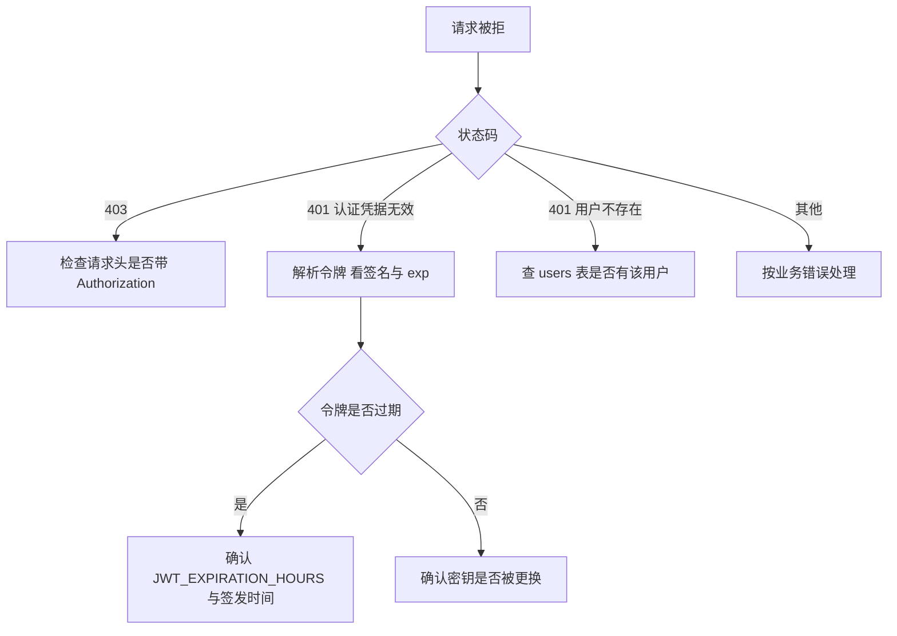
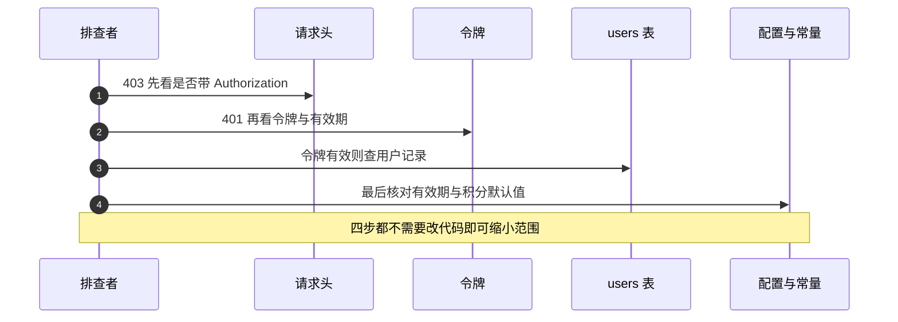

# 鉴权链路的易错点与排查

鉴权问题的表现通常是 401、403 或登录后立刻失效，原因却可能在配置、令牌、存储或前端携带四层中的任意一层。风险集中列出，并给出一条从状态码反推到配置的排查顺序。

令牌细节见 `01-JWT的签发与校验.md`，密码见 `02-密码哈希与截断.md`，存储见 `03-用户存储与凭据校验.md`，端点覆盖见 `04-受保护端点的鉴权面.md`。

## 1. 风险清单

| 编号 | 风险 | 位置 | 现象 |
| --- | --- | --- | --- |
| R1 | 密钥在导入期校验 | `backend/config.py:169-170` | 未配置时应用无法启动 |
| R2 | 有效期注释与实际值不一致 | `auth/jwt.py:5` 与 `config.py:172` | 按注释估算过期时间会错 |
| R3 | 无吊销与刷新机制 | `auth/jwt.py:18-51` | 令牌只能等到期或换密钥 |
| R4 | 令牌存在 `localStorage` | `frontend/src/api/auth.ts:3-15` | 同源脚本可读取 |
| R5 | bcrypt 在事件循环内同步执行 | `routes/auth.py:76` | 并发登录互相排队 |
| R6 | 登录失败不区分原因 | `routes/auth.py:80-86` | 排查时无法判断是用户还是密码 |
| R7 | 注册接口暴露用户名占用 | `:64-68` | 可批量探测已注册用户名 |
| R8 | 取头像端点公开 | `:139-147` | 按用户名可探测头像是否存在 |
| R9 | 导出端点无鉴权 | `routes/export.py:39-58` | 无凭据可导出全部卡片 |
| R10 | 两种失败状态码不同 | `routes/auth.py:20` | 客户端需要处理 401 与 403 |
| R11 | 积分默认值重复三处 | `config.py:152`、`models/user.py:22`、`storage/database.py:27` | 改一处后行为不一致 |
| R12 | 更新语句拼接列名 | `storage/sqlite_user_store.py:87` | 列名来源失控时成为注入面 |

## 2. 启动期：密钥与配置

`JWT_SECRET` 缺失会在导入 `backend/config.py` 时抛 `RuntimeError`（`:169-170`）。这个文件被入口、令牌模块与限流模块共同导入，所以表现是应用启动失败，而不是登录接口报错。排查启动失败时先看日志里的异常类型，再看环境变量是否注入到进程。

`JWT_EXPIRATION_HOURS` 有默认值 4（`config.py:172`），未配置时不会报错。它与令牌的有效期直接相关，排查「登录后很快失效」时先确认这个值。

| 配置项 | 缺失表现 | 默认值 |
| --- | --- | --- |
| `JWT_SECRET` | 启动失败 | 无，必填 |
| `JWT_EXPIRATION_HOURS` | 无提示 | 4 小时 |
| `CORS_ORIGINS` | 无提示 | `"*"` |

## 3. 请求期：状态码的含义

三类失败对应三种状态码，排查时先按状态码分流：

| 状态码 | 触发条件 | 排查方向 |
| --- | --- | --- |
| 403 | 缺少 `Authorization` 头 | 前端是否带了令牌 |
| 401 认证凭据无效 | 令牌过期、签名不符、结构损坏、缺 `sub` | 令牌内容与有效期 |
| 401 用户不存在 | 令牌有效但用户被删 | 用户表记录 |

`decode_access_token` 把所有解析失败压成 `None`（`auth/jwt.py:50-51`），所以 401 `认证凭据无效` 无法进一步区分原因。要定位到具体原因，需要在解码处打印异常类型，或临时用一个独立脚本解析令牌的 `exp`。

## 4. 请求期：令牌与前端携带

令牌由前端主动放进 `localStorage`（`frontend/src/api/auth.ts:3-15`），登录成功后写入（`:55`）。若出现「刚登录就 401」，先检查写入与读取是否使用同一个键，再检查请求是否走了带令牌的封装。`api/agent.ts` 有一套独立的取令牌逻辑（`frontend/src/api/agent.ts:50-54`），两套逻辑读取同一个键但拼接位置不同，容易在新增请求时漏加。

| 症状 | 先查 | 位置 |
| --- | --- | --- |
| 所有请求都 403 | 请求头是否带令牌 | `api/auth.ts:23-25` |
| 部分请求 401 | 该请求是否走封装 | `api/agent.ts:50-54` |
| 登录后立刻失效 | 令牌有效期与服务器时间 | `auth/jwt.py:15` |

## 5. 请求期：密码与哈希

bcrypt 比对在 `verify_password` 里同步执行（`auth/password.py:36-48`），单个请求的耗时集中在哈希计算上。并发登录时，这段计算会占住事件循环，形成排队。排查登录变慢时，先确认并发量，再确认是否在循环里做了其他同步操作。

哈希字符串损坏时 `checkpw` 抛异常，端点不会捕获（`:48`），最终由全局处理器返回 500。现象是「密码正确但服务报错」，需要看日志中的异常栈而不是响应体。

| 症状 | 原因 | 位置 |
| --- | --- | --- |
| 登录慢 | 哈希计算占用事件循环 | `auth/password.py:48` |
| 登录 500 | 哈希字符串损坏，异常未捕获 | `:48` |
| 超长密码永远失败 | 两侧截断规则被改动 | `:46` 与 `:60` |

## 6. 访问面：公开端点与重复常量

公开端点包括注册、登录、取头像、健康检查与导出。前三个属于设计需要，导出属于未接入鉴权。排查数据暴露面时，先取一份端点清单对照 `backend/routes/export.py:39-58` 这类没有鉴权符号的模块。

积分默认值 `48` 在三处重复：配置、模型与建表语句。排查「新用户积分不对」时，三处都要看，尤其是直接建表或直接构造模型而不经过注册端点的路径。

## 7. 容易走错的方向

| 现象 | 容易先怀疑 | 实际应先查 |
| --- | --- | --- |
| 应用启动失败 | 路由代码 | `config.py:169-170` 的密钥校验 |
| 登录后很快失效 | 前端存储 | `JWT_EXPIRATION_HOURS` 与令牌 `exp` |
| 401 认证凭据无效 | 数据库 | 令牌解密结果，解码层把所有失败合并 |
| 登录返回 500 | 密码错误 | 哈希字符串是否损坏 |
| 新用户积分不对 | 注册逻辑 | 三处 48 的默认值是否一致 |
| 任意用户头像可见 | 端点鉴权 | 该端点本身设计为公开 |

## 小结

核心概念：

| 概念 | 内容 |
| --- | --- |
| 启动期风险 | 密钥缺失直接阻止启动，有效期配置无提示 |
| 状态码分流 | 403 缺头、401 令牌问题或用户不存在 |
| 令牌排查 | 解码层合并所有失败，需另取 `exp` 判断过期 |
| 哈希排查 | 慢在同步计算，500 来自未捕获异常 |
| 访问面 | 导出端点无鉴权，取头像与注册登录为有意公开 |
| 常量重复 | 积分 48 出现在配置、模型与建表三处 |

设计权衡：

| 决策 | 选择 | 收益 | 代价 |
| --- | --- | --- | --- |
| 失败合并 | 解码统一返回 `None` | 调用方简单 | 排查缺少线索 |
| 密钥校验时机 | 导入期 | 缺配置立刻暴露 | 无法以降级模式启动 |
| 哈希执行 | 端点内同步 | 路径短 | 并发登录排队 |
| 公开头像 | 不挂鉴权 | 展示方便 | 用户名可探测 |
| 默认值分布 | 三层各写一份 | 各层自洽 | 修改需同步 |

## 练习

基础题：

1. 列出三类失败对应的状态码与响应文案。
2. `JWT_SECRET` 缺失时应用会怎样？在哪个文件校验？
3. 为什么登录失败无法从响应判断是用户不存在还是密码错误？
4. 积分默认值 48 出现在哪三个位置？

挑战题：

5. 设计一份鉴权故障的排查清单，覆盖启动失败、403、401、登录 500 与积分异常五类现象，每类写出观测点与判定依据。
6. 为 `decode_access_token` 增加原因保留机制，说明对 `get_current_user` 与响应文案的影响。
7. 把鉴权风险按「可利用性」排序，给出前三名的整改建议与验证方式。

---

### 附：本页引用的路径

| 路径 | 用途 |
| --- | --- |
| `backend/config.py` | 密钥校验（:169-170）、有效期（:172）、积分上限（:152） |
| `backend/auth/jwt.py` | 注释（:5）、有效期计算（:15）、解码合并失败（:38-51） |
| `backend/auth/password.py` | 校验（:36-48）、截断（:46、:60） |
| `backend/routes/auth.py` | `HTTPBearer`（:20）、登录失败（:80-86）、注册重名（:64-68）、头像端点（:139-147）、哈希调用位置（:76） |
| `backend/routes/export.py` | 未鉴权的导出端点（:39-58） |
| `backend/models/user.py` | `points` 默认值（:22） |
| `backend/storage/database.py` | 建表默认值（:27） |
| `backend/storage/sqlite_user_store.py` | 更新语句拼接（:87） |
| `frontend/src/api/auth.ts` | 令牌存储与携带（:3-15、:23-25、:55） |
| `frontend/src/api/agent.ts` | 独立取令牌（:50-54） |
