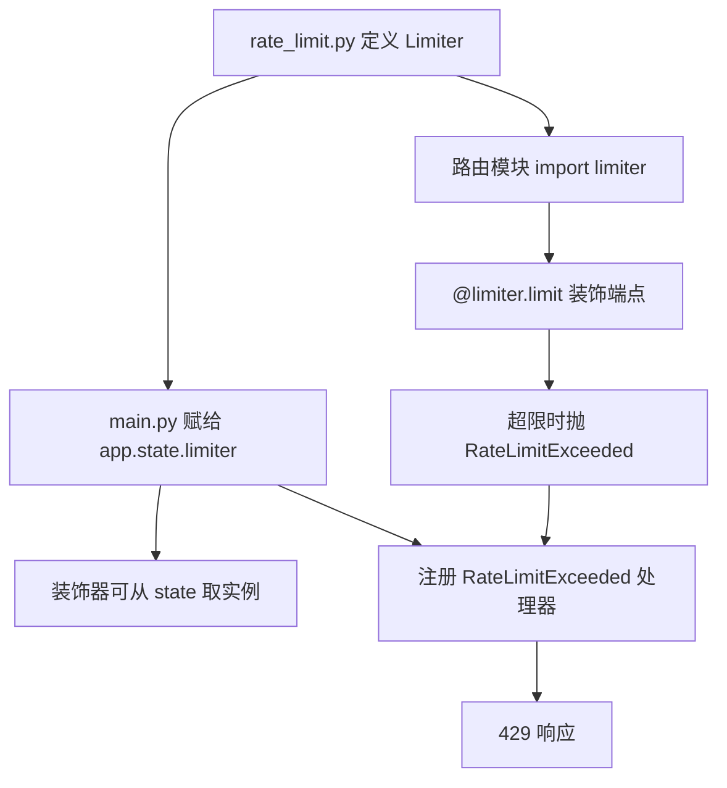
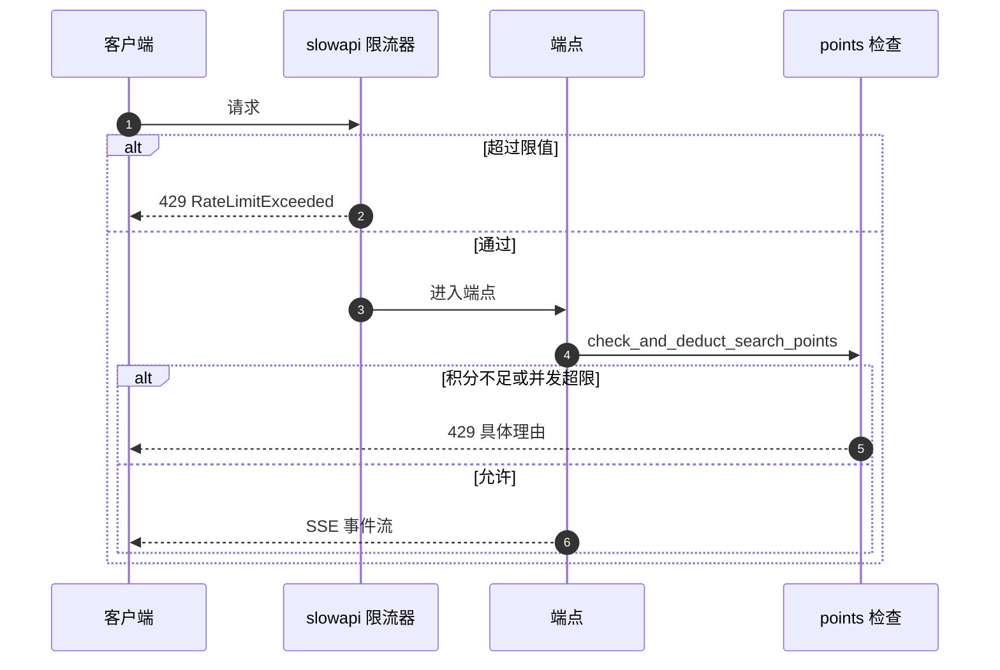

# 限流器的接入与覆盖

后端的限流由 slowapi 承担。限流器定义在一个独立模块里，装配层把它挂到 `app.state` 并注册异常处理器，需要更严格限制的端点再单独加装饰器。与限流并行存在的还有一套应用层配额：按用户统计并发任务数与积分，超限时抛 429。

限流器本身与它的覆盖范围在这里展开。异步任务一侧在 `02-任务的创建与注册.md` 与 `04-任务的并发上限与积分.md`。

## 1. 限流器定义在独立模块

`backend/rate_limit.py` 只有 12 行。模块注释说明了独立成文件的原因：`auth` 与 `main` 之间通过流水线存在循环导入，把 `Limiter` 实例放在中间层可以避开（`:1-6`）。

```python
limiter = Limiter(key_func=get_remote_address, default_limits=[RATE_LIMIT_DEFAULT])
```

| 参数 | 取值 | 来源 |
| --- | --- | --- |
| `key_func` | `get_remote_address` | slowapi 提供的客户端地址函数 |
| `default_limits` | `[RATE_LIMIT_DEFAULT]` | 配置项，默认 `30/minute` |
| 存储后端 | 进程内内存 | 模块注释写明 `in-memory backend` |

`RATE_LIMIT_DEFAULT` 的默认值是 `30/minute`，认证专用值是 `5/minute`（`backend/config.py:161-162`），两者都可以用环境变量覆盖。

## 2. 装配层的两件事

`backend/main.py` 做了两步接入（`:85-86`）：把 `limiter` 赋给 `app.state.limiter`，把 `RateLimitExceeded` 的处理器注册为全局异常处理器。两步都不可少：缺少 `app.state.limiter` 时装饰器无法工作，缺少处理器时超限会变成未处理异常。

| 步骤 | 代码 | 缺失后果 |
| --- | --- | --- |
| 暴露实例 | `app.state.limiter = limiter` | 装饰器失效 |
| 注册处理器 | `add_exception_handler(RateLimitExceeded, ...)` | 超限请求返回 500 |



## 3. 显式装饰器只覆盖两个端点

仓库里只有注册与登录两个端点带 `@limiter.limit`，限值使用认证专用值（`backend/routes/auth.py:59-60`、`:75-76`）：

```python
@router.post("/api/auth/register", response_model=Token)
@limiter.limit(RATE_LIMIT_AUTH)
async def register(request: Request, user_data: UserCreate, store: SqliteUserStore = Depends(get_user_store)):
```

两个端点的签名里都有 `request: Request`。slowapi 的装饰器需要请求对象取客户端地址，这一条对该库的用法是硬要求，按官方文档理解。

其余端点没有装饰器。它们是否受 `default_limits` 约束取决于库对默认限值的处理方式：按 slowapi 文档，默认限值同样作用于路由，但仍需要请求对象可获取。本仓库未对这一点做本地实测，排查时以实际观测到的 429 为准。

| 端点 | 显式限值 | 签名带 `Request` |
| --- | --- | --- |
| `POST /api/auth/register` | `5/minute` | 是 |
| `POST /api/auth/login` | `5/minute` | 是 |
| 其余业务端点 | 无显式装饰器 | 部分带 |

## 4. 键函数与进程边界

限流的键是客户端地址，由 `get_remote_address` 从连接信息中取。部署在反向代理后面时，所有请求的来源地址可能都是代理地址，限流会退化成全局计数。要在这种部署下按真实客户端限流，需要让应用信任代理头或替换键函数。

存储后端是进程内内存，计数不跨进程。多 worker 部署时每个进程各有一份计数，实际限值等于配置值乘以 worker 数。这一点影响部署容量估算，排查「限流没有生效」时先确认 worker 数量。

## 5. 限流与应用层配额的分工

限流按客户端地址限制请求频率；配额按用户限制并发任务数与积分消耗。两者都会返回 429，但判定依据不同：

| 维度 | 限流 | 配额 |
| --- | --- | --- |
| 键 | 客户端地址 | 用户名 |
| 统计 | 时间窗内请求数 | 当前运行任务数与积分 |
| 触发点 | 装饰器与默认限值 | `_check_and_deduct_points`（`backend/routes/pipeline.py:32-37`） |
| 拒绝理由 | 库生成 | 具体文案，如 `积分不足` |

配额侧的拒绝状态码映射在 `backend/routes/pipeline.py:37`：理由里含 `积分不足` 或 `并发` 时返回 429，否则返回 404。这条分支把两类配额失败合并成同一个状态码，细节见 `04-任务的并发上限与积分.md`。



## 6. 限值的配置与调整

两个限值都在 `backend/config.py` 读取环境变量（`:161-162`），因此调整不需要改代码。`default_limits` 在模块导入时求值一次（`backend/rate_limit.py:12`），进程运行期间不会重新读取配置。

| 配置项 | 环境变量 | 默认 |
| --- | --- | --- |
| `RATE_LIMIT_DEFAULT` | `RATE_LIMIT_DEFAULT` | `30/minute` |
| `RATE_LIMIT_AUTH` | `RATE_LIMIT_AUTH` | `5/minute` |

## 7. 限流返回的响应

超限时 `RateLimitExceeded` 由 slowapi 的处理器转成响应，状态码 429。响应体格式由库决定，与本仓库自定义的异常处理器无关：三个自定义处理器分别对应 `HTTPException`、`RequestValidationError` 与 `Exception`（`backend/main.py:92-126`），`RateLimitExceeded` 走的是 `:86` 注册的专用处理器。

排查 429 时先看响应体是否符合库的格式，再看限值配置。若响应是自定义 JSON 格式，说明触发的是配额分支而不是限流分支。

## 8. 易错点

| 易错点 | 现象 | 位置 |
| --- | --- | --- |
| 以为所有端点都有限流装饰器 | 只有注册与登录有 | `routes/auth.py:59`、`:75` |
| 在无 `Request` 的端点上加装饰器 | 装饰器取不到请求对象 | `:60`、`:76` 都带 `Request` |
| 多 worker 下按配置值估算容量 | 每进程一份计数 | `rate_limit.py:12` 内存后端 |
| 反代后按客户端地址限流 | 来源地址都是代理 | `get_remote_address` |
| 把配额 429 当成限流 429 | 两者判定依据与响应体不同 | `pipeline.py:37` |
| 运行期改环境变量期望生效 | 限值在导入期求值 | `rate_limit.py:10-12` |

## 小结

核心概念：

| 概念 | 内容 |
| --- | --- |
| 限流器 | 独立模块的 `Limiter`，键为客户端地址，内存后端 |
| 装配 | 挂 `app.state.limiter` 并注册 `RateLimitExceeded` 处理器 |
| 显式覆盖 | 注册与登录用 `5/minute`，其余端点依赖默认限值 |
| 装饰器前提 | 端点需要 `request: Request` 形参 |
| 配额 | 按用户统计并发与积分，同样返回 429 但路径不同 |

设计权衡：

| 决策 | 选择 | 收益 | 代价 |
| --- | --- | --- | --- |
| 限流存储 | 进程内内存 | 零外部依赖 | 多进程部署计数不共享 |
| 键函数 | 客户端地址 | 无需登录即可限流 | 代理部署下失效 |
| 显式装饰器 | 只加在认证端点 | 登录接口保护更严 | 其余端点的限制不确定 |
| 限值来源 | 环境变量 | 部署可调 | 导入期求值，运行期不可变 |
| 两套机制 | 限流加配额 | 频率与资源分别控制 | 都返回 429，排查要区分来源 |

## 练习

基础题：

1. 限流器定义在哪个文件？键函数与默认限值分别是什么？
2. 装配层为限流做了哪两件事？缺少任何一件会怎样？
3. 仓库里哪两个端点有显式限值？限值是多少？
4. 限流与配额在判定依据上有哪些差别？

挑战题：

5. 把限流状态放到共享存储（如 Redis），说明键函数、后端配置与部署方式的改动。
6. 为流水线端点补上显式限流，说明需要修改的签名与限值选择的依据。
7. 设计一个能在多 worker 与反向代理下都成立的限制方案，说明代理头的信任边界与失败行为。

---

### 附：本页引用的路径

| 路径 | 用途 |
| --- | --- |
| `backend/rate_limit.py` | `Limiter` 定义与循环导入说明（:1-12） |
| `backend/main.py` | 装配（:85-86）与异常处理器（:92-126） |
| `backend/config.py` | 两个限值（:161-162） |
| `backend/routes/auth.py` | 显式装饰器与签名（:59-60、:75-76） |
| `backend/routes/pipeline.py` | 配额检查与状态码映射（:32-37） |
