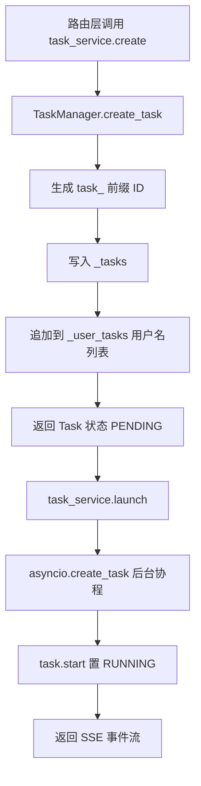
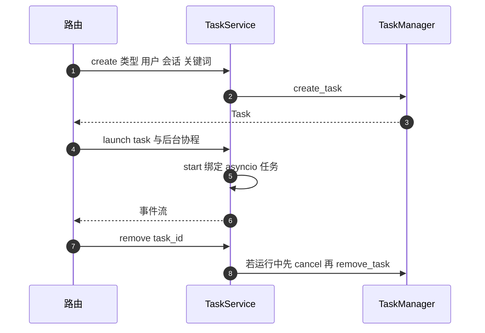

# 任务的创建与注册

异步任务的生命周期从 `TaskManager.create_task` 开始：生成 ID、构造 `Task`、写进两张内存表。上层统一通过 `TaskService` 单例访问，路由层不直接触碰 `TaskManager`。注册表只在进程内存里，进程重启后任务记录不会恢复。

注册与查询是这里的重点。事件流与心跳在 `03-SSE事件流与心跳.md`，并发上限在 `04-任务的并发上限与积分.md`。

## 1. 包级接口只有一个类

`backend/task/__init__.py` 只导出 `TaskService`，包注释写明它是该包唯一对外接口，单例模式。路由与业务模块导入时统一写 `from backend.task import TaskService`（`backend/routes/pipeline.py`），不直接引用 `TaskManager`。

| 层 | 类 | 位置 | 职责 |
| --- | --- | --- | --- |
| 服务层 | `TaskService` | `backend/task/service.py` | 创建、启动、查询、控制、SSE 生成 |
| 管理层 | `TaskManager` | `backend/models/task.py` | 保存任务与用户索引 |
| 数据层 | `Task` | `backend/models/task.py` | 单个任务的状态与事件队列 |

`TaskService.__init__` 在构造时取 `TaskManager.get_instance()`（`service.py`），两个单例彼此绑定一次，之后调用都走同一份注册表。

## 2. TaskManager 的单例实现

`TaskManager` 用 `__new__` 保证唯一实例（`backend/models/task.py`）：

```python
def __new__(cls):
    if cls._instance is None:
        cls._instance = super().__new__(cls)
        cls._instance._tasks: Dict[str, Task] = {}
        cls._instance._user_tasks: Dict[str, List[str]] = {}
    return cls._instance
```

两张表分别是任务 ID 到 `Task` 的映射，与用户名到任务 ID 列表的索引。类上还定义了一个 `asyncio.Lock`，但创建路径没有用到它，单例初始化依赖 `__new__` 的顺序执行。`get_instance` 是另一条入口，与直接构造等价。

| 表 | 键 | 值 | 用途 |
| --- | --- | --- | --- |
| `_tasks` | 任务 ID | `Task` 对象 | 按 ID 查询与移除 |
| `_user_tasks` | 用户名 | 任务 ID 列表 | 列出某用户的任务 |

## 3. 任务 ID 与初始状态

`create_task` 先拼 ID 再构造对象（`backend/models/task.py`）。ID 形如 `task_` 加 12 位十六进制，取自 `uuid4()`：

```python
task_id = f"task_{uuid.uuid4().hex[:12]}"
```

`Task.__init__` 接收六个参数并设置一批内部字段：

| 字段 | 初始值 | 说明 |
| --- | --- | --- |
| `status` | `TaskStatus.PENDING` | 创建但未启动 |
| `progress` | `None` | 首个进度事件后写入 |
| `generated_cards` | 空列表 | 卡片事件累积 |
| `error` | `None` | 错误事件写入 |
| `agent_owned` | `False` | Agent 触发的任务置为真 |
| `_event_queue` | 空 `asyncio.Queue` | 事件暂存 |
| `_subscriber_count` | 0 | 当前 SSE 订阅者数 |

状态在 `start` 时才从 `PENDING` 变成 `RUNNING`。这条顺序让「已创建但未启动」的任务可被查询到，但不会出现在运行中列表里。

## 4. 服务层的三段式启动

`TaskService` 把启动拆成三种粒度（`backend/task/service.py`）：

| 方法 | 行为 | 使用场景 |
| --- | --- | --- |
| `create` | 只创建并注册 | 需要手动控制生命周期 |
| `start` | 创建后台任务并置 `RUNNING` | 不需要 SSE 流 |
| `launch` | `start` 之后返回事件流 | 路由层立即返回 SSE |

`start` 用 `asyncio.create_task` 绑定后台协程，`launch` 返回 `stream_events` 生成的异步迭代器。路由层把它直接交给 `StreamingResponse`（`backend/routes/pipeline.py`）。



## 5. 查询与复用

查询方法都建立在两张表之上（`backend/models/task.py`）：`get_task` 按 ID 取对象，`get_user_tasks` 按用户名取列表并可按会话过滤，`get_running_tasks` 在其中筛出 `RUNNING`。服务层再做一层封装（`service.py`），并提供一个关键词匹配方法 `find_existing`。

`find_existing` 按关键词、会话与任务类型三项匹配运行中的任务，用于 SSE 重连。路由层的收集端点自己实现了一遍同样的匹配（`backend/routes/pipeline.py`），匹配到已有任务时直接返回它的事件流，不再创建新任务。

| 方法 | 匹配条件 | 位置 |
| --- | --- | --- |
| `find_existing` | 关键词、会话、类型 | `service.py` |
| 路由内的复用逻辑 | 同上 | `routes/pipeline.py` |

## 6. 移除与清理

`remove_task` 同时清两张表（`backend/models/task.py`），移除用户索引时用 `try` / `except ValueError` 兜底。服务层的 `remove` 在任务仍为运行中时先取消再移除（`service.py`）。

`cleanup_completed_tasks` 按完成时间清理超过 24 小时的任务，但仓库里没有任何调用点。没有调用意味着完成的任务会一直留在 `_tasks` 里，直到进程重启或显式移除。



## 7. 注册表的进程内边界

两张表都定义在 `TaskManager` 实例上（`backend/models/task.py`），没有落库也没有跨进程共享。三个直接后果：进程重启后所有任务记录消失；多 worker 部署时同一任务只存在于处理它的进程；SSE 重连请求若被负载均衡分到另一个进程，会得到 404。

| 边界 | 表现 | 影响 |
| --- | --- | --- |
| 进程重启 | 注册表清空 | 重连与状态查询 404 |
| 多 worker | 各进程独立 | 请求需要粘性路由 |
| 无持久化 | 任务历史不留存 | 只能看到当前进程内的任务 |

## 8. 易错点

| 易错点 | 现象 | 位置 |
| --- | --- | --- |
| 以为任务会恢复 | 重启后 404 | `models/task.py` |
| 认为 `PENDING` 就是运行中 | `start` 之后才置 `RUNNING` | — |
| 直接 import `TaskManager` | 绕过服务层约定 | 包只导出 `TaskService`（`task/__init__.py`） |
| 以为清理会自动执行 | 无调用点 | `models/task.py` |
| 在用户索引上重复添加 | 同一任务 ID 进入列表多次 |  每次创建都追加 |
| 依赖 `_lock` 保护创建 | 创建路径未使用锁 |  定义了但没被引用 |

## 小结

核心概念：

| 概念 | 内容 |
| --- | --- |
| 分层 | `TaskService` 服务层、`TaskManager` 注册表、`Task` 单任务 |
| 单例 | `__new__` 加 `_instance`，服务层构造时取用 |
| ID 形式 | `task_` 加 12 位十六进制 |
| 状态起点 | 创建为 `PENDING`，启动后为 `RUNNING` |
| 注册表边界 | 两张内存表，进程重启即清空，多 worker 不共享 |

设计权衡：

| 决策 | 选择 | 收益 | 代价 |
| --- | --- | --- | --- |
| 注册位置 | 进程内存 | 查询无 IO 开销 | 无持久化、不可跨进程 |
| 单例 | `__new__` 实现 | 访问入口唯一 | 初始化未加锁保护 |
| 服务层封装 | 一个类覆盖全部操作 | 调用方接口一致 | 服务层与管理层职责有重叠 |
| 清理策略 | 提供方法但不调用 | 保留手动清理能力 | 长期运行内存持续增长 |
| 任务复用 | 关键词加会话匹配 | 重连不重复建任务 | 匹配逻辑在两处重复实现 |

## 练习

基础题：

1. 说出 `TaskService`、`TaskManager`、`Task` 三者的职责与位置。
2. 任务 ID 的格式是什么？由哪段代码生成？
3. `create`、`start`、`launch` 三个方法的差别是什么？
4. 任务注册表保存在哪里？进程重启后会发生什么？

挑战题：

5. 设计一个把任务注册表下沉到 Redis 的方案，说明需要序列化的字段与 SSE 重连的读取路径。
6. 为 `cleanup_completed_tasks` 找一个调用时机（例如启动钩子或定时任务），说明实现位置与清理间隔的依据。
7. `find_existing` 与路由内的复用逻辑重复。给出合并方案并说明对重连行为的影响。

---

### 附：本页引用的路径

| 路径 | 用途 |
| --- | --- |
| `backend/models/task.py` | `Task` 字段与 `to_dict`、单例与建表、创建、查询、移除与清理 |
| `backend/task/service.py` | 创建与启动、查询与复用、控制 |
| `backend/task/__init__.py` | 包级导出 |
| `backend/routes/pipeline.py` | 服务层使用与复用逻辑 |
