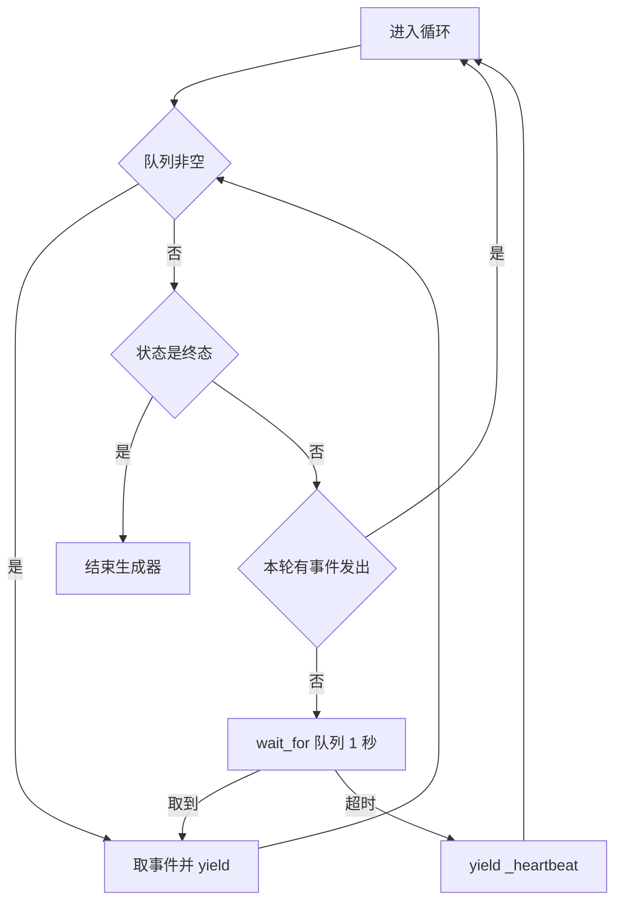
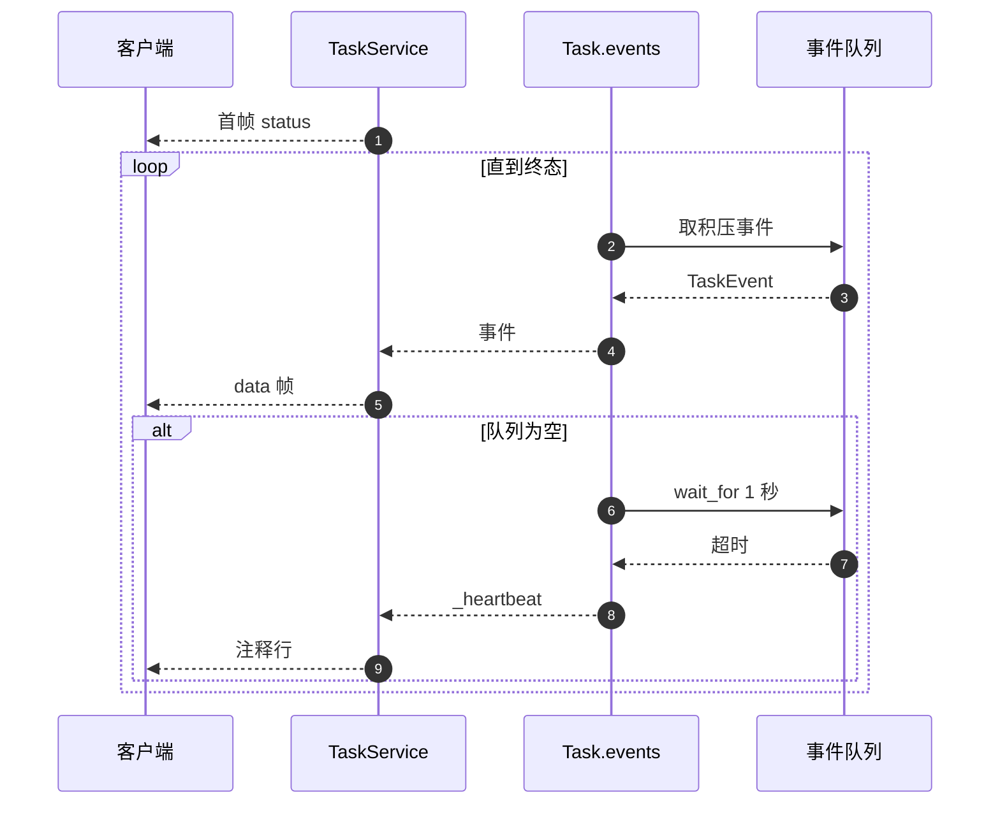

# SSE 事件流与心跳

任务进度通过 SSE 推给客户端，载体是 `Task._event_queue`。生成器 `Task.events` 负责把队列里的 `TaskEvent` 变成异步迭代，等待期间用超时发心跳保活；`TaskService.stream_events` 负责把事件编码成 `data: ...` 帧。断线重连时 `replay_events` 先回放已有状态再续上实时流。

事件流的推与拉在这里展开。任务注册在 `02-任务的创建与注册.md`，并发与配额在 `04-任务的并发上限与积分.md`。

## 1. 事件入队

所有进度都从 `Task.emit` 进入队列（`backend/models/task.py:106-124`）。它先构造 `TaskEvent`，把 Pydantic 模型转成 JSON 字典，再放入队列并更新时间戳。随后按事件类型更新任务状态：

| 事件类型 | 附加动作 | 行号 |
| --- | --- | --- |
| `progress` | 记录 `TaskProgress` | `:115-116` |
| `card` | 追加到 `generated_cards` | `:117-118` |
| `error` | 状态置 `ERROR`，记录错误文本 | `:119-121` |
| `complete` | 状态置 `COMPLETED`，记录完成时间 | `:122-124` |

事件类型是字符串，没有枚举约束。`_heartbeat` 是一种内部类型，只由事件流生成器产生，不会经过 `emit`。

## 2. 排空加等待的循环

`Task.events` 是异步生成器，主体是一个循环（`backend/models/task.py:126-164`）。每轮先把队列里已有事件全部取出并 `yield`，然后判断任务是否已进入终态，最后在没有待发事件时等待新事件。

```python
while True:
    drained = False
    while not self._event_queue.empty():
        try:
            event = self._event_queue.get_nowait()
            drained = True
            yield event
        except asyncio.QueueEmpty:
            break

    if self.status in (TaskStatus.COMPLETED, TaskStatus.ERROR, TaskStatus.CANCELLED):
        break
    if drained:
        continue
    try:
        event = await asyncio.wait_for(self._event_queue.get(), timeout=1.0)
        yield event
    except asyncio.TimeoutError:
        yield TaskEvent(type="_heartbeat", data={})
```

三段结构各有用途：内层 `while` 保证攒下的事件一次发完；终态判断让任务结束后生成器自然收尾；`wait_for` 的 1 秒超时把等待切成片段，超时即发心跳。终态判断在排空之后，所以结束前队列里的事件不会丢。

| 片段 | 作用 | 超时行为 |
| --- | --- | --- |
| 内层排空 | 一次性发送积压事件 | 无 |
| 终态判断 | 结束生成器 | 无 |
| 等待新事件 | 保持连接活跃 | 1 秒后发 `_heartbeat` |



## 3. 订阅者计数与空闲取消

生成器进入时先取消待执行的空闲计时器，并把订阅者计数加一（`backend/models/task.py:127-132`）。退出时在 `finally` 里减一；若计数归零、任务仍在运行且不是 Agent 触发的任务，就安排一次空闲取消（`:160-164`）。

`_schedule_idle_cancel` 创建计时任务，30 秒后若仍无订阅者且状态为 `RUNNING` 就调用 `cancel`（`:171-180`）。`cancel` 会先取消计时器与后台协程，再把状态置 `CANCELLED` 并记录完成时间（`:182-190`）。

| 字段 | 作用 | 位置 |
| --- | --- | --- |
| `_subscriber_count` | 统计当前连接数 | `:87`、`:132`、`:161` |
| `_idle_cancel_timer` | 空闲取消计时器 | `:88`、`:171-180` |
| `agent_owned` | 为真时跳过空闲取消 | `:77`、`:163` |

这条机制的含义是：浏览器关掉页面 30 秒后，任务会被自动取消，避免没人看时继续消耗抓取与模型调用。Agent 触发的任务例外，因为前端断开不代表用户离开。

## 4. TaskService 的帧格式

`stream_events` 先把首帧状态发给客户端，再逐事件编码（`backend/task/service.py:90-106`）：

```python
yield f"data: {json.dumps({'type': 'status', 'data': {'task_id': task.task_id, 'status': task.status.value}}, ensure_ascii=False)}\n\n"
...
payload = {"type": event.type, "data": event.data}
yield f"data: {json.dumps(payload, ensure_ascii=False, default=str)}\n\n"
```

| 细节 | 取值 | 说明 |
| --- | --- | --- |
| 帧格式 | `data: ` 加 JSON 加两个换行 | 标准 SSE |
| 中文 | `ensure_ascii=False` | 不转义 |
| 兜底编码 | `default=str` | 处理非标准类型 |
| 心跳 | `: heartbeat\n\n` | 注释行，不触发事件 |
| 结束 | 生成器耗尽 | 响应自然关闭 |

心跳事件在 `stream_events` 里被转换成注释行（`:99-101`），客户端不会收到 `_heartbeat` 类型的事件。事件计数只统计非心跳事件，日志里可以看到每个任务的总事件数（`:102`、`:106`）。



## 5. 断线重连的回放

`replay_events` 区分终态与运行中两种任务（`backend/task/service.py:153-176`）：

| 任务状态 | 回放内容 | 行号 |
| --- | --- | --- |
| 终态 | status、progress、全部已生成卡片、error、complete | `:155-163` |
| 运行中 | status、progress、已生成卡片，随后接实时事件 | `:164-176` |

回放的事件帧与实时帧结构一致，客户端可以用同一套解析逻辑。已生成的卡片来自 `generated_cards`，所以即使中途断线，重连后也能补齐之前推送过的卡片。

路由层的重连端点对两类任务返回同一个生成器（`backend/routes/pipeline.py:435-445`），判断分支里的两个 `return` 内容相同，条件判断实际没有产生分支差异。

## 6. 队列的无界性

`_event_queue` 是普通的 `asyncio.Queue`（`backend/models/task.py:85`），没有设置最大长度。没有订阅者时事件仍会入队，队列随进度增长；任务结束后生成器不再消费，队列内容一直保留到任务对象被移除。长时间无人订阅的长任务因此会持有较多已完成事件。

| 情况 | 队列行为 |
| --- | --- |
| 有订阅者 | 事件被及时取走 |
| 无订阅者，任务运行中 | 事件堆积，30 秒后任务被取消 |
| 任务已结束 | 队列保留最后一批事件，供重连回放 |

## 7. 易错点

| 易错点 | 现象 | 位置 |
| --- | --- | --- |
| 以为心跳是业务事件 | `_heartbeat` 被转成注释行 | `service.py:99-101` |
| 忘记断线会被取消 | 30 秒无订阅者任务终止 | `models/task.py:171-180` |
| 以为 Agent 任务同样会被取消 | `agent_owned` 为真时跳过 | `:163` |
| 认为重连只有一条分支 | 两个分支返回同一生成器 | `routes/pipeline.py:435-445` |
| 忽略队列无上限 | 长任务会积累事件 | `models/task.py:85` |
| 在终态判断前就退出循环 | 会丢掉队列里最后的事件 | 判断在排空之后（`:145`） |

## 小结

核心概念：

| 概念 | 内容 |
| --- | --- |
| 入队 | `emit` 构造 `TaskEvent` 并按类型更新任务状态 |
| 出队 | 排空积压事件，终态即结束，等待用 1 秒超时 |
| 心跳 | 超时产生 `_heartbeat`，在服务层转成 SSE 注释行 |
| 空闲取消 | 无订阅者 30 秒后取消运行中任务，Agent 任务除外 |
| 重连回放 | 终态回放全部卡片，运行中回放后再接实时流 |

设计权衡：

| 决策 | 选择 | 收益 | 代价 |
| --- | --- | --- | --- |
| 等待方式 | 1 秒超时轮询 | 心跳简单，兼容代理 | 每秒一次调度开销 |
| 空闲策略 | 30 秒自动取消 | 防止无人任务空跑 | 短暂断线也会终止任务 |
| 队列 | 默认无界 | 实现简单 | 长任务事件堆积 |
| 事件类型 | 字符串 | 扩展方便 | 无枚举约束，拼写错误不报错 |
| 回放 | 复用同一帧格式 | 客户端解析统一 | 历史进度事件不完整回放 |

## 练习

基础题：

1. 描述 `Task.events` 每轮循环的三段结构。
2. 心跳由什么触发？它在 SSE 帧里长什么样？
3. 空闲取消的条件是什么？哪类任务不受影响？
4. 终态任务与运行中任务的重连回放内容有何不同？

挑战题：

5. 为 `_event_queue` 设置上限并设计溢出策略（丢弃最旧或丢最新），说明对重连回放的影响。
6. 把 1 秒轮询改成基于事件的推送（例如信号量或条件变量），说明心跳的实现方式变化。
7. 设计一个在浏览器短暂断线时不被取消的策略，要求区分「页面关闭」与「网络抖动」，给出判定依据。

---

### 附：本页引用的路径

| 路径 | 用途 |
| --- | --- |
| `backend/models/task.py` | `emit`（:106-124）、事件循环与心跳（:126-164）、空闲取消与 `cancel`（:171-190）、队列定义（:85） |
| `backend/task/service.py` | 帧编码（:90-106）、重连回放（:153-176） |
| `backend/routes/pipeline.py` | 流式返回与重连端点（:112-117、:423-445） |
