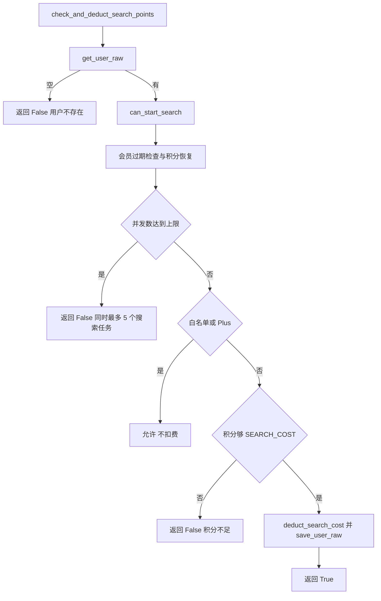
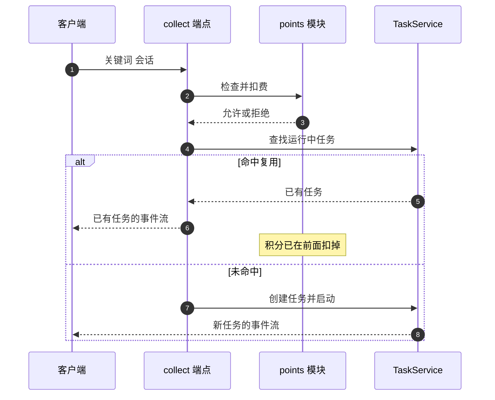

# 任务的并发上限与积分

启动一条搜索流水线前有两道闸门：并发任务数不超过 5，Free 用户还要扣掉 1 点积分。判定与扣费封装在一个函数里，路由层只负责把失败理由转成状态码。这套机制与限流器互不相干，但同样会返回 429。

配额判定与扣费顺序在这里展开。限流器在 `01-限流器的接入与覆盖.md`，任务注册在 `02-任务的创建与注册.md`，事件流在 `03-SSE事件流与心跳.md`。

## 1. 常量与会员差异

配额相关的常量都在 `backend/config.py`：

| 常量 | 值 | 说明 |
| --- | --- | --- |
| `MAX_CONCURRENT_TASKS` | 5 | 每用户并发任务上限 |
| `MAX_POINTS_FREE` | 48 | Free 用户积分上限 |
| `MAX_POINTS_PRO` | 96 | Pro 用户积分上限 |
| `POINTS_PER_HOUR_FREE` | 2 | Free 每小时恢复 |
| `POINTS_PER_HOUR_PRO` | 8 | Pro 每小时恢复 |
| `SEARCH_COST` | 1 | 单次搜索消耗 |
| `DOCUMENT_COST` | 6 | 单次文档分析消耗 |

并发上限对所有用户一致。积分只在 Free 用户上扣：白名单与 Plus 用户免扣（`backend/services/points.py`），但并发检查仍然执行。

| 用户类型 | 扣积分 | 并发上限 |
| --- | --- | --- |
| 白名单 | 否 | 5 |
| Plus | 否 | 5 |
| Free | 是，1 点 | 5 |

## 2. 判定与扣费的封装

`check_and_deduct_search_points` 把存储读写、判定与扣费包装成一次调用（`backend/services/points.py`）：

```python
store = SqliteUserStore()
user_data = store.get_user_raw(username)
if not user_data:
    return False, "用户不存在"
allowed, reason = can_start_search(user_data, running_count)
if not allowed:
    return False, reason
deduct_search_cost(user_data)
store.save_user_raw(username, user_data)
return True, ""
```

它自己构造 `SqliteUserStore`，不走依赖注入。判定通过后立即扣费并写回，因此函数名里的「deduct」是实际行为，不是命名冗余。

`can_start_search` 负责纯判定：先检查会员是否过期、按小时恢复积分，再按用户类型分支。三条分支都先看并发数，Free 用户额外看积分是否够一次搜索。



## 3. 拒绝理由到状态码的映射

路由层的包装函数把理由映射成状态码（`backend/routes/pipeline.py`）：

```python
running_count = len(task_service.list_running(current_user.username))
allowed, reason = check_and_deduct_search_points(current_user.username, running_count)
if not allowed:
    raise HTTPException(status_code=429 if "积分不足" in reason or "并发" in reason else 404, detail=reason)
```

判定用的是子串匹配：理由里出现 `积分不足` 或 `并发` 就返回 429，其余返回 404。`用户不存在` 落进 404 分支，与「任务不存在」共用同一个状态码。

| 理由 | 状态码 | 语义 |
| --- | --- | --- |
| `积分不足，当前积分: N` | 429 | 资源不足，可恢复 |
| `同时最多 5 个搜索任务` | 429 | 并发超限，可恢复 |
| `用户不存在` | 404 | 账号问题 |

子串匹配的代价是文案即契约：改动 `can_start_search` 里的提示文字可能把 429 变成 404，而代码里没有测试守住这一点。

## 4. 扣费与任务复用的顺序

收集端点在扣费之后才检查是否有可复用的运行中任务（`backend/routes/pipeline.py`）：

| 顺序 | 步骤 |
| --- | --- |
| 1 | 判定并扣费 |
| 2 | 查找同关键词同会话的运行中任务 |
| 3 | 命中则返回已有任务的事件流 |
| 4 | 未命中则创建新任务 |

这意味着命中复用路径时积分已经被扣掉一次：客户端刷新页面或重复发起同一关键词，会持续消耗积分而不产生新任务。把复用检查提到扣费之前可以消除这次重复计费，代价是需要在复用路径上补一次配额可用的判断（否则并发超限的用户仍能靠复用进入）。



## 5. 文档分析的另一条配额

文档分析使用独立判定函数 `can_analyze_document`（`backend/services/points.py`），逻辑与搜索一致：先做会员与积分恢复，再检查并发，最后按 Free 用户检查 `DOCUMENT_COST` 是否够。白名单与 Plus 用户跳过积分检查但保留并发检查。

两个判定函数的并发提示文案相同（`同时最多 5 个搜索任务`），文档场景下这句话里的「搜索」与实际用途不符。文案还参与状态码映射，改动它需要同步检查映射条件。

| 函数 | 消耗常量 | 并发检查 |
| --- | --- | --- |
| `can_start_search` | `SEARCH_COST` | 有 |
| `can_analyze_document` | `DOCUMENT_COST` | 有 |

## 6. 任务接口的所有权校验

任务的状态、事件流、取消与移除四类端点都会校验任务归属（`backend/routes/pipeline.py`）：

| 情况 | 响应 |
| --- | --- |
| 任务不存在 | 404 `Task not found` |
| 任务属于他人 | 403 `Access denied` |

校验方式是比较 `task.username` 与当前用户名，四处写法一致。任务列表类端点不校验单个任务归属，查询时直接按用户名过滤。

## 7. 并发计数的口径

并发数由 `task_service.list_running(username)` 现场统计（`backend/routes/pipeline.py`），数据来自内存注册表。计数只覆盖当前进程内的任务，多 worker 部署时每个进程各算一份，实际并发可能超过 5。

统计口径与任务状态绑定的：只有 `RUNNING` 的任务计入（`backend/models/task.py`），创建后未启动的任务与已结束的任务都不算。

| 口径 | 说明 |
| --- | --- |
| 统计来源 | 进程内 `_user_tasks` 索引 |
| 计入状态 | `RUNNING` |
| 跨进程 | 不共享 |

## 8. 易错点

| 易错点 | 现象 | 位置 |
| --- | --- | --- |
| 以为复用不扣积分 | 扣费在复用判断之前 | `routes/pipeline.py` 与  |
| 依赖 429 判断配额类型 | 看 detail 才能区分积分与并发 | — |
| 改动提示文案 | 状态码可能从 429 变 404 |  的子串匹配 |
| 认为白名单不受并发限制 | 只免积分，不免并发 | `services/points.py` |
| 多 worker 下按 5 估算总并发 | 计数不跨进程 | `routes/pipeline.py` |
| 把 404 当成任务不存在 | 也可能是用户不存在 | — |

## 小结

核心概念：

| 概念 | 内容 |
| --- | --- |
| 并发上限 | 每用户 5，对所有用户类型一致 |
| 积分消耗 | Free 扣 1 点，白名单与 Plus 免扣 |
| 判定封装 | `check_and_deduct_search_points` 读库、判定、扣费、写回 |
| 状态码映射 | 理由含 `积分不足` 或 `并发` 为 429，否则 404 |
| 所有权校验 | 单任务端点 404 与 403 两种响应 |

设计权衡：

| 决策 | 选择 | 收益 | 代价 |
| --- | --- | --- | --- |
| 判定与扣费合并 | 一个函数完成 | 路由层只需处理返回值 | 复用路径也会扣费 |
| 状态码映射 | 子串匹配 | 实现简单 | 文案即契约 |
| 并发口径 | 进程内统计 | 无需共享存储 | 多 worker 下上限失效 |
| 提示文案 | 搜索与文档共用 | 文案统一 | 文档场景语义不准 |
| 所有权校验 | 逐端点比较用户名 | 直观 | 四处重复实现 |

## 练习

基础题：

1. 列出五道配额相关的常量与取值。
2. `check_and_deduct_search_points` 做了哪四件事？
3. 哪些拒绝理由返回 429，哪些返回 404？
4. 任务单查、事件流、取消、移除四个端点在任务不存在与属于他人时分别返回什么？

挑战题：

5. 把复用检查移到扣费之前，说明需要补充的配额判断与对并发语义的影响。
6. 用枚举或结构化错误码替换子串匹配，列出需要改动的位置与对客户端的影响。
7. 设计一个多 worker 下仍然成立的并发计数方案，比较共享存储与粘性路由两种做法。

---

### 附：本页引用的路径

| 路径 | 用途 |
| --- | --- |
| `backend/config.py` | 配额常量 |
| `backend/services/points.py` | `can_start_search`、`deduct_search_cost`、`can_analyze_document`、`check_and_deduct_search_points` |
| `backend/routes/pipeline.py` | 配额包装与状态码、扣费与复用的顺序、任务端点 |
| `backend/models/task.py` | 运行中任务筛选 |
