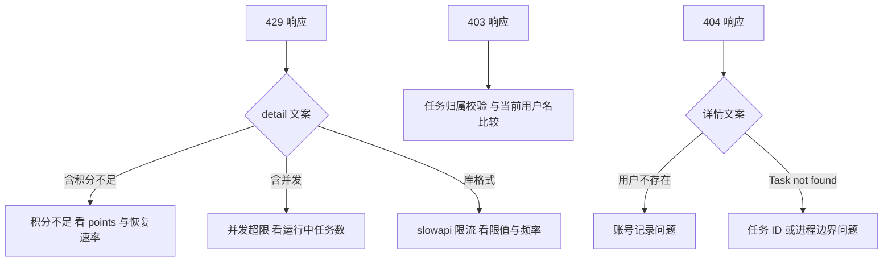
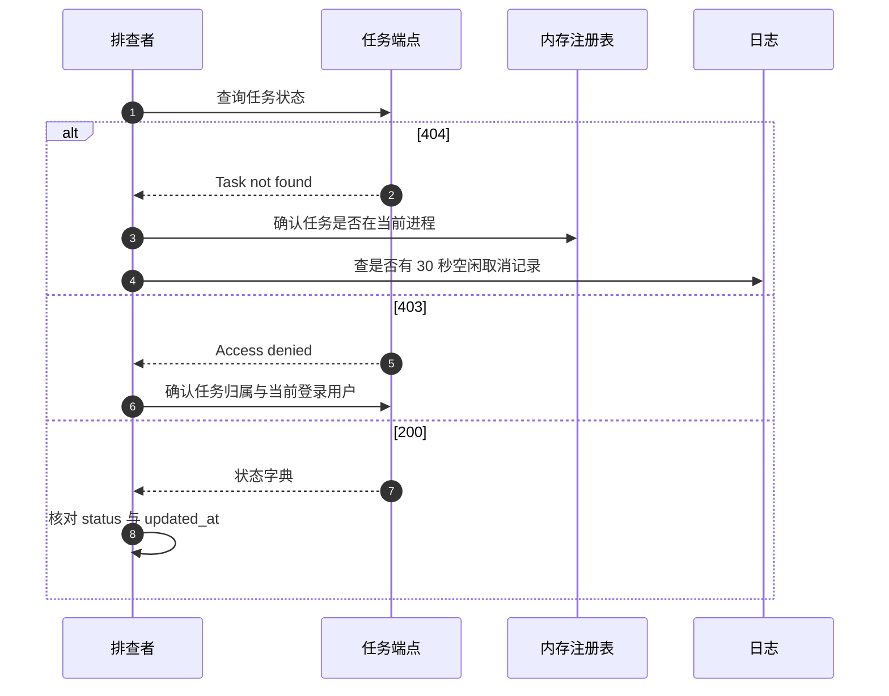

# 限流与任务的易错点与排查

这一块的问题分成三类：请求被拒（429 与 403）、任务凭空消失（空闲取消或进程重启）、进度流看起来卡住（心跳与队列）。三类现象的排查入口不同，混在一起追会绕远路。

限流见 `01-限流器的接入与覆盖.md`，任务注册见 `02-任务的创建与注册.md`，事件流见 `03-SSE事件流与心跳.md`，配额见 `04-任务的并发上限与积分.md`。

## 1. 风险清单

| 编号 | 风险 | 位置 | 现象 |
| --- | --- | --- | --- |
| R1 | 扣费在任务复用判断之前 | `routes/pipeline.py` 与  | 重复请求同一关键词持续掉积分 |
| R2 | 状态码由提示文案子串决定 | — | 改文案会把 429 变成 404 |
| R3 | 任务注册表只在进程内存 | `models/task.py` | 重启或多 worker 下查不到任务 |
| R4 | 无订阅者 30 秒自动取消 | — | 切走页面后任务终止 |
| R5 | 事件队列无上限 | — | 长任务积累事件 |
| R6 | 清理方法无调用点 | — | 完成任务长期占用内存 |
| R7 | 限流计数在进程内存 | `rate_limit.py` | 多 worker 下限值成倍 |
| R8 | 默认限值是否覆盖未装饰端点未实测 | — | 429 触发规律不易预测 |
| R9 | 心跳是内部事件 | `task/service.py` | 客户端看不到 `_heartbeat` |
| R10 | 并发计数只统计 `RUNNING` | `models/task.py` | 创建未启动的任务不计入 |
| R11 | 404 同时表示任务不存在与用户不存在 | `routes/pipeline.py` | 排查方向要分开 |
| R12 | 重连端点的两个分支返回相同生成器 | — | 终态与运行中回放内容差异靠生成器内部处理 |

## 2. 请求被拒：先分状态码

429 与 403 的来源不同，先按状态码分流再看具体分支：

| 状态码 | 来源 | 排查入口 |
| --- | --- | --- |
| 429 | slowapi 限流 | 限值配置与请求频率 |
| 429 | 配额判定 | 并发数或积分 |
| 403 | 任务属于他人 | 任务归属 |
| 401 | 令牌问题 | 见鉴权单元 |
| 404 | 配额里的用户不存在 | 用户表 |

配额的两条 429 靠响应体里的 `detail` 区分：含 `积分不足` 是积分问题，含 `并发` 是并发问题（`backend/services/points.py`）。slowapi 的 429 响应体格式由库生成，与本仓库的文案不同，这一点可以用来区分来源。

## 3. 积分异常：先看扣费顺序

「什么都没搜到但积分一直掉」对应 R1：收集端点在复用判断之前扣费（`backend/routes/pipeline.py`）。同一关键词同一会话重复请求时，命中复用路径返回已有任务，但积分已经扣过一次。

排查步骤：记录请求次数与积分变化，确认关键词与会话是否相同，再核对响应里返回的是新任务 ID 还是已有任务 ID。若任务 ID 不变而积分下降，就是重复扣费。

| 观察项 | 含义 |
| --- | --- |
| 任务 ID 不变、积分下降 | 命中复用且被重复扣费 |
| 任务 ID 变化、积分下降 | 正常扣费 |
| 积分不变 | 白名单或 Plus 用户 |

## 4. 任务消失：三类原因

任务查不到或中途终止有三种常见原因，排查时按顺序排除：

| 原因 | 触发条件 | 判定方式 |
| --- | --- | --- |
| 空闲取消 | 30 秒无 SSE 订阅者且任务运行中 | 日志里有自动取消记录（`models/task.py`） |
| 进程重启 | 注册表为内存表 | 重启时间与任务创建时间对比 |
| 换了进程 | 多 worker 无粘性路由 | 同一任务 ID 两次请求可能分别落到不同进程 |

Agent 触发的任务不受空闲取消影响，排查时先确认任务的 `agent_owned` 标记。

## 5. 进度流卡住：心跳与队列

SSE 连接看起来没有数据时，先确认服务端是否在发心跳。`Task.events` 每秒超时一次并产生 `_heartbeat`（`models/task.py`），服务层把它转成注释行 `: heartbeat`（`task/service.py`）。浏览器与常见 SSE 客户端会忽略注释行，因此连接不断但界面没有更新属于正常现象，前提是任务确实没有新进度。

任务已经结束时生成器会退出，连接关闭。若连接保持而任务已结束，检查是否读到了终态判断之后的残留事件。

| 现象 | 判定 |
| --- | --- |
| 只有注释行 | 任务在等待中，属正常 |
| 有 status 帧后无内容 | 任务可能被空闲取消 |
| 连接直接关闭 | 任务进入终态 |

## 6. 容量与边界

限流与并发都以进程为边界。多 worker 部署时，两个计数器各自独立：限流按配置值乘 worker 数放宽，并发上限同样按进程分别计算（`backend/routes/pipeline.py`、`rate_limit.py`）。容量规划要按进程数折算。

任务对象不会自动清理：`cleanup_completed_tasks` 没有调用点（`models/task.py`），事件队列也没有上限。长时间运行的进程内存占用会随任务数增长，排查内存增长时先看任务总数与队列长度。

## 7. 容易走错的方向

| 现象 | 容易先怀疑 | 实际应先查 |
| --- | --- | --- |
| 积分异常下降 | 积分模块逻辑 | 收集端点的扣费顺序 |
| 429 原因不明 | 限流配置 | 响应体 `detail` 的文案来源 |
| 任务突然消失 | 前端断连 | 空闲取消日志与进程重启时间 |
| 重连回放不全 | SSE 客户端 | 回放分支里两类任务的差异 |
| 内存持续增长 | 事件对象泄漏 | 完成任务数与被取消的清理方法 |
| 多进程下上限失效 | 配置值写错 | 计数所在进程 |

## 小结

核心概念：

| 概念 | 内容 |
| --- | --- |
| 429 来源 | 限流器与配额判定两条路径，靠响应体区分 |
| 扣费顺序 | 扣费在复用判断之前，重复请求会重复扣费 |
| 状态码契约 | 由提示文案子串决定，文案改动会改变状态码 |
| 任务边界 | 注册表与计数都在进程内，重启与多 worker 都有影响 |
| 连接保活 | 每秒心跳以注释行发送，客户端不可见 |

设计权衡：

| 决策 | 选择 | 收益 | 代价 |
| --- | --- | --- | --- |
| 扣费与复用 | 先扣费后复用 | 路由层结构简单 | 复用路径重复计费 |
| 状态码判定 | 子串匹配 | 无需额外错误类型 | 文案即契约 |
| 空闲取消 | 固定 30 秒 | 防止空跑 | 短暂断线终止任务 |
| 清理 | 提供方法不调度 | 保留手动能力 | 长期运行内存增长 |
| 计数 | 进程内 | 无外部依赖 | 多 worker 下失效 |

## 练习

基础题：

1. 429 可能来自哪两条路径？如何区分？
2. 为什么重复请求同一关键词会重复扣积分？给出代码顺序。
3. 任务在哪些情况下会从注册表里消失？
4. 心跳在客户端看到的是什么内容？

挑战题：

5. 设计一份排查清单，覆盖 429、403、404、积分下降、任务消失、进度卡住与内存增长七类现象，每类写清观测点与判定依据。
6. 把配额拒绝改成结构化错误码，说明对状态码映射、客户端处理与日志的影响。
7. 为任务注册表设计生命周期管理（清理时机、上限与淘汰策略），并说明对重连回放的影响。

---

### 附：本页引用的路径

| 路径 | 用途 |
| --- | --- |
| `backend/routes/pipeline.py` | 配额映射、扣费与复用顺序、任务端点 |
| `backend/services/points.py` | 并发与积分提示文案、文档分析判定 |
| `backend/models/task.py` | 队列与字段、事件循环与心跳、空闲取消、注册表、状态筛选、清理 |
| `backend/task/service.py` | 心跳帧转换、重连回放 |
| `backend/rate_limit.py` | 内存后端与默认限值 |
