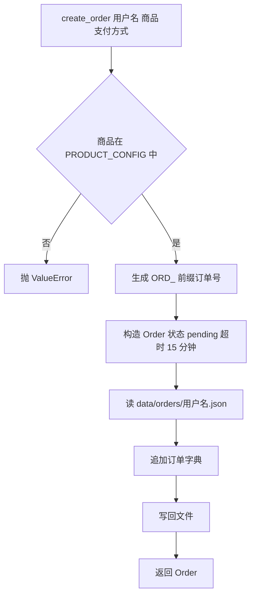
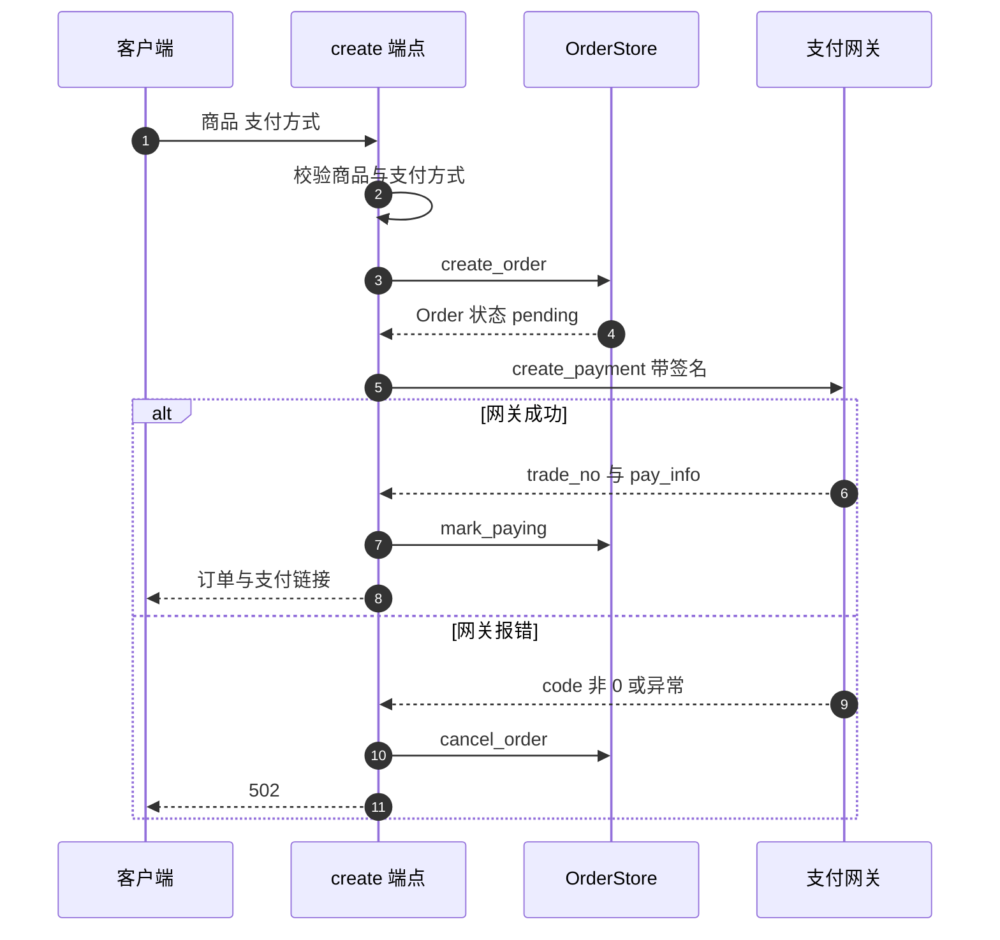

# 商品配置与订单创建

支付链路的入口是订单创建接口 `POST /api/pay/create`，它在调用支付网关之前先做商品与支付方式校验，然后写入一条 `pending` 订单。订单不存数据库，而是按用户名放在 `data/orders/{username}.json` 里。

商品配置与创建流程在这里展开。网关与签名在 `02-支付网关与签名.md`，回调在 `03-回调与幂等.md`，查询与取消在 `04-订单查询与轮询补偿.md`。

## 1. 三个商品

商品与定价集中在一张表里（`backend/storage/order_store.py:19-23`）：

```python
PRODUCT_CONFIG = {
    "pro": {"amount": "12.00", "duration_days": 30},
    "plus": {"amount": "30.00", "duration_days": 30},
    "points_24": {"amount": "1.00", "points": 24},
}
```

| 商品 | 金额 | 权益 | 字段 |
| --- | --- | --- | --- |
| `pro` | 12.00 | Pro 会员 30 天 | `duration_days` |
| `plus` | 30.00 | Plus 会员 30 天 | `duration_days` |
| `points_24` | 1.00 | 24 点积分 | `points` |

金额是字符串，与网关接口按字符串传参的习惯一致。`points_24` 没有 `duration_days`，`pro` 与 `plus` 没有 `points`，回调处理时按商品名分支读取对应字段。商品名在仓库里以字符串字面量出现，例如 `backend/routes/payment.py:196` 的 `"points_24"`。

`会员有效期另有配置：`MEMBERSHIP_DURATION_DAYS` 默认 30（`backend/config.py:158`），与 `duration_days` 是两个来源。

## 2. 订单模型与超时

订单由 `OrderStore.create_order` 构造（`backend/storage/order_store.py:59-89`）。订单号形如 `ORD_` 加 12 位十六进制（`:70`），超时时间是当前时间加 15 分钟（`:25`、`:82`）。

| 字段 | 来源 | 说明 |
| --- | --- | --- |
| `order_id` | `uuid4().hex[:12]` | `ORD_` 前缀 |
| `amount` | 商品配置 | 字符串金额 |
| `duration_days` | 商品配置 | 会员商品才有 |
| `status` | 固定 `pending` | 初始状态 |
| `expired_at` | 当前时间加 15 分钟 | 超时时间 |
| `created_at` | `datetime.utcnow()` | 创建时间 |

`expired_at` 只是记录，仓库里没有调用 `mark_expired` 的代码（该方法定义于 `:127-136`，全仓库无调用点）。订单不会因为超过 15 分钟自动过期，仍可继续支付或取消。

## 3. 按用户分文件的订单存储

`OrderStore` 不用数据库，而是每个用户一个 JSON 文件（`backend/storage/order_store.py:35-57`）。构造时会创建目录（`:37`），写入用 `json.dump` 加 `ensure_ascii=False`（`:56-57`）。

订单创建时把模型转成 JSON 字典后追加（`:85-87`）：

```python
orders = self._load_orders(username)
orders.append(order.model_dump(mode="json"))
self._save_orders(username, orders)
```

读回时用 `Order(**o)` 重建模型（`:145-148`）。按订单号查询要跨用户扫描：`_find_order` 遍历所有订单文件找匹配的订单号（`:150-157`），用户名列表来自目录下的 `*.json`（`:169-177`）。

| 操作 | 文件范围 | 复杂度 |
| --- | --- | --- |
| 创建订单 | 单个用户文件 | 一次读写 |
| 列用户订单 | 单个用户文件 | 一次读 |
| 按订单号查询 | 全部用户文件 | 随订单文件数增长 |



## 4. 创建接口的校验顺序

`POST /api/pay/create` 用表单接收参数，先校验再落订单（`backend/routes/payment.py:55-85`）：

| 顺序 | 校验 | 失败响应 | 行号 |
| --- | --- | --- | --- |
| 1 | 商品名在 `PRODUCT_CONFIG` 中 | 400，列出可选商品 | `:64-68` |
| 2 | 支付方式在 `PAY_METHOD_MAP` 中 | 400 | `:70-71` |
| 3 | 创建订单 | 数据库异常由全局处理器处理 | `:81-85` |

`PAY_METHOD_MAP` 只映射两个值：`alipay` 与 `wxpay`（`:39-42`）。商品名到中文名的映射在端点内另写了一份（`:74-79`），只影响网关展示名称，与 `PRODUCT_CONFIG` 的键保持一致。

## 5. 回调地址与客户端地址

通知地址与跳转地址由 `BASE_URL` 拼出（`backend/routes/payment.py:36`、`:87-88`）。`BASE_URL` 默认 `https://knowledgediver.cloud`，可用环境变量覆盖。通知路径来自支付服务模块的常量 `NOTIFY_PATH`（`backend/services/payment.py:32`），值是 `/api/pay/notify`。

客户端地址优先取 `X-Forwarded-For` 的第一个值，缺失时退回连接的 `request.client.host`（`:90-92`）：

```python
client_ip = request.headers.get("X-Forwarded-For", "").split(",")[0].strip()
if not client_ip:
    client_ip = request.client.host if request.client else "127.0.0.1"
```

这个头由客户端提供，未做代理来源校验，因此客户端可以自行填写。它只用于传给网关，不影响本仓库的风控。

## 6. 调用网关与失败回滚

订单落库后调用 `create_payment`，成功后标记为 `paying` 并返回支付链接（`backend/routes/payment.py:94-132`）：

| 结果 | 处理 | 行号 |
| --- | --- | --- |
| 成功 | `mark_paying` 记录网关订单号与链接 | `:122` |
| `PaymentError` | 取消订单，返回 502 | `:104-106` |
| 其他异常 | 取消订单，记日志，返回 502 | `:107-110` |

两类失败都调用 `cancel_order` 把订单置为取消，避免留下无法支付的 `pending` 记录。响应体包含订单号、网关订单号、支付链接、方式、金额、商品与超时时间（`:124-132`）。



## 7. 路由注册与前端调用

支付路由在入口装配（`backend/main.py:33` 导入，`:141` 注册），注释标为订单创建、回调、查询。前端封装在 `frontend/src/api/payment.ts`：创建（`:37`）、查询（`:44`）、取消（`:48`）、列表（`:54`）四个调用，都走带令牌的封装。

| 接口 | 前端函数 | 位置 |
| --- | --- | --- |
| `POST /api/pay/create` | `createPayment` | `frontend/src/api/payment.ts:37` |
| `GET /api/pay/query/{id}` | 查询订单 | `:44` |
| `POST /api/pay/cancel/{id}` | 取消订单 | `:48` |
| `GET /api/pay/orders` | 订单列表 | `:54` |

## 8. 易错点

| 易错点 | 现象 | 位置 |
| --- | --- | --- |
| 以为订单存在数据库 | 实际是按用户 JSON 文件 | `order_store.py:35-41` |
| 依赖 15 分钟自动过期 | `mark_expired` 无调用点 | `:127-136` |
| 按订单号查询的成本估计过低 | 全目录扫描 | `:150-157` |
| 认为 `X-Forwarded-For` 可信 | 由客户端提供 | `routes/payment.py:90` |
| 改商品名只改配置 | 端点内还有一份中文名映射 | `:74-79` |
| 以为时长只来自商品配置 | 会员另有 `MEMBERSHIP_DURATION_DAYS` | `config.py:158` |

## 小结

核心概念：

| 概念 | 内容 |
| --- | --- |
| 商品表 | 三个商品，金额为字符串，权益字段按商品区分 |
| 订单号 | `ORD_` 加 12 位十六进制 |
| 存储 | 按用户分文件，按订单号查询需跨文件扫描 |
| 创建顺序 | 校验商品与方式，落订单，调网关，成功后置 `paying` |
| 失败处理 | 网关失败时把订单取消后再返回 502 |

设计权衡：

| 决策 | 选择 | 收益 | 代价 |
| --- | --- | --- | --- |
| 订单存储 | 按用户 JSON 文件 | 无需建表与迁移 | 跨用户查询慢，并发写有覆盖风险 |
| 金额类型 | 字符串 | 与网关传参一致 | 计算需自行转换 |
| 超时 | 记录 `expired_at` | 字段齐备 | 无强制过期逻辑 |
| 客户端地址 | 读代理头 | 网关可拿到真实地址 | 头可伪造 |
| 商品名映射 | 配置与端点各一份 | 展示名可本地化 | 两处需同步 |

## 练习

基础题：

1. 列出三个商品的金额与权益字段。
2. 订单号的格式是什么？超时时间是多少分钟？
3. 订单文件存在哪里？按订单号查询要扫描多少文件？
4. 网关调用失败时端点做了哪两步处理？

挑战题：

5. 把订单存储改为数据库表，说明需要保留的字段、索引与跨用户查询的替代写法。
6. 为 `expired_at` 补上强制过期逻辑，说明触发时机与对查询接口的影响。
7. 客户端地址改为只信任受控代理头，给出判定条件与不满足时的降级行为。

---

### 附：本页引用的路径

| 路径 | 用途 |
| --- | --- |
| `backend/routes/payment.py` | 商品与方式校验（:64-71）、名称映射（:74-79）、订单创建（:81-85）、回调地址与客户端地址（:87-92）、网关调用与回滚（:94-132） |
| `backend/storage/order_store.py` | 商品配置（:19-23）、超时常量（:25）、存储与创建（:35-89）、超时标记（:127-136）、查询与扫描（:138-177） |
| `backend/services/payment.py` | `NOTIFY_PATH`（:32） |
| `backend/config.py` | `MEMBERSHIP_DURATION_DAYS`（:158） |
| `backend/main.py` | 路由注册（:33、:141） |
| `frontend/src/api/payment.ts` | 四个支付接口封装（:37-54） |
