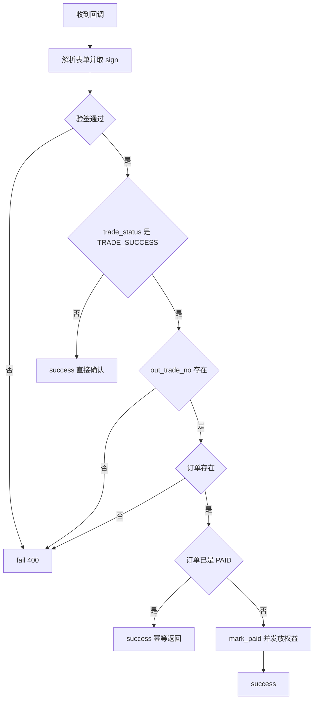
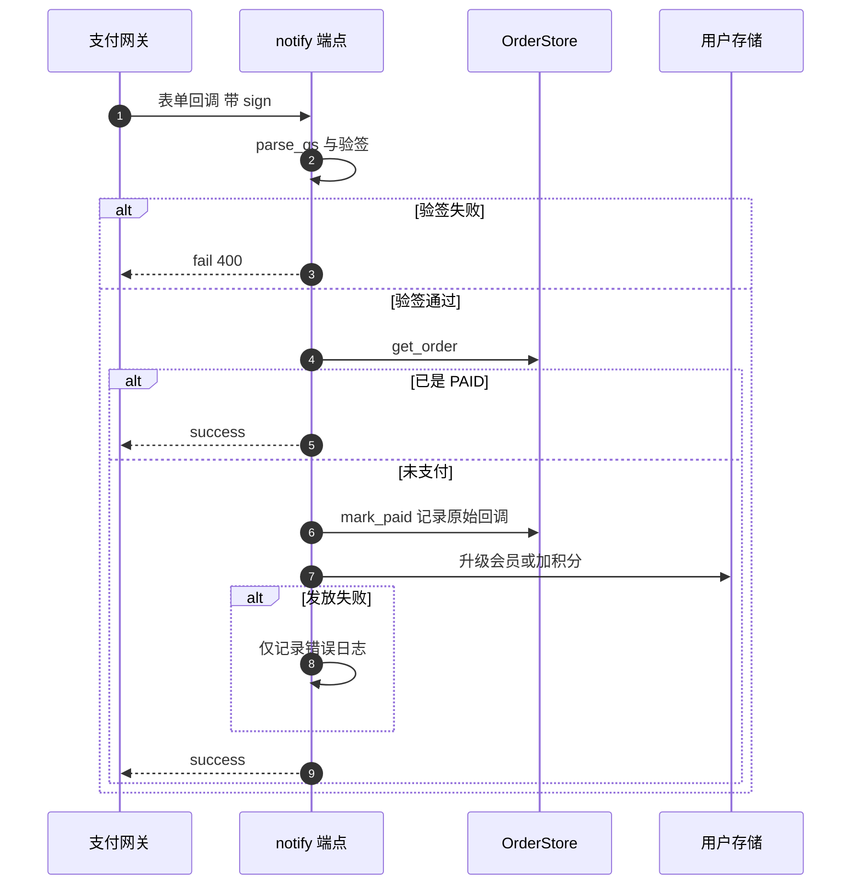

# 回调与幂等

支付结果通过 `POST /api/pay/notify` 异步通知服务端。这个端点没有鉴权依赖，身份完全由验签确认。处理顺序是：解析表单、验签、判状态、查订单、标记已支付、发放权益。每一步的失败处理都不一样，有的返回 `fail` 让网关重试，有的返回 `success` 直接确认。

回调的分支与幂等边界在这里展开。签名在 `02-支付网关与签名.md`，轮询补偿在 `04-订单查询与轮询补偿.md`，积分与会员函数在 `05-易错点与排查.md` 附录所引模块。

## 1. 请求形态与解析

回调端点的响应类型是纯文本（`backend/routes/payment.py`），因为它要按网关约定返回 `success` 或 `fail` 字符串。请求体按表单编码解析：

```python
body = await request.body()
body_str = body.decode("utf-8")
params = parse_qs(body_str, keep_blank_values=True)
flat_params = {k: v[0] if v else "" for k, v in params.items()}
sign = flat_params.pop("sign", "")
sign_type = flat_params.pop("sign_type", "")
```

`keep_blank_values=True` 保证空值参数不丢失，`pop` 取出签名相关字段后，剩余参数参与验签。原始请求体字符串会随支付成功一起存入订单，用于事后核对。

| 步骤 | 代码 | 说明 |
| --- | --- | --- |
| 读取 | `await request.body()` | 原始字节 |
| 解码 | `decode("utf-8")` | 文本 |
| 解析 | `parse_qs` | 表单参数 |
| 展平 | 取每个键的第一个值 | 得到扁平字典 |
| 取出签名 | `pop("sign")` 与 `pop("sign_type")` | 不参与验签 |

## 2. 验签与状态判定

验签失败返回 `fail` 加 400（`backend/routes/payment.py`），网关会按约定重试。验签通过后先看交易状态：

| 情况 | 响应 | 理由 |
| --- | --- | --- |
| 验签失败 | `fail` 400 | 让网关重试或告警 |
| 状态不是 `TRADE_SUCCESS` | `success` | 已收到通知，无需再推 |
| 缺 `out_trade_no` | `fail` 400 | 无法定位订单 |
| 订单不存在 | `fail` 400 | 可能重放或串号 |

非成功状态返回 `success` 的做法避免了网关对失败交易的重复推送。这也意味着关闭或退款通知不会改变订单状态，仓库不处理这两类交易。



## 3. 幂等：只防重复已支付

重复回调的处理只判断一个条件：订单状态已是 `PAID` 时直接返回 `success`（`backend/routes/payment.py`）。这是幂等的主要防线，配合 `mark_paid` 在发放权益之前执行，使第二次回调在第一步就被拦住。

| 场景 | 处理 | 是否重复发放 |
| --- | --- | --- |
| 同一订单第二次成功回调 | 命中 `PAID` 判断 | 否 |
| 两个回调同时到达 | 都可能在 `mark_paid` 之前读到非 `PAID` | 存在窗口 |
| 回调与轮询同时命中 | 同上 | 存在窗口 |

并发窗口来自「先读后写」：两个请求都可能先读到 `pending` 或 `paying`，再各自执行 `mark_paid` 与发放权益。仓库没有锁或唯一约束阻止这种情况，订单是文件存储，写操作也没有原子性保证。

## 4. 金额与状态校验的缺口

回调参数里有 `money`，但代码没有把它与订单金额比对，也没有校验 `pid` 是否为本商户。验签能确认通知来自平台，但一笔合法签名的小额支付无法在服务端被识别为与订单金额不符。

已被取消的订单同样能通过处理：`CANCELLED` 与 `EXPIRED` 状态不在判断条件里，只要不是 `PAID` 就会执行 `mark_paid` 并发放权益。用户先取消订单再完成支付（或网关延迟通知），结果仍是权益到账。

| 校验项 | 是否实现 | 位置 |
| --- | --- | --- |
| 签名 | 是 | — |
| 交易状态 | 是 | — |
| 订单存在 | 是 | — |
| 已支付幂等 | 是 | — |
| 金额一致 | 否 | 回调参数未使用 `money` |
| 订单可支付状态 | 否 | 未检查 `CANCELLED` 与 `EXPIRED` |

## 5. 权益发放

验证通过后，权益按商品名分支发放（`backend/routes/payment.py`）：

| 商品 | 发放 | 失败处理 |
| --- | --- | --- |
| `pro` / `plus` | `upgrade_membership` 后写回用户 | 错误只记日志，不写回 |
| `points_24` | `add_points` 加 24 点后写回 | 异常被外层吞掉 |

`upgrade_membership` 会拒绝两种请求：Plus 有效期内不能买 Pro，不能降级到 Free（`backend/services/points.py`），拒绝理由放在返回值里。回调端点收到非空错误时只记录日志，订单仍是已支付状态。

外层 `try` / `except` 把发放阶段的任何异常都收敛为一条日志，随后照常返回 `success`。这意味着「钱已付、订单已标记、权益未到账」是仓库认可的终态，用户只能通过人工介入恢复。



## 6. 用户缺失的回调

订单记录里的用户名在用户表中找不到时，端点记录错误后仍返回 `success`（`backend/routes/payment.py`）。此时订单已在前一步标记为已支付，权益无处发放。用户被删除或用户名被改写都会走到这条分支。

| 分支 | 订单状态 | 权益 | 响应 |
| --- | --- | --- | --- |
| 用户存在 | `PAID` | 已发放 | `success` |
| 用户缺失 | `PAID` | 未发放 | `success` |
| 发放异常 | `PAID` | 未发放或部分 | `success` |

## 7. 与轮询补偿的关系

查询接口也有一套发放逻辑（`backend/routes/payment.py`）。两处都会在 `mark_paid` 之后升级会员或加积分，因此回调与轮询之间存在重复发放的理论窗口，详见 `04-订单查询与轮询补偿.md`。区别是轮询把 `mark_paid` 与发放包在同一个 `try` 里，异常会走 `PaymentError` 或通用分支。

## 8. 易错点

| 易错点 | 现象 | 位置 |
| --- | --- | --- |
| 以为回调校验了金额 | 只验签与状态 | `routes/payment.py` |
| 认为取消后回调会被拒绝 | 非 `PAID` 即处理 | `routes/payment.py` |
| 依赖并发下的唯一发放 | 先读后写存在窗口 | `routes/payment.py` |
| 以为发放失败会回滚订单 | 订单已标记，失败只记日志 | — |
| 把 `success` 当成业务成功 | 用户缺失与发放失败也返回 `success` | `routes/payment.py` |
| 期望处理退款通知 | 非 `TRADE_SUCCESS` 直接确认 | `routes/payment.py` |

## 小结

核心概念：

| 概念 | 内容 |
| --- | --- |
| 身份 | 无鉴权，靠 `verify_sign` 确认来源 |
| 响应约定 | 纯文本 `success` 或 `fail` |
| 幂等 | 仅判断订单是否已 `PAID` |
| 发放 | `pro` / `plus` 升级会员，`points_24` 加 24 点 |
| 失败口径 | 发放异常与用户缺失都只记日志并返回 `success` |

设计权衡：

| 决策 | 选择 | 收益 | 代价 |
| --- | --- | --- | --- |
| 非成功状态 | 返回 `success` | 停止无意义重推 | 不处理关闭与退款 |
| 幂等判断 | 只看 `PAID` | 实现简单 | 取消与超时订单仍可入账 |
| 发放失败 | 不回滚订单 | 保留支付事实 | 需人工补偿 |
| 校验范围 | 验签加状态 | 依赖平台签名权威 | 金额不比对 |
| 原始回调 | 存入订单 | 便于事后核对 | 文件体积随回调增长 |

## 练习

基础题：

1. 列出回调端点的五道判断与各自的响应。
2. 幂等判断在哪个条件上？为什么它能拦住重复回调？
3. 哪些情况会返回 `success` 但权益未发放？
4. 回调没有校验哪两项与订单直接相关的信息？

挑战题：

5. 补上金额一致性与可支付状态校验，说明改动位置与对历史订单的影响。
6. 设计一个并发安全的权益发放方案（例如发放幂等键或状态机），说明订单文件存储需要增加什么。
7. 为发放失败设计补偿流程，比较「回调内重试」「定时对账」「人工兜底」三种做法。

---

### 附：本页引用的路径

| 路径 | 用途 |
| --- | --- |
| `backend/routes/payment.py` | 回调端点全文、幂等判断、发放分支、异常处理 |
| `backend/services/payment.py` | `verify_sign` |
| `backend/services/points.py` | `upgrade_membership`、`add_points` |
| `backend/storage/order_store.py` | `mark_paid` |
