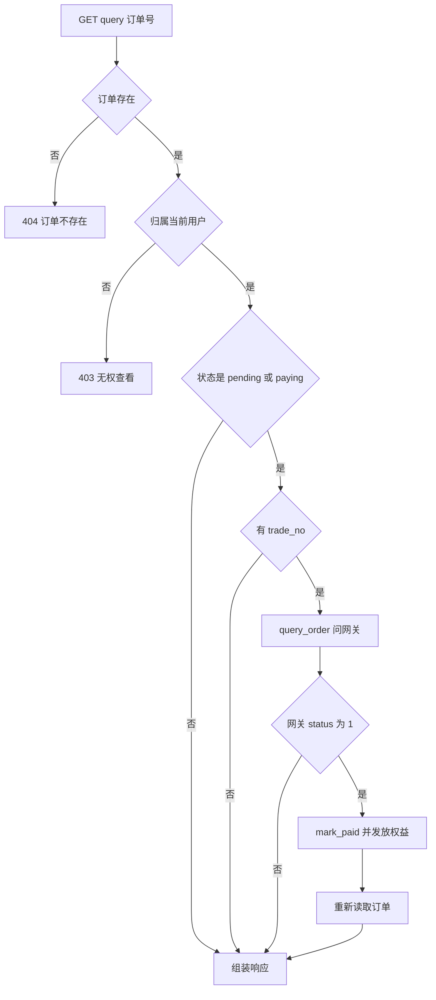
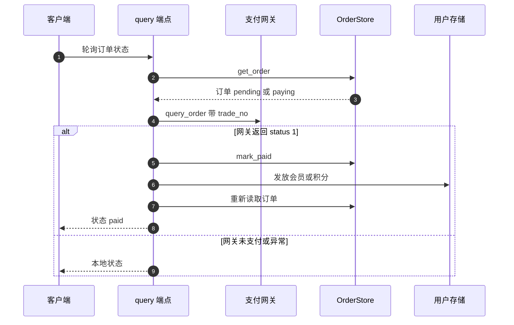

# 订单查询与轮询补偿

回调可能丢失，因此查询接口承担补偿职责：前端轮询 `GET /api/pay/query/{order_id}`，服务端发现订单仍处于待支付时主动向网关查一次，已支付就当场发放权益。列表与取消接口也在同一个模块里，三者都要求订单归属当前用户。

查询与取消在这里展开。回调侧在 `03-回调与幂等.md`，网关查询函数在 `02-支付网关与签名.md`。

## 1. 三个接口的归属校验

订单是敏感数据，三个接口都在读订单后比较用户名（`backend/routes/payment.py`）：

| 接口 | 订单不存在 | 属于他人 |
| --- | --- | --- |
| `GET /api/pay/orders` | 不适用，按用户名过滤 | 不适用 |
| `GET /api/pay/query/{order_id}` | 404 `订单不存在` | 403 `无权查看此订单` |
| `POST /api/pay/cancel/{order_id}` | 404 `订单不存在` | 403 `无权操作此订单` |

列表接口直接调用 `get_user_orders(username)`，不经过跨用户扫描；单订单接口走 `get_order`，后者会遍历所有用户文件（`backend/storage/order_store.py`）。

## 2. 列表的字段组装

列表接口手工组装字典，并把顺序反转（`backend/routes/payment.py`）：

```python
return [
    {
        "order_id": o.order_id,
        "product": o.product,
        "amount": o.amount,
        "status": o.status,
        "pay_method": o.pay_method,
        "created_at": o.created_at.isoformat(),
        "paid_at": o.paid_at.isoformat() if o.paid_at else None,
        "expired_at": o.expired_at.isoformat() if o.expired_at else None,
    }
    for o in reversed(orders)
]
```

文件里的追加顺序是创建顺序，`reversed` 后最新的订单排在前面。没有分页参数，订单多的用户会一次拿到全部记录。时间字段用 `isoformat()` 转字符串，可空字段保留 `None`。

| 字段 | 处理 | 说明 |
| --- | --- | --- |
| `status` | 原样 | 字符串枚举值 |
| 三个时间 | `isoformat()` | 可空字段判空 |
| `trade_no` | 不返回 | 列表不暴露网关订单号 |
| `raw_callback` | 不返回 | 原始回调不对外 |

## 3. 查询接口的轮询逻辑

查询接口先做归属校验，再判断状态是否需要问网关（`backend/routes/payment.py`）：

| 条件 | 行为 |
| --- | --- |
| 状态是 `pending` 或 `paying` 且有 `trade_no` | 调 `query_order` |
| 网关 `status` 为 1 且订单不是 `PAID` | `mark_paid` 并发放权益 |
| `PaymentError` | 静默忽略 |
| 其他异常 | 记录警告 |

没有 `trade_no` 的订单（创建成功但网关调用失败前被取消）不会触发轮询，直接返回本地状态。轮询成功后重新读取订单，保证响应里的状态与时间是最新值。



## 4. 轮询发放与回调发放的重复窗口

轮询里的发放逻辑与回调几乎一致：按商品名分支，`pro` / `plus` 升级会员，`points_24` 加积分（`backend/routes/payment.py`）。两处代码各写一份，判定与写入方式相同。

重复发放的窗口在于判定的时机：回调与轮询都先判断状态不是 `PAID`，再 `mark_paid`，再发放。两个请求若在检查之后、写入之前交错执行，就会各自发放一次。文件存储的读写没有排他控制，无法阻止这种交错。

| 组合 | 结果 | 风险 |
| --- | --- | --- |
| 仅回调到达 | 发放一次 | 无 |
| 仅轮询命中 | 发放一次 | 无 |
| 回调与轮询并行 | 可能各发放一次 | 会员到期日或积分多算 |

会员多算一次的表现是到期日再延长 30 天（`backend/services/points.py`），积分多算的表现是加上第二份 24 点，但受会员上限截断。

## 5. 轮询的两条静默路径

轮询用 `except PaymentError: pass` 与通用 `except` 记录后继续（`backend/routes/payment.py`）。两类失败都不会改变响应结构：客户端看到的仍是本地订单状态，无法区分「网关说未支付」与「网关没答上来」。

| 失败 | 处理 | 客户端可见差异 |
| --- | --- | --- |
| `PaymentError` | 完全静默 | 无 |
| 网络异常 | 记警告日志 | 无 |
| 网关返回未支付 | 正常返回本地状态 | 无 |

排查支付未到账时，需要结合服务端日志与网关后台，接口本身不提供诊断信息。

## 6. 取消接口的状态限制

取消依赖存储层的状态判断（`backend/routes/payment.py`）：`cancel_order` 只在 `pending` 或 `paying` 时生效，其他状态返回 `None`（`backend/storage/order_store.py`），端点把 `None` 转成 400 `订单无法取消（已支付或已完成）`。

| 订单状态 | 取消结果 | 响应 |
| --- | --- | --- |
| `pending` | 置 `cancelled` | 返回取消后的订单号 |
| `paying` | 置 `cancelled` | 同上 |
| `paid` | 不变 | 400 |
| `cancelled` | 不变 | 400 |
| `expired` | 不变 | 400 |

取消后订单仍可能收到成功回调并被标记已支付，因为回调不检查 `cancelled` 状态（`03-回调与幂等.md`）。

## 7. 超时字段与轮询的关系

订单创建时写入 `expired_at`，但仓库没有任何代码把超过时间的订单改成 `expired`（`backend/storage/order_store.py`）。因此 `EXPIRED` 状态只存在于模型与存储层定义中，实际运行不会产生。

| 状态 | 是否会出现 | 产生条件 |
| --- | --- | --- |
| `pending` | 会 | 创建订单 |
| `paying` | 会 | 网关返回支付链接 |
| `paid` | 会 | 回调或轮询命中 |
| `cancelled` | 会 | 用户取消或网关调用失败回滚 |
| `expired` | 不会 | 无调用 `mark_expired` |



## 8. 易错点

| 易错点 | 现象 | 位置 |
| --- | --- | --- |
| 以为查询结果一定来自网关 | 缺 `trade_no` 时只读本地 | `routes/payment.py` |
| 忽略回调与轮询的重复窗口 | 权益可能发放两次 |  与  |
| 用接口判断网关是否可达 | 两类失败都静默 | — |
| 认为取消会阻止后续支付 | 回调不检查 `cancelled` | — |
| 等待订单自动过期 | `mark_expired` 无调用点 | `order_store.py` |
| 以为列表有分页 | 一次返回全部订单 | `routes/payment.py` |

## 小结

核心概念：

| 概念 | 内容 |
| --- | --- |
| 归属校验 | 单订单接口 404 与 403 两种响应 |
| 列表 | 手工组装字段并反转为最新优先，无分页 |
| 轮询 | 仅 `pending` / `paying` 且有 `trade_no` 时问网关 |
| 发放重复窗口 | 回调与轮询各有一份发放逻辑，先读后写无锁 |
| 取消 | 仅 `pending` / `paying` 可取消，其他状态返回 400 |
| 过期 | `EXPIRED` 状态无代码产生 |

设计权衡：

| 决策 | 选择 | 收益 | 代价 |
| --- | --- | --- | --- |
| 补偿方式 | 客户端轮询 | 不依赖网关重推 | 每次轮询都有网关调用 |
| 失败处理 | 静默或记日志 | 接口始终可用 | 客户端无法诊断 |
| 发放逻辑 | 回调与轮询各写一份 | 各自独立 | 重复窗口与同步成本 |
| 取消限制 | 存储层状态判断 | 端点代码短 | 取消与回调语义冲突 |
| 列表 | 无分页 | 实现简单 | 订单多时响应大 |

## 练习

基础题：

1. 列出三个订单接口在订单不存在与属于他人时的响应。
2. 轮询在什么条件下会向网关发起查询？
3. 为什么回调与轮询可能重复发放权益？
4. 哪些订单状态可以取消？其他状态返回什么？

挑战题：

5. 把两份发放逻辑抽成一个幂等函数，说明幂等键的选择与并发下的实现方式。
6. 为订单列表增加分页与状态过滤，说明对前端调用与文件存储读取方式的影响。
7. 设计超时订单的处理时机（轮询时判定或定时任务），说明 `EXPIRED` 状态引入后对取消与回调分支的改动。

---

### 附：本页引用的路径

| 路径 | 用途 |
| --- | --- |
| `backend/routes/payment.py` | 列表、查询与轮询、取消 |
| `backend/storage/order_store.py` | 取消与过期标记、查询与扫描 |
| `backend/services/points.py` | 续期计算、积分上限截断 |
