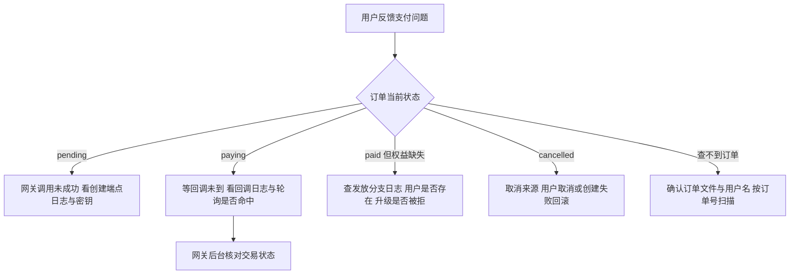
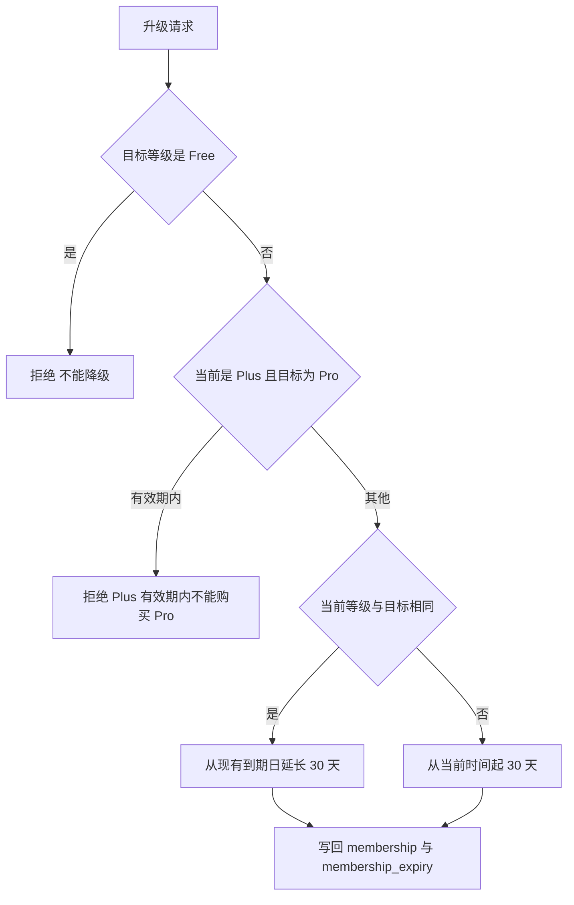

# 支付与积分的易错点与排查

这条链路的故障表现有四种：订单状态不对、钱付了权益没到、积分不恢复、网关报错。前三种都能在订单文件与用户表里找到痕迹，第四种要看配置与日志。风险集中列出，并给出排查顺序。

订单创建见 `01-商品配置与订单创建.md`，网关与签名见 `02-支付网关与签名.md`，回调见 `03-回调与幂等.md`，查询见 `04-订单查询与轮询补偿.md`。

## 1. 风险清单

| 编号 | 风险 | 位置 | 现象 |
| --- | --- | --- | --- |
| R1 | 回调不校验金额 | `routes/payment.py:146-174` | 与订单金额不符的支付也会入账 |
| R2 | 回调不校验订单可支付状态 | `:170` | 取消或超时订单仍可标记已支付 |
| R3 | 发放失败只记日志 | `:205-206` | 订单已支付，权益缺失，无补偿 |
| R4 | 用户缺失仍返回 `success` | `:180-182` | 支付成功但权益无处发放 |
| R5 | 回调与轮询各有一份发放逻辑 | `:184-204` 与 `:258-266` | 并发下权益可能重复发放 |
| R6 | `mark_expired` 无调用点 | `order_store.py:127-136` | `EXPIRED` 状态不会出现 |
| R7 | 订单按用户 JSON 文件存储 | `order_store.py:35-57` | 并发写覆盖，按订单号查询要全目录扫描 |
| R8 | 支付密钥默认空值无启动校验 | `services/payment.py:25-30` | 首次请求才失败 |
| R9 | 验签异常统一为 `False` | `:92-93` | 无法区分配置错误与篡改 |
| R10 | `X-Forwarded-For` 未校验来源 | `routes/payment.py:90` | 客户端可伪造地址 |
| R11 | 查询失败静默 | `:269-272` | 客户端无法诊断未到账原因 |
| R12 | 恢复时间戳在返回前被重置 | `services/points.py:87-91` | 频繁访问时积分永不恢复 |
| R13 | 白名单每次调用都读文件 | `:37-48` | 高频检查产生重复 IO |
| R14 | 商品名与积分数量散落 | `routes/payment.py:196-198`、`:262-264` | 改商品配置时字面量漏改 |

## 2. 支付链路的排查顺序

按订单状态决定入口，再顺着状态对应的代码路径找原因：



| 状态 | 常见原因 | 检查点 |
| --- | --- | --- |
| `pending` | 网关创建失败 | 密钥配置与创建端点 502 日志 |
| `paying` | 回调未到达 | 回调日志、`NOTIFY_PATH` 可达性、轮询结果 |
| `paid` 但无权益 | 发放异常或用户缺失 | 回调查看 `Post-payment processing failed` 日志 |
| `cancelled` | 用户取消或网关失败回滚 | 取消接口调用记录 |

## 3. 积分恢复的口径

积分恢复是懒加载：每次读取用户状态时按经过的小时数补齐（`backend/services/points.py:58-98`）。这段逻辑有一处会改变实际行为的时间戳写入：

```python
if last_refill:
    try:
        last_time = datetime.fromisoformat(last_refill)
    except (ValueError, TypeError):
        last_time = now
else:
    last_time = now
user_data["last_points_refill"] = now.isoformat()

hours_elapsed = (now - last_time).total_seconds() / 3600
if hours_elapsed < 1:
    return user_data
```

`last_points_refill` 在计算之前就被写成当前时间（`:87`），不足一小时的早退分支（`:90-91`）保留了这个新值。结果是：两次访问间隔小于一小时时，起点被重置为本次访问时间，积分永远不会累积。用户只要在一个小时内多次查看状态或发起搜索，恢复逻辑就不会生效。

| 访问间隔 | 起点变化 | 恢复量 |
| --- | --- | --- |
| 超过 1 小时 | 起点保留 | `int(小时数) × 每小时速率` |
| 不足 1 小时 | 起点被重置为本次时间 | 0 |
| 持续高频访问 | 起点不断重置 | 始终 0 |

积分恢复的三个相关常量：Free 每小时 2 点、上限 48；Pro 每小时 8 点、上限 96（`backend/config.py:152-155`）。Plus 用户不分恢复：直接置为上限（`services/points.py:75-78`）。恢复量按 `int(hours_elapsed)` 取整，零头不计，写入时把起点推进整小时数，余量留到下次（`:97`）。

## 4. 会员与权益的规则边界

`upgrade_membership` 与 `add_points` 各自有边界条件（`backend/services/points.py:228-287`）：

| 规则 | 行为 | 行号 |
| --- | --- | --- |
| Plus 有效期内买 Pro | 拒绝，返回错误文案 | `:241-249` |
| 请求降级到 Free | 拒绝 | `:251-252` |
| 同类型续期 | 从现有到期日延长 30 天 | `:256-264` |
| 换类型 | 从当前时间起 30 天 | `:255` |
| 加积分 | 不超过当前等级上限 | `:282-285` |
| Plus 加积分 | 直接返回，不生效 | `:279-280` |

回调与轮询拿到升级错误时都只记录或忽略：回调写日志（`routes/payment.py:188-190`），轮询丢弃返回值（`:260`）。用户看到的仍是已支付，权益按拒绝后的原样保留。



## 5. 订单数据与并发

订单存在 `data/orders/{username}.json`，一次状态变更要读整个文件、改一条、写回整个文件（`backend/storage/order_store.py:159-167`）。两个并发回调可能互相覆盖，导致一条状态变更丢失。

按订单号查询要遍历所有用户文件（`:150-157`），订单文件越多，单次查询越慢。回调与轮询都会触发这条扫描。

| 操作 | 读 | 写 |
| --- | --- | --- |
| 创建订单 | 单文件 | 单文件 |
| 状态变更 | 单文件 | 单文件全量覆写 |
| 按订单号查找 | 全部文件 | 无 |

## 6. 网关配置与响应

四个配置键都没有导入期校验（`backend/services/payment.py:25-30`），排查 502 时按顺序确认：环境变量是否存在、内容是否为未包装的单行 base64、`api_base` 是否可达。签名与验签的规范化必须一致，两边都过滤 `sign`、`sign_type` 与空值并按字典序排序（`:51-70`、`:73-93`），任何一侧改动都会导致验签失败。

## 7. 容易走错的方向

| 现象 | 容易先怀疑 | 实际应先查 |
| --- | --- | --- |
| 支付成功但权益没到 | 用户表写入失败 | 回调日志里的发放错误与用户是否存在 |
| 积分一直不涨 | 恢复速率配置 | `last_points_refill` 被重置的访问频率 |
| 订单金额不符仍入账 | 网关验签失效 | 回调缺少金额比对 |
| 取消后仍显示已支付 | 取消接口失效 | 回调不检查订单可支付状态 |
| 订单查不到 | 订单号写错 | 订单文件所在目录与用户名 |
| 创建订单始终 502 | 网关故障 | 密钥是否为未包装的单行 base64 与 `api_base` |

## 小结

核心概念：

| 概念 | 内容 |
| --- | --- |
| 回调缺口 | 不校验金额与可支付状态 |
| 发放失败 | 只记日志，订单保留已支付，无自动补偿 |
| 重复窗口 | 回调与轮询各写一份发放逻辑，先读后写 |
| 积分恢复 | 懒加载按小时补齐，时间戳在早退分支被重置 |
| 订单存储 | 按用户 JSON 文件，状态变更全量覆写，跨用户查询靠扫描 |
| 网关配置 | 密钥以单行 base64 注入，无启动校验，验签异常统一为假 |

设计权衡：

| 决策 | 选择 | 收益 | 代价 |
| --- | --- | --- | --- |
| 校验范围 | 验签加状态 | 依赖平台权威 | 金额不校验 |
| 发放失败 | 记录日志 | 支付事实保留 | 需要人工补偿 |
| 存储形态 | JSON 文件 | 无迁移成本 | 并发写与查询效率差 |
| 恢复策略 | 懒加载 | 无需定时任务 | 依赖访问频率，易被重置 |
| 白名单 | 每次读文件 | 改动立即生效 | 重复 IO 开销 |

## 练习

基础题：

1. 列出回调处理里缺失的两项校验。
2. 发放失败的订单最终处于什么状态？用户如何被感知？
3. 积分恢复为什么在频繁访问时会失效？涉及哪一行写入？
4. 订单状态变更是如何持久化的？

挑战题：

5. 设计一份支付对账方案，要求能发现「已支付未发放权益」与「重复发放」两类问题，说明数据来源与比对方式。
6. 修复积分恢复的时间戳问题，给出改动位置与验证用例（含间隔不足一小时与超过一小时的场景）。
7. 把订单存储换成事务型存储，说明需要的事务边界、索引与对调用方接口的影响。

---

### 附：本页引用的路径

| 路径 | 用途 |
| --- | --- |
| `backend/services/points.py` | 白名单读取（:37-48）、积分上限（:51-55）、恢复逻辑（:58-98）、升级规则（:228-269）、加积分（:272-287） |
| `backend/config.py` | 积分与会员常量（:151-158`） |
| `backend/routes/payment.py` | 回调缺口（:146-204）、发放分支（:184-204）、轮询发放（:258-266）、查询静默（:269-272`） |
| `backend/storage/order_store.py` | 文件存储与并发（:35-57）、状态变更（:103-136）、持久化与扫描（:150-177） |
| `backend/services/payment.py` | 配置（:25-30）、签名与验签（:51-93） |
