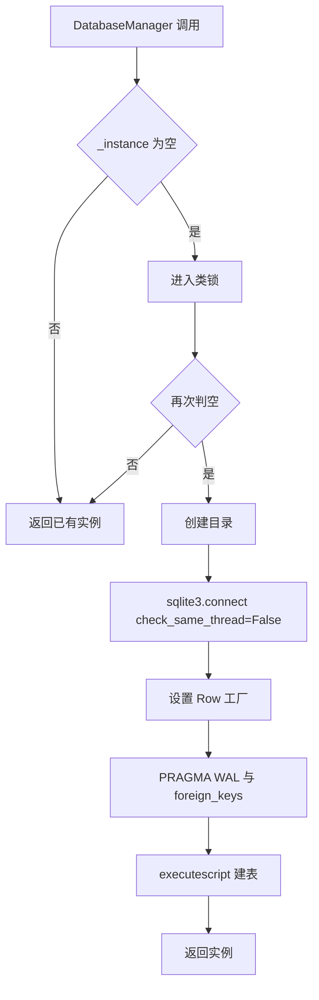
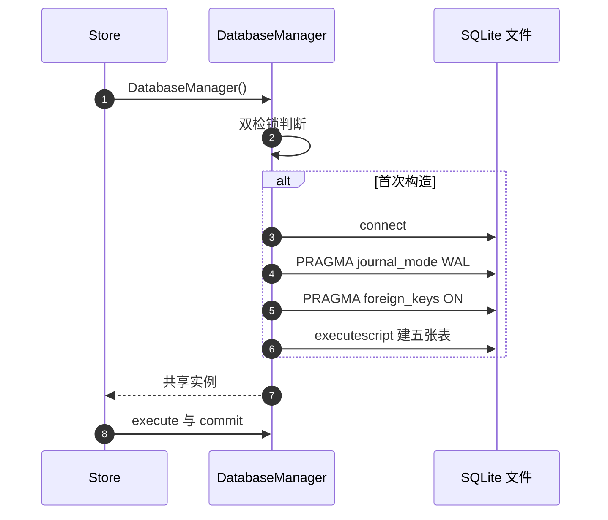

# 全局数据库与连接管理

全局数据（用户、订单、论坛、分享令牌、域名质量）共用一个 SQLite 文件，由 `DatabaseManager` 管理。它是一个进程内单例，用双检锁保证只初始化一次，对外只暴露执行、批量执行、提交与关闭四个方法。

连接的建立与生命周期在这里展开。五张表的列定义在 `02-五张全局表.md`，会话级数据库在 `04-会话级数据库.md`。

## 1. 单例与双检锁

`DatabaseManager` 用 `__new__` 实现单例（`backend/storage/database.py`）：

```python
def __new__(cls, db_path: Optional[str] = None) -> "DatabaseManager":
    if cls._instance is None:
        with cls._lock:
            if cls._instance is None:
                cls._instance = super().__new__(cls)
                cls._instance._initialize(db_path or DATABASE_PATH)
    return cls._instance
```

锁定义在类上，第一次检查不加锁，只有需要初始化时才进入临界区并在锁内二次检查。这样多线程同时首次访问时只建一个实例，后续访问不付锁开销。

| 细节 | 实现 |
| --- | --- |
| 单例字段 | `_instance` |
| 锁 | `threading.Lock()` |
| 首次检查 | 无锁快速路径 |
| 二次检查 | 锁内判空 |

注意 `db_path` 只在首次构造时生效：第二个调用者传入不同路径不会得到新连接，而是拿到已有实例。需要指向另一个库时必须先 `close` 重置单例。

## 2. 数据库路径

路径来自配置（`backend/storage/database.py`、`backend/config.py`）：环境变量 `KNOWLEDGEDIVER_DB` 未设置时用相对路径 `data/knowledgediver.db`。相对路径以进程工作目录为基准，因此从不同目录启动程序会指向不同的库文件。

`_initialize` 会先创建父目录，所以库文件不存在时无需手工建目录。

| 项 | 值 |
| --- | --- |
| 环境变量 | `KNOWLEDGEDIVER_DB` |
| 默认值 | `data/knowledgediver.db` |
| 是否创建目录 | 是，`os.makedirs(exist_ok=True)` |

## 3. 连接参数与两条 PRAGMA

连接建立后要立刻设两条 PRAGMA，示意如下：

```python
# 示意：连接参数与两条 PRAGMA
conn = sqlite3.connect(db_path, check_same_thread=False, timeout=5.0)
conn.execute("PRAGMA journal_mode=WAL")      # 写前日志：读写不互相阻塞
conn.execute("PRAGMA foreign_keys=ON")       # 外键约束默认是关的，必须显式打开
```

PRAGMA 是 SQLite 的运行期开关，只对当前连接生效。`journal_mode=WAL`把写操作先追加到日志文件、再回写主库，读事务因此不会被写阻塞——单写多读的桌面/服务端场景差异明显。`foreign_keys`默认关闭是 SQLite 的历史包袱：不显式打开，声明了外键的表也不会做级联与约束检查，删除父行时子行会变成悬空数据。

建连接时指定三个参数与两条 PRAGMA（`backend/storage/database.py`）：

```python
self.conn = sqlite3.connect(db_path, check_same_thread=False)
self.conn.row_factory = sqlite3.Row
self.conn.execute("PRAGMA journal_mode=WAL;")
self.conn.execute("PRAGMA foreign_keys=ON;")
```

| 设置 | 作用 | 影响 |
| --- | --- | --- |
| `check_same_thread=False` | 允许跨线程使用连接 | 需调用方自行保证互斥 |
| `row_factory = Row` | 查询结果可按列名取值 | 存储层用 `row["points"]` 之类写法 |
| `journal_mode=WAL` | 读写不互相阻塞 | 目录里出现 `-wal` 与 `-shm` 文件 |
| `foreign_keys=ON` | 打开外键约束 | 当前表结构没有外键声明，暂无约束可执行 |

`foreign_keys` 打开后并没有生效对象：`SCHEMA_SQL` 里没有任何 `REFERENCES` 子句。表之间的关系靠业务代码维护，例如订单表有 `username` 列但不会阻止写不存在的用户。



## 4. 建表脚本

`_init_schema` 用 `executescript` 一次性执行 `SCHEMA_SQL` 并提交（`backend/storage/database.py`）。脚本里全部是 `CREATE TABLE IF NOT EXISTS`，因此重复启动不会报错，也不会覆盖已有数据。

| 特性 | 说明 |
| --- | --- |
| 幂等 | `IF NOT EXISTS` |
| 执行方式 | `executescript` 单次调用 |
| 事务 | 脚本后显式 `commit` |

这条路径只负责建表，不做列迁移。会话级数据库另有一个 `ALTER TABLE` 补列的方法（见 `04-会话级数据库.md`），全局库没有对应实现：如果 `SCHEMA_SQL` 新增列，已有库不会自动补上。



## 5. 对外的四个方法

`DatabaseManager` 的方法面很窄（`backend/storage/database.py`）：

| 方法 | 参数 | 说明 |
| --- | --- | --- |
| `execute` | SQL 与参数元组 | 返回游标 |
| `executemany` | SQL 与序列 | 批量写入 |
| `commit` | 无 | 提交当前事务 |
| `close` | 无 | 关闭连接并重置单例 |

`close` 在关闭连接后把 `_instance` 置空，下一次调用 `DatabaseManager()` 会重新建连接。重置只影响单例字段，不影响已经持有旧连接引用的对象：这些对象继续调用 `execute` 会操作已关闭的连接。

| 操作 | 单例字段 | 已有 Store 对象 |
| --- | --- | --- |
| `close` | 置空 | 仍持有旧连接 |
| 再次构造 | 新建连接 | 不会自动换到新连接 |

## 6. 线程安全的口径

单例初始化是线程安全的，运行期并发则依赖两层：连接以 `check_same_thread=False` 创建，允许跨线程；WAL 模式允许并发读与单写。类里没有为 `execute` 与 `commit` 加互斥锁，两个线程同时写同一连接时的行为由 sqlite3 模块的内部状态决定。

| 环节 | 是否有保护 |
| --- | --- |
| 实例创建 | 有，双检锁 |
| 连接建立 | 一次 |
| 执行与提交 | 无显式锁 |
| 跨进程 | 无，每进程一个连接 |

## 7. 谁在用它

全局连接的实际使用者有三类：用户存储（`backend/storage/sqlite_user_store.py` 构造时取 `DatabaseManager()`）、域名质量缓存（`backend/scraper/domain_quality.py` 多处取 `db = DatabaseManager()`）、迁移脚本（`backend/scripts/migrate_to_sqlite.py`）。订单、论坛与分享令牌在当前代码里走文件存储，详见 `02-五张全局表.md`。

| 使用方 | 访问的表 | 位置 |
| --- | --- | --- |
| `SqliteUserStore` | `users` | `sqlite_user_store.py` |
| `_DomainQualityCache` | `domain_quality` | `scraper/domain_quality.py` 起 |
| 迁移脚本 | 五张表 | `scripts/migrate_to_sqlite.py` |

## 8. 易错点

| 易错点 | 现象 | 位置 |
| --- | --- | --- |
| 期望第二次构造能换库 | 拿到同一实例 | `database.py` |
| 从不同目录启动 | 指向不同库文件 | `config.py` 相对路径 |
| 认为外键已生效 | 表结构没有外键 | `database.py` |
| `close` 后期望已有 Store 恢复 | 旧连接已关闭 | `database.py` |
| 新增列后期望自动迁移 | 只有 `IF NOT EXISTS` 建表 | `database.py` |
| 把 WAL 当成互斥保证 | 只保证读写不互相阻塞 | `database.py` |

## 小结

核心概念：

| 概念 | 内容 |
| --- | --- |
| 单例 | `__new__` 加双检锁，首次构造时建连接 |
| 路径 | `KNOWLEDGEDIVER_DB`，默认相对路径 |
| 连接设置 | 跨线程允许、行按列名取值、WAL、外键打开 |
| 建表 | `executescript` 执行幂等建表脚本 |
| 方法面 | `execute`、`executemany`、`commit`、`close` |

设计权衡：

| 决策 | 选择 | 收益 | 代价 |
| --- | --- | --- | --- |
| 连接模型 | 进程内一个共享连接 | 无需连接池 | 运行期并发靠库自身保证 |
| 路径 | 支持环境变量覆盖 | 部署灵活 | 相对路径受工作目录影响 |
| 建表 | 启动时幂等执行 | 无需迁移工具 | 新增列不会自动补齐 |
| `close` | 重置单例 | 可重建连接 | 已持有引用者不会更新 |
| 外键 | 打开但未声明 | 未来加约束即可生效 | 当前无实际约束 |

## 练习

基础题：

1. 单例的两次判空分别在锁内还是锁外？为什么这样写？
2. 连接创建时指定了哪三个参数与两条 PRAGMA？
3. `close` 之后已有 Store 对象会发生什么？
4. 全局库的建表为什么可以重复执行？

挑战题：

5. 为全局库补一个幂等的列迁移机制，说明与 `executescript` 建表的分工。
6. 评估把单例连接改成每线程一连接的代价与收益，说明需要修改的调用方。
7. 设计一条从旧库文件平滑升级到新库路径的流程，说明校验点与回滚方式。

---

### 附：本页引用的路径

| 路径 | 用途 |
| --- | --- |
| `backend/storage/database.py` | 建表脚本、单例与初始化、方法与关闭 |
| `backend/config.py` | `DATABASE_PATH` |
| `backend/storage/sqlite_user_store.py` | 取连接 |
| `backend/scraper/domain_quality.py` | 域名质量表的读写（起） |
| `backend/scripts/migrate_to_sqlite.py` | 迁移脚本对五张表的使用 |
