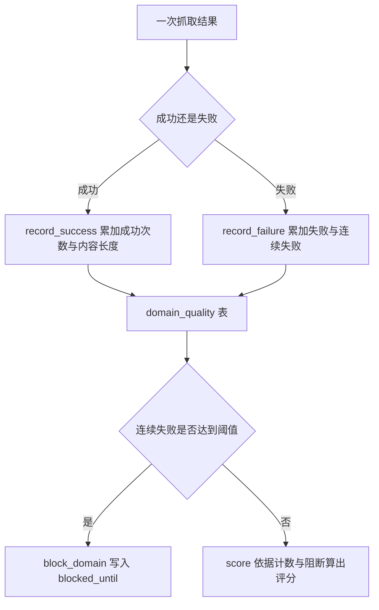
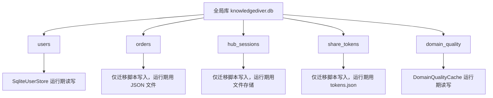

# 五张全局表

全局库的建表脚本定义五张表：用户、订单、论坛会话、分享令牌、域名质量。五张表都由启动时的 `executescript` 创建，但运行期实际被读写的只有两张：`users` 与 `domain_quality`。另外三张由迁移脚本写入，运行时代码走的是文件存储。

五张表逐列的定义与使用者在这里对照。连接管理在 `01-全局数据库与连接管理.md`，存储类与抽象在 `03-Storage抽象与实现清单.md`，迁移脚本见 29/03 单元。

## 1. 类型约定

五张表的列类型可以归成四类：

| 类型 | 用途 | 例子 |
| --- | --- | --- |
| `TEXT` | 标识、状态、ISO 时间 | `username`、`status`、`created_at` |
| `TEXT` 存 JSON | 列表与结构 | `topics`、`comments`、`liked_by` |
| `INTEGER` | 计数与积分 | `points`、`fetch_count` |
| `REAL` | 时间戳与阻断截止 | `blocked_until`、`last_updated` |

时间出现两种表示：`users` 与 `orders` 用 `TEXT` 存 ISO 字符串，`domain_quality` 用 `REAL` 存数值时间。同一个库里的两套约定意味着跨表比较时间需要先转换。

## 2. users 表

`users` 是运行期使用最充分的表（`backend/storage/database.py:20-29`）：

| 列 | 类型 | 约束 | 说明 |
| --- | --- | --- | --- |
| `username` | `TEXT` | 主键 | 登录名 |
| `hashed_password` | `TEXT` | 非空 | bcrypt 哈希 |
| `created_at` | `TEXT` | 非空 | ISO 时间 |
| `avatar_url` | `TEXT` | 可空 | 头像地址 |
| `membership` | `TEXT` | 非空，默认 `'free'` | 会员等级 |
| `membership_expiry` | `TEXT` | 可空 | 到期时间 |
| `points` | `INTEGER` | 非空，默认 48 | 积分 |
| `last_points_refill` | `TEXT` | 可空 | 上次恢复时间 |

读写由 `SqliteUserStore` 完成，八个方法与基类声明一一对应（`backend/storage/base.py:125-167`）。积分默认值 48 与配置、模型三处重复，这一点在 28/03 单元已记录。

## 3. orders 表

`orders` 有 15 列，覆盖订单的全部状态字段（`backend/storage/database.py:31-47`）：订单号为主键，`username` 为非空外键列（无约束），金额与支付方式为非空，状态默认 `'pending'`，其余为可空的时间、网关订单号、支付链接、原始回调与错误信息。

运行期没有任何代码读写这张表。订单实际走 `OrderStore` 的按用户 JSON 文件（`backend/storage/order_store.py:35-57`）。表里的列名与 `Order` 模型字段基本一致，说明它对应的是「订单迁到 SQLite」的预留结构。

| 项 | orders 表 | 运行期存储 |
| --- | --- | --- |
| 位置 | 全局库 | `data/orders/{username}.json` |
| 写入方 | 迁移脚本 | `OrderStore` |
| 查询方式 | SQL | 读文件加扫描 |

## 4. hub_sessions 表

`hub_sessions` 用复合主键 `(creator, name)` 表示「谁的哪个会话被分享」（`backend/storage/database.py:49-64`）。列表与结构字段全部用 `TEXT` 存 JSON：`topics`、`liked_by`、`disliked_by`、`comments`、`graph`，默认值分别是 `'[]'` 与 `'{}'`。计数类字段 `card_count`、`likes`、`dislikes` 用 `INTEGER`。

运行期论坛数据走 `HubStore` 的文件存储（`backend/storage/hub_store.py:26` 定义锁上下文，`:60` 定义存储类），不经过这张表。迁移脚本的文档注释写明来源是 `Hub/{creator}/{name}/` 目录（`backend/scripts/migrate_to_sqlite.py:8`）。

## 5. share_tokens 表

`share_tokens` 只有四列（`backend/storage/database.py:66-71`）：

| 列 | 类型 | 约束 | 说明 |
| --- | --- | --- | --- |
| `token` | `TEXT` | 主键 | 分享令牌 |
| `username` | `TEXT` | 非空 | 创建者 |
| `session_id` | `TEXT` | 非空 | 被分享会话 |
| `created_at` | `TEXT` | 非空 | 创建时间 |

表里没有过期时间、使用次数或撤销标记，令牌一旦写入就是永久有效。运行期分享功能走 `backend/share/tokens.json`（迁移脚本注释 `:9` 记录了来源），因此这张表的校验能力目前只影响迁移数据。

## 6. domain_quality 表

`domain_quality` 是第二张运行期活跃的表（`backend/storage/database.py:73-84`），以域名为主键，记录抓取次数、成功与失败次数、内容长度合计、连续失败次数、阻断截止时间、首次与最近更新时间、最近使用的抓取方式。

| 列 | 类型 | 默认 | 用途 |
| --- | --- | --- | --- |
| `domain` | `TEXT` | 主键 | 域名 |
| `fetch_count` | `INTEGER` | 0 | 抓取次数 |
| `success_count` / `fail_count` | `INTEGER` | 0 | 成败计数 |
| `total_content_len` | `INTEGER` | 0 | 内容长度合计 |
| `consecutive_fails` | `INTEGER` | 0 | 连续失败 |
| `blocked_until` | `REAL` | 0 | 阻断截止 |
| `first_seen` / `last_updated` | `REAL` | 0 | 时间戳 |
| `last_method` | `TEXT` | `''` | 最近方式 |

`_DomainQualityCache` 负责读写这张表：成功与失败记录、阻断判断与解除、评分与列表都直接走 SQL（`backend/scraper/domain_quality.py:105` 起）。它取 `DatabaseManager()` 而不是继承存储基类，因为这张表不在 `base.py` 的抽象范围内。

## 7. 表与运行期存储的对照

| 表 | 运行期读 | 运行期写 | 迁移脚本 |
| --- | --- | --- | --- |
| `users` | 是 | 是 | 是 |
| `domain_quality` | 是 | 是 | 否 |
| `orders` | 否 | 否 | 是 |
| `hub_sessions` | 否 | 否 | 是 |
| `share_tokens` | 否 | 否 | 是 |

## 8. 易错点

| 易错点 | 现象 | 位置 |
| --- | --- | --- |
| 认为订单已在库里 | 表存在但运行期写 JSON | `order_store.py:35-57` |
| 认为论坛数据在库里 | `HubStore` 用文件 | `hub_store.py:26`、`:60` |
| 按表结构判断分享有效期 | 表里没有过期列 | `database.py:66-71` |
| 混用两种时间表示 | `REAL` 与 `TEXT` 不能直接比较 | `:73-84` 与 `:20-29` |
| 以为有外键约束 | 无 `REFERENCES` 声明 | `:19-85` |
| 认为列新增会自动迁移 | 建表脚本无列迁移 | `:122-124` |

## 小结

核心概念：

| 概念 | 内容 |
| --- | --- |
| 表数量 | 五张，均由启动时建表脚本创建 |
| 类型约定 | 标识与时间用 `TEXT`，列表用 JSON 文本，计数用整数，质量时间戳用 `REAL` |
| 运行期活跃 | `users` 与 `domain_quality` |
| 预留结构 | `orders`、`hub_sessions`、`share_tokens` 由迁移脚本写入 |
| 约束 | 仅主键与非空、默认值，无外键声明 |

设计权衡：

| 决策 | 选择 | 收益 | 代价 |
| --- | --- | --- | --- |
| 全局表范围 | 五张集中在建表脚本 | 启动即就绪 | 部分表与运行期存储脱节 |
| 列表存储 | JSON 文本 | 结构灵活 | 无法用 SQL 查询内部字段 |
| 时间表示 | 两套并用 | 各表按需 | 跨表比较要转换 |
| 分享令牌 | 无过期列 | 结构简单 | 无法在库层控制有效期 |
| 外键 | 打开 PRAGMA 不声明 | 便于未来加约束 | 当前无约束生效 |

## 练习

基础题：

1. 列出五张表名与各自的主键。
2. 哪两张表在运行期有读写？另外三张由谁写入？
3. `hub_sessions` 用哪些列存 JSON？默认值分别是什么？
4. `domain_quality` 的时间列为 `REAL` 意味着什么？

挑战题：

5. 把订单改回 `orders` 表，列出需要改动的存储类、查询方式与数据迁移步骤。
6. 为 `share_tokens` 增加过期与撤销语义，说明列设计与查询改动。
7. 统一两张表的时间表示，比较「全部改 `TEXT`」与「全部改 `REAL`」两种方案的成本。

---

### 附：本页引用的路径

| 路径 | 用途 |
| --- | --- |
| `backend/storage/database.py` | 五张表定义（:19-85）、建表执行（:122-124） |
| `backend/storage/order_store.py` | 订单的文件存储（:35-57） |
| `backend/storage/hub_store.py` | 论坛存储类与锁（:26、:60） |
| `backend/storage/base.py` | 用户存储抽象（:125-167） |
| `backend/scraper/domain_quality.py` | 域名质量表的读写入口（:105 起） |
| `backend/scripts/migrate_to_sqlite.py` | 迁移来源与目标（:8-9） |
