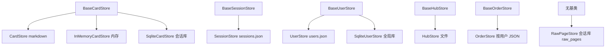
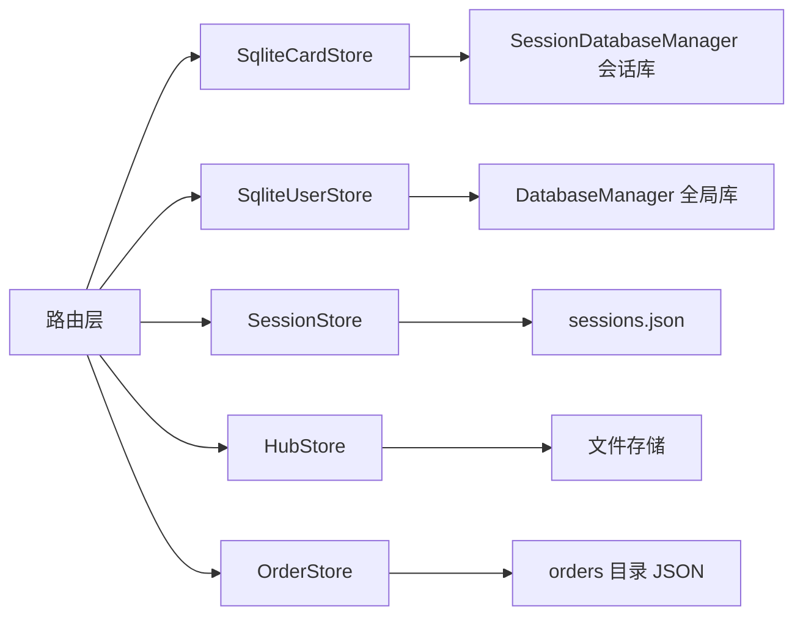

# Storage 抽象与实现清单

`backend/storage` 目录有十四个模块、约一千八百行代码，对外形态是「一套基类加多个实现」。基类在 `base.py`，实现按存储介质分成两代：早期用 markdown 与 JSON 文件，后期逐步迁到 SQLite。两代实现共存，调用方通过构造具体的类来选择。

抽象与实现在这里逐一对照。全局库与表结构在 `01-全局数据库与连接管理.md` 与 `02-五张全局表.md`，会话级数据库在 `04-会话级数据库.md`。

## 1. 五个抽象基类

`backend/storage/base.py` 共 309 行，定义五个 `ABC`：

| 基类 | 行范围 | 方法数 | 职责 |
| --- | --- | --- | --- |
| `BaseCardStore` | `:26-75` | 8 | 卡片增删改查与批量保存 |
| `BaseSessionStore` | `:77-123` | 6 | 会话增删改查与卡片迁移 |
| `BaseUserStore` | `:125-174` | 8 | 用户增删改查与凭据校验 |
| `BaseHubStore` | `:176-264` | 11 | 分享、列表、点赞、评论 |
| `BaseOrderStore` | `:266-309` | 8 | 订单生命周期 |

方法体都是 `raise NotImplementedError` 或空实现，基类只固定接口形状。`BaseCardStore` 同时提供 `read_card` 与 `get_card` 两个名字（`:38`、`:43`），语义重叠，实现类两个都写。

| 基类 | 代表方法 |
| --- | --- |
| `BaseCardStore` | `create_card`、`list_cards`、`save_cards` |
| `BaseSessionStore` | `list_sessions`、`move_cards_to_session` |
| `BaseUserStore` | `verify_user`、`get_user_raw`、`save_user_raw` |
| `BaseHubStore` | `share_session`、`like_session`、`add_comment` |
| `BaseOrderStore` | `create_order`、`mark_paid`、`mark_expired` |

## 2. 实现类与介质

九个实现类分布在七个模块里：

| 实现类 | 基类 | 介质 | 位置 |
| --- | --- | --- | --- |
| `CardStore` | `BaseCardStore` | markdown 文件加锁文件 | `card_store.py:50` |
| `InMemoryCardStore` | `BaseCardStore` | 内存列表 | `card_store.py:204` |
| `SqliteCardStore` | `BaseCardStore` | 会话级 SQLite | `sqlite_card_store.py:37` |
| `SessionStore` | `BaseSessionStore` | `sessions.json` | `session_store.py:26` |
| `UserStore` | `BaseUserStore` | `data/users.json` | `user_store.py:19` |
| `SqliteUserStore` | `BaseUserStore` | 全局 SQLite | `sqlite_user_store.py:20` |
| `HubStore` | `BaseHubStore` | 文件加锁文件 | `hub_store.py:60` |
| `OrderStore` | `BaseOrderStore` | `data/orders/{username}.json` | `order_store.py:28` |
| `RawPageStore` | 无 | 会话级 SQLite | `raw_store.py:28` |

三处细节：`RawPageStore` 不继承任何基类，直接组合 `SessionDatabaseManager`；`CardStore` 每个卡片写一个 `.md` 文件，目录用 `CARDS_DIR`（`card_store.py:20`、`:74`）；`HubStore` 与 `CardStore` 都带一个基于锁文件的上下文管理器（`card_store.py:23`、`hub_store.py:26`）。

## 3. 包级导出的取舍

`backend/storage/__init__.py` 只导出一部分类（`:6-17`）：五个基类、`CardStore`、`InMemoryCardStore`、`SqliteCardStore`、`RawPageStore`、`SqliteUserStore`，外加两个 frontmatter 工具函数。

| 是否导出 | 类 |
| --- | --- |
| 导出 | 五个基类、`CardStore`、`InMemoryCardStore`、`SqliteCardStore`、`SqliteUserStore`、`RawPageStore` |
| 未导出 | `SessionStore`、`HubStore`、`OrderStore`、`UserStore`、`SessionDatabaseManager` |

未导出的类走模块级导入，例如 `from backend.storage.session_store import SessionStore`。包级导出的收益是常用类导入路径短，代价是「哪些类算主推实现」没有统一标准：`SqliteUserStore` 在包级导出，`SqliteCardStore` 也在，但会话与订单的 SQLite 化还没发生。

## 4. 运行期的选择

按实例化位置统计，运行期实际使用的实现如下：

| 存储 | 使用方 | 位置 |
| --- | --- | --- |
| `SqliteCardStore` | 卡片路由、流水线、链接、论坛详情 | `routes/cards.py:52` 等多处 |
| `SqliteUserStore` | 认证、支付、文档、登录初始化 | `routes/auth.py:25` 等四处 |
| `SessionStore` | 会话路由、会话导入导出、论坛导入 | `routes/sessions.py:21` 等三处 |
| `HubStore` | 论坛路由 | `routes/hub.py:33` |
| `OrderStore` | 支付路由 | `routes/payment.py:47`、`:163` |
| `RawPageStore` | 卡片原始页与流水线 | `routes/cards.py:139`、`pipeline/api.py:59` |
| `InMemoryCardStore` | 导出路由的空存储回退 | `routes/export.py:34` |

`CardStore` 与 `UserStore` 在运行期没有实例化点：前者被 `SqliteCardStore` 取代，后者被 `SqliteUserStore` 取代。两者仍保留在包内，导入路径与抽象实现都完整。

## 5. 抽象是否被遵守

基类的价值在于调用方可以面向接口编程，但仓库里有两种做法并存：

| 做法 | 例子 | 效果 |
| --- | --- | --- |
| 提供者函数返回基类 | `routes/auth.py:23-25` 返回 `SqliteUserStore` | 调用方看不到具体类 |
| 端点内直接构造 | `routes/cards.py:52` 构造 `SqliteCardStore` | 换实现要改端点 |

卡片是最典型的一例：`get_current_user` 通过 `get_user_store` 间接取用户存储，而卡片端点在函数体里直接 `new` 出 SQLite 实现，签名上写的是 `List[dict]`（`:50`）。要换成文件存储需要改十余处构造点。

| 存储 | 是否走提供者函数 | 直接构造点数量 |
| --- | --- | --- |
| 用户 | 是（认证与支付各有一份） | 少量 |
| 卡片 | 否 | 十余处 |
| 会话 | 是（三个模块各一份） | 0 |
| 订单 | 是（支付路由内） | 回调与查询各一次 |

## 6. 未继承基类的存储

`RawPageStore` 直接组合会话数据库管理器（`raw_store.py:36-43`），方法名是 `save`、`get` 一类，与 `base.py` 的五套接口都不同。它在 29/01 单元的定位是「会话内的另一张表」，不参与卡片或会话的多态替换。

`frontmatter_utils` 提供 `parse_frontmatter` 与 `generate_frontmatter`（`:1-64`），供 markdown 卡片读写使用，属于 `CardStore` 的配套工具。

| 模块 | 是否继承基类 | 说明 |
| --- | --- | --- |
| `raw_store.py` | 否 | 组合会话库 |
| `frontmatter_utils.py` | 否 | 工具函数 |
| `parent_migration.py` | 否 | 卡片父子关系迁移脚本 |
| `session_database.py` | 否 | 连接管理器 |

## 7. 会话的基类实现是文件存储

会话元数据存在 `cards/{username}/sessions.json`（`session_store.py:1-7`、`:35-36`），而会话的卡片数据已经进 SQLite。同一个会话因此有两个位置：元数据在 JSON，卡片在 `session.db`。`SessionStore` 的路径用相对目录（`:35`），`SessionDatabaseManager` 用项目根目录拼绝对路径（`session_database.py:23`、`:99-104`），两者对工作目录的敏感度不同。

| 数据 | 位置 | 路径基准 |
| --- | --- | --- |
| 会话元数据 | `cards/{username}/sessions.json` | 进程工作目录 |
| 会话卡片 | `cards/{username}/{session_id}/session.db` | 项目根目录 |

## 8. 易错点

| 易错点 | 现象 | 位置 |
| --- | --- | --- |
| 在包级导入里找 `SessionStore` | 未导出 | `storage/__init__.py:6-17` |
| 以为 `CardStore` 已废弃删除 | 仍在包内且实现完整 | `card_store.py:50` |
| 认为卡片端点可换实现 | 直接构造具体类 | `routes/cards.py:52` |
| 以为 `RawPageStore` 有基类 | 未继承 | `raw_store.py:28` |
| 混用相对与绝对路径基准 | 换工作目录后找不到数据 | `session_store.py:35` 与 `session_database.py:99-104` |
| 认为基类方法名唯一 | `read_card` 与 `get_card` 并存 | `base.py:38`、`:43` |

## 小结

核心概念：

| 概念 | 内容 |
| --- | --- |
| 抽象 | 五个基类固定接口形状，实现类各自落地 |
| 实现数量 | 九个实现类，覆盖文件、内存与 SQLite 三种介质 |
| 两代并存 | 卡片与用户已迁 SQLite，会话元数据与订单仍是文件 |
| 导出取舍 | 包级只导出部分类，其余走模块级导入 |
| 抽象遵守度 | 用户与会话走提供者函数，卡片直接构造 |

设计权衡：

| 决策 | 选择 | 收益 | 代价 |
| --- | --- | --- | --- |
| 基类划分 | 按业务实体五个 | 接口清晰 | 基类多，重复定义 |
| 实现并存 | 旧实现保留 | 可回退、可对照 | 同一实体两套代码需同步 |
| 包级导出 | 只导出部分 | 常用导入短 | 主推实现不统一 |
| 会话元数据 | 继续用 JSON | 无迁移成本 | 与卡片库分离，计数需维护 |

## 练习

基础题：

1. 列出五个基类与各自的方法数。
2. 哪两个实现类在运行期没有实例化点？被谁取代？
3. 包的 `__init__.py` 导出了哪些类？哪些未导出？
4. 会话的元数据与卡片分别存在哪里？

挑战题：

5. 把卡片端点改为通过提供者函数取存储，列出需要改动的文件与回退到文件实现的步骤。
6. 评估删除 `CardStore` 与 `UserStore` 的影响面，说明需要保留的能力。
7. 统一会话元数据与卡片的存储位置，给出迁移方案与计数维护方式。

---

### 附：本页引用的路径

| 路径 | 用途 |
| --- | --- |
| `backend/storage/base.py` | 五个基类（:26-309） |
| `backend/storage/__init__.py` | 包级导出（:6-17） |
| `backend/storage/card_store.py` | `CardStore` 与 `InMemoryCardStore`（:23、:50、:204）、卡片目录（:20） |
| `backend/storage/sqlite_card_store.py` | `SqliteCardStore`（:37） |
| `backend/storage/session_store.py` | `SessionStore` 与存储位置（:26、:35-36） |
| `backend/storage/user_store.py` | `UserStore`（:19） |
| `backend/storage/sqlite_user_store.py` | `SqliteUserStore`（:20） |
| `backend/storage/hub_store.py` | `HubStore`（:26、:60） |
| `backend/storage/order_store.py` | `OrderStore`（:28） |
| `backend/storage/raw_store.py` | `RawPageStore`（:28、:36-43） |
| `backend/routes/cards.py` | 直接构造（:52）与端点签名（:50） |
| `backend/routes/auth.py` | 用户存储提供者（:23-25） |
