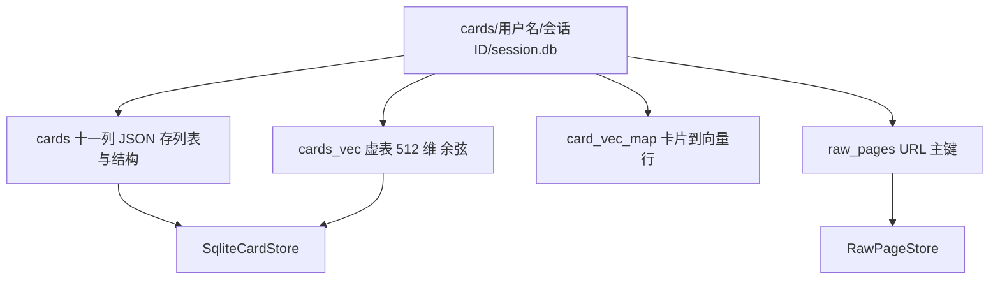
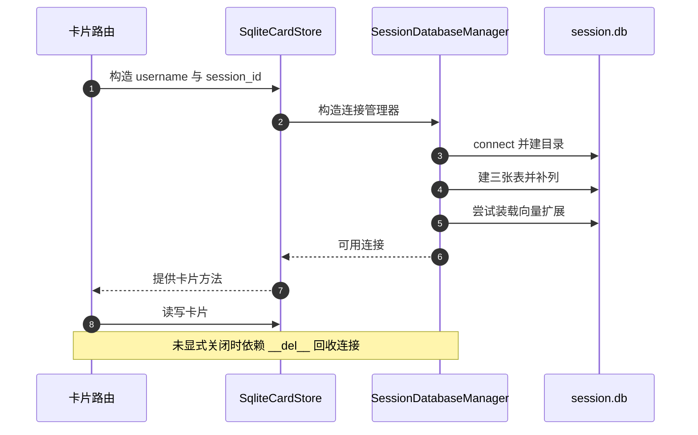

# 会话级数据库

卡片数据不在全局库里。每个会话有自己的 `session.db`，路径是 `cards/{username}/{session_id}/session.db`，由 `SessionDatabaseManager` 管理。它与全局单例相反：没有 `__new__` 拦截，每构造一个实例就打开一条独立连接。隔离换来的是「按会话查询不需要过滤条件」，代价是跨会话查询无法用一条 SQL 完成。

会话库的结构与生命周期在这里展开。全局库在 `01-全局数据库与连接管理.md`，存储类清单在 `03-Storage抽象与实现清单.md`。

## 1. 文件布局与设计意图

模块注释写明了三条设计决定（`backend/storage/session_database.py:1-10`）：每个会话一个 `.db` 文件、文件路径本身提供身份、与全局单例不同每实例只管理一个会话。路径由项目根目录拼出（`:23`、`:99-104`）：

```python
root = PROJECT_ROOT
self.db_dir = root / "cards" / username / session_id
self.db_dir.mkdir(parents=True, exist_ok=True)
self.db_path = self.db_dir / "session.db"
```

| 决定 | 表现 |
| --- | --- |
| 每会话一库 | 路径含用户名与会话 ID |
| 路径即身份 | `cards` 表没有 `username` 与 `session_id` 列 |
| 每实例一连接 | 构造函数里 `sqlite3.connect` |
| 目录自动创建 | `mkdir(parents=True, exist_ok=True)` |

## 2. 三张表与一张可选虚表

建表脚本分三段，各一个常量：

| 表 | 常量 | 列数 | 用途 |
| --- | --- | --- | --- |
| `cards` | `SESSION_CARDS_SCHEMA`（`:26-41`） | 11 | 卡片正文与关系 |
| `raw_pages` | `SESSION_RAW_SCHEMA`（`:44-53`） | 6 | 原始网页内容 |
| `card_vec_map` | `SESSION_VECTOR_SCHEMA`（`:55-60`） | 2 | 卡片到向量行的映射 |

`cards` 表把列表与结构字段存成 JSON 文本：`links`、`backlinks`、`sources`、`tags`、`metadata`，默认值分别是 `'[]'` 与 `'{}'`。`confidence` 是 `REAL`，其余为文本。

`raw_pages` 以 `url` 为主键，写入用 `INSERT OR REPLACE`（`backend/storage/raw_store.py:57-59`），同 URL 重复保存即覆盖。`card_vec_map` 用 `vec_rowid` 关联向量表的行号。

第四张是可选虚表：装载 `sqlite_vec` 扩展后创建 `cards_vec`，向量维度写死 512（`:148-152`）：

```python
self.conn.execute(
    "CREATE VIRTUAL TABLE IF NOT EXISTS cards_vec USING vec0("
    "  embedding FLOAT[512] distance_metric=cosine"
    ")"
)
```



## 3. 构造与建表顺序

构造函数按固定顺序完成六件事（`backend/storage/session_database.py:87-123`）：

| 顺序 | 动作 | 行号 |
| --- | --- | --- |
| 1 | 记录用户名与会话 ID | `:93-94` |
| 2 | 解析根目录并建立目录 | `:96-102` |
| 3 | 连接 `session.db` | `:106` |
| 4 | 设置行工厂 | `:119` |
| 5 | 打开 WAL | `:120` |
| 6 | 建表与迁移，并注册实例 | `:121-123` |

`_init_schema` 依次执行三段建表脚本、提交，再调用补列与向量表初始化（`:125-131`）：

```python
self.conn.executescript(SESSION_CARDS_SCHEMA)
self.conn.executescript(SESSION_RAW_SCHEMA)
self.conn.executescript(SESSION_VECTOR_SCHEMA)
self.conn.commit()
self._migrate_columns()
self._init_vector_table()
```

建表本身幂等，补列与向量表各自负责存量库与新环境。

## 4. 幂等补列

存量库缺 `parent_id` 时由 `_migrate_columns` 补上（`backend/storage/session_database.py:133-141`）：

```python
try:
    self.conn.execute("ALTER TABLE cards ADD COLUMN parent_id TEXT DEFAULT ''")
    self.conn.commit()
    logger.info("Session DB migrated: added parent_id column (%s/%s)", ...)
except sqlite3.OperationalError:
    pass
```

列已存在时 `ALTER TABLE` 抛 `OperationalError`，被捕获后忽略，因此新库与已迁移库都走同一条路径。这条机制只覆盖 `parent_id` 一列：将来新增列需要在同一个方法里继续追加 `ALTER` 语句，或者引入版本号表。

| 情形 | ALTER 结果 | 处理 |
| --- | --- | --- |
| 缺列 | 成功 | 记日志 |
| 已有列 | `OperationalError` | 忽略 |
| 其他 SQL 错误 | `OperationalError` | 同样被忽略，无区分 |

## 5. 向量表与静默降级

向量表初始化整段包在 `try` 里（`backend/storage/session_database.py:143-156`）：导入 `sqlite_vec`、打开扩展加载开关、装载扩展、建虚表、关闭开关、提交。任何一步失败都只写一条警告日志，构造函数继续返回。

```python
try:
    import sqlite_vec
    self.conn.enable_load_extension(True)
    sqlite_vec.load(self.conn)
    self.conn.execute("CREATE VIRTUAL TABLE IF NOT EXISTS cards_vec USING vec0(...)")
    self.conn.enable_load_extension(False)
    self.conn.commit()
except Exception as e:
    logger.warning("Vector extension load failed: %s", e)
```

降级后的表现是语义检索不可用，而卡片增删改查不受影响。`SqliteCardStore` 在自动建索引前会先探测 `cards_vec` 是否存在（`backend/storage/sqlite_card_store.py:74-78`），探测失败就跳过索引，同样只写调试日志。

| 能力 | 扩展可用 | 扩展缺失 |
| --- | --- | --- |
| 卡片读写 | 正常 | 正常 |
| 语义检索 | 正常 | 不可用 |
| 启动表现 | 无提示 | 警告日志 |

## 6. 实例注册表与关闭路径

类级字典 `_instances` 按 `(username, session_id)` 收集所有实例（`backend/storage/session_database.py:77`、`:123`）。三个关闭入口：

| 入口 | 行为 | 行号 |
| --- | --- | --- |
| `close()` | 从注册表移除自身并关连接 | `:167-172` |
| `close_for_session()` | 弹出该键的列表并全部关闭 | `:79-85` |
| `__del__()` | 调用 `close()` | `:180-181` |

`close_for_session` 的唯一调用点是会话删除（`backend/storage/session_store.py:199`），顺序是先关连接再 `shutil.rmtree` 目录（`:201-203`），避免在 Windows 上删除被占用的文件。`__del__` 让未显式关闭的实例在回收时释放连接，但它依赖垃圾回收时机。



## 7. 一个会话会有多少连接

每构造一个 `SqliteCardStore` 或 `RawPageStore` 就会新开一条连接，而卡片路由在每个端点函数里构造（`backend/routes/cards.py:52` 起多处），多数端点不调用 `close`。因此一个会话在多次请求后可能同时存在多条连接，直到对应的管理器实例被回收。

| 场景 | 连接数 | 说明 |
| --- | --- | --- |
| 单次请求用完即回收 | 1 | 依赖 `__del__` |
| 并发多个请求 | 每条一次 | 注册表里累积 |
| 会话删除 | 全部关闭 | `close_for_session` |

WAL 模式下多条连接可以并发读写，因此这一设计在功能上成立，代价是连接数与内存占用随请求量上升，且注册表在长期运行的进程里会持有已失活实例的引用直到关闭。

## 8. 易错点

| 易错点 | 现象 | 位置 |
| --- | --- | --- |
| 以为会话库是单例 | 每次构造一条新连接 | `session_database.py:87-123` |
| 在卡片表里找会话字段 | 路径即身份，无该列 | `:26-41` |
| 依赖向量表一定可用 | 扩展缺失只写警告 | `:143-156` |
| 认为补列机制覆盖所有列 | 只补 `parent_id` | `:133-141` |
| 期望不用关闭连接 | 依赖 `__del__` 时机 | `:180-181` |
| 先删目录再关连接 | 删除可能失败 | `session_store.py:199-203` 顺序相反 |

## 小结

核心概念：

| 概念 | 内容 |
| --- | --- |
| 隔离单位 | 用户名加会话 ID 决定一个 `session.db` |
| 表 | `cards`、`raw_pages`、`card_vec_map` 加可选 `cards_vec` |
| 补列 | 只有 `parent_id`，靠捕获 `OperationalError` 实现幂等 |
| 向量 | 512 维余弦，装载失败静默降级 |
| 关闭 | `close`、`close_for_session` 与 `__del__` 三条路径 |

设计权衡：

| 决策 | 选择 | 收益 | 代价 |
| --- | --- | --- | --- |
| 隔离粒度 | 每会话一库 | 查询无需过滤，删除即删目录 | 跨会话统计困难 |
| 连接模型 | 每实例一连接 | 实现简单 | 连接数随构造增长 |
| 向量扩展 | 可选装载 | 环境缺失也能运行 | 检索能力静默缺失 |
| 补列 | 捕获异常 | 无需版本表 | 无法区分列已存在与真错误 |

## 练习

基础题：

1. 会话库的文件路径如何拼出？为什么表里没有会话字段？
2. 会话库有几张表？各自主键是什么？
3. 向量表初始化失败时会发生什么？
4. 关闭连接的三个入口分别是什么？

挑战题：

5. 把每实例一连接改成按会话复用连接池，说明注册表的改动与并发正确性验证方式。
6. 为会话库引入列版本表，替代当前的异常捕获补列方式，写出迁移流程。
7. 设计一个既保留会话隔离又能做跨会话统计的方案，说明需要新增的索引或汇总表。

---

### 附：本页引用的路径

| 路径 | 用途 |
| --- | --- |
| `backend/storage/session_database.py` | 设计说明与路径（:1-23、:99-104）、三张表（:26-60）、构造（:87-123）、建表（:125-131）、补列（:133-141）、向量表（:143-156）、关闭路径（:79-85、:167-181） |
| `backend/storage/sqlite_card_store.py` | 包装会话库与自动索引（:48-52、:62-78） |
| `backend/storage/raw_store.py` | 原始页写入（:36-43、:57-59） |
| `backend/storage/session_store.py` | 会话删除时的关闭顺序（:191-208） |
| `backend/routes/cards.py` | 每端点构造存储（:52 起） |
