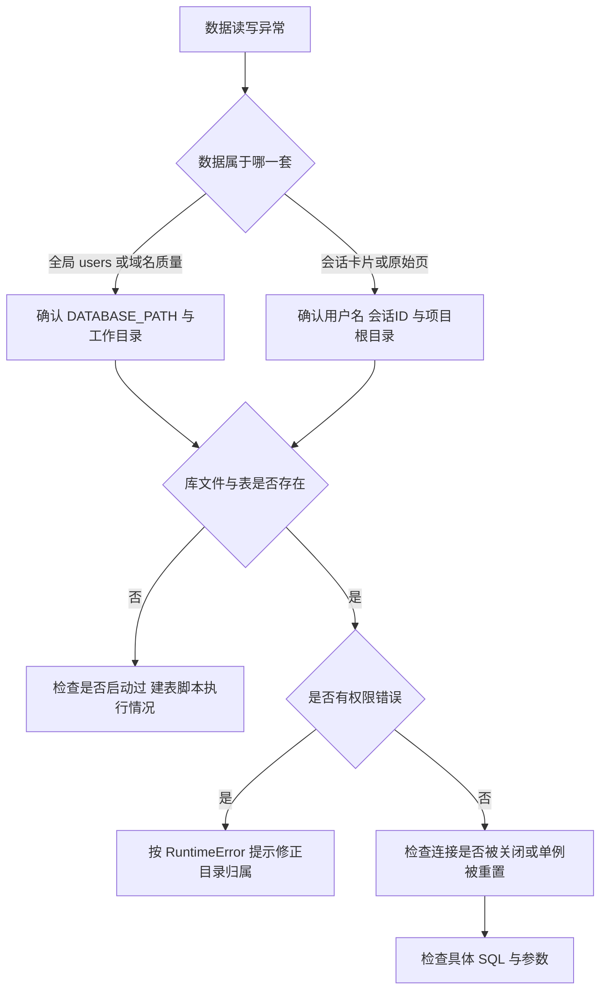
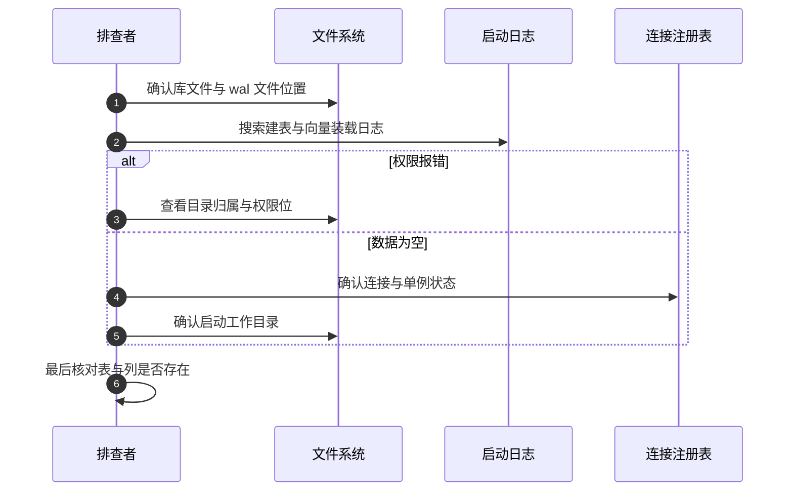

# 数据层的易错点与排查

数据层的问题表现集中：读写不到数据、启动权限报错、语义检索失效、会话删不掉。这些现象分属全局库与会话库两套机制，排查前先确认数据属于哪一套，再沿着路径、连接、表结构三层往下看。

全局库见 `01-全局数据库与连接管理.md` 与 `02-五张全局表.md`，存储清单见 `03-Storage抽象与实现清单.md`，会话库见 `04-会话级数据库.md`。

## 1. 风险清单

| 编号 | 风险 | 位置 | 现象 |
| --- | --- | --- | --- |
| R1 | 会话库有补列机制，全局库没有 | `session_database.py:133-141` 与 `database.py:122-124` | 新增全局列在存量库不生效 |
| R2 | 每构造一个存储就开一条连接 | `session_database.py:106` | 连接与注册表条目随请求增长 |
| R3 | 向量扩展装载失败静默降级 | `:143-156` | 语义检索失效无报错 |
| R4 | 补列吞掉所有 `OperationalError` | `:133-141` | 真实 SQL 错误被当成「列已存在」 |
| R5 | 路径基准不一致 | `session_store.py:35` 与 `session_database.py:99-104` | 换工作目录后数据找不到 |
| R6 | 全局库默认相对路径 | `config.py:140` | 不同启动目录指向不同库 |
| R7 | 目录归属导致连接失败 | `session_database.py:105-118` | 抛带提示的 `RuntimeError` |
| R8 | `close` 重置单例但旧引用不更新 | `database.py:135-137` | 旧 Store 操作已关闭连接 |
| R9 | 外键 PRAGMA 打开但无约束 | `database.py:19-85` | 业务依赖关系无库层保证 |
| R10 | 三张全局表只有迁移脚本在写 | `scripts/migrate_to_sqlite.py:8-9` | 运行期订单与论坛数据在文件里 |
| R11 | WAL 产生副产物文件 | `database.py:118`、`session_database.py:120` | 目录出现 `-wal` 与 `-shm` |
| R12 | 向量维度硬编码 512 | `session_database.py:149-151` | 换嵌入模型需重建虚表 |
| R13 | 时间表示两套 | `database.py:20-29` 与 `:73-84` | 跨表比较要转换 |

## 2. 排查顺序

先用「数据在哪一套库里」分流，再逐层确认：

| 层级 | 检查点 | 对应风险 |
| --- | --- | --- |
| 路径 | 环境变量、工作目录、项目根 | R5、R6 |
| 文件 | 库文件与 `-wal` 是否存在 | R11 |
| 权限 | 目录归属与权限位 | R7 |
| 连接 | 生命周期与单例状态 | R2、R8 |
| 结构 | 表与列是否存在 | R1、R4 |
| 能力 | 向量扩展是否装载 | R3、R12 |

## 3. 两套库的路径与基准

四个存储模块使用三种路径基准：

| 模块 | 基准 | 结果 |
| --- | --- | --- |
| `DatabaseManager` | `DATABASE_PATH`，默认相对 `data/` | 随工作目录变化 |
| `SessionDatabaseManager` | 项目根目录 | 固定 |
| `SessionStore` | 相对 `cards/` | 随工作目录变化 |
| `OrderStore` / `UserStore` | `os.getcwd()` | 随工作目录变化 |

从服务目录启动与从仓库根目录启动，会得到不同的数据文件集合。排查「数据忽然为空」时先确认启动目录，再确认环境变量是否覆盖了默认值。

## 4. 连接与实例注册表

会话库没有单例，每构造一个 `SqliteCardStore` 就开一条连接，并在类级字典里登记。三个可观测点：

| 观察项 | 含义 |
| --- | --- |
| 注册表键的数量 | 当前进程打开过的会话 |
| 键下实例数 | 该会话的连接数 |
| 长期运行后内存上升 | 未关闭实例被注册表持有 |

显式关闭的两个时机：会话删除时 `close_for_session` 会清掉整个键，以及存储对象被回收时 `__del__` 触发 `close`。排查连接占用时可用 `lsof` 类工具观察 `session.db` 的打开数，与注册表对照。

## 5. 建表与补列的口径差异

全局库与会话库对结构演进的处理不同：

| 库 | 建表 | 补列 | 新增列的支持 |
| --- | --- | --- | --- |
| 全局 | `executescript` 幂等 | 无 | 需手写迁移或删库重建 |
| 会话 | 三段幂等脚本 | 捕获异常的 `ALTER` | 每列一条 `ALTER`，异常不区分原因 |

会话库的补列实现把 `OperationalError` 一律视为「列已存在」（`session_database.py:139-141`），因此语法错误或锁超时也会被吞掉。排查「列没加上」时，把 `ALTER` 单独执行一次看是否报错。

## 6. 向量能力的静默缺失

`sqlite_vec` 装载失败只写一条警告（`session_database.py:155-156`），进程照常运行。判断向量能力是否可用有两种方式：查看启动日志中的 `Vector extension load failed`，或直接查询虚表是否存在。

| 检查 | 命令或代码 |
| --- | --- |
| 日志 | 搜索 `Vector extension load failed` |
| 表存在性 | `SELECT 1 FROM cards_vec LIMIT 0` |
| 映射表内容 | `SELECT COUNT(*) FROM card_vec_map` |

`SqliteCardStore` 的自动索引在探测失败后跳过（`sqlite_card_store.py:74-78`），因此映射表为空也可能只是扩展缺失，而不是没有卡片。

## 7. 权限与单例重置

会话库连接失败时会先读取目录的归属与权限位，再抛出带修复提示的 `RuntimeError`（`session_database.py:105-118`）。提示里的命令是 `chown -R $(whoami) <目录>`，对应「上次以 sudo 启动留下 root 属主目录」这一常见场景。

全局库的 `close` 会把单例字段置空（`database.py:137`），下一次构造打开新连接。已经持有旧连接的对象不会自动切换，继续操作会报「连接已关闭」类错误。排查这类错误时确认是否有代码在运行期调用了 `close`。

## 8. 容易走错的方向

| 现象 | 容易先怀疑 | 实际应先查 |
| --- | --- | --- |
| 数据全空 | 数据库损坏 | 启动工作目录与路径基准 |
| 语义检索无结果 | 没有卡片 | 向量扩展是否装载 |
| 会话目录删不掉 | 文件系统锁 | 连接是否已关闭 |
| 新增列读不到 | 代码写错 | 全局库没有补列机制 |
| 连接数持续上升 | 应用泄漏 | 每请求构造存储与注册表 |
| 外键约束未生效 | 数据写入错误 | 表结构没有外键声明 |

## 小结

核心概念：

| 概念 | 内容 |
| --- | --- |
| 两套库 | 全局单例库与每会话一库，路径基准不同 |
| 连接 | 全局共享一条，会话每实例一条 |
| 结构演进 | 会话库补列，全局库只建表 |
| 可选能力 | 向量扩展失败静默降级 |
| 关闭 | 显式关闭与回收关闭两条路径 |

设计权衡：

| 决策 | 选择 | 收益 | 代价 |
| --- | --- | --- | --- |
| 路径基准 | 三种并存 | 各模块就近取值 | 工作目录敏感，排查成本高 |
| 补列 | 捕获异常 | 幂等且代码短 | 错误无法区分 |
| 可选扩展 | 失败告警继续 | 环境门槛低 | 能力缺失不易察觉 |
| 连接管理 | 交给回收 | 调用方无需关心 | 连接数随时机波动 |

## 练习

基础题：

1. 数据层的风险里，哪两条与路径基准有关？分别影响哪些存储？
2. 会话库补列为什么可以重复执行？它牺牲了什么？
3. 向量扩展缺失时如何确认？
4. 全局库 `close` 之后旧的对象会怎样？

挑战题：

5. 统一四个存储模块的路径基准，说明放置位置与对现有部署的影响。
6. 为全局库设计列迁移机制，要求能区分「列已存在」与真实错误。
7. 设计一份数据层健康检查清单，覆盖库文件、连接数、表结构、向量能力与权限五项，写出每项的判定命令。

---

### 附：本页引用的路径

| 路径 | 用途 |
| --- | --- |
| `backend/storage/database.py` | 表定义（:19-85）、WAL 与单例（:118、:135-137） |
| `backend/storage/session_database.py` | 连接与权限提示（:99-118）、补列（:133-141）、向量表（:143-156） |
| `backend/storage/sqlite_card_store.py` | 自动索引探测（:74-78） |
| `backend/storage/session_store.py` | 会话路径基准与删除（:35、:191-208） |
| `backend/config.py` | `DATABASE_PATH`（:140） |
| `backend/scripts/migrate_to_sqlite.py` | 迁移脚本覆盖的表与来源（:8-9） |
