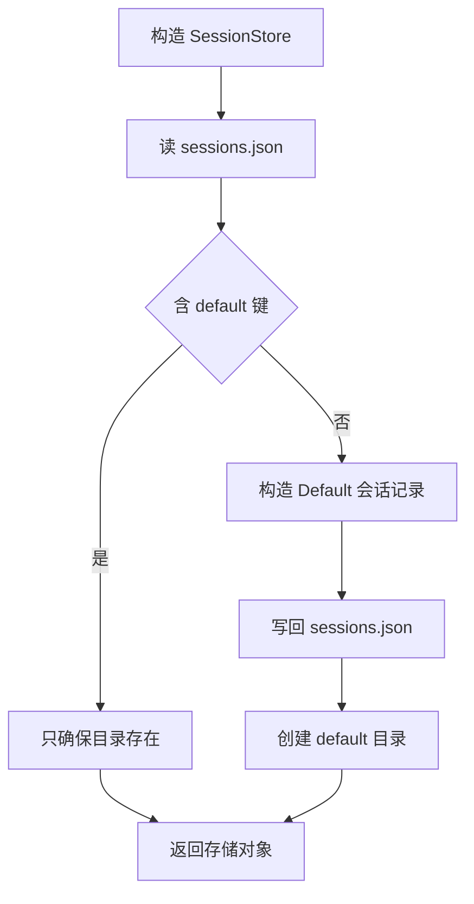
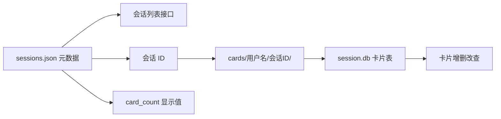

# 会话元数据与默认会话

新用户第一次打开应用，前端请求会话列表，拿到的直接是一个名为 Default 的会话。它没有任何人创建过，是存储层在构造时补出来的：`SessionStore(username=...)` 的 `__init__` 会检查 `sessions.json`，缺少 `default` 就写一条进去，并在 `cards/{用户名}/` 下建好同名目录。用户看到的一切「已有会话」，都来自这个 JSON 文件。

会话数据因此分成两半：元数据（名字、时间、卡片数量）在 `sessions.json`，卡片正文在会话目录下的 `session.db`。这一半与另一半的对应关系靠会话 ID 维系，下面从元数据一侧看起。

## 1. 一条会话记录有哪些字段

元数据模型定义在 `backend/models/session.py`，字段少但都能对上界面元素：

| 字段 | 类型 | 含义 |
| --- | --- | --- |
| `id` | 字符串 | 会话标识，默认会话固定为 `default` |
| `name` | 字符串 | 显示名，创建与改名时校验非空与长度 |
| `created_at` | 时间 | 创建时间 |
| `updated_at` | 时间 | 最后修改时间 |
| `card_count` | 整数 | 卡片数量，存在 JSON 里供列表直接显示 |

`card_count` 是唯一与卡片库相关的字段，这个字段是写进 JSON 的一份副本，不是每次查询实时算出的结果。副本与真实数量的偏差来源会在后两篇展开。

## 2. 文件与目录布局

一个用户的会话相关文件是这样排的（`backend/storage/session_store.py` 模块注释与构造）：

```text
cards/{用户名}/
├── sessions.json          会话元数据全集
├── default/
│   └── session.db         默认会话的卡片库
└── {会话UUID}/
    └── session.db         该会话的卡片库
```

`sessions.json` 是一个以会话 ID 为键的字典，值是会话记录。目录名与会话 ID 相同，因此从元数据到卡片库只需要拼一次路径。`SessionStore.get_session_dir` 返回的正是这个目录。

路径前缀 `cards` 用的是相对路径，含义随进程工作目录变化；会话库管理器则用项目根目录拼绝对路径。两者指向通常一致，但从别的目录启动进程时会分叉，这一点在 29/01 单元已记录。

## 3. 默认会话的补建

默认会话在构造时补齐，示意如下：

```python
# 示意：构造时保证至少有一个会话
def ensure_default_session(self) -> None:
    sessions = self._load_sessions()               # 读元数据文件
    if not sessions:
        sessions = [{"id": "default", "name": "Default", "card_count": 0}]
        self._save_sessions(sessions)              # 写回
```

这是"读取时惰性初始化"的一种：不在安装或注册流程里建默认数据，而是让第一次读取顺手补上。好处是新增用户、数据被手工删空等边界都走同一条路径；坏处是把写操作藏在了构造逻辑里，调用方以为只是读、实际可能触发写盘——所以这类补建要保证幂等，并且失败要能降级。

构造 `SessionStore` 时先确保默认会话存在（`session_store.py` 的 `_ensure_default_session`）：

```python
sessions = self._load_sessions()
if DEFAULT_SESSION_ID not in sessions:
    default_session = Session(id="default", name="Default",
                              created_at=datetime.utcnow(),
                              updated_at=datetime.utcnow(), card_count=0)
    sessions[DEFAULT_SESSION_ID] = default_session.model_dump(mode="json")
    self._save_sessions(sessions)
default_dir = self.cards_dir / "default"
default_dir.mkdir(exist_ok=True)
```

三步：读、判、补。读到的文件不存在或解析失败都会得到空字典，因此「文件损坏」与「首次使用」走同一条补建路径。默认会话的 ID 是固定的字符串常量，不是 UUID，删除接口专门拦它。



## 4. 读写时的类型转换

JSON 里没有时间类型，所以存取两侧各有一层转换（`session_store.py` 的 `_load_sessions` 与 `_save_sessions`）：

| 方向 | 操作 |
| --- | --- |
| 读 | 对 `created_at`、`updated_at` 字符串调用 `datetime.fromisoformat` |
| 写 | 模型先 `model_dump(mode="json")`，字典里的时间再 `isoformat()` |

写入路径同时接受模型对象与字典，用 `hasattr(session_data, "model_dump")` 判断后分别处理。这样的宽容写法让调用方可以混着传，代价是两种形态在代码里长期并存，读的时候也要再判一次 `isinstance(session_data, dict)`。

读失败的处理是记录一条警告并返回空字典：

```python
except Exception as e:
    logger.warning("Session load failed: %s", e)
    return {}
```

这个兜底让损坏的文件表现为「会话消失」，而不是请求失败。用户看不到报错，重新创建同名会话时又会因为旧记录还在文件里而失败，排查时需要直接打开 `sessions.json`。

## 5. 列表与单条查询

`list_sessions` 与 `get_session` 都先整体加载 JSON 再取用（`session_store.py`）：列表把每条记录构造回 `Session`，单条查不到返回 `None`，由路由转成 404。两个方法都是全量读取，会话数量不多时开销可忽略。

| 方法 | 返回 | 查不到时 |
| --- | --- | --- |
| `list_sessions` | 全部会话的列表 | 空列表 |
| `get_session` | 单条会话 | `None` |

字典没有顺序保证，列表顺序取决于文件里的键序，也就是写入顺序。前端若要按最近使用排序，需要自己排序。

## 6. 元数据与卡片库的衔接

元数据文件与卡片库通过目录名对应。`SessionStore` 本身不读卡片表，只有刷新数量或移动卡片时才会构造 `SqliteCardStore` 或 `SessionDatabaseManager` 打开对应目录下的 `session.db`（细节见 `03-卡片数量的一致性.md`）。这种分工让会话列表只依赖一个小 JSON 文件，不需要为每次列表请求打开数据库。



## 7. 易错点

| 易错点 | 现象 | 位置 |
| --- | --- | --- |
| 以为默认会话是用户建的 | 构造存储时自动补出 | `session_store.py` `_ensure_default_session` |
| 在卡片库里找会话名 | 名字只在 `sessions.json` | 同上 |
| JSON 损坏后期望报错 | 只记警告并返回空 | `_load_sessions` 的 `except` |
| 认为 `card_count` 总是准的 | 它是写入时的副本 | 后两篇展开 |
| 从其他目录启动 | `cards` 相对路径指向别处 | `session_store.py` 构造 |

## 小结

核心概念：

| 概念 | 内容 |
| --- | --- |
| 元数据位置 | `cards/{用户名}/sessions.json` |
| 默认会话 | ID 固定 `default`，构造时补建 |
| 时间转换 | 读 `fromisoformat`，写 `model_dump` 加 `isoformat` |
| 容错 | 读失败返回空字典并记警告 |
| 与卡片库的关系 | 目录名即会话 ID，元数据不读卡片表 |

设计权衡：

| 决策 | 选择 | 收益 | 代价 |
| --- | --- | --- | --- |
| 元数据存储 | 单个 JSON 文件 | 列表请求快，无迁移成本 | 并发写整文件覆写 |
| 默认会话 | 构造时补建 | 新用户开箱可用 | 读失败也走补建，掩盖损坏 |
| 字段形态 | 模型与字典都接受 | 调用方灵活 | 判断分支分散在多处 |
| 卡片数量 | 写入副本 | 列表无需开库 | 需要额外同步逻辑 |

## 练习

基础题：

1. 会话元数据存在哪个文件？默认会话的 ID 是什么？
2. 读 `sessions.json` 时对时间字段做了什么处理？
3. 会话目录名与哪个字段对应？
4. 文件解析失败时 `_load_sessions` 会怎样？

挑战题：

5. 把损坏文件的容错改成可观测的报错，说明对默认会话补建与前端的影响。
6. 让会话列表支持按最近修改排序，说明改动位置与是否要改数据结构。
7. 设计一个并发写 `sessions.json` 的保护方案，比较文件锁与改用数据库两种做法。

---

### 附：本页引用的路径

| 路径 | 用途 |
| --- | --- |
| `backend/storage/session_store.py` | 模块说明与构造、`_ensure_default_session`、`_load_sessions`、`_save_sessions`、`list_sessions`、`get_session` |
| `backend/models/session.py` | 会话模型与请求模型 |
| `backend/routes/sessions.py` | 列表与单条查询接口 |
| `backend/storage/session_database.py` | 会话卡片库路径的拼接方式 |
