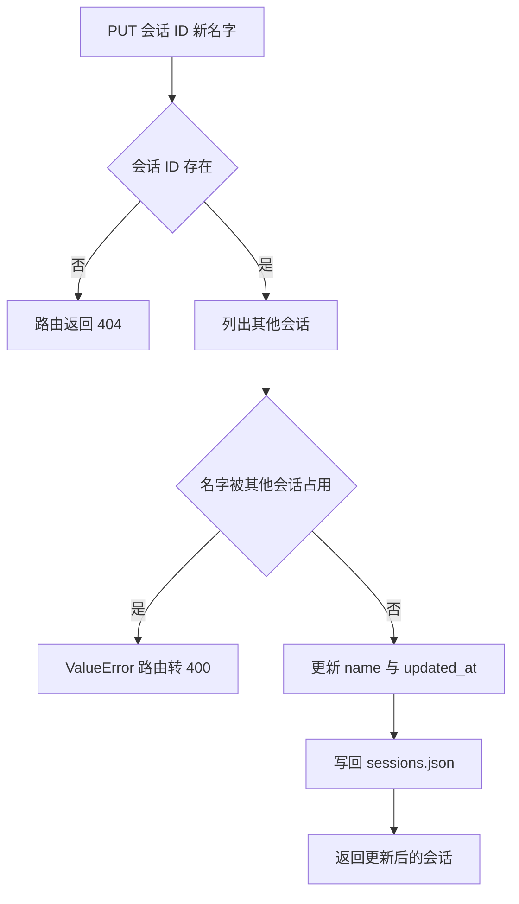
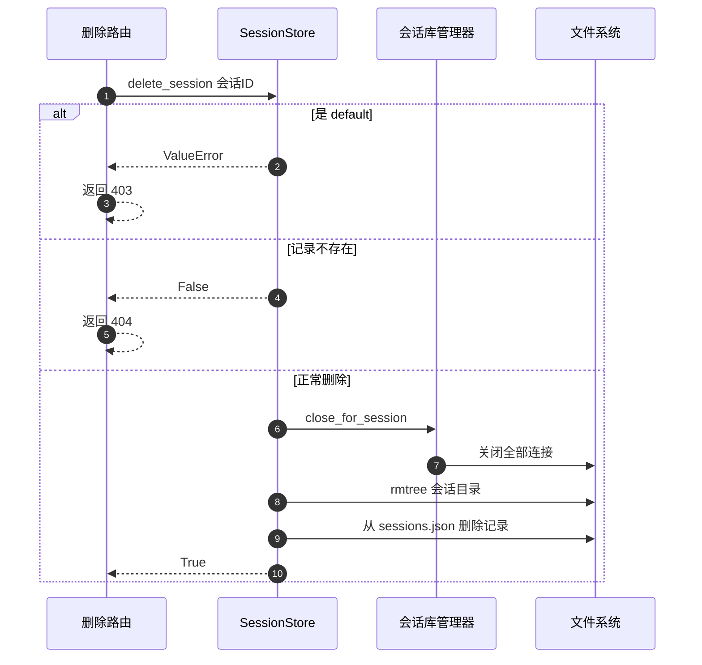

# 会话增删改与卡片迁移

用户在界面上点「新建会话」「重命名」「删除」时，服务端做的不只是改一个名字：新建要同时写 JSON 与建目录，删除要先断开该会话的数据库连接再删目录，重命名要保证同一用户下名字不重复。这些动作分散在 `SessionStore` 与 `backend/routes/sessions.py` 两侧，存储层负责数据与副作用，路由层只做错误翻译。

下面按用户能触发的四类操作展开，最后看把卡片从一个会话搬到另一个会话的路径。

## 1. 新建会话的三个动作

`create_session` 接收一个名字，做三件事（`backend/storage/session_store.py`）：

```python
session_id = str(uuid.uuid4())
sessions = self.list_sessions()
for session in sessions:
    if session.name == name:
        raise ValueError(f"Session with name '{name}' already exists")
session = Session(id=session_id, name=name, created_at=..., updated_at=..., card_count=0)
sessions_dict = self._load_sessions()
sessions_dict[session_id] = session.model_dump(mode="json")
self._save_sessions(sessions_dict)
session_dir = self.cards_dir / session_id
session_dir.mkdir(exist_ok=True)
```

| 动作 | 作用 |
| --- | --- |
| 生成 UUID | 会话 ID，目录名同值 |
| 重名检查 | 与已有会话的名字逐一比对 |
| 写入记录并建目录 | 元数据落盘，卡片库目录就位 |

目录此时是空的，`session.db` 要等第一次访问卡片存储时才创建。`card_count` 初始写 0。

## 2. 重名检查的口径

新建与会话改名都调用了同一套名字检查，但口径不同：

| 操作 | 比较范围 | 命中后 |
| --- | --- | --- |
| 新建 | 全部已有会话 | 抛 `ValueError` |
| 改名 | 除自身以外的会话 | 抛 `ValueError` |

改名必须排除自身，否则「把 A 改成它现在的名字」会被当成冲突。检查都是先读全表再逐个比较，两个请求同时改名同一个目标时没有锁保护，可能出现两个会话同名。

## 3. 改名的写入过程

`update_session` 先确认会话存在，再检查名字，最后改 `name` 与 `updated_at`（`session_store.py`）。记录可能是字典也可能是模型对象，两种形态各写一条分支，写完都统一 `model_dump(mode="json")` 后落盘。



## 4. 删除的顺序

删除必须先断连接再删目录，示意如下：

```python
# 示意：删除会话的顺序
manager.close_session(username, session_id)   # 1 先关闭该会话的数据库连接
shutil.rmtree(session_dir, ignore_errors=True)  # 2 再删目录
self._save_sessions(remaining)               # 3 最后更新元数据
```

顺序反了的后果是平台相关的：Windows 上被进程持有的文件不能删除，目录会留下半个；即使删除成功，连接池里仍握着指向已删文件的句柄，后续写入会落到"幽灵文件"里。先释放资源再删实体、最后改引用它的元数据，这个顺序对任何"有句柄或引用的资源"都适用。

删除是四步，顺序不能换（`session_store.py` 的 `delete_session`）：

```python
if session_id == DEFAULT_SESSION_ID:
    raise ValueError("default 是系统保留会话，不可删除")
sessions_dict = self._load_sessions()
if session_id not in sessions_dict:
    return False
SessionDatabaseManager.close_for_session(self.username, session_id)
session_dir = self.cards_dir / session_id
if session_dir.exists():
    shutil.rmtree(session_dir)
del sessions_dict[session_id]
self._save_sessions(sessions_dict)
```

| 顺序 | 动作 | 不这样做的后果 |
| --- | --- | --- |
| 1 | 拦默认会话 | 系统会话被删 |
| 2 | 查记录是否存在 | 删了不存在的目标 |
| 3 | 关闭该会话的全部数据库连接 | 文件占用，删除失败 |
| 4 | 删目录、删记录 | 目录与元数据不一致 |

先关连接再删目录是 Windows 环境下必须的顺序：还有连接打开时 `rmtree` 会因文件占用失败。



## 5. 删除的状态码语义

路由把存储层的两种信号翻成状态码（`backend/routes/sessions.py`）：

| 存储层返回 | 路由响应 | 含义 |
| --- | --- | --- |
| `True` | 200 与 `deleted` | 删除成功 |
| `False` | 404 | 会话不存在 |
| `ValueError` | 403 | 默认会话不可删 |

403 在这里的含义是「目标不允许操作」，与鉴权无关。用户看到 403 时应检查是否在删默认会话。

## 6. 跨会话移动卡片

`move_cards_to_session` 打开源与目标两个卡片存储，把指定卡片搬过去（`session_store.py`）：

```python
if source_session_id == target_session_id:
    return 0
source_store = SqliteCardStore(username=self.username, session_id=source_session_id)
target_store = SqliteCardStore(username=self.username, session_id=target_session_id)
moved = source_store.move_card_ids_to(target_store, card_ids)
self._update_session_card_count(source_session_id)
self._update_session_card_count(target_session_id)
```

同会话移动直接返回 0，避免无意义的搬动。两个会话的卡片库是两个 `.db` 文件，搬迁就是跨库复制加删除，具体实现与冲突处理在 `SqliteCardStore.move_card_ids_to`。搬完刷新两边计数，保证会话列表显示正确。

接口签名的参数是路径参数加两个普通参数（`backend/routes/sessions.py`），`card_ids` 是字符串列表，按 FastAPI 的默认规则从查询串解析。卡片多时查询串会很长，这是当前接口形态的一个限制。

| 参数 | 位置 | 类型 |
| --- | --- | --- |
| `session_id` | 路径 | 源会话 |
| `target_session_id` | 查询串 | 目标会话 |
| `card_ids` | 查询串 | 要移动的卡片 ID 列表 |

## 7. 路由与存储的对应

| 接口 | 存储方法 | 失败信号 |
| --- | --- | --- |
| `GET /api/sessions` | `list_sessions` | 无 |
| `POST /api/sessions` | `create_session` | 重名 `ValueError` 转 400 |
| `GET /api/sessions/{id}` | `get_session` | `None` 转 404 |
| `PUT /api/sessions/{id}` | `update_session` | 不存在 404，重名 400 |
| `DELETE /api/sessions/{id}` | `delete_session` | 不存在 404，默认会话 403 |
| `POST /api/sessions/{id}/move-cards` | `move_cards_to_session` | 任意异常转 400 |

移动接口把异常统一转成 400 并给出通用文案，目标会话不存在、卡片 ID 无效、跨库写入失败都表现为同一条错误信息，排查时只能看日志。

## 8. 易错点

| 易错点 | 现象 | 位置 |
| --- | --- | --- |
| 用 403 判断权限问题 | 也可能是删默认会话 | `routes/sessions.py` 删除分支 |
| 改名时把自身算作冲突 | 名字检查已排除自身 | `session_store.py` `update_session` |
| 删除顺序写反 | 目录删不掉 | `delete_session` |
| 以为移动会自动创建目标会话 | 目标不存在时按卡片存储逻辑处理 | `move_cards_to_session` |
| 卡片多时用查询串传 ID | 请求 URL 过长 | `routes/sessions.py` 移动接口 |
| 认为移动接口错误信息可区分原因 | 统一转 400 | 同上 |

## 小结

核心概念：

| 概念 | 内容 |
| --- | --- |
| 新建 | UUID 加写记录加建目录 |
| 重名 | 新建比全部，改名排除自身 |
| 删除 | 拦默认、查存在、关连接、删目录与记录 |
| 状态码 | 404 不存在、403 默认会话、400 重名 |
| 移动卡片 | 两个卡片存储跨库搬动后刷新计数 |

设计权衡：

| 决策 | 选择 | 收益 | 代价 |
| --- | --- | --- | --- |
| 名字唯一性 | 读全表逐个比较 | 实现简单 | 并发改名可重名 |
| 删除顺序 | 先关连接后删目录 | 文件不被占用 | 依赖管理器注册表准确 |
| 移动参数 | ID 列表走查询串 | 无需请求体模型 | 卡片多时 URL 过长 |
| 错误翻译 | 通用文案 | 不泄露内部细节 | 排查依赖日志 |

## 练习

基础题：

1. 新建会话时执行了哪三个动作？
2. 改名与新建的重名检查范围有什么不同？
3. 删除会话的四步顺序是什么？为什么不能交换？
4. 删除接口的 403 在什么情况下出现？

挑战题：

5. 为移动卡片改成请求体接收 ID 列表，说明对前端调用与接口文档的影响。
6. 让会话名字唯一性在并发下成立，给出文件锁或数据库唯一索引两种做法。
7. 设计删除失败的回滚流程：目录删除失败时应如何保持元数据与文件一致。

---

### 附：本页引用的路径

| 路径 | 用途 |
| --- | --- |
| `backend/storage/session_store.py` | `create_session`、`update_session`、`delete_session`、`move_cards_to_session` |
| `backend/routes/sessions.py` | 会话 CRUD 与移动卡片接口、状态码翻译 |
| `backend/storage/session_database.py` | `close_for_session` |
| `backend/storage/sqlite_card_store.py` | `move_card_ids_to` 与卡片计数刷新 |
