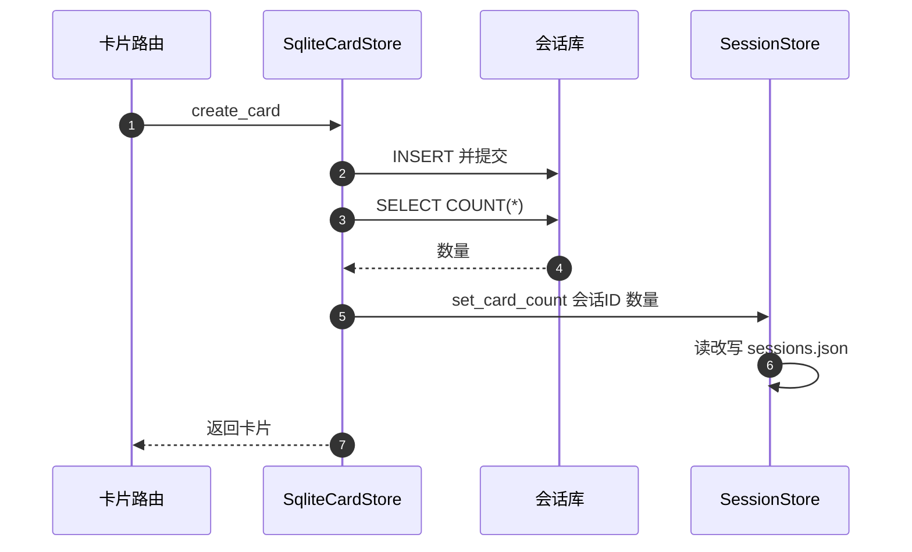
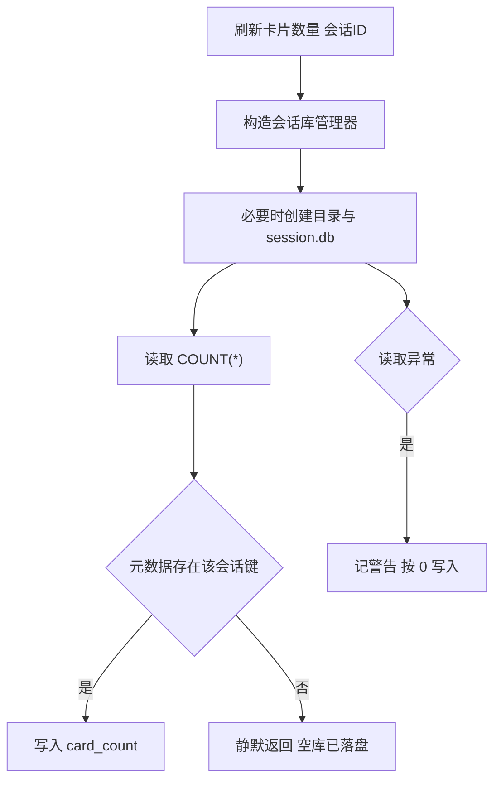

# 卡片数量的一致性

会话列表上那个「N 张卡片」不是查出来的。为了不让列表接口为每个会话打开一次数据库，数量被写进元数据文件，由卡片存储在增删卡片后顺手刷新。副本一旦漏刷，列表显示就会与真实数量不一致，而且不会报错。

要回答的是四个问题：谁来刷、什么时候刷、刷的时候读的是什么、失败会怎样。

## 1. 数量的真实来源与副本

真实数量是会话库里的一张表行数。会话库管理器提供了一个直接执行 `COUNT(*)` 的属性：

```python
@property
def card_count(self) -> int:
    row = self.conn.execute("SELECT COUNT(*) AS cnt FROM cards").fetchone()
    return row["cnt"] if row else 0
```

`sessions.json` 里的 `card_count` 是这份真实数量的副本。副本的写入口只有一个：`SessionStore.set_card_count`，它读 JSON、改对应键、整文件写回。

| 值 | 位置 | 读取方式 |
| --- | --- | --- |
| 真实数量 | `session.db` 的 `cards` 表 | `COUNT(*)` |
| 显示数量 | `sessions.json` | 直接读字段 |

## 2. 刷新链路

刷新由卡片存储发起，三步走（`backend/storage/sqlite_card_store.py`）：

```python
def _update_session_card_count(self) -> None:
    if not self.username:
        return
    count = self.db.card_count
    session_store = SessionStore(username=self.username)
    session_store.set_card_count(self.session_id, count)
```

它先读真实数量，再构造一个 `SessionStore` 写回元数据。没有用户名时直接跳过，因为无法定位 `sessions.json`。

`SessionStore` 自己也有一个同名方法，用于移动卡片后的刷新（`session_store.py`）：它临时构造一个会话库管理器、读数量、关闭连接，然后调用 `set_card_count`。异常时记警告并把数量按 0 处理，于是「读不到卡片库」的结果是显示 0，而不是保留旧值。

| 发起者 | 读数量方式 | 失败兜底 |
| --- | --- | --- |
| `SqliteCardStore` | 自己的连接 | 无显式兜底 |
| `SessionStore` | 临时管理器加 `close` | 记警告并按 0 写 |

## 3. 什么时候会刷新

`SqliteCardStore` 在三个位置调用刷新：

| 操作 | 是否刷新 | 说明 |
| --- | --- | --- |
| `create_card` | 是 | 提交后立即刷新 |
| `delete_card` | 是 | 删除后刷新 |
| `update_card` | 否 | 数量不变，无需刷新 |
| `move_card_ids_to` | 由会话层刷新两边 | 见 `move_cards_to_session` |

文件版 `CardStore` 也在创建与删除后调用自己的刷新方法，路径一致。`RawPageStore` 写的是 `raw_pages` 表，不参与卡片计数。



## 4. 会漏刷的路径

有三类操作绕过了上述刷新：

| 路径 | 原因 | 后果 |
| --- | --- | --- |
| 直接执行 SQL | 绕过卡片存储的方法 | 副本停在旧值 |
| 批量写入 | 只在单条方法里刷新 | 数量滞后 |
| 手工修库 | 外部工具改表 | 副本不动 |

第三类在运维时常见：直接连 `session.db` 删除重复卡片后，列表仍显示旧数量，必须再触发一次增删或手工改 JSON 才能对齐。

## 5. 刷新失败会怎样

刷新链路里没有把 `set_card_count` 的失败上抛的代码：`SessionStore` 侧读数量失败按 0 写入，`set_card_count` 在会话键不存在时静默返回。两种失败都只影响显示值，不影响卡片本身。

| 失败 | 表现 | 影响范围 |
| --- | --- | --- |
| 会话库读不到 | 警告日志，写 0 | 列表显示 |
| `sessions.json` 里没有该键 | 静默返回 | 列表显示 |
| `cards` 表被删 | `COUNT(*)` 报错 | 警告日志 |

写 0 的行为需要留意：它会把一个本来正确的旧值覆盖成 0。

## 6. 用错会话 ID 的副作用

读取数量要构造会话库管理器，而管理器在构造时就会建立目录与 `.db` 文件。因此对一个不存在的会话 ID 调用 `_update_session_card_count`，会先创建空库、读出 0，再尝试写回元数据。因为元数据里没有这个键，写入静默失败，但空目录与空库已经留在磁盘上。



## 7. 排查数量不一致

先确认哪一侧是错的：直接查会话库 `cards` 表行数与 `sessions.json` 里的值，两者相等时问题在别处（例如前端缓存）。不相等时，按最近一次操作判断：新建或删除卡片应该已刷新，若没刷新说明操作走了绕过路径。

| 现象 | 检查 | 处理 |
| --- | --- | --- |
| 显示比实际多 | 表被外部删行 | 触发一次增删或手工改 JSON |
| 显示比实际少 | 卡片被绕过写入 | 同上 |
| 显示为 0 但卡片存在 | 刷新时读库失败 | 看警告日志与目录权限 |
| 列表多出陌生会话目录 | 用错会话 ID 触发建库 | 删除空目录 |

## 8. 易错点

| 易错点 | 现象 | 位置 |
| --- | --- | --- |
| 以为数量是实时查询 | 它是副本 | `sessions.json` |
| 用外部工具改卡片表 | 副本不更新 | `SqliteCardStore` 刷新点 |
| 忽略读失败的 0 写入 | 正确值被覆盖 | `session_store.py` 刷新方法 |
| 用错会话 ID 做刷新 | 落下空库 | `session_database.py` 构造即建库 |
| 期望 `update_card` 也刷新 | 数量不变，确实不刷 | `sqlite_card_store.py` |

## 小结

核心概念：

| 概念 | 内容 |
| --- | --- |
| 数据关系 | 真实数量在会话库，显示数量在元数据 |
| 刷新入口 | `SqliteCardStore` 在创建与删除后调用 |
| 刷新实现 | 读 `COUNT(*)` 后整文件写回 `sessions.json` |
| 失败行为 | 读失败按 0 写，键不存在静默返回 |
| 副作用 | 构造会话库会建目录与空库 |

设计权衡：

| 决策 | 选择 | 收益 | 代价 |
| --- | --- | --- | --- |
| 数量存储 | 元数据副本 | 列表接口不打开数据库 | 需要同步逻辑 |
| 刷新时机 | 增删后立即 | 常规操作准确 | 绕过路径会漂移 |
| 失败处理 | 记警告并写 0 | 不影响主流程 | 旧值可能被覆盖 |
| 计数方式 | `COUNT(*)` | 永远反映表状态 | 每次刷新一次查询 |

## 练习

基础题：

1. 卡片数量的真实来源与显示来源分别在哪里？
2. 刷新链路做了哪三步？
3. `SqliteCardStore` 在哪些操作后刷新数量？
4. 读数量失败时写入的值是什么？

挑战题：

5. 把显示数量改成实时查询，评估列表接口的数据库打开次数与优化方式。
6. 为绕过路径设计兜底对账任务，说明触发频率与比对内容。
7. 让「用错会话 ID」不再创建空库，说明构造时机与校验位置。

---

### 附：本页引用的路径

| 路径 | 用途 |
| --- | --- |
| `backend/storage/sqlite_card_store.py` | `_update_session_card_count` 与三个刷新点 |
| `backend/storage/session_database.py` | `card_count` 属性与构造建库 |
| `backend/storage/session_store.py` | `_update_session_card_count`、`set_card_count` |
| `backend/storage/card_store.py` | 文件版存储的同类刷新 |
| `backend/storage/raw_store.py` | `raw_pages` 不参与卡片计数 |
