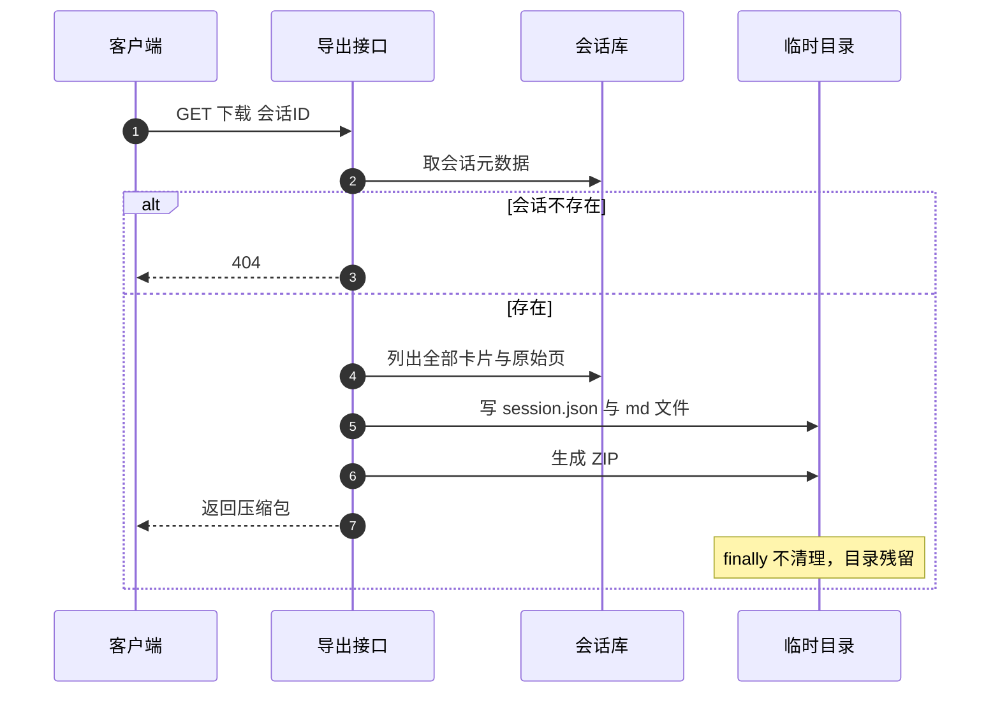
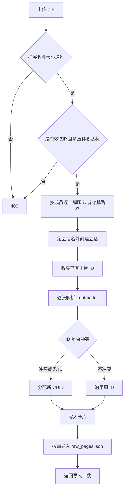

# 会话导入导出

用户想把一个会话备份出来或从别人那里导入时，走的是 ZIP：导出接口把会话目录的内容打成压缩包，导入接口把压缩包重新落成卡片与原始页。两端的格式约定相同，都是 `session.json` 加若干 `.md` 卡片，原始页可选。

导入侧是唯一接收外部文件的入口，因此校验最多：文件类型、压缩包大小、解压后总大小、路径穿越，以及卡片 UUID 冲突。

## 1. 导出的目录结构

导出先按会话 ID 取出元数据，再把卡片逐张写成 Markdown（`backend/routes/session_io.py` 的 `download_session`）：

```text
{safe_name}/
├── session.json        会话元数据，card_count 被重算
├── {card_id}.md        每张卡片一个文件，带 frontmatter
└── raw_pages.json      原始网页数组，没有则不出现在包里
```

每个 Markdown 文件由三段拼成：frontmatter、一级标题、正文。frontmatter 由工具函数生成，字段与卡片模型一一对应；正文前再补一行 `# 标题`，导入时会识别并去掉重复标题。

| 组成部分 | 来源 |
| --- | --- |
| `session.json` | 会话模型，`card_count` 用 `len(cards)` 覆盖 |
| `{card_id}.md` | 卡片 frontmatter 加标题与正文 |
| `raw_pages.json` | 该会话 `raw_pages` 表全部记录 |

`card_count` 覆盖是导出侧的对账动作：不信任元数据里的副本，直接按实际卡片数写。这能修正历史漂移，但也说明导入后显示的数量以导出时的真实值为准。

## 2. 文件名与打包

会话名会被清洗成安全文件名：反斜杠、斜杠、冒号、星号、问号、引号、尖括号与竖线都替换成下划线。压缩包名与返回给浏览器的下载名都用清洗后的值。

打包流程是：建临时目录、写内容、用归档工具生成 ZIP、返回文件响应。临时目录在 `finally` 块里没有清理（该块是空的），因此每次导出都会在系统临时目录留下一份解压内容与 ZIP。导入接口的 `finally` 才做了递归删除，两侧行为不一致。



## 3. 导入的校验顺序

导入接口的校验按代价从低到高排列（`session_io.py` 的 `upload_session`）：

| 顺序 | 校验 | 失败响应 |
| --- | --- | --- |
| 1 | 文件名以 `.zip` 结尾 | 400 |
| 2 | 内容不超过 50MB | 400 |
| 3 | 是有效 ZIP | 400 |
| 4 | 解压后总大小不超过 200MB | 400 |
| 5 | 逐个成员做路径穿越检查 | 跳过该成员 |

前两项限制上传体积，第三项防止把任意文件当压缩包解，第四项用各成员的声明大小求和防压缩炸弹，第五项把解压路径规范化后确认仍落在临时目录内，不在范围内的成员直接跳过。

## 4. 会话名与卡片来源

解压后先找 `session.json`，找不到就退而用 Markdown 文件所在的顶层目录名，再不行用压缩包文件名去掉后缀。名字拿到后直接调 `create_session`，因此导入到已有同名会话时会因为重名检查失败而报 400，错误文案是通用的「创建会话失败」。

卡片文件来自遍历解压目录得到的 `.md` 列表，逐个解析 frontmatter；读文件失败或 frontmatter 解析失败都记警告并跳过该文件，不中断整次导入。

## 5. UUID 冲突的处理

导入前会先把当前用户所有会话的卡片 ID 收集成一个集合（`session_io.py`）。这一步要为每个会话构造一次卡片存储，会话多时开销明显。逐张导入时按下面的规则决定新 ID：

| 情况 | 处理 |
| --- | --- |
| frontmatter 有 ID 且未被占用 | 沿用原 ID |
| frontmatter 有 ID 但已占用 | 换成新 UUID |
| frontmatter 没有 ID | 生成新 UUID |

沿用原 ID 的好处是卡片之间的链接仍然指向同一张卡片；代价是导入到同一账号时，只要原 ID 已存在就必须换 ID，链接会指到旧卡片上。

## 6. 卡片字段的落地

导入的卡片时间被统一写成当前时间，原始创建时间不保留；链接、反链、来源与标签按 frontmatter 取，类型不对时退回空列表；置信度取不到时按 1.0 处理；元数据不是字典时置空。

正文去重的规则是：如果正文开头正好是 `# 标题` 加一个空行，就去掉这两行。这是导出时补标题的逆操作，只在格式完全匹配时生效。



## 7. 导入的返回值与收尾

导入成功返回新会话对象、导入卡片数与原始页数（`session_io.py`）。原始页文件在 `session.json` 同目录下找不到时会再找一次同目录，找到就逐条写入 `raw_pages` 表，单条失败不影响其余；整段原始页导入失败也只记警告。

异常收尾分三种：压缩包损坏返回 400，自身抛出的 400 原样透出，其余异常统一转成 500 与通用文案。无论哪条路径，临时目录都会在 `finally` 里递归删除。

| 返回值字段 | 含义 |
| --- | --- |
| `session` | 新建的会话对象 |
| `card_count` | 成功导入的卡片数，跳过的文件不计 |
| `raw_pages_count` | 成功导入的原始页数 |

## 8. 易错点

| 易错点 | 现象 | 位置 |
| --- | --- | --- |
| 导出后期望临时目录被清理 | `finally` 为空 | `download_session` |
| 导入同名会话 | 重名检查失败返回 400 | `upload_session` |
| 以为原始创建时间会保留 | 统一写成导入时间 | 卡片构造处 |
| 导入后链接指向旧卡片 | ID 冲突时换了新 UUID | 冲突处理分支 |
| 用大压缩包测试 | 50MB 与 200MB 两道限制 | 校验顺序表 |
| 以为坏文件会让整次导入失败 | 单文件解析失败会跳过 | 解析循环 |

## 小结

核心概念：

| 概念 | 内容 |
| --- | --- |
| 包结构 | `session.json` 加 `.md` 卡片，原始页可选 |
| 导出对账 | `card_count` 按实际卡片数重写 |
| 导入校验 | 类型、50MB、ZIP 有效性、200MB 解压体积、路径穿越 |
| UUID | 冲突时换新，不冲突时沿用 |
| 收尾 | 导入清临时目录，导出不清 |

设计权衡：

| 决策 | 选择 | 收益 | 代价 |
| --- | --- | --- | --- |
| 备份格式 | ZIP 加 Markdown | 可读、可手工编辑 | 需要 frontmatter 解析 |
| 导入命名 | 复用会话创建逻辑 | 一致的重名规则 | 同名导入直接失败 |
| UUID 冲突 | 换新 ID | 保证主键唯一 | 跨卡片链接失效 |
| 体积限制 | 上传与解压两道 | 挡住压缩炸弹 | 大备份无法导入 |

## 练习

基础题：

1. 导出包里有哪些文件？`session.json` 里的数量来自哪里？
2. 导入的校验按什么顺序执行？
3. frontmatter 里的 ID 什么时候会被换掉？
4. 导入的卡片时间字段用什么值？

挑战题：

5. 补上导出侧的临时目录清理，说明清理时机与失败处理。
6. 让同名会话导入变成自动改名或合并，比较两种语义与对 UUID 的影响。
7. 保留原始创建时间，说明需要在包格式或 frontmatter 里增加什么字段。

---

### 附：本页引用的路径

| 路径 | 用途 |
| --- | --- |
| `backend/routes/session_io.py` | 导出与导入接口、体积常量、路径穿越检查、UUID 冲突处理 |
| `backend/storage/frontmatter_utils.py` | frontmatter 解析与生成 |
| `backend/storage/session_store.py` | 会话创建与重名检查 |
| `backend/storage/sqlite_card_store.py` | 卡片写入 |
| `backend/storage/raw_store.py` | 原始页写入 |
