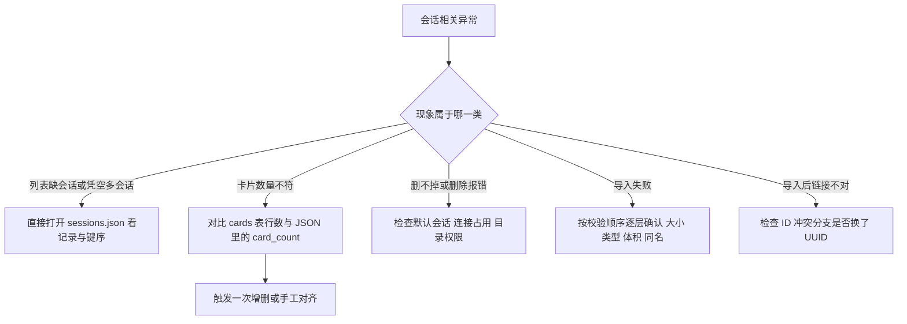
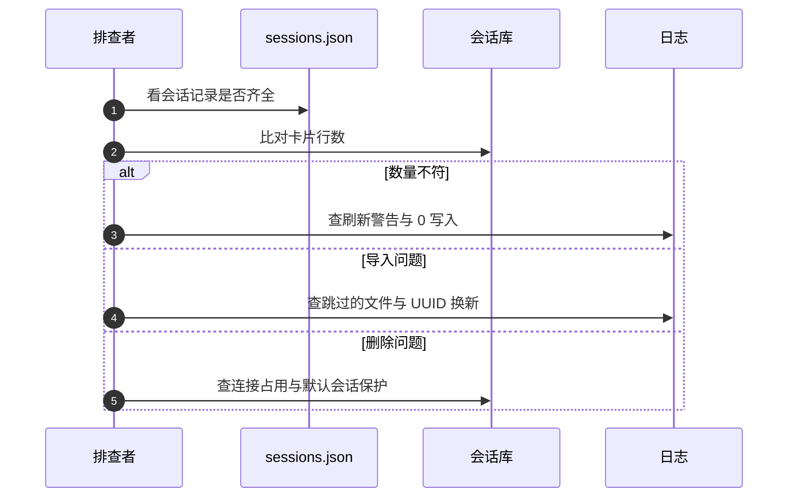

# 会话层的易错点与排查

会话相关的问题很少报错，多数是「显示不对」：列表多了一个空会话、卡片数量少一张、导入后链接指到别处、删掉的会话又出现。这类问题要回到 `sessions.json` 与 `session.db` 两份数据上对照，而不是从前端查起。

下面先列风险，再给一条从现象到文件的排查顺序。

## 1. 风险清单

| 风险 | 位置 | 现象 |
| --- | --- | --- |
| `sessions.json` 整文件读写，无并发保护 | `session_store.py` 读写方法 | 并发新建或改名时后写覆盖先写 |
| 解析失败返回空字典 | `_load_sessions` 的 `except` | 会话像凭空消失，且补建默认会话 |
| `card_count` 是副本 | `sessions.json` 字段 | 数量与实际卡片不符 |
| 读数量失败按 0 写入 | `_update_session_card_count` | 正确值被 0 覆盖 |
| 删除顺序依赖连接先关闭 | `delete_session` | Windows 下目录删不掉 |
| 默认会话用 403 拦 | `routes/sessions.py` 删除分支 | 403 被误认为权限问题 |
| 移动卡片参数走查询串 | `routes/sessions.py` 移动接口 | 卡片多时 URL 过长 |
| 导入同名会话直接失败 | `upload_session` | 返回通用 400 |
| 导入时换 UUID | 冲突处理分支 | 卡片链接指向旧卡片 |
| 导出不清理临时目录 | `download_session` 的 `finally` | 临时目录越积越多 |
| 导入前遍历全部会话取卡片 ID | `upload_session` | 会话多时导入变慢 |
| 导入卡片时间被重写 | 卡片构造处 | 创建时间都是导入时间 |

## 2. 排查顺序

先判断问题是「元数据」还是「卡片」，再决定打开哪个文件：



| 现象 | 首个检查点 | 判定依据 |
| --- | --- | --- |
| 会话列表异常 | `sessions.json` | 记录是否存在、键是否被覆盖 |
| 数量不符 | 两张数据源 | `COUNT(*)` 与字段值是否相等 |
| 删除失败 | 连接与目录 | 是否默认会话、目录是否被占用 |
| 导入失败 | 校验顺序 | 在哪一层返回 400 或 500 |
| 链接错误 | UUID 分支 | ID 是否被换新 |

## 3. 元数据文件的读写风险

`sessions.json` 的操作模式是「读全量、改一处、写全量」。两个请求同时新建会话时，各自读到同一份旧内容，后写的一方会丢掉先写的那条记录。文件里没有锁，也没有版本号。

| 场景 | 结果 |
| --- | --- |
| 顺序执行 | 两条都在 |
| 同时读后写 | 后写覆盖先写 |
| 写一半进程退出 | 文件可能截断，下次读返回空 |

写操作使用覆盖写而不是临时文件改名，因此写入过程被打断会留下不完整文件，下次读取解析失败并返回空字典。

## 4. 数量不一致的定位

定位方式是拿真源重算一遍与副本对比，示意如下：

```sql
-- 示意：按会话统计真实卡片数
SELECT session_id, COUNT(*) AS real_count FROM cards GROUP BY session_id;
```

把这条结果与列表页显示的数字逐条对照，差在哪里就说明那条刷新链路漏了一次。对账的关键是"用真源重算派生数据"，而不是反过来相信副本——副本出错时没有任何异常，只有对照才能发现。修复也顺手：以真源结果覆盖副本即可。

数量不一致时先取两个值：会话库 `cards` 表的行数与 `sessions.json` 里的 `card_count`。相等则问题不在数据层；不等时按操作类型判断。

| 差多少 | 可能原因 |
| --- | --- |
| 少固定的几行 | 外部工具直接改过表 |
| 多固定几行 | 卡片被绕过存储层写入 |
| 全为 0 | 刷新时读库失败或键不存在 |
| 与某个旧值相同 | 刷新路径根本没触发 |

修正方式有两种：触发一次卡片增删让刷新链路跑一遍，或直接改 `sessions.json`。前者顺带验证刷新链路是否正常。

## 5. 删除失败的三种原因

| 原因 | 判定 | 处理 |
| --- | --- | --- |
| 目标是默认会话 | 收到 403 | 默认会话不允许删除 |
| 目录被占用 | `rmtree` 抛异常 | 确认连接是否已关闭 |
| 记录不存在 | 收到 404 | 文件里已经没有该键 |

删除顺序保证了连接先关，但如果别的进程仍持有该会话库的文件句柄，占用依然存在。排查时看是否有另一个服务实例在运行。

## 6. 导入失败的定位

导入的返回码能直接指到校验层：400 对应扩展名、体积、ZIP 有效性或重名，500 对应解析与写入过程中的其他异常。同名会话冲突也返回 400，且文案统一为「创建会话失败」，与文件格式错误无法区分。

| 返回 | 可能原因 |
| --- | --- |
| 400 请上传 zip 文件 | 扩展名不符 |
| 400 上传文件不能超过 50MB | 压缩包过大 |
| 400 文件不是有效的 ZIP | 内容损坏 |
| 400 解压后大小超过限制 | 压缩炸弹防护 |
| 400 创建会话失败 | 会话重名 |
| 400 ZIP 文件已损坏 | 解压阶段损坏 |
| 500 导入失败 | 其他异常 |

跳过的卡片不会出现在返回值里，只有日志能确认跳过了几张。核对导入结果时用返回的卡片数与原包中的 Markdown 文件数比较。

## 7. 导出侧的残留

导出会创建临时目录并在最后返回文件，但没有删除临时目录。长期运行的服务上，这些目录会持续占用磁盘。排查磁盘增长时，检查系统临时目录下的导出产物，确认清理策略由外部负责。



## 8. 容易走错的方向

| 现象 | 容易先怀疑 | 实际应先查 |
| --- | --- | --- |
| 会话凭空消失 | 前端缓存 | `sessions.json` 是否解析失败 |
| 数量显示 0 | 卡片被删 | 刷新时读库是否失败 |
| 删除报 403 | 登录权限 | 是否在删默认会话 |
| 导入报 400 | 压缩包内容 | 是否与已有会话重名 |
| 链接指到旧卡片 | 前端路由 | 导入时 UUID 是否被换 |
| 磁盘持续增长 | 卡片库 | 导出临时目录 |

## 小结

核心概念：

| 概念 | 内容 |
| --- | --- |
| 主要风险 | JSON 全量覆写无并发保护，解析失败静默 |
| 数量问题 | 副本与真实值两处对照 |
| 删除问题 | 默认会话 403、占用、404 |
| 导入问题 | 校验层对应状态码，同名与格式错误同码 |
| 导出问题 | 临时目录不清理 |

设计权衡：

| 决策 | 选择 | 收益 | 代价 |
| --- | --- | --- | --- |
| 元数据格式 | 单个 JSON | 简单直接 | 并发与中断风险 |
| 容错 | 解析失败返回空 | 不阻断请求 | 故障被掩盖 |
| 错误文案 | 通用 | 不泄露细节 | 排查依赖日志 |
| 临时目录 | 导入清理、导出不清理 | 导出路径短 | 磁盘残留 |

## 练习

基础题：

1. 列出三条与 `sessions.json` 并发写有关的风险。
2. 数量不一致时先取哪两个值？
3. 删除返回 403 与 404 分别代表什么？
4. 导入返回 400 的常见原因有哪些？

挑战题：

5. 为 `sessions.json` 设计原子写方案（临时文件加改名），说明失败恢复方式。
6. 让导入的同名冲突与格式错误返回可区分的错误码，列出改动点。
7. 设计一份会话数据一致性检查脚本，覆盖元数据、卡片库、目录三者的对应关系。

---

### 附：本页引用的路径

| 路径 | 用途 |
| --- | --- |
| `backend/storage/session_store.py` | JSON 读写、数量刷新、删除流程 |
| `backend/storage/session_database.py` | 会话库构造与 `card_count` |
| `backend/routes/sessions.py` | 会话接口与状态码 |
| `backend/routes/session_io.py` | 导入校验与导出收尾 |
| `backend/storage/sqlite_card_store.py` | 卡片增删与数量刷新点 |
