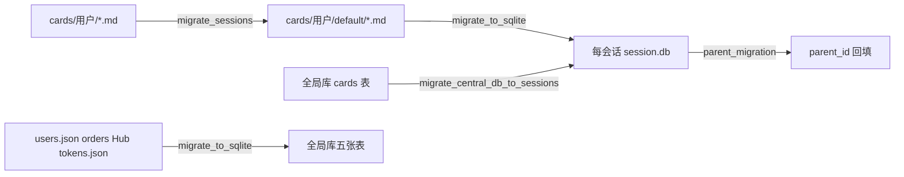
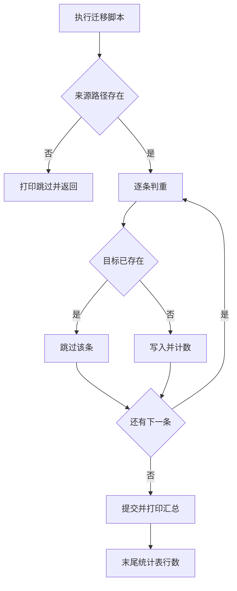

# 迁移脚本总览

数据层从文件迁到 SQLite 不是一步完成的：卡片先按会话分目录，再从卡片目录进每会话的数据库，用户与订单等数据另有一条进全局库的路径，树结构的父子关系还要单独回填。仓库把这几件事拆成四个脚本，放在 `backend/scripts` 与 `backend/storage` 下，可以按需分别执行。

四个脚本都遵守同一条约定：先判断来源是否存在、目标是否已有，能跳就跳。因此重复执行不会产生重复数据，这是判断一个脚本属于哪一批迁移时最直接的线索。

## 1. 四个工具的分工

| 工具 | 位置 | 从 | 到 |
| --- | --- | --- | --- |
| 会话目录整理 | `backend/scripts/migrate_sessions.py` | `cards/{用户}/*.md` | `cards/{用户}/default/*.md` |
| 中心库拆分 | `backend/scripts/migrate_central_db_to_sessions.py` | 全局库的 `cards` 表 | 每会话 `session.db` |
| 文件进全局库 | `backend/scripts/migrate_to_sqlite.py` | users.json、orders、Hub、tokens.json、卡片 | 全局库与每会话库 |
| 父子关系回填 | `backend/storage/parent_migration.py` | 卡片已有的 links 与 backlinks | `cards.parent_id` |

前两个是历史阶段的产物：早期卡片直接放在用户目录下，后来变成每会话一个目录，再后来进数据库。第三个是当前的主力迁移脚本，覆盖的数据类型最多。



## 2. 共同的幂等写法

迁移脚本都以"可重入"为前提，示意如下：

```python
# 示意：可重入的写入
for item in iter_source():
    if already_migrated(item.id):     # 已处理就跳过，不报错
        skipped += 1
        continue
    insert(item)
print(f"migrated={inserted} skipped={skipped} failed={failed}")
```

"可重入"指脚本被中断后可以重跑，而不会重复写入或破坏已有数据；这也是它敢在真实数据上运行的前提。实现手段通常是"每条记录先判存在、再决定写"，配一份迁移完成的标记。代价是每次跑都要多做一次存在性查询，换来的是失败后可以直接重跑，不必手工回退。

四个脚本的幂等判断都在「写入前查一次」这一步：

| 脚本 | 判重条件 | 命中后 |
| --- | --- | --- |
| `migrate_users` | `users` 表有同名用户 | 跳过并打印 |
| `migrate_sessions_and_cards` | 目录下已有 `session.db`，或卡片 ID 已存在 | 跳过该会话或该卡片 |
| `migrate_orders` | `order_id` 已存在 | 跳过该订单 |
| `migrate_hub` | `(creator, name)` 已存在 | 跳过该会话 |
| `migrate_share_tokens` | `token` 已存在 | 跳过 |
| `migrate_central_db_to_sessions` | 目标库已有同 ID 卡片 | 跳过该卡片 |
| `parent_migration` | 卡片已有 `parent_id` | 跳过该卡片 |

判重放在写入侧而不是「先清空再导入」，意味着脚本不会覆盖已经被人改过的数据。代价是修正过的旧数据不会被重新导入，改数据要手工处理。

## 3. 数据来源的判断顺序

每个脚本先确认来源路径存在，不存在就打印一行说明并返回：

```python
cards_dir = PROJECT_ROOT / "cards"
if not cards_dir.exists():
    log("cards/ 目录不存在，跳过")
    return
```

这段是 `migrate_to_sqlite.py` 里会话与卡片迁移的开头，其余脚本形态一致。它让脚本可以在任意机器上跑完而不报错：没有旧数据的机器只会输出一串「跳过」。

| 来源 | 路径 |
| --- | --- |
| 用户 | `data/users.json` |
| 订单 | `data/orders/*.json` |
| 论坛 | `Hub/{创建者}/{会话}/manifest.json` |
| 分享令牌 | `backend/share/tokens.json` |
| 卡片 | `cards/{用户}/{会话}/*.md` |

## 4. 输出与核对

四个脚本都以打印为主，没有返回值供程序判断。`migrate_to_sqlite.py` 在最后统计四张表的行数（`users`、`orders`、`hub_sessions`、`share_tokens`），卡片数量则在迁移过程中按会话累加。

`migrate_central_db_to_sessions.py` 的核对更完整，分成三个阶段：迁移、同步 `sessions.json` 的卡片数量、逐会话统计数据库里的卡片总数。`parent_migration.py` 不打印表，只记日志，支持 `dry_run` 只统计不写入。

| 脚本 | 有无 dry-run | 末尾核对 |
| --- | --- | --- |
| `migrate_sessions.py` | 无 | 打印移动数量 |
| `migrate_central_db_to_sessions.py` | 无 | 三阶段，含逐库统计 |
| `migrate_to_sqlite.py` | 无 | 四张全局表行数 |
| `parent_migration.py` | 有 | 日志记录更新数量 |

## 5. 执行顺序上的约束

按数据流向，合理的顺序是先整理目录，再进会话库，最后回填父子关系；全局库那一部分与卡片无关，可以独立跑。跨步骤的重复执行是安全的，但顺序颠倒会出问题：卡片还没进库时执行父子回填，脚本读到的会话库是空的，结果为「无更新」而不是报错。

| 顺序 | 执行 | 原因 |
| --- | --- | --- |
| 1 | `migrate_sessions.py` | 先把散落的 Markdown 归到会话目录 |
| 2 | `migrate_to_sqlite.py` 或 `migrate_central_db_to_sessions.py` | 把卡片送入会话库 |
| 3 | `parent_migration.py` | 卡片已在库里才能回填 |
| 任意 | `migrate_to_sqlite.py` 的全局库部分 | 与卡片无关 |

## 6. 谁来触发

四个脚本都可以直接运行（`__main__` 入口），没有接进启动流程。`migrate_to_sqlite.py` 的 `main` 会在开始时强制重建全局单例：

```python
db_path = os.path.join(os.getcwd(), "data", "knowledgediver.db")
if DatabaseManager._instance is not None:
    DatabaseManager._instance.close()
db = DatabaseManager(db_path)
```

先关闭已有单例再以显式路径新建，确保拿到的是最新表结构。代价是同一个进程里若有其他代码持有旧连接，会在脚本结束后继续操作已关闭的连接，因此这类脚本适合单独进程运行。



## 7. 易错点

| 易错点 | 现象 | 位置 |
| --- | --- | --- |
| 认为脚本会覆盖旧数据 | 判重命中即跳过 | 各 `migrate_*` 函数 |
| 在服务进程里跑迁移 | 单例被关闭，旧连接失效 | `migrate_to_sqlite.py` `main` |
| 顺序颠倒后期待报错 | 只输出零更新 | `parent_migration.py` |
| 把打印当成程序可判断的结果 | 无返回值，只看输出 | 四个脚本 |
| 缺 dry-run 时直接跑 | 改动立即落盘 | 仅父子回填支持 `dry_run` |

## 小结

核心概念：

| 概念 | 内容 |
| --- | --- |
| 四个工具 | 目录整理、中心库拆分、文件进全局库、父子回填 |
| 幂等 | 写入前判重，命中即跳过 |
| 来源判断 | 路径不存在就跳过，不报错 |
| 输出 | 以打印为主，无返回值 |
| 触发 | 手工执行，独立进程 |

设计权衡：

| 决策 | 选择 | 收益 | 代价 |
| --- | --- | --- | --- |
| 判重位置 | 写入前查询 | 不覆盖人工修正 | 旧数据不会被重新导入 |
| 入口形态 | 独立脚本 | 与启动流程解耦 | 需要人工记得执行 |
| 结果反馈 | 打印 | 实现简单 | 无法被其他程序消费 |
| 回填安全 | 只有回填支持 `dry_run` | 改关系前可预演 | 迁移脚本本身无预演 |

## 练习

基础题：

1. 四个迁移工具各自负责什么范围？
2. 四个脚本共同的幂等做法是什么？
3. 来源路径不存在时脚本会怎样？
4. 哪个脚本支持 `dry_run`？

挑战题：

5. 为 `migrate_to_sqlite.py` 增加 `dry_run`，说明需要改动的判重与写入分支。
6. 把四个脚本串成一个带顺序与校验的命令，说明每步的失败处理。
7. 设计迁移结果的可机读输出（例如 JSON 汇总），说明要包含哪些计数与错误信息。

---

### 附：本页引用的路径

| 路径 | 用途 |
| --- | --- |
| `backend/scripts/migrate_sessions.py` | 卡片目录整理与无主卡片处理 |
| `backend/scripts/migrate_central_db_to_sessions.py` | 中心库拆到每会话库、计数同步与核对 |
| `backend/scripts/migrate_to_sqlite.py` | 文件系统到全局库与会话库的五段迁移加末尾核对 |
| `backend/storage/parent_migration.py` | `parent_id` 推断与回填 |
| `backend/storage/database.py` | 迁移脚本使用的全局单例 |
