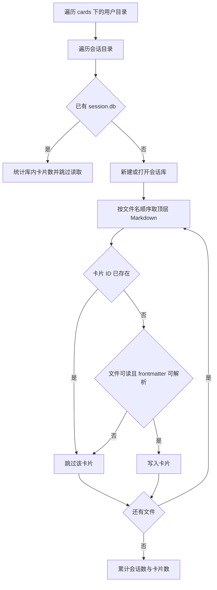
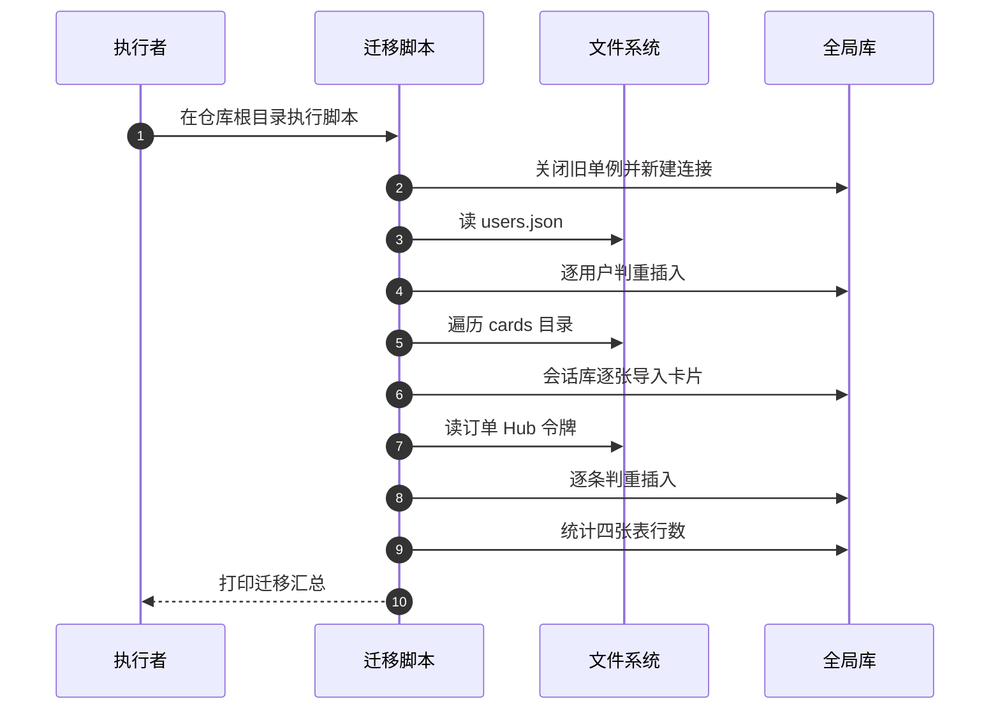

# 文件到 SQLite 迁移

老部署升级时，数据以文件形态存在：用户在一个 JSON 字典里，订单在按用户分文件的目录里，论坛每个会话一个 `manifest.json`，分享令牌一个文件，卡片是散在会话目录里的 Markdown。数据库建好了但里面是空的，`migrate_to_sqlite.py` 就是把这些文件一次性倒进去的脚本。

它的模块注释列出了五组来源与目标，并声明可重复执行。脚本不依赖应用进程，直接打开数据库写入，末尾打印四张表的行数供人工核对。

## 1. 执行结构与单例处理

迁移脚本要显式重置进程内的单例，示意如下：

```python
# 示意：迁移脚本的骨架
def main():
    DatabaseManager.reset_instance()       # 丢弃可能已按旧路径初始化的单例
    db = DatabaseManager.instance()        # 用当前配置重新建
    migrate_users(db)
    migrate_orders(db)
    verify(db)                             # 末尾核对
```

"单例"指全进程只有一个实例的对象；它在正常服务里省掉了重复初始化，但在脚本里会带来麻烦——如果同一进程先按默认路径建过实例，迁移时拿到的就是那个旧对象，写到的库可能不是目标库。所以脚本开头要显式重置，让它按本次的配置重建。这是单例模式的常见代价：生命周期由调用方接管。

`main` 先确定数据库路径并把全局单例重建一次，然后按编号依次执行五个迁移段，最后统计行数。编号从 1 到 5 却写成 `[x/6]`：脚本里实际是五段迁移加一段核对，分母是历史上六段结构的残留。

数据库路径用当前工作目录拼出（`os.getcwd()` 加 `data/knowledgediver.db`），因此必须在仓库根目录执行，否则会新建一个空库并「迁移成功」。

| 段 | 内容 | 来源 |
| --- | --- | --- |
| `[1/6]` | 用户 | `data/users.json` |
| `[2/6]` | 会话与卡片 | `cards/{用户}/{会话}/*.md` |
| `[3/6]` | 订单 | `data/orders/*.json` |
| `[4/6]` | 论坛 | `Hub/{创建者}/{会话}/manifest.json` |
| `[5/6]` | 分享令牌 | `backend/share/tokens.json` |
| 核对 | 四张表行数 | 无 |

## 2. 用户迁移

用户来自一个以用户名为键的字典（`migrate_users`）。逐条查 `users` 表判断是否已存在，已存在打印跳过。插入时对缺字段给默认值：会员等级 `free`、积分 48、创建时间取当前时间。

| 字段 | 缺省值 |
| --- | --- |
| `hashed_password` | 空字符串 |
| `membership` | `free` |
| `points` | 48 |
| `created_at` | 当前时间 |

时间字段统一经过 `fmt` 转换，把 `datetime` 对象转成字符串后写入。积分默认值与配置、模型里的默认值重复，三处一致但需要一起改。

## 3. 卡片与会话迁移

卡片迁移的目标是每个会话自己的 `session.db`，全局库不接收卡片（`migrate_sessions_and_cards`）。它遍历 `cards` 下的用户目录与会话目录，对每个会话做两件事之一：

| 情况 | 处理 |
| --- | --- |
| 目录里已有 `session.db` | 只统计库里的卡片数，不读 Markdown |
| 目录里没有 `session.db` | 新建库并逐张导入 Markdown |

逐张导入时先查卡片 ID 是否已存在，已存在就跳过；读文件失败与 frontmatter 解析失败都只打印一行「跳过」，不中断整个会话。脚本只匹配会话目录顶层的 `*.md`，不递归子目录。



## 4. 自带的前端解析工具

脚本没有引入 frontmatter 库，自己实现了三个函数（`migrate_to_sqlite.py` 开头）：

| 函数 | 作用 |
| --- | --- |
| `parse_frontmatter_raw` | 以三横线切出元数据原文与正文，逐行按冒号分键值 |
| `parse_yaml_value` | 把字符串值转成列表、字典、数字或布尔 |
| `parse_frontmatter_proper` | 组合前两者，产出可直接写入数据库的类型 |

第一层解析是纯文本切分，遇到嵌套结构或跨行值会退化；第二层负责把 `[]`、空串、数字等常见形态还原成 Python 类型。卡片字段的类型兜底也在这一层：标题取不到用文件名，创建时间取不到用当前时间。

## 5. 订单迁移

订单目录下每个用户一个 JSON 文件，文件内容是一个订单数组（`migrate_orders`）。脚本按文件名排序遍历，逐个订单查 `order_id` 是否已存在。插入覆盖订单表的 15 个字段，缺省状态是 `pending`，金额缺省为字符串 `"0"`。

时间字段与用户迁移一样用当前时间兜底，回调原文与错误信息原样搬运，不做解析。

## 6. 论坛与分享令牌

论坛数据的来源是 `Hub/{创建者}/{会话}/` 目录下的 `manifest.json`（`migrate_hub`）。判重键是 `(creator, name)` 组合，与表的复合主键一致。清单里的列表与结构字段在写入前用 JSON 序列化成文本，评论序列化时允许把非字符串对象转成字符串。

分享令牌来自 `backend/share/tokens.json`（`migrate_share_tokens`），以令牌字符串为键，写入令牌、用户名、会话 ID 与创建时间四列，判重按令牌。

| 类型 | 判重键 | 默认值 |
| --- | --- | --- |
| 论坛 | `creator` 加 `name` | 描述空、计数 0、列表空 |
| 分享令牌 | `token` | 创建时间当前时间 |

## 7. 末尾核对

脚本最后对四张全局表执行 `COUNT(*)` 并打印：用户、订单、论坛会话、分享令牌。卡片数量不在其中，因为卡片分布在多个会话库里，数量在第二段迁移过程中按会话累加后打印。

| 表 | 是否在核对中 |
| --- | --- |
| `users` | 是 |
| `orders` | 是 |
| `hub_sessions` | 是 |
| `share_tokens` | 是 |
| `domain_quality` | 否 |

核对只是打印，不比较迁移前后的数量，因此「来源有多少条、导入多少条」需要人工从输出里对齐。



## 8. 易错点

| 易错点 | 现象 | 位置 |
| --- | --- | --- |
| 从非仓库根目录执行 | 迁移到新建空库 | `main` 的路径拼接 |
| 认为卡片进全局库 | 卡片进每会话库 | `migrate_sessions_and_cards` |
| 把序号当成步骤数 | 只有五段迁移 | `main` 编号 |
| 期待覆盖旧记录 | 判重命中即跳过 | 各迁移段 |
| 以为会递归找卡片 | 只匹配顶层 `*.md` | 同上 |
| 把核对当成一致性校验 | 只打印行数 | `main` 末尾 |

## 小结

核心概念：

| 概念 | 内容 |
| --- | --- |
| 入口 | 在仓库根目录运行，直接写数据库 |
| 五段迁移 | 用户、卡片、订单、论坛、分享令牌 |
| 卡片目标 | 每会话 `session.db`，不是全局库 |
| 判重 | 写入前查一次，命中即跳过 |
| 解析 | 自带三个 frontmatter 解析函数 |
| 核对 | 末尾打印四张全局表行数 |

设计权衡：

| 决策 | 选择 | 收益 | 代价 |
| --- | --- | --- | --- |
| 依赖 | 不引 frontmatter 库 | 环境无需新装包 | 解析只覆盖常见形态 |
| 路径 | 用当前工作目录 | 代码简单 | 执行目录错就写错库 |
| 结果 | 只打印 | 实现简单 | 无机器可判断的结论 |
| 卡片处理 | 已有库时只统计 | 避免重复导入 | 库里缺的卡片不会被补 |

## 练习

基础题：

1. 脚本的五段迁移分别处理哪类数据？
2. 卡片的导入目标是什么？
3. 用户与订单迁移各用什么判重？
4. 末尾核对统计了哪四张表？

挑战题：

5. 把 `[x/6]` 编号与步骤数对齐，并说明是否应该补回缺失的那一段。
6. 为卡片迁移增加「缺卡片补齐」模式，说明与现有只统计分支的关系。
7. 增加迁移前后数量对比报告，说明需要从来源侧统计哪些值。

---

### 附：本页引用的路径

| 路径 | 用途 |
| --- | --- |
| `backend/scripts/migrate_to_sqlite.py` | 五段迁移、frontmatter 解析函数、单例重建与末尾核对 |
| `backend/storage/database.py` | 迁移写入的全局库与单例 |
| `backend/storage/session_database.py` | 卡片迁移使用的会话库管理器 |
