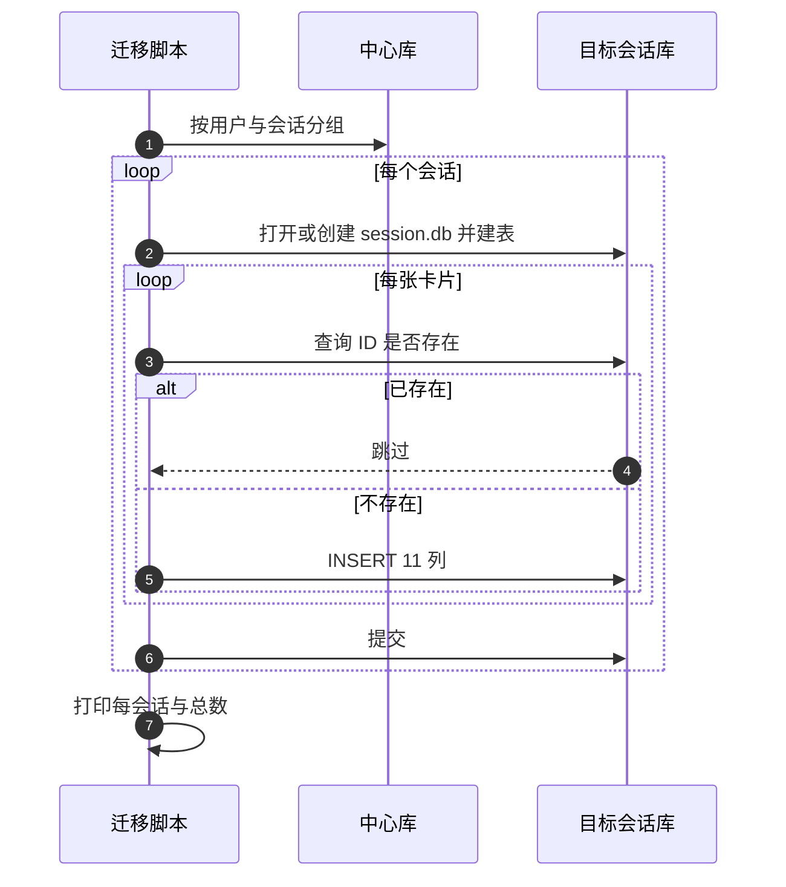
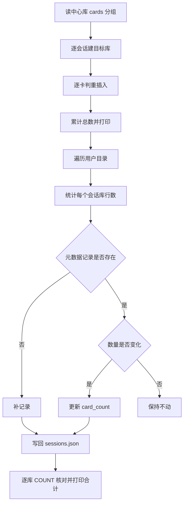

# 中心库到会话库迁移

卡片曾经和用户表住在一起：全局库有一张 `cards` 表，每行用 `username` 与 `session_id` 两列标明归属。后来会话各自独立成库，卡片搬进 `cards/{用户名}/{会话}/session.db`。这次搬迁把一张表的行搬到很多张小表里，不重新解析 Markdown，脚本是 `migrate_central_db_to_sessions.py`。

它做三件事：搬卡片、把数量写回会话元数据、逐库统计核对。三段都直接操作 SQLite 文件，不经过应用的存储类。

## 1. 执行入口与三段结构

`main` 打印三段横幅并依次调用三个函数：

| 顺序 | 函数 | 作用 |
| --- | --- | --- |
| 1 | `migrate` | 中心表拆到每会话库 |
| 2 | `sync_session_counts` | 更新 `sessions.json` 的卡片数量 |
| 3 | `verify` | 逐库统计并打印总数 |

三段之间没有失败即停的逻辑：搬卡片阶段跳过某个会话，后面的同步与核对仍会继续。

## 2. 来源与分组读取

来源固定在 `data/knowledgediver.db`，用项目根目录拼绝对路径；文件不存在就打印「跳过」并返回。读取分两步：先按 `(username, session_id)` 分组拿到所有会话键，再对每个键取出该会话的全部卡片行。

```python
rows = central_conn.execute(
    "SELECT username, session_id FROM cards GROUP BY username, session_id"
).fetchall()
cards = central_conn.execute(
    "SELECT * FROM cards WHERE username = ? AND session_id = ?",
    (username, session_id),
).fetchall()
```

分组查询依赖中心表里有这两列。若中心库的表结构已经变过（例如列被删除），脚本会在取行时报错，而不是给出可读的提示。

| 项 | 值 |
| --- | --- |
| 来源库 | `data/knowledgediver.db` |
| 分组键 | `username` 与 `session_id` |
| 目标目录 | `cards/{用户名}/{会话}/` |

## 3. 每会话建表

目标库用标准库的 `sqlite3` 直接打开，先设 WAL，再执行自己的建表语句（`CREATE TABLE IF NOT EXISTS cards`）。表结构与应用的会话库基本一致，共 11 列。

与 `SessionDatabaseManager` 建库的差别在这里：

| 项 | 本脚本 | 应用侧管理器 |
| --- | --- | --- |
| 表 | 只有 `cards` | `cards`、`raw_pages`、`card_vec_map` 加可选向量表 |
| `parent_id` | 没有该列 | 补列机制会加上 |
| WAL | 有 | 有 |
| 权限提示 | 无 | 构造失败时给出目录归属提示 |

迁移出的库缺少的两张表与一列会在应用下次打开该会话时补齐，因此顺序上先跑迁移、再让应用访问是可行的。

## 4. 逐张判重写入

每张卡片先查目标库是否已有同 ID 行，有就跳过。写入使用 11 列显式列表，把中心表里对应列一一搬过去，不做字段改名。脚本同时累加本会话与全局的迁移数，并把每会话结果打印成一行。



## 5. 计数同步

搬完之后会话元数据里的数量可能还是旧值，第二段负责对齐（`sync_session_counts`）。它遍历 `cards` 下的用户目录，读该用户的 `sessions.json`，再遍历每个含 `session.db` 的会话目录并统计行数：

| 情况 | 处理 |
| --- | --- |
| 会话目录不在 `sessions.json` 里 | 补一条记录，写入 ID 与数量 |
| 已存在但数量不同 | 更新 `card_count` |
| 已存在且数量相同 | 不动 |

只有发生改动才写回文件。统计失败的会话直接跳过，不阻断其余会话。

## 6. 逐库核对

第三段 `verify` 重新遍历所有会话库，逐个执行 `COUNT(*)` 并打印相对路径与数量，最后给出合计。它不比对同步阶段写入的值，因此若 `sessions.json` 更新失败，核对结果仍然正常，问题要靠单独查看元数据才能发现。

| 阶段 | 数据来源 | 输出 |
| --- | --- | --- |
| 迁移 | 中心库 | 每会话迁移数与总数 |
| 同步 | 会话库与元数据 | 新增与变化的会话 |
| 核对 | 会话库 | 每库数量与合计 |

## 7. 与文件迁移脚本的分工

两个脚本都能把卡片送进会话库，但来源不同：

| 脚本 | 来源 | 适用场景 |
| --- | --- | --- |
| `migrate_central_db_to_sessions.py` | 全局库 `cards` 表 | 卡片曾被中心表管理过 |
| `migrate_to_sqlite.py` | 会话目录下的 Markdown | 卡片一直在文件里 |

先跑哪个取决于历史：如果卡片早已进过中心表，用本脚本；如果只有 Markdown，用文件迁移脚本。两者都判重，先后执行不会造成重复数据，但本脚本不会读取 Markdown，所以文件脚本先跑也不会被本脚本覆盖。



## 8. 易错点

| 易错点 | 现象 | 位置 |
| --- | --- | --- |
| 认为脚本会解析 Markdown | 只读中心表 | `migrate` |
| 期待目标库包含全部表 | 只建 `cards` | 建表语句 |
| 中心库结构已变 | 取行报错 | 分组查询 |
| 同步失败后核对仍正常 | 核对不比对元数据 | `verify` |
| 在别处执行脚本 | 找不到中心库并跳过 | 来源路径 |
| 指望有回滚 | 逐会话提交，无整体事务 | `migrate` |

## 小结

核心概念：

| 概念 | 内容 |
| --- | --- |
| 来源 | 全局库 `cards` 表 |
| 目标 | `cards/{用户}/{会话}/session.db` |
| 建表 | 脚本自带 11 列 `cards` 表语句 |
| 判重 | 目标库已有同 ID 即跳过 |
| 同步 | 核对会话库行数并写入 `sessions.json` |
| 核对 | 逐库 `COUNT(*)` 打印合计 |

设计权衡：

| 决策 | 选择 | 收益 | 代价 |
| --- | --- | --- | --- |
| 数据库访问 | 直接用 `sqlite3` | 不依赖应用单例 | 缺少权限提示与表补齐 |
| 表结构 | 只建 `cards` | 迁移路径最短 | 目标库暂时不完整 |
| 提交粒度 | 每会话提交 | 单会话失败不影响其他 | 无整体回滚 |
| 核对方式 | 只打印 | 简单 | 不校验元数据一致性 |

## 练习

基础题：

1. 脚本的三个阶段分别做什么？
2. 目标库建了哪张表？缺少什么？
3. 判重条件是什么？
4. 计数同步在什么情况下写回文件？

挑战题：

5. 让目标库改用应用侧管理器建库，说明能补齐哪些表与需要处理的差异。
6. 增加元数据一致性校验，说明如何比对 `sessions.json` 与实际行数。
7. 给出整体事务或失败回滚方案，比较逐会话提交与一次性提交的取舍。

---

### 附：本页引用的路径

| 路径 | 用途 |
| --- | --- |
| `backend/scripts/migrate_central_db_to_sessions.py` | 分组读取、建表、判重写入、计数同步与核对 |
| `backend/storage/session_database.py` | 应用侧会话库的表结构与补列 |
| `backend/storage/session_store.py` | `sessions.json` 与卡片数量字段 |
| `backend/scripts/migrate_to_sqlite.py` | 另一条从 Markdown 进会话库的路径 |
