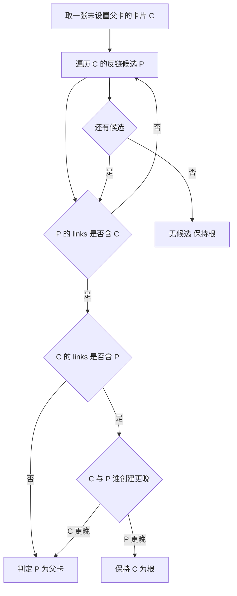
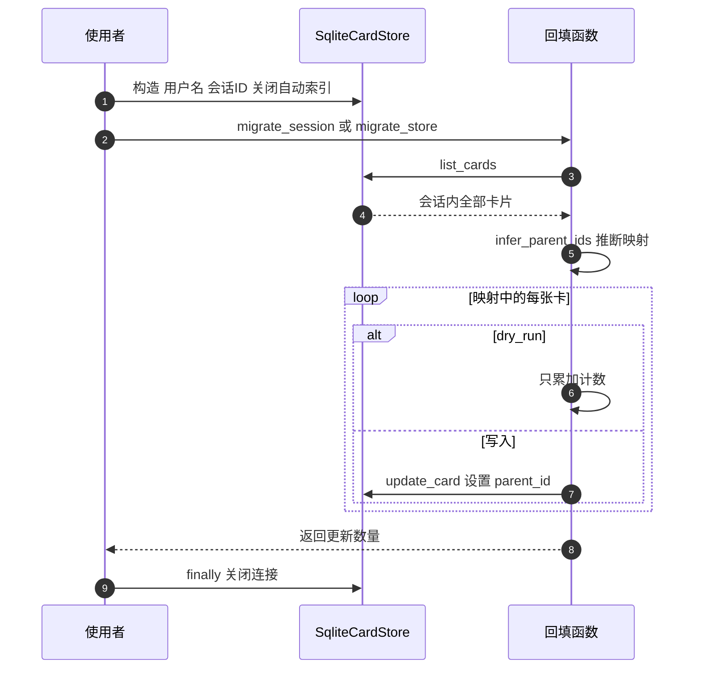

# 卡片目录整理与父子回填

卡片相关还有两件与数据库无关的历史欠账。第一件是目录布局：最早卡片直接放在 `cards/{用户名}/` 下，后来变成每会话一个子目录，旧文件需要挪进 `default/`。第二件是树结构：旧版本靠链接方向和时间先后猜父子关系，猜法写在运行期代码里，结果不稳定，需要把猜出来的结果固化到 `parent_id` 列。

两件事分别由 `backend/scripts/migrate_sessions.py` 与 `backend/storage/parent_migration.py` 完成，一个移动文件，一个更新行。

## 1. 目录布局的前后对比

整理脚本的目标写在模块注释里：把 `cards/{用户名}/*.md` 移到 `cards/{用户名}/default/*.md`，同时把 `cards/*.md` 下的无主卡片移到 `cards/unknown/default/*.md`。

```text
整理前                          整理后
cards/                          cards/
├── alice/                      ├── alice/
│   ├── a.md                    │   ├── default/
│   └── b.md                    │   │   ├── a.md
├── bob/                        │   │   └── b.md
│   └── c.md                    │   └── sessions.json
└── stray.md                    ├── bob/default/c.md
                                ├── unknown/default/stray.md
                                └── ...
```

布局统一后，每个用户目录下的子目录都对应一个会话，应用侧按会话 ID 找卡片目录的规则才成立。

## 2. 整理脚本的三个分支

`migrate_user_cards` 对一个用户目录做判断（`migrate_sessions.py`）：

| 情况 | 处理 |
| --- | --- |
| 用户目录不存在 | 打印跳过 |
| 目录下没有 Markdown | 打印提示并返回 0 |
| 目标文件已存在 | 打印警告并跳过该文件 |
| 正常文件 | 移动到 `default/` 并计数 |

目标冲突不覆盖，因此同名文件会留在原处，需要人工比对。移动使用文件系统的改名操作，同一分区内是原子的；跨分区执行会退化成复制加删除。

## 3. 无主卡片的兜底

`cards` 根目录下的 Markdown 不属于任何用户，脚本把它们统一收进 `cards/unknown/default/`，并明确提示这些卡片没有归属，需要人工指派。这样做的好处是整理后根目录不再混有卡片文件，代价是 `unknown` 这个用户名会出现在用户目录列表里。

| 项 | 值 |
| --- | --- |
| 来源 | `cards/*.md` |
| 去向 | `cards/unknown/default/` |
| 后续动作 | 人工指派归属 |

主入口 `main` 先检查 `cards` 是否存在，不存在直接报错退出；存在则列出全部用户目录逐个整理，最后处理无主卡片并打印汇总。

## 4. 树结构为什么需要固化

旧版树方向由「链接有向边加创建时间启发式」推断，模块注释指出它无法区分两种情形：后建的父卡挂载先建的子卡（Agent 重新定根），以及旧版关键词合并留下的反向污染边。两者在数据上都是双向链接，单看边分不出来。

把推断结果写进 `parent_id` 之后，渲染树时直接读列，不再每次重跑启发式，也不会因为数据顺序变化而改变结果。

## 5. 四条推断规则

推断规则按可解释性排序，逐条尝试，示意如下：

```python
# 示意：父子的推断顺序（先做最可信的，都不成立才兜底）
parent = (explicit_parent(card)          # 1 显式字段
          or link_target(card)           # 2 链接指向
          or same_session_root(card)     # 3 同会话的根卡片
          or default_root(card))         # 4 兜底
```

历史数据缺少明确的父子字段时，只能从其它痕迹反推；把规则按可信度排序，是为了让"高可信规则先命中"而不是被兜底规则抢先。跑这类回填前应当支持试运行（dry-run）：只统计每条规则命中多少条、不落盘，确认分布符合预期后再真正写入——否则错误的推断被写进库，回滚成本远高于重跑一次。

`infer_parent_ids` 对每张还没有父卡的卡片 C，遍历它的反链候选 P，按顺序套用规则：

| 规则 | 条件 | 结果 |
| --- | --- | --- |
| 边存在性 | `C.id` 在 `P.links` 中 | P 是候选 |
| 非互指 | C 的 links 里没有 P | links 方向权威，`C.parent_id = P` |
| 互指 | 双方都有边 | 创建更晚的当子卡，更早的保持根 |
| 无候选 | 没有满足条件的 P | 保持根，`parent_id` 为空 |

互指那条是妥协：双向边分不出真实方向，用创建时间兜底，并保留更早的卡为根，兼容历史上的污染数据。



## 6. 幂等与试运行

回填对「已有 `parent_id` 的卡片」直接跳过，因此第二次运行没有副作用。`migrate_store` 提供 `dry_run` 参数：只统计会被设置的卡片数量，不写库；写入路径会对每张卡调用存储的更新方法并累加计数，最后记一条日志。

| 模式 | 行为 | 输出 |
| --- | --- | --- |
| `dry_run=True` | 只计数 | 日志里的更新数量 |
| `dry_run=False` | 写 `parent_id` 并更新 | 日志与库内变化 |

目录整理脚本没有对应的试运行开关，执行即移动文件。

## 7. 会话级入口

`migrate_session` 是回填的便捷入口：按用户名与会话 ID 构造 `SqliteCardStore`，调用 `migrate_store`，最后在 `finally` 里关闭连接。构造时显式传 `auto_index=False`，注释说明是为了避免向量自动索引与关闭连接产生竞态——回填只改 `parent_id`，不需要重建向量。



## 8. 易错点

| 易错点 | 现象 | 位置 |
| --- | --- | --- |
| 认为同名文件会被覆盖 | 冲突即跳过留在原处 | `migrate_user_cards` |
| 忽略无主卡片 | 被收进 `unknown` | `migrate_orphaned_cards` |
| 期望互指也能判出方向 | 用创建时间兜底 | 规则部分 |
| 重复回填导致覆盖 | 已有 `parent_id` 会跳过 | `infer_parent_ids` |
| 目录整理前没备份 | 移动不可撤销 | `migrate_sessions.py` |
| 回填时开着自动索引 | 可能与关闭竞态 | 会话级入口注释 |

## 小结

核心概念：

| 概念 | 内容 |
| --- | --- |
| 目录整理 | 用户卡片进 `default/`，无主卡片进 `unknown/default/` |
| 冲突处理 | 目标存在即跳过，不覆盖 |
| 回填目标 | 把启发式推断固化到 `parent_id` |
| 推断规则 | 边存在、非互指取 links 方向、互指取创建时间、无候选保持根 |
| 幂等 | 已有 `parent_id` 跳过 |
| 试运行 | 只有回填支持 `dry_run` |

设计权衡：

| 决策 | 选择 | 收益 | 代价 |
| --- | --- | --- | --- |
| 冲突处理 | 跳过不覆盖 | 不丢数据 | 需要人工清理 |
| 无主卡片 | 集中到 `unknown` | 根目录干净 | 多出特殊用户名 |
| 方向推断 | 互指用时间兜底 | 兼容旧数据 | 可能判错 |
| 结果存储 | 写 `parent_id` | 运行期不再猜 | 需要一次迁移 |

## 练习

基础题：

1. 整理脚本把卡片从哪移到哪？无主卡片去哪里？
2. 目标文件已存在时脚本怎么做？
3. 回填的四条规则分别是什么？
4. 回填的幂等条件是什么？

挑战题：

5. 为目录整理脚本增加试运行与冲突报告，说明输出内容。
6. 设计一份互指边的复核清单，说明如何在人工确认后修正 `parent_id`。
7. 评估把 `unknown` 用户改成显式归属字段的影响面。

---

### 附：本页引用的路径

| 路径 | 用途 |
| --- | --- |
| `backend/scripts/migrate_sessions.py` | 卡片目录整理、无主卡片处理与主入口 |
| `backend/storage/parent_migration.py` | 推断规则、`migrate_store` 与 `migrate_session` |
| `backend/storage/sqlite_card_store.py` | 回填使用的卡片存储与 `auto_index` 参数 |
| `backend/models/card.py` | `parent_id` 字段 |
