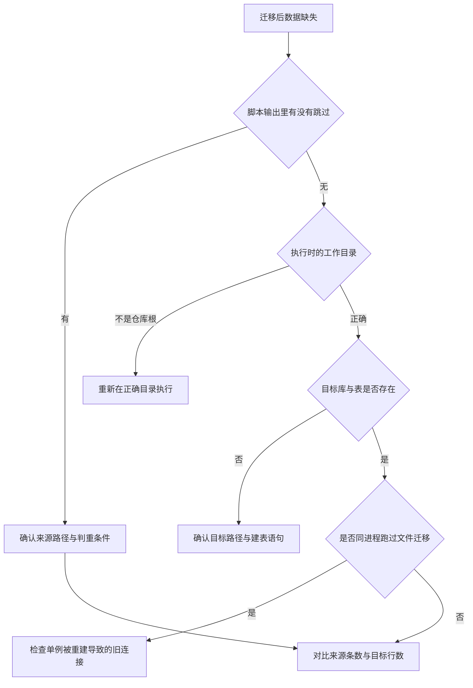
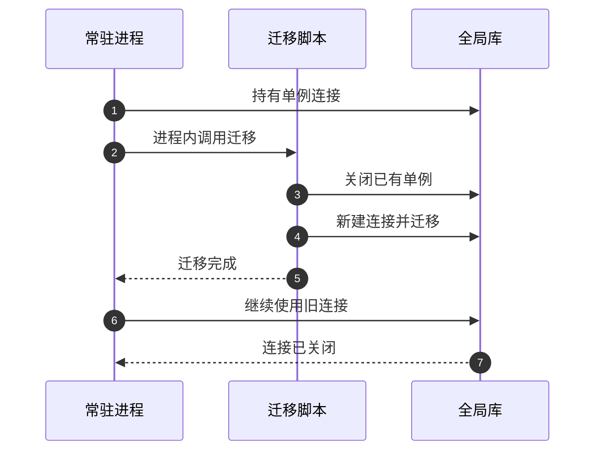

# 迁移脚本的易错点与排查

迁移脚本的问题不会在运行时暴露：跑完一段，没有报错，数量也打印了，第二天用户却发现卡片少了几张。原因通常是它按设计「跳过」了某些东西，或者执行时所在目录与来源路径不匹配。

排查迁移问题要从「来源是否存在、目标是否已有、脚本在哪里执行」三处入手，而不是从应用日志里找。

## 1. 风险清单

| 风险 | 位置 | 现象 |
| --- | --- | --- |
| 执行目录不是仓库根 | `migrate_to_sqlite.py` 的路径拼接 | 迁移进新建的空库 |
| 来源路径不存在就跳过 | 各迁移函数开头 | 输出全是「跳过」，数据没动 |
| 除回填外没有预演 | 三个 `migrate_*` 脚本 | 执行即写盘 |
| 无整体事务 | 各脚本按段或按会话提交 | 中断后留下半份数据 |
| 中央库脚本只建 `cards` 表 | `migrate_central_db_to_sessions.py` 建表语句 | 目标库暂时缺表与列 |
| 计数同步与核对相互独立 | 同脚本第二、三段 | 同步失败但核对正常 |
| 迁移脚本强制重建全局单例 | `migrate_to_sqlite.py` `main` | 同进程旧连接失效 |
| 目录整理不更新计数 | `migrate_sessions.py` | 会话数量显示不对 |
| 无主卡片进入 `unknown` | 同脚本 | 出现特殊用户名 |
| 判重跳过不覆盖 | 所有脚本 | 来源侧修改不会同步 |
| frontmatter 简易解析 | `migrate_to_sqlite.py` 解析函数 | 复杂结构被降级 |
| 输出只有打印 | 四个工具 | 无法被自动化消费 |

## 2. 排查顺序

| 层级 | 检查点 | 判据 |
| --- | --- | --- |
| 执行环境 | 当前目录 | 是否是仓库根 |
| 来源 | 文件或表是否存在 | 输出中的跳过信息 |
| 判重 | 目标是否已有同键 | 跳过计数 |
| 目标结构 | 库与表是否存在 | 表清单 |
| 进程 | 是否与应用的连接混用 | 单例重建记录 |

## 3. 执行目录的影响

`migrate_to_sqlite.py` 用当前工作目录拼数据库路径，`migrate_central_db_to_sessions.py` 与 `migrate_sessions.py` 用项目根目录拼来源。同一个脚本在不同目录执行，结果不一样：

| 脚本 | 路径基准 | 执行目录错时的表现 |
| --- | --- | --- |
| `migrate_to_sqlite.py` | 当前工作目录 | 写入新建的空库 |
| `migrate_central_db_to_sessions.py` | 项目根目录 | 找不到来源并跳过 |
| `migrate_sessions.py` | 项目根目录 | 找不到 `cards` 并报错 |

第一种最危险：它不报错，还会打印一份看起来正常的汇总。

## 4. 幂等带来的增量缺失

判重的收益是不覆盖人工修正，代价是「来源更新不会同步到目标」。用户后来在 `users.json` 里改了密码或积分，再跑一次脚本不会更新数据库里的旧值。

| 操作 | 结果 |
| --- | --- |
| 首次迁移 | 全部写入 |
| 重复执行 | 全部跳过 |
| 来源后改、目标已存在 | 以目标为准 |
| 目标被外部删除、来源还在 | 会重新导入 |

排查「改了没生效」时先确认改的是来源还是目标：脚本只从来源流向目标，且只填补缺失的记录。

## 5. 事务粒度与中断

脚本按段或按会话提交，没有覆盖整次迁移的事务。中途中断会留下部分数据，但不会留下重复数据：重跑时判重会跳过已写入的部分。

| 脚本 | 提交粒度 | 中断后果 |
| --- | --- | --- |
| `migrate_to_sqlite.py` | 每类数据一次提交 | 已提交的类型保留 |
| `migrate_central_db_to_sessions.py` | 每会话一次 | 已完成的会话保留 |
| `migrate_sessions.py` | 逐文件移动 | 已移动的文件保留 |

因此中断后的处理方式是重新执行，而不是清理后再来。

## 6. 计数与核对的分离

中心库脚本的第二段更新 `sessions.json`，第三段只统计会话库行数。两者互不校验，所以「数量显示不对但核对通过」是可能的。排查时把两张数据直接取出来对照，而不要只看脚本末尾的总数。

| 数据 | 来源 | 是否被核对覆盖 |
| --- | --- | --- |
| 会话库行数 | `COUNT(*)` | 是 |
| `sessions.json` 的 `card_count` | 文件字段 | 否 |
| 目录整理结果 | 文件系统 | 否 |

## 7. 单例重建的副作用

`migrate_to_sqlite.py` 在开始时关闭已有的全局单例并新建连接。如果这个脚本被某个常驻进程导入而不是单独执行，进程里其他代码持有的旧连接会失效，之后的操作会报连接已关闭类错误。

排查时看两条线索：脚本是否在服务进程内被调用，以及错误是否集中在全局库相关操作上。

## 8. 容易走错的方向

| 现象 | 容易先怀疑 | 实际应先查 |
| --- | --- | --- |
| 迁移后数据为空 | 脚本坏了 | 执行目录与来源路径 |
| 卡片少几张 | 导入失败 | 判重跳过的日志 |
| 迁移后连接报错 | 数据库损坏 | 单例是否被脚本重建 |
| 数量显示不对 | 卡片真丢了 | 元数据字段是否被同步 |
| 重复执行后没变化 | 脚本没跑 | 判重命中属正常 |
| 目标库缺表 | 迁移中断 | 建表语句只含 `cards` |

## 小结

核心概念：

| 概念 | 内容 |
| --- | --- |
| 排查三处 | 执行目录、来源是否跳过、目标结构 |
| 幂等代价 | 来源更新不会同步到目标 |
| 事务 | 分段提交，中断可重跑 |
| 计数与核对 | 两段互不校验 |
| 单例 | 文件迁移脚本会重建全局单例 |

设计权衡：

| 决策 | 选择 | 收益 | 代价 |
| --- | --- | --- | --- |
| 路径基准 | 不统一 | 各脚本就近取值 | 执行目录成隐形前提 |
| 判重策略 | 跳过已存在 | 不覆盖人工修正 | 缺增量同步 |
| 事务粒度 | 分段提交 | 中断可续跑 | 无整体一致性 |
| 结果输出 | 打印 | 简单 | 无法自动化判定 |

## 练习

基础题：

1. 排查迁移数据缺失先看哪三处？
2. 为什么重复执行脚本不会更新已存在的记录？
3. 哪个脚本会重建全局单例？副作用是什么？
4. 计数同步与核对为什么不能互相证明？

挑战题：

5. 统一四个脚本的路径基准，说明放置位置与部署影响。
6. 为迁移增加「更新模式」，说明如何在不覆盖人工修正的前提下同步来源变更。
7. 设计一份迁移结果的结构化报告，列出需要的计数、跳过原因与时间戳。

---

### 附：本页引用的路径

| 路径 | 用途 |
| --- | --- |
| `backend/scripts/migrate_to_sqlite.py` | 路径拼接、单例重建、解析与判重 |
| `backend/scripts/migrate_central_db_to_sessions.py` | 建表语句、计数同步与核对 |
| `backend/scripts/migrate_sessions.py` | 目录整理与来源检查 |
| `backend/storage/parent_migration.py` | 试运行与幂等条件 |
| `backend/storage/database.py` | 被重建的全局单例 |
