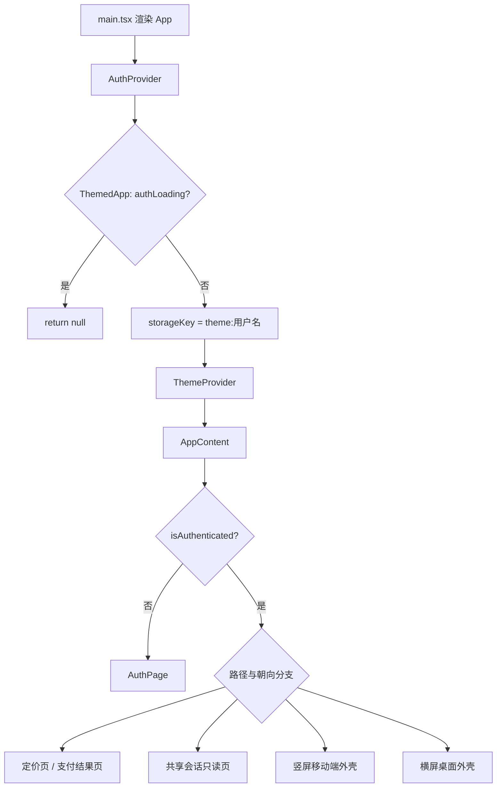
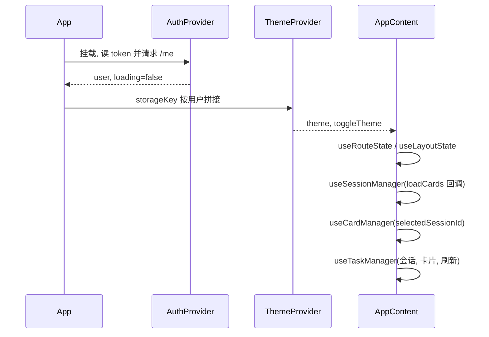
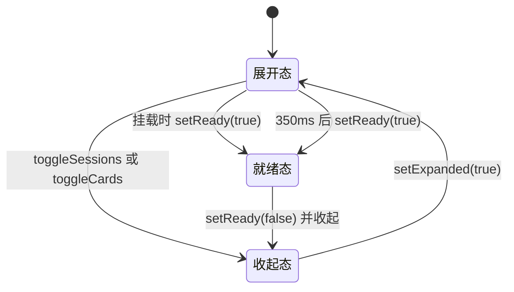

# 应用外壳的视图分层

前端入口 `src/App.tsx` 有 861 行，其中没有业务数据请求，全部是外壳逻辑：决定当前渲染哪一种页面骨架、把哪些 Hook 的状态接到哪些组件上、以及各面板的展开收起。入口文件本身只做 Provider 嵌套，分支都在 `AppContent` 这个组件里。

分层方式是"先认证与主题，再布局与路由，最后业务 Hook"。认证与主题是全局上下文，必须在最外层；布局状态、路由状态、会话、卡片、任务五组状态由自定义 Hook 各自持有，在 `AppContent` 顶部一次性组合后按需向下传。理解这个文件的关键是三件事：Hook 的调用顺序与相互依赖、早退分支的判定条件、以及面板宽度与移动端页面切换为什么不卸载组件。

## 入口只做 Provider 嵌套

`src/App.tsx:853-859` 的 `App` 组件只有一层嵌套：

```tsx
const App: React.FC = () => {
  return (
    <AuthProvider>
      <ThemedApp />
    </AuthProvider>
  )
}
```

`ThemedApp` 在认证结果出来之前返回 `null`，并把主题的存储键按用户隔离（`src/App.tsx:842-851`）：

```tsx
const { user, loading: authLoading } = useAuth()
if (authLoading) return null
const storageKey = user ? `theme:${user.username}` : 'theme'
return (
  <ThemeProvider storageKey={storageKey}>
    <AppContent />
  </ThemeProvider>
)
```

主题 Provider 放在认证 Provider 内部，是为了让存储键能读到当前用户；`authLoading` 期间直接返回空，避免先按匿名键加载一次主题再切换，造成首屏闪一下。嵌套顺序与依赖方向一致：`AuthProvider` 不依赖用户信息，`ThemeProvider` 依赖。



## AppContent 顶部的五组 Hook

`AppContent` 从 `src/App.tsx:49` 开始，前三十行是状态装配（`src/App.tsx:50-75`）：

| 顺序 | Hook | 来源 | 提供的东西 |
| --- | --- | --- | --- |
| 1 | `useAuth` | `src/contexts/AuthContext.tsx:104` | 用户、登录态、退出、刷新用户 |
| 2 | `useDeviceOrientation` | `src/hooks/useDeviceOrientation.ts:5` | `portrait` / `landscape` |
| 3 | `useRouteState` | `src/hooks/useRouteState.ts:7` | 工作区/论坛模式、移动端页面、路由动作 |
| 4 | `useLayoutState` | `src/hooks/useLayoutState.ts:19` | 四个面板的展开与就绪标志 |
| 5 | `useSessionManager` | `src/hooks/useSessionManager.ts:52` | 会话列表、选中会话、导入导出 |
| 6 | `useCardManager` | `src/hooks/useCardManager.ts:34` | 卡片列表、选中与编辑、批量删除 |
| 7 | `useTaskManager` | `src/hooks/useTaskManager.ts:29` | 搜索任务表、采集与上传、任务恢复 |

第 5 与第 6 项之间存在循环依赖：会话切换要刷新卡片，而卡片 Hook 需要知道当前会话。代码用惰性回调解开（`src/App.tsx:60-67`）：

```tsx
const sessionMgr = useSessionManager(
  (sessionId?: string) => cardMgr.loadCards(sessionId)
)
const cardMgr = useCardManager(
  sessionMgr.selectedSessionId,
  isPortrait,
  goMobilePage
)
```

回调体在会话切换时才会执行，那时 `cardMgr` 已经完成初始化，因此不会触发暂时性死区错误。这个顺序不能随意调整：把 `useCardManager` 提到前面会让 `selectedSessionId` 取不到值。

`useTaskManager` 的入参最多（`src/App.tsx:68-75`），除会话 ID 外还要卡片列表、重载卡片的函数、刷新用户的函数，以及收集器面板的展开状态与设置函数——采集任务需要知道当前会话有哪些卡片（用于"延申"），并在任务开始后自动展开收集器。



## 早退分支决定外壳形态

认证与主题就绪后，`AppContent` 依次判断五种情况，顺序本身有语义（`src/App.tsx:299-324`）：

| 判定 | 条件 | 渲染 | 行号 |
| --- | --- | --- | --- |
| 1 | `authLoading` | 全屏加载文案 | `src/App.tsx:299-308` |
| 2 | `!isAuthenticated` | `AuthPage`，不带任何外壳 | `src/App.tsx:310-312` |
| 3 | 根路径且没有 `share` 参数 | 重定向到 `/workspace/cards` | `src/App.tsx:314-316` |
| 4 | `/pricing` | `PricingPage` | `src/App.tsx:319-321` |
| 5 | `/pay/result` | `PaymentResultPage` | `src/App.tsx:322-324` |

共享会话走的是另一段内联 JSX（`src/App.tsx:327-389`），它复用了左侧栏与树组件，但把内容区换成只读的 Markdown 渲染，并在页头标明"只读"。判断依据是查询串里的 `share` 参数（`src/App.tsx:209-224`）。

竖屏与横屏是两条独立返回路径：`src/App.tsx:392` 开始移动端外壳，`src/App.tsx:553` 开始桌面外壳。两者的页头、路由表、面板结构都不同，共用的是 Hook 状态与卡片数据。

三个外层容器的类名分别是 `app-shell`（共享会话，`src/App.tsx:337`）、`app-shell portrait-shell`（移动端，`src/App.tsx:394`）与 `app-shell app-main-shell`（桌面，`src/App.tsx:554`）。

## 桌面外壳由四个可折叠面板拼成

桌面分支的外层是一个横向 flex 容器，里面按顺序排四个 aside 与一个 main。宽度由布局状态决定，展开与收起都用 CSS 过渡，而不是切换组件（`src/App.tsx:580`）：

```tsx
<aside style={{ width: layout.sessionsExpanded ? 240 : 40, ...,
  transition: 'width 0.3s cubic-bezier(0.4,0,0.2,1)', position: 'relative' }}>
```

| 区域 | 宽度 | 内容 | 行号 |
| --- | --- | --- | --- |
| 会话栏 | 240 / 40 | 会话列表、管理模式操作、导入菜单 | `src/App.tsx:580-731` |
| 中间主区 | flex: 1 | 知识图谱、质量分析入口 | `src/App.tsx:734-770` |
| 收集器 | 400 / 40 | 关键词输入、上传、搜索任务流 | `src/App.tsx:773-801` |
| Agent 栏 | 360 / 40 | 常驻对话面板 | `src/App.tsx:804-811` |

收起状态只保留 40 px，折叠按钮做成圆形悬浮在边界上（`src/App.tsx:581-583`）。内容渲染被额外条件挡住，例如会话列表只在"展开且就绪"时渲染（`src/App.tsx:584`），卡片树只在 `layout.cardsReady` 为真时渲染（`src/App.tsx:724-727`）。

卡片树上的三个入口都指向浮动窗口层：新建空卡片、新建孤立卡片、编辑卡片，包装后统一调用 `handleOpenCardWindow`（`src/App.tsx:726`）。这解释了为什么树组件自己不做编辑界面，它只上报意图，窗口由外壳层管理。

浮动窗口是数组状态加两个自增引用（`src/App.tsx:89-145`）：`windowSeqRef` 生成唯一窗口 ID，zSeqRef 维护层级。窗口按 `openWindows` 数组渲染在页面最外层（`src/App.tsx:816-833`），每个窗口的 card 通过 ID 从卡片列表现查；当卡片被删除时，一个副作用会把对应窗口过滤掉（`src/App.tsx:169-175`）。



## 移动端页面靠显示与隐藏切换

竖屏分支把五个页面容器全部挂载，用 `display` 切换可见性。会话页是唯一按条件渲染的（`src/App.tsx:419-438`），其余四个容器分别是卡片（`src/App.tsx:439-478`）、内容（`src/App.tsx:479-529`）、收集器（`src/App.tsx:530-539`）与图谱（`src/App.tsx:540-542`）。

```tsx
<div style={{ display: mobilePage === 'cards' ? 'flex' : 'none', flex: 1, ... }}>
```

这样切换页面时组件不卸载，滚动位置、输入框内容与图谱的相机姿态都能保留。代价是四个页面的副作用会同时存在，图谱页因此显式接收一个 `visible` 参数（`src/App.tsx:541`），由它自己决定是否继续渲染。

当前页由路由推导而不是单独的状态。`useRouteState` 用正则匹配路径得出 `mobilePage`（`src/hooks/`useRouteState`.ts:22-32`），并从 /workspace/card/:id 解析出卡片 ID（`src/hooks/`useRouteState`.ts:35-36`）。外壳再决定用哪一份选中卡片（`src/App.tsx:77`）：

```tsx
const effectiveCardId = isPortrait && routeCardId ? routeCardId : cardMgr.selectedCardId
```

竖屏优先信路由，横屏信卡片 Hook 的内部状态。两套来源都指向同一张卡片，但更新时机不同步：路由变化由浏览器历史驱动，`selectedCardId` 由点击驱动。

朝向本身由两个来源共同维护：初始值取宽高比（`src/hooks/`useDeviceOrientation`.ts:6-9`），之后同时监听 `resize` 与 `matchMedia` 的 portrait 媒体查询，退出时都注销（`src/hooks/`useDeviceOrientation`.ts:11-30`）。用两个来源是因为桌面浏览器缩放窗口只触发 `resize`，某些移动端旋转只触发媒体查询。

## 面板就绪标志与动画时序

收起与展开动画是 300 ms 的 CSS 过渡，如果展开瞬间就渲染完整内容，列表会先按最终宽度布局再被压缩，出现跳动。代码用"就绪"标志把渲染推迟到动画结束：展开时先设置 `expanded`，350 ms 后再设置 `ready`；收起时立即清掉 `ready`（`src/hooks/`useLayoutState`.ts:30-48`）。

初始挂载时不能等 350 ms，否则首屏空白。AppContent 有一个只跑一次的副作用，把已经展开的面板直接标成就绪（`src/App.tsx:189-196`）：

```tsx
if (layout.sessionsExpanded) layout.setSessionsReady(true)
if (layout.cardsExpanded) layout.setCardsReady(true)
// eslint-disable-next-line react-hooks/exhaustive-deps
}, [])
```

初始展开状态本身依赖窗口宽度：宽于 768 px 时会话栏与卡片栏默认展开（`src/hooks/`useLayoutState`.ts:20-23`）。收集器默认收起、Agent 栏默认展开（`src/hooks/`useLayoutState`.ts:24-25`）。

## 易错点

| 位置 | 问题 | 建议 |
| --- | --- | --- |
| `src/App.tsx:314-322` | 早退分支读全局 location，文件并未导入 useLocation；能跟随路由更新只是因为别处订阅了路由 | 改为从 `useRouteState` 取 location，避免隐式耦合 |
| `src/App.tsx:189-196` | 就绪标志的副作用依赖数组为空并关闭了 lint 检查，只在挂载时执行一次 | 若将来支持初始收起后再展开，需要把 layout 的字段加回依赖 |
| `src/App.tsx:60-63` | 会话 Hook 的回调引用了尚未声明的 `cardMgr` | 保持回调惰性执行；不要在渲染期直接调用该回调 |
| `src/App.tsx:439-542` | 移动端四个页面同时挂载，副作用与请求都会执行 | 需要卸载的页面改用条件渲染，或像图谱那样传 `visible` |
| `src/App.tsx:77` | 选中卡片有两个来源（路由与 Hook） | 在移动端修改选中项时同步一次路由，避免返回键与内部状态打架 |
| `src/App.tsx:45` | 外壳只显式引入一个组件样式，其余样式由各组件内部引入 | 排查全局样式冲突时先看组件内的 import |

## 小结

### 核心概念

* 入口 App 只做两层 Provider 嵌套：认证在外、主题在内，主题存储键按用户名隔离（`src/App.tsx:845-858`）。
* AppContent 顶部按依赖顺序组合七组 Hook，会话与卡片之间的循环依赖用惰性回调解开（`src/App.tsx:60-67`）。
* 五种早退分支覆盖加载、未登录、根路径重定向、定价页与支付结果页（`src/App.tsx:299-324`）。
* 桌面是四个可折叠面板加中间主区，宽度由布局状态驱动，内容渲染由 `ready` 标志推迟到动画结束（`src/App.tsx:580-811`）。
* 移动端五个页面全部挂载，用 `display` 切换以保留组件内部状态（`src/App.tsx:439-542`）。
* 朝向同时监听 `resize` 与媒体查询，初始值取宽高比（`src/hooks/`useDeviceOrientation`.ts:6-30`）。

### 设计权衡

| 选择 | 收益 | 代价 |
| --- | --- | --- |
| 主题 Provider 放在认证 Provider 内 | 存储键按用户隔离，读到用户后再初始化 | 认证加载期间必须返回 null，首屏依赖认证接口 |
| 会话与卡片用惰性回调解耦 | 两个 Hook 各自独立，不互相导入 | 依赖关系隐含在调用顺序里，阅读时需要留意 |
| 面板用宽度过渡而不是条件渲染 | 动画连续，树与列表状态保留 | 多一层 `ready` 标志与固定 350 ms 延时 |
| 移动端页面用显示隐藏切换 | 滚动位置与输入内容保留 | 四个页面同时存在副作用，图谱要自己处理不可见 |
| 浮动窗口状态放在外壳而不是卡片组件里 | 多窗口层级、焦点、最小化统一管理 | 外壳文件变长，窗口与卡片的同步要靠副作用兜底 |

## 练习

### 基础题

1. 列出 AppContent 中七组 Hook 的调用顺序，并说明 `useSessionManager` 与 `useCardManager` 为什么必须按这个顺序调用。
2. 说明桌面外壳四个面板的展开宽度与收起宽度，以及 `ready` 标志的用途。
3. 移动端页面切换为什么用 `display` 而不是条件渲染，举出一个因此需要额外处理的组件。

### 挑战题

4. 把早退分支里的全局 location 改成从路由 Hook 取值，列出需要修改的行，并说明这次修改会不会改变现有行为。
5. 设计一个"从会话 A 切到会话 B 时关闭所有浮动窗口"的方案，写出需要改动的位置，并说明为什么放在卡片加载副作用里过滤窗口是不够的。

## 附：本页引用的路径

| 路径 | 用途 |
| --- | --- |
| /mnt/d/KnowledgeDiver/frontend/ | 前端工程根目录，文中相对路径均相对它 |
| `src/App.tsx` | 外壳：Provider 嵌套、Hook 组合、外壳分支、面板与浮动窗口 |
| `src/contexts/AuthContext.tsx` | 认证上下文与 useAuth |
| `src/contexts/ThemeContext.tsx` | 主题上下文与存储键切换 |
| `src/hooks/`useRouteState`.ts` | 路由模式、移动端页面与路由动作 |
| `src/hooks/`useLayoutState`.ts` | 面板展开与就绪标志 |
| `src/hooks/`useDeviceOrientation`.ts` | 竖屏与横屏判定 |
| `src/components/FloatingCardWindow.tsx` | 浮动窗口的状态结构与属性约定 |

