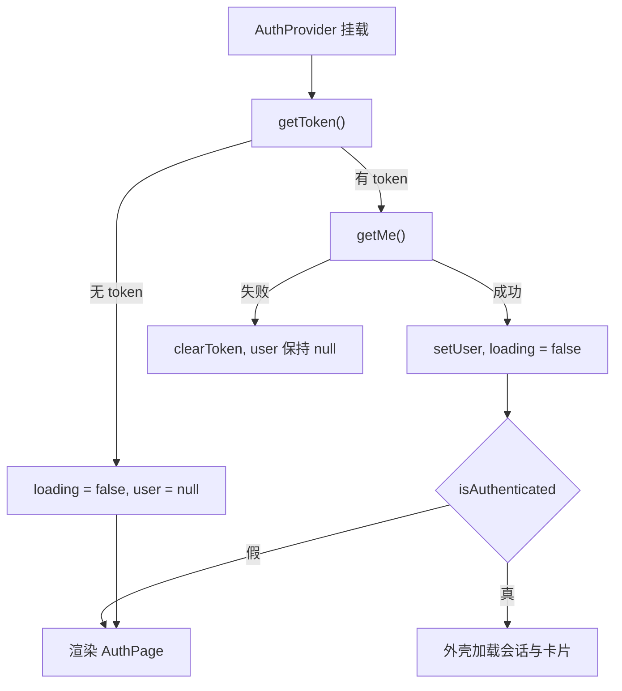
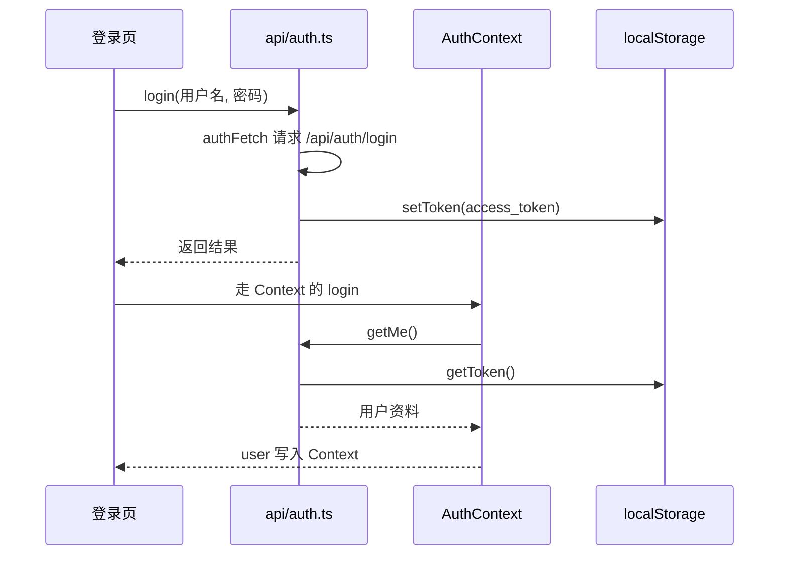
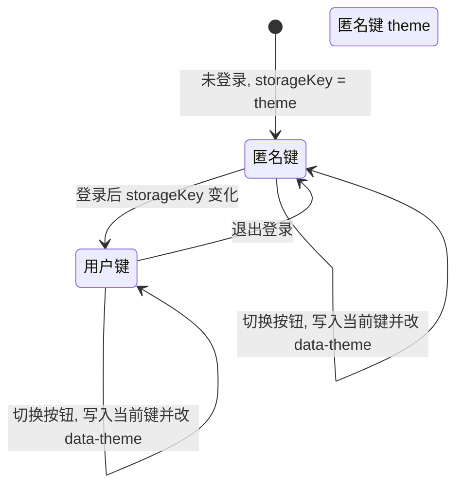

# 全局上下文的两个 Provider

这个前端的全局状态只有两块：当前登录用户与当前主题。两者都用 React Context 实现，各自一个 Provider、一个消费 Hook，放在 `src/contexts/` 下。认证上下文管 110 行，主题上下文管 59 行，逻辑都不复杂，但它们的初始化时机与失效处理决定了整个应用的第一屏行为。

认证上下文的消费方有四个：外壳读用户与登录态（`src/App.tsx:50`）、主题包装层读用户来决定存储键（`src/App.tsx:843`）、登录页拿 `login` 与 `register`（`src/components/AuthPage.tsx:13`）、定价页读登录态（`src/components/PricingPage.tsx:44`）。主题上下文只有一个消费方，用户菜单里的明暗切换（`src/components/UserMenu.tsx:18`）。 两个 Provider 可以按"约定、生命周期、存储、嵌套顺序"四段来读，重点在几个容易忽略的失效路径。

## 两个上下文各自持有什么

| 上下文 | 字段 | 定义位置 | 消费方 |
| --- | --- | --- | --- |
| 认证 | `user`、`loading`、`error`、`login`、`register`、`logout`、`refreshUser`、`isAuthenticated` | `src/contexts/AuthContext.tsx:5-14` | `src/App.tsx:50`、`src/App.tsx:843`、`src/components/AuthPage.tsx:13`、`src/components/PricingPage.tsx:44` |
| 主题 | `theme`、`toggleTheme` | `src/contexts/ThemeContext.tsx:5-8` | `src/components/UserMenu.tsx:18` |

字段划分对应两类用途：认证上下文把"用户数据"、"加载中"、"错误信息"与四个动作平铺在一起，调用方按需取；主题上下文只暴露当前值与切换函数，持久化细节不外露。

`isAuthenticated` 没有独立状态，它从用户对象派生（`src/contexts/AuthContext.tsx:96`）：

```tsx
isAuthenticated: !!user,
```

这样"有用户"与"已登录"不会出现两种事实。代价是每个消费方在用户对象变化时都会重新渲染，即使它只关心布尔值。

## 空值约定与使用处的报错

两个上下文都以 `null` 作为默认值，并在消费 Hook 里显式检查（`src/contexts/AuthContext.tsx:16`、`src/contexts/ThemeContext.tsx:10`）：

```tsx
const AuthContext = createContext<AuthContextType | null>(null)
...
const context = useContext(AuthContext)
if (!context) {
  throw new Error('useAuth must be used within AuthProvider')
}
```

用 `null` 而不是给一个字段齐全的假默认值，是为了让"忘了包 Provider"立刻变成一个错误，而不是变成一堆 `undefined` 调用。报错信息里写明必须包在哪个 Provider 内（`src/contexts/AuthContext.tsx:106-108`、`src/contexts/ThemeContext.tsx:57`）。

类型层面，Hook 的返回类型是去掉 `null` 的具体类型（`src/contexts/AuthContext.tsx:104`、`src/contexts/ThemeContext.tsx:55`），所以调用方不需要处理空值，检查集中在 Hook 内部。

## 认证状态的三段生命周期

启动阶段先读本地 token，再请求当前用户（`src/contexts/AuthContext.tsx:23-39`）：

```tsx
const loadUser = useCallback(async () => {
  const token = getToken()
  if (!token) {
    setLoading(false)
    return
  }
  try {
    const userData = await getMe()
    setUser(userData)
  } catch (err) {
    console.warn('User load failed:', err)
    clearToken()
  } finally {
    setLoading(false)
  }
}, [])
```

没有 token 时直接结束加载，不去打接口；有 token 但请求失败时清掉 token 并保持用户为空。`loading` 初始值为 `true`（`src/contexts/AuthContext.tsx:20`），因此首屏在没有结论前一定处于加载态，这个初始值同时被 `ThemedApp` 用来决定是否渲染主题层（`src/App.tsx:843-844`）。

登录与注册的流程一致：清错误、调接口（接口内部写入 token）、再拉一次用户资料写进状态（`src/contexts/AuthContext.tsx:45-56`、`:58-69`）。失败时把可读信息写进 `error` 并继续向上抛（`src/contexts/AuthContext.tsx:51-55`），让表单能显示提示。

退出只做两件事：清 token、把用户置空（`src/contexts/AuthContext.tsx:71-74`）。刷新用户是给任务完成后的积分更新用的（`src/contexts/AuthContext.tsx:76-84`），失败时保留当前用户数据，只打警告。




## token 的存取与请求头

token 放在 `localStorage` 里，不进 Context，由 `src/api/auth.ts` 单独封装。键名是常量（`src/api/auth.ts:3`），三个操作分别读写删（`src/api/auth.ts:5-15`）：

```tsx
const TOKEN_KEY = 'knowledgeDiver.token'
export function getToken(): string | null { return localStorage.getItem(TOKEN_KEY) }
export function setToken(token: string): void { localStorage.setItem(TOKEN_KEY, token) }
export function clearToken(): void { localStorage.removeItem(TOKEN_KEY) }
```

请求函数在每次调用时现读 token 并拼 `Authorization` 头（`src/api/auth.ts:17-25`、`:76-91`）。这样做的结果是：登录接口写入 token 之后，后续任何请求都能立刻带上，不需要等 Context 状态更新；反过来，退出后即使有旧请求在途，新请求也不会再带头。

两个请求函数的分工需要区分：`authFetch` 允许匿名（无 token 时不加头，`src/api/auth.ts:23-25`），用于登录与注册；`authFetchWithToken` 在无 token 时直接抛错（`src/api/auth.ts:77-80`），用于所有需要登录的业务接口。后者对 `FormData` 不设置 `Content-Type`（`src/api/auth.ts:85-88`），避免覆盖浏览器生成的 multipart 边界。



## 主题按用户隔离

主题值只有两个，初始值从 `localStorage` 读（`src/contexts/ThemeContext.tsx:12-17`），并且在浏览器环境缺失时回落到暗色（`src/contexts/ThemeContext.tsx:13`）：

```tsx
function readStoredTheme(key: string): Theme {
  if (typeof window === 'undefined') return 'dark'
  const stored = localStorage.getItem(key)
  if (stored === 'light' || stored === 'dark') return stored
  return 'dark'
}
```

初始化用的是惰性初值函数（`src/contexts/ThemeContext.tsx:23`），只在首次渲染时读一次存储，后续渲染不再读。

切换用户时存储键会变（外层传进来的是 `theme:用户名`，`src/App.tsx:845`），组件需要换一份存储。它用两个引用区分三件事（`src/contexts/ThemeContext.tsx:24-35`）：

| 引用 | 作用 |
| --- | --- |
| `storageKeyRef` | 每次渲染同步为当前键，供写入 effect 使用（`src/contexts/ThemeContext.tsx:28`） |
| `prevKeyRef` | 记住上一次的键，用来判断是否真的发生了切换（`src/contexts/ThemeContext.tsx:25`、`:32-33`） |
| `theme` 状态 | 当前主题，切换键时从新键重新读（`src/contexts/ThemeContext.tsx:34`） |

两个 effect 分工明确：写 DOM 与存储的 effect 只依赖 `theme`（`src/contexts/ThemeContext.tsx:39-42`），切换键的 effect 只依赖 `storageKey`（`src/contexts/ThemeContext.tsx:31-35`）。如果用同一个 effect 同时依赖两者，键变化时会先把旧主题按新键写一遍，把用户在新键下的偏好覆盖掉。

主题最终落到根元素的属性上（`src/contexts/ThemeContext.tsx:40`），样式用属性选择器覆盖：

```tsx
document.documentElement.setAttribute('data-theme', theme)
```

暗色是默认样式，浅色是一层覆盖（`src/styles.css:93`、`src/styles.css:135-136`）。切换动作本身只是一个三元翻转（`src/contexts/ThemeContext.tsx:44-46`）。



## Provider 嵌套顺序与重渲染

外壳的嵌套是 `AuthProvider` 包 `ThemedApp`，`ThemedApp` 再包 `ThemeProvider` 与 `AppContent`（`src/App.tsx:842-858`）。顺序由依赖决定：存储键需要用户信息，所以主题层必须在认证层内部。

`ThemedApp` 在认证未完成时返回 `null`（`src/App.tsx:844`），于是主题层与整个应用都推迟到认证有结论之后才挂载。这样主题只需要读一次存储，不会出现"先按匿名键渲染、登录后再切换"的闪烁。

两个 Provider 的 `value` 都是每次渲染新建的对象字面量（`src/contexts/AuthContext.tsx:88-97`、`src/contexts/ThemeContext.tsx:49`），因此 Provider 自身每次重渲染都会让所有消费方重渲染。对认证上下文来说这不是问题，因为用户数据变化本来就该广播；对主题上下文来说消费方只有一个，代价可以忽略。

## 易错点

| 位置 | 问题 | 建议 |
| --- | --- | --- |
| `src/contexts/AuthContext.tsx:33-35` | 任何错误都会清 token，包括网络不通或后端 5xx，用户会被动退出登录 | 区分 401 与网络错误，只在鉴权失败时清 token |
| `src/contexts/AuthContext.tsx:71-74` | 退出只清本地 token，没有通知服务端 | 若后端支持注销接口，在清本地前调用一次 |
| `src/contexts/AuthContext.tsx:76-84` | 刷新用户失败时静默保留旧数据 | 需要把失败暴露给调用方，否则积分显示会长期停在旧值 |
| `src/contexts/ThemeContext.tsx:39-42` | 持久化 effect 只依赖 theme，写入键靠引用读取 | 保持这个分工，不要把 storageKey 加进依赖 |
| `src/contexts/ThemeContext.tsx:13` | 服务端渲染分支直接返回暗色 | 本工程是纯客户端渲染，该分支属于防御性写法 |
| `src/App.tsx:843-844` | 认证加载期间返回 null，首屏白屏时间等于 /me 请求耗时 | 需要改进时给主题层一个不依赖用户的默认键 |

## 小结

### 核心概念

* 全局状态只有认证与主题两块，各自一个 Provider、一个消费 Hook（`src/contexts/AuthContext.tsx:104`、`src/contexts/ThemeContext.tsx:55`）。
* 上下文默认值为 `null`，消费 Hook 内抛错，让漏包 Provider 立刻暴露（`src/contexts/AuthContext.tsx:106-108`）。
* `isAuthenticated` 由用户对象派生，不单独维护（`src/contexts/AuthContext.tsx:96`）。
* token 存在 `localStorage`，由 `src/api/auth.ts` 封装，请求时现读（`src/api/auth.ts:3-15`、`:76-91`）。
* 主题存储键按用户名隔离，切换键与持久化由两个 effect 分开处理（`src/contexts/ThemeContext.tsx:31-42`）。
* 主题落到根元素的 `data-theme` 属性，样式用属性选择器覆盖（`src/contexts/ThemeContext.tsx:40`、`src/styles.css:93`）。

### 设计权衡

| 选择 | 收益 | 代价 |
| --- | --- | --- |
| token 放 `localStorage` 而非 Context | 请求函数随时可读，不依赖渲染时序 | 无法感知过期，需要靠 401 或主动刷新处理 |
| 上下文默认值用 `null` 并抛错 | 漏包 Provider 立刻报错 | 每个消费 Hook 多一次判空 |
| 认证加载期间整棵树不挂载 | 主题只读一次，避免闪烁 | 首屏白屏时间等于 `/me` 耗时 |
| 主题键按用户隔离 | 不同账号各自记住偏好 | 需要两个引用维护键切换与写入 |
| `value` 每次渲染新建对象 | 代码简单，字段永远最新 | 消费方无法靠引用相等跳过重渲染 |

## 练习

### 基础题

1. 列出认证上下文的八个字段，并指出哪一个是派生值。
2. 说明 `authFetch` 与 `authFetchWithToken` 的差别，以及后者对 `FormData` 做特殊处理的原因。
3. 主题的写入 effect 为什么只依赖 `theme`，如果把 `storageKey` 也加进依赖会发生什么。

### 挑战题

4. 把"任何错误都清 token"改成"只在 401 时清 token"，写出需要修改的函数与判断条件，并说明如何验证网络错误不再导致退出。
5. 给主题上下文加一个跟随系统偏好的选项，列出需要新增的状态、存储格式与 effect 改动，并说明如何在用户显式选择后停止跟随。

## 附：本页引用的路径

| 路径 | 用途 |
| --- | --- |
| /mnt/d/KnowledgeDiver/frontend/ | 前端工程根目录，文中相对路径均相对它 |
| `src/contexts/AuthContext.tsx` | 认证上下文、登录态生命周期与消费 Hook |
| `src/contexts/ThemeContext.tsx` | 主题上下文、存储键切换与持久化 |
| `src/api/auth.ts` | token 存取与两个请求函数 |
| `src/App.tsx` | Provider 嵌套与消费方 |
| `src/components/UserMenu.tsx` | 主题切换入口 |
| `src/components/AuthPage.tsx` | 登录与注册表单 |
| `src/components/PricingPage.tsx` | 定价页读取登录态 |
| `src/styles.css` | `data-theme` 属性选择器与浅色覆盖 |
| `src/main.tsx` | 根渲染与路由包裹 |
