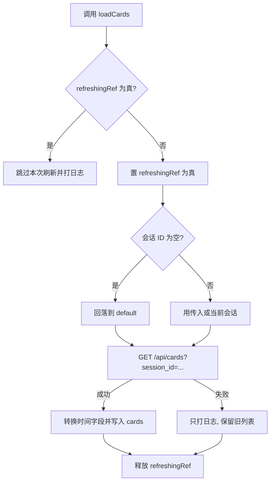
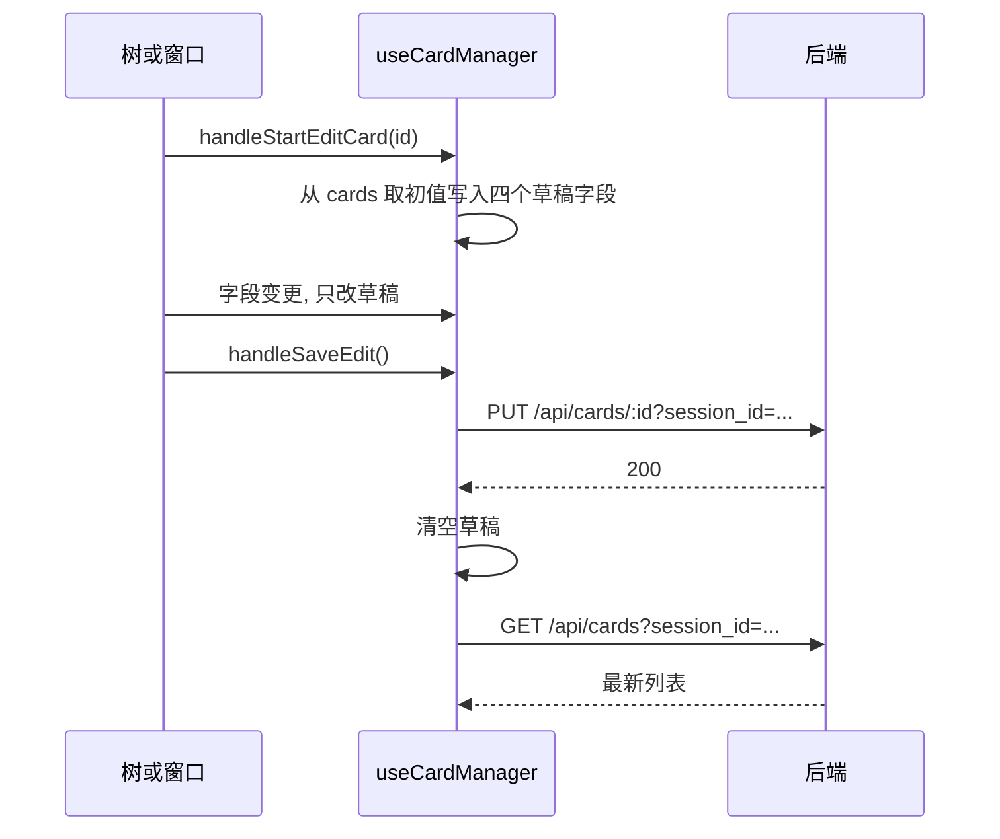
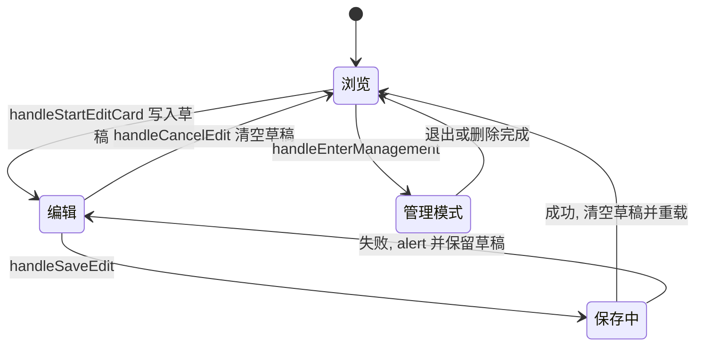

# 卡片状态的单一来源

知识卡片是这个应用的核心数据，所有与它相关的状态都放在一个 Hook 里：`src/hooks/useCardManager.ts`，314 行。它持有卡片数组、当前选中卡、编辑草稿、管理模式与批量选择，并暴露 20 个字段给外壳。外壳自己只额外持有一份浮动窗口列表，窗口的内容仍然从卡片数组里按 ID 查。

把同一份数据交给唯一的所有者、视图只从它派生，是前端状态管理的通用原则：改数据只有一个入口，就不会出现两个组件各存一份、互相覆盖的情况。这种"数据与草稿都进同一个 Hook"的做法，让选中卡与编辑草稿天然一致：进入编辑时从卡片数组取初值，保存成功后重新拉取列表，取消时把草稿清空。代价是 Hook 返回的字段很多，外壳的 JSX 需要按用途分发到树组件、内容页与浮动窗口三个消费方。

## 卡片状态的字段分组

`useCardManager` 的十个状态可以按用途分成五组（`src/hooks/useCardManager.ts`）：

| 分组 | 字段 | 用途 |
| --- | --- | --- |
| 数据 | `cards` | 当前会话的卡片数组 |
| 选中 | `selectedCardId` | 树、图谱与内容页共用的选中项 |
| 编辑草稿 | `editingCardId`、`editingTitle`、`editingContent`、`editingLinks` | 编辑中的四个字段，保存或取消后清空 |
| 管理模式 | `managementMode`、`selectedCardIds` | 批量选择与删除 |
| 请求中标志 | `savingCard`、`deleting` | 禁用按钮与显示进行中文案 |

`selectedCardId` 是全应用唯一的"当前卡片"来源。竖屏下外壳会让路由里的卡片 ID 覆盖它（`src/App.tsx`），横屏下直接用它的值。

## 加载函数的防重与会话兜底

`loadCards` 接受一个可选的会话 ID，不传就用当前选中会话（`src/hooks/useCardManager.ts`）。它有两个防御：一个 `refreshingRef` 做并发标记（ref 在多次渲染之间保持同一个对象，改它不会触发重渲染，适合放这种只给逻辑看的标志），一个空会话 ID 兜底：

```tsx
if (refreshingRef.current) {
  console.log('Refresh already in progress, skipping')
  return
}
refreshingRef.current = true
let targetSessionId = sessionId || selectedSessionId
if (!targetSessionId || targetSessionId.trim() === '') {
  console.warn('[loadCards] Invalid session ID, defaulting to "default"')
  targetSessionId = 'default'
}
```

请求成功后把时间字段转成 `Date` 对象再入状态（`src/hooks/useCardManager.ts`），失败只打日志、不改变现有列表，无论成败都在 `finally` 里释放防重标志。



## 选中与编辑草稿

选中卡片只写一个状态（`src/hooks/useCardManager.ts`）：

```tsx
const handleSelectCard = useCallback(
  (id: string) => {
    setSelectedCardId(id)
    if (isPortrait && goMobilePage) {
      // Caller should handle the mobile navigation
    }
  },
  [isPortrait]
)
```

竖屏分支目前是空的，移动端的页面跳转交给底部导航栏：它用选中卡拼出内容页地址（`src/components/BottomNavBar.tsx`），由 `NavLink` 完成导航。因此竖屏下点树里的卡片只会更新选中态，要进内容页还要按一次底部"内容"。

进入编辑时从卡片数组取初值写入四个草稿字段，竖屏下顺便跳到内容页（`src/hooks/useCardManager.ts`）：

```tsx
const card = cards.find((c) => c.id === cardId)
if (!card) return
setEditingCardId(cardId)
setEditingTitle(card.title)
setEditingContent(card.content)
setEditingLinks(card.links || [])
if (isPortrait) {
  goMobilePage('content', cardId)
}
```

三个字段变更函数各写一个状态（`src/hooks/useCardManager.ts`），保存时把四个草稿字段拼成请求体发 `PUT`，成功后清空草稿并重新拉取列表。取消只清草稿，不动服务端数据。




## 管理模式与批量删除

管理模式只用一组状态：布尔开关加一个 ID 集合（`src/hooks/useCardManager.ts`）。进入与退出都会清空已选项，避免上一次的选择残留到下一次。

单项切换用集合复制而不是原地修改（`src/hooks/useCardManager.ts`）：

```tsx
setSelectedCardIds((prev) => {
  const next = new Set(prev)
  if (next.has(cardId)) next.delete(cardId)
  else next.add(cardId)
  return next
})
```

全选直接由卡片数组生成（`src/hooks/useCardManager.ts`），取消选择置空集。批量删除先确认数量，再对每个 ID 发 `DELETE` 并 `Promise.all` 等待：

```tsx
if (!confirm(`确定要删除选中的 ${selectedCardIds.size} 张卡牌吗？此操作不可撤销。`)) return
setDeleting(true)
const deletePromises = Array.from(selectedCardIds).map((cardId) =>
  authFetchWithToken(`/api/cards/${cardId}?session_id=${encodeURIComponent(selectedSessionId)}`, { method: 'DELETE' })
)
await Promise.all(deletePromises)
setSelectedCardIds(new Set())
loadCards()
```

删除是逐张请求而不是批量接口，任意一张失败都会让 `Promise.all` 抛错——`Promise.all` 会等所有请求结束，但只要有一个 reject 就整体失败（若换成 `Promise.allSettled`，则会等全部结束并逐个给出成功或失败结果）——此时已删除的卡片不会从列表里消失，直到下一次刷新。

## 新建卡片的两个入口

新建有两种：带父卡片的子卡片与孤立卡片。两者的请求体只差一个 `parent_id`（`src/hooks/useCardManager.ts`），流程一致：`POST` 后把返回的卡片追加进数组、设为选中、立刻进入编辑并把标题与内容填进草稿。

```tsx
const newCard = await authFetchWithToken<Card>(
  `/api/cards?session_id=${encodeURIComponent(selectedSessionId)}`,
  { method: 'POST', headers: { 'Content-Type': 'application/json' }, body }
)
setCards((prev) => [...prev, newCard])
setSelectedCardId(newCard.id)
setEditingCardId(newCard.id)
setEditingTitle(newCard.title)
setEditingContent(newCard.content)
if (isPortrait) goMobilePage('content', newCard.id)
loadCards()
return newCard.id
```

函数返回新卡片的 ID，调用方据此决定后续动作。桌面外壳拿这个 ID 打开浮动窗口（`src/App.tsx`），把"新建即编辑"落在一个独立窗口里，而不是切换中间主区。

## 浮动窗口复用同一份卡片数据

窗口的状态结构由外壳定义（`src/components/FloatingCardWindow.tsx`）：窗口 ID、卡片 ID、位置、尺寸、最小化标志、层级，以及一个"打开时直接进入编辑"的可选标志。窗口组件接收的属性能分成三类：要显示的卡片与全量卡片列表、窗口自身的位置与尺寸、以及一组回调。卡片的持久化由父组件代理，注释里写明了理由：每个窗口编辑自己的草稿，父组件通过卡片管理器保存。

窗口的打开逻辑在外壳里，同一个卡片已有未最小化窗口时只提升层级，不新建（`src/App.tsx`）：

```tsx
const existing = prev.find((w) => w.cardId === cardId && !w.minimized)
if (existing) {
  zSeqRef.current += 1
  return prev.map((w) => (w.id === existing.id ? { ...w, zIndex: zSeqRef.current, initialEditing: startEditing || w.initialEditing } : w))
}
```

新窗口的位置按已有窗口数错开，尺寸固定为 440 乘 440（`src/App.tsx`）。层级用一个自增引用维护，聚焦、移动、缩放、最小化都是对数组里单个元素的替换。

窗口里的保存走外壳提供的回调，请求成功后重新拉卡片列表（`src/App.tsx`）：

```tsx
await authFetchWithToken(`/api/cards/${cardId}?session_id=${encodeURIComponent(sessionMgr.selectedSessionId)}`, {
  method: 'PUT',
  headers: { 'Content-Type': 'application/json' },
  body: JSON.stringify({ title, content, links }),
})
cardMgr.loadCards()
```

这条路径与 Hook 里的 `handleSaveEdit` 是两套独立实现，改字段时要注意同步。



## 易错点

| 位置 | 问题 | 建议 |
| --- | --- | --- |
| `src/hooks/useCardManager.ts` | 刷新进行中会直接跳过新请求，新建或删除后的重载可能被丢掉 | 把请求排队或改为最后一次生效，而不是丢弃 |
| `src/hooks/useCardManager.ts` | 新建卡片只重置标题与内容，没有重置 `editingLinks`，会带上一张卡片的链接 | 在进入编辑与新建设置草稿的每个位置都写全部四个字段 |
| `src/hooks/useCardManager.ts` | 竖屏分支是空实现，注释说由调用方处理 | 删除该分支并注释说明导航在导航栏完成 |
| `src/hooks/useCardManager.ts` | 新建后直接追加服务端返回的对象，时间字段仍是字符串，与加载时的转换不一致 | 追加前用与加载相同的转换函数处理 |
| `src/App.tsx` | 卡片被删后窗口会被过滤掉，但窗口里的草稿没有提示 | 关闭前提示未保存内容，或把草稿提升到外壳 |
| `src/hooks/useCardManager.ts` | 批量删除任意一张失败会中断后续逻辑，已删除的卡片仍留在列表里 | 改用 `Promise.allSettled`，按结果决定是否局部移除 |

## 小结

### 核心概念

* 卡片数据、选中项、编辑草稿、管理模式与请求中标志都在 `useCardManager` 里（`src/hooks/useCardManager.ts`）。
* `loadCards` 用引用防止并发重入，并把空会话 ID 回落到 `default`（`src/hooks/useCardManager.ts`）。
* 编辑草稿的四个字段来自卡片数组，保存成功后清空并重载（`src/hooks/useCardManager.ts`）。
* 管理模式用布尔开关加 ID 集合，进入与退出都清空选择（`src/hooks/useCardManager.ts`）。
* 新建子卡片与孤立卡片只差 `parent_id`，都走"追加、选中、进入编辑"三步（`src/hooks/useCardManager.ts`）。
* 浮动窗口由外壳管理，窗口只编辑本地草稿，保存经父组件代理（`src/components/FloatingCardWindow.tsx`、`src/App.tsx`）。

### 设计权衡

| 选择 | 收益 | 代价 |
| --- | --- | --- |
| 卡片与编辑草稿放在同一个 Hook | 选中项与草稿天然一致 | 返回字段多，外壳要按用途分发 |
| 刷新用丢弃式防重 | 避免重复请求与竞态覆盖 | 新建删除后的重载可能失效 |
| 卡片树只上报意图，编辑交给窗口 | 树组件保持无状态展示 | 新建即编辑需要外壳额外包装 |
| 窗口的持久化由父组件代理 | 多窗口共用一套保存逻辑 | 两套保存实现（Hook 与外壳）需要同步 |
| 批量删除用逐张请求 | 后端接口简单 | 部分失败时列表状态不一致 |

## 练习

### 基础题

1. 列出 `useCardManager` 的十个状态，并按数据、选中、草稿、管理模式、请求中标志分组。
2. 说明 `loadCards` 的两个防御分别防的是什么问题。
3. 新建卡片后为什么要立刻把四段草稿写满，而不是等用户点击编辑。

### 挑战题

4. 把丢弃式防重改成"最后一次请求生效"，写出需要新增的引用与判断逻辑，并说明如何构造一次能触发旧实现缺陷的操作序列。
5. 让浮动窗口与 Hook 共用同一套保存函数，列出需要修改的属性与调用点，并说明这样做会影响哪些现有的诊断日志。

## 附：本页引用的路径

| 路径 | 用途 |
| --- | --- |
| /mnt/d/KnowledgeDiver/frontend/ | 前端工程根目录，文中相对路径均相对它 |
| `src/hooks/useCardManager.ts` | 卡片数据、草稿、管理模式与增删改查 |
| `src/components/FloatingCardWindow.tsx` | 浮动窗口的状态结构与属性约定 |
| `src/components/TreeBrowser.tsx` | 卡片树与操作入口 |
| `src/components/mobile/MobileCardsPage.tsx` | 移动端卡片页，复用卡片树 |
| `src/components/BottomNavBar.tsx` | 移动端底部导航与内容页地址拼接 |
| `src/App.tsx` | 浮动窗口的打开、层级与保存代理 |
| `src/api/auth.ts` | 带 token 的请求封装 |
