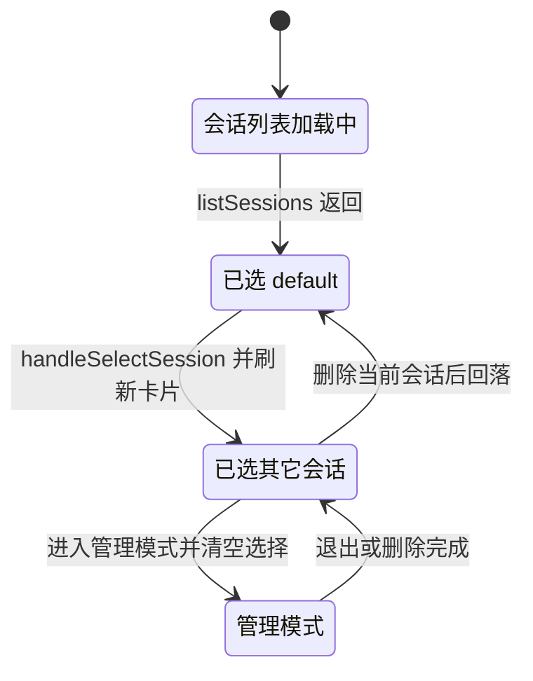
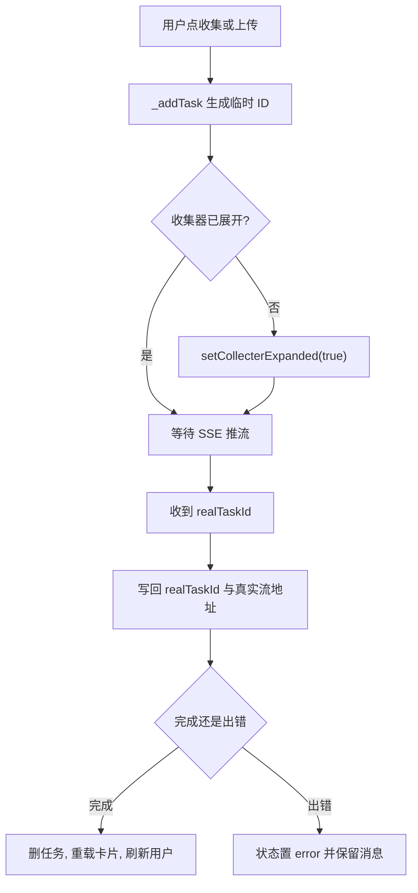
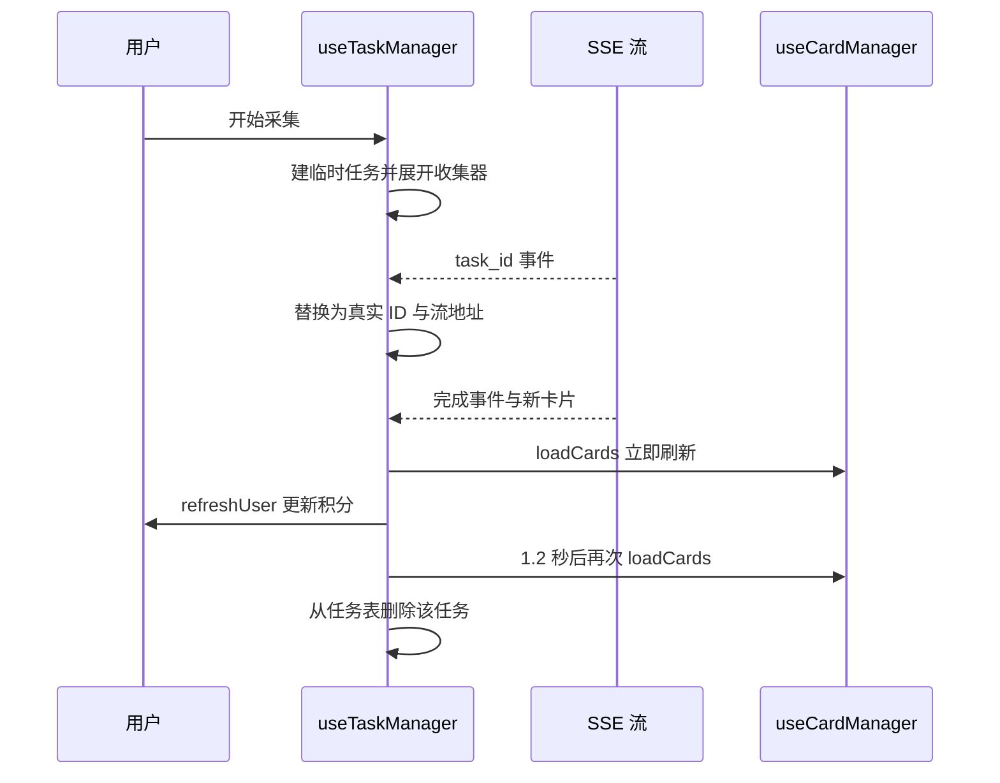

# 会话与任务 Hook 的协作

会话与卡片是一对多关系，采集任务又挂在会话下，三者之间需要互相触发刷新。这个前端用两个 Hook 承担会话与任务：`src/hooks/useSessionManager.ts`（289 行）与 `src/hooks/useTaskManager.ts`（263 行），再由外壳把它们与卡片 Hook 接起来。

协作方式是显式传参而不是互相导入。会话 Hook 接收一个"重载卡片"的回调（`src/hooks/useSessionManager.ts:52-53`），任务 Hook 接收会话 ID、卡片列表、重载卡片与刷新用户四个函数（`src/hooks/useTaskManager.ts:29-36`）。这样三个 Hook 之间没有直接依赖，刷新时机集中在外壳的调用点上。

## 两个 Hook 的输入与输出

| Hook | 输入 | 主要输出 | 定义位置 |
| --- | --- | --- | --- |
| 会话管理 | 重载卡片的回调 | 会话列表、选中会话、管理模式、导入导出与分享动作 | `src/hooks/useSessionManager.ts:16-50` |
| 任务管理 | 会话 ID、卡片数组、重载卡片、刷新用户、收集器展开状态与设置函数 | 任务表、关键词、采集与上传动作、任务恢复 | `src/hooks/useTaskManager.ts:8-27` |

任务 Hook 的入参里有三个是"别人的状态"：卡片数组用于"延申"时校验源卡片存在（`src/hooks/useTaskManager.ts:89-95`），重载卡片用于采集完成后刷新列表（`src/hooks/useTaskManager.ts:113-116`），刷新用户用于更新积分（`src/hooks/useTaskManager.ts:116`）。它自己不持有卡片数据。

## 会话状态与依赖倒置

会话 Hook 的内部状态以 `default` 会话为初始选中（`src/hooks/useSessionManager.ts:55-67`）。加载只打一次接口并整批写入（`src/hooks/useSessionManager.ts:69-77`）。

切换会话是本 Hook 里唯一直接触发卡片刷新的动作（`src/hooks/useSessionManager.ts:79-85`）：

```tsx
const handleSelectSession = useCallback(
  (sessionId: string) => {
    setSelectedSessionId(sessionId)
    loadCardsFn(sessionId)
  },
  [loadCardsFn]
)
```

回调由外壳传入，实际执行的是卡片 Hook 的 `loadCards`（`src/App.tsx:60-62`）。这就是依赖倒置：会话 Hook 不知道卡片 Hook 的存在，只要求一个签名相同的函数。代价是回调的引用必须在 Hook 之间保持稳定，否则会话 Hook 的回调依赖会频繁变化。

新增会话先追加一条再整体重载（`src/hooks/useSessionManager.ts:87-101`），重命名只替换数组中对应元素（`src/hooks/useSessionManager.ts:103-114`）。删除会话的处理最完整（`src/hooks/useSessionManager.ts:116-142`）：确认数量、并发删除、清空选择、重载列表，并且当被删的会话正是当前选中项时切回 `default` 并刷新卡片。

| 动作 | 端点或方式 | 成功后的状态更新 | 行号 |
| --- | --- | --- | --- |
| 删除 | 逐个 `deleteSession` 后 `Promise.all` | 清选择、重载列表、必要时切回 `default` | `src/hooks/useSessionManager.ts:126-135` |
| 下载 | `downloadSession` | 只切换按钮的进行中状态 | `src/hooks/useSessionManager.ts:185-198` |
| 从文件导入 | 运行时创建 `input[type=file]`，接受 `.zip` | 提示卡片数并重载列表 | `src/hooks/useSessionManager.ts:200-223` |
| 生成本地分享链接 | `shareSession` 后写剪贴板 | 提示已复制 | `src/hooks/useSessionManager.ts:225-234` |
| 分享到 Hub | 两次 `prompt` 收集简介与主题 | 提示已分享 | `src/hooks/useSessionManager.ts:236-252` |




## 任务表的结构与临时 ID

任务表是一个以任务 ID 为键的 `Map`（`src/hooks/useTaskManager.ts:37`）。每条任务的字段包括关键词、流地址、状态、创建时间、所属会话与任务类型（`src/hooks/useTaskManager.ts:43-53`）。用 `Map` 而不是数组，是为了按 ID 做增删改而不用遍历，取消与移除都能直接命中（`src/hooks/useTaskManager.ts:148-185`）。

任务开始时还没有后端 ID，前端先生成一个带时间戳的临时 ID（`src/hooks/useTaskManager.ts:64-71`）：

```tsx
const url = `/api/pipeline/collect?keyword=${encodeURIComponent(keyword)}&max_sources=5&session_id=${encodeURIComponent(selectedSessionId)}&search_level=${...}`
_addTask(`temp_${Date.now()}`, keyword, url, 'collect')
```

流式组件在收到后端推送的真实 ID 后回调 `handleTaskIdReceived`，Hook 把 `realTaskId` 与新的流地址写回同一条记录（`src/hooks/useTaskManager.ts:199-208`）：

```tsx
const task = next.get(tempId)
if (task && !task.realTaskId) {
  next.set(tempId, { ...task, realTaskId, streamUrl: getTaskStreamUrl(realTaskId) })
}
```

键仍然是临时 ID，真实 ID 存在字段里。取消与移除会优先用真实 ID（`src/hooks/useTaskManager.ts:151`、`:172`），因为后端只认它。

除了关键词采集，还有三个入口复用同一套任务结构：从卡片"延申"（`src/hooks/useTaskManager.ts:89-100`）、自定义关键词搜索并挂到卡片下（`src/hooks/useTaskManager.ts:104-111`）、上传本地文档（`src/hooks/useTaskManager.ts:73-87`）。三者都通过内部函数 `_addTask` 建任务，并在收集器收起时自动展开面板（`src/hooks/useTaskManager.ts:59-61`）。



## 采集完成后的刷新链

完成回调做了四件事（`src/hooks/useTaskManager.ts:113-130`）：立即重载卡片、刷新用户积分、再延迟 1.2 秒重载一次、把任务从表中删除。延迟重载是为了避开后端写库与前端请求之间的竞态，注释写明"确保后端 DB 已提交"。

延迟重载只用了一个引用保存定时器，新的完成事件会清掉上一个（`src/hooks/useTaskManager.ts:117-127`）：

```tsx
const timer = setTimeout(() => loadCards(), 1200)
...
const prev = _reloadTimerRef.current
if (prev) clearTimeout(prev)
_reloadTimerRef.current = timer
```

出错回调不改卡片列表，只把任务状态标成 `error` 并记下错误信息（`src/hooks/useTaskManager.ts:132-146`），同时刷新一次用户积分——采集失败也可能消耗了配额。

页面刷新后恢复未完成任务靠一次列表查询（`src/hooks/useTaskManager.ts:214-241`）：遍历后端返回的运行中任务，逐个写入任务表，并在存在任务时展开收集器。这里对每条任务单独调用一次状态更新函数（`src/hooks/useTaskManager.ts:229-233`），任务多时会产生多次渲染。

## 会话切换时任务表的处理

每条任务在创建时记录所属会话（`src/hooks/useTaskManager.ts:52`），恢复出来的任务用后端返回的会话（`src/hooks/useTaskManager.ts:227`）。渲染时按会话过滤（`src/App.tsx:790`、`src/App.tsx:532`）：

```tsx
const sessionTasks = Array.from(taskMgr.searchTasks).filter(
  ([_, t]) => t.sessionId === sessionMgr.selectedSessionId || !t.sessionId
)
```

切换会话不会取消任务，只是让不属于当前会话的任务从列表里消失。没有 `sessionId` 的任务在任何会话下都显示，这是一个兜底：早期创建的任务可能没有这个字段。



## 易错点

| 位置 | 问题 | 建议 |
| --- | --- | --- |
| `src/hooks/useTaskManager.ts:68` | 临时 ID 用毫秒时间戳，同一毫秒内连续开始两次采集会互相覆盖 | 加自增序号或用随机后缀 |
| `src/hooks/useTaskManager.ts:117-127` | 只保留最新一个延迟重载定时器，前一个任务的延迟刷新被取消 | 改成集合管理定时器，或在完成时直接以服务端返回的卡片为准 |
| `src/hooks/useTaskManager.ts:229-233` | 恢复任务时逐条更新状态，任务多时渲染次数等于任务数 | 先聚合再一次性写入 |
| `src/hooks/useSessionManager.ts:167-169` | 全选会包含 `default`，而单项切换明确跳过了它 | 与单项切换保持一致，或在删除前过滤 |
| `src/hooks/useSessionManager.ts:200-223` | 导入文件时在运行时创建 `input`，没有 React 生命周期管理 | 改为隐藏的受控 `input`，或用 `showOpenFilePicker` |
| `src/App.tsx:199-205` | 认证后的初始化副作用只依赖 `isAuthenticated`，内部调用了三个 Hook 的函数 | 补齐依赖或明确注释，避免后续闭包引用过期数据 |

## 小结

### 核心概念

* 会话 Hook 通过接收 `loadCards` 回调实现依赖倒置，不直接引用卡片 Hook（`src/hooks/useSessionManager.ts:52-53`、`src/App.tsx:60-62`）。
* 任务表是 ID 到任务的 `Map`，临时 ID 作为键、真实 ID 作为字段（`src/hooks/useTaskManager.ts:37`、`:199-208`）。
* `_addTask` 在收集器收起时自动展开面板（`src/hooks/useTaskManager.ts:59-61`）。
* 采集完成后立即重载卡片并刷新用户，再用单个定时器做延迟重载（`src/hooks/useTaskManager.ts:113-127`）。
* 页面刷新后用 `listRunningTasks` 恢复任务表（`src/hooks/useTaskManager.ts:214-241`）。
* 任务按创建时记录的会话过滤显示，未记录会话的任务始终显示（`src/App.tsx:790`）。

### 设计权衡

| 选择 | 收益 | 代价 |
| --- | --- | --- |
| Hook 之间用回调而不是互相导入 | 职责清晰，依赖方向单一 | 需要在外壳手动装配，回调引用要稳定 |
| 任务表用 `Map` 加稳定键 | 增删改都是常数时间 | 键是临时 ID，真实 ID 需要额外字段 |
| 完成后延迟重载一次 | 避开后端写库竞态 | 定时器只保留最新一个，多任务时可能漏刷新 |
| 切换会话只过滤不取消任务 | 后台任务继续跑 | 任务在界面上暂时不可见，需要用户切回会话才能查看 |
| 恢复任务逐条写状态 | 代码直观 | 任务多时渲染次数偏多 |

## 练习

### 基础题

1. 说明会话 Hook 的依赖倒置是怎么实现的，回调由谁提供，为什么不能直接导入卡片 Hook。
2. 画出一次关键词采集从创建任务到列表刷新的完整调用顺序。
3. 临时 ID 与真实 ID 分别用在什么场合，取消任务时用哪一个。

### 挑战题

4. 把延迟重载定时器改成支持多任务并发，写出需要新增的数据结构与清理逻辑，并说明组件卸载时如何避免定时器泄漏。
5. 设计一个"切换会话时把后台任务收进一个全局入口"的方案，列出需要改动的组件与状态，并说明如何在任务完成时正确刷新当前会话的卡片列表。

## 附：本页引用的路径

| 路径 | 用途 |
| --- | --- |
| /mnt/d/KnowledgeDiver/frontend/ | 前端工程根目录，文中相对路径均相对它 |
| `src/hooks/useSessionManager.ts` | 会话列表、选中、增删改查与导入导出 |
| `src/hooks/useTaskManager.ts` | 任务表、开始采集、完成回调与任务恢复 |
| `src/hooks/useCardManager.ts` | 被调用的卡片重载函数 |
| `src/App.tsx` | 三个 Hook 的装配与任务过滤渲染 |
| `src/api/session.ts` | 会话相关接口封装 |
| `src/api/task.ts` | 运行中任务列表、取消与移除 |
| `src/api/stream.ts` | 采集流水线入口 |
| `src/components/StreamingOutput.tsx` | 任务流渲染与完成、出错、取消回调 |
