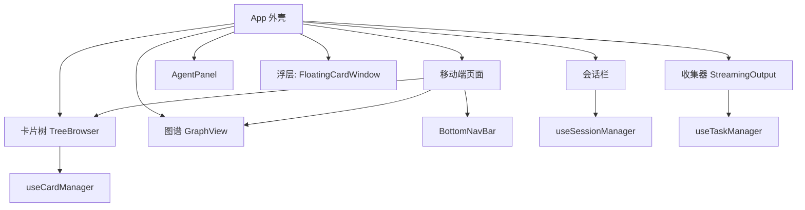
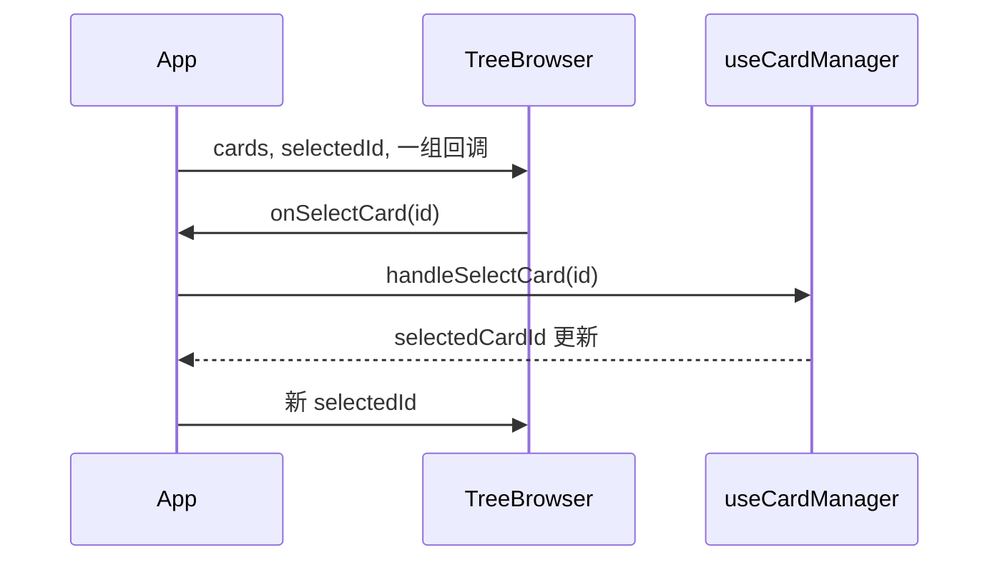

# 组件分层与移动端复用

`src/components/` 下有 31 个组件文件，其中 26 个桌面组件、5 个移动端页面。它们没有统一的目录分层，靠命名与调用关系区分角色：外壳与面板由 App 直接装配，浮层挂在最外层，页面级组件自己带数据请求，移动端页面多半是对桌面组件的再包装。

组件之间的通信方式只有两种：数据通过属性向下传，用户动作通过回调向上报。没有全局事件总线，也没有状态管理库；跨组件共享的数据全部来自那三个业务 Hook。 分层、属性约定、移动端复用、浮层与样式这五段合起来是当前的组件全貌，规模上有几个异常点。

## 组件分成五层

| 层 | 代表组件 | 行数量级 | 特点 |
| --- | --- | --- | --- |
| 外壳 | `src/App.tsx` | 861 | 持有布局、路由与浮层状态 |
| 面板 | `src/components/TreeBrowser.tsx`、`GraphView.tsx`、`AgentPanel.tsx`、`StreamingOutput.tsx` | 117 到 336 | 无状态或只持有视图局部状态 |
| 浮层 | `src/components/FloatingCardWindow.tsx`、`SearchLevelPopup.tsx`、`TutorialPopover.tsx`、`AvatarCropModal.tsx` | 82 到 296 | 由开关位控制挂载，覆盖在其他内容上 |
| 页面 | `src/components/AuthPage.tsx`、`PricingPage.tsx`、`ProfilePage.tsx`、`HubPage.tsx`、`PaymentResultPage.tsx` | 150 到 379 | 自带数据请求，独立于工作区外壳 |
| 移动端 | `src/components/mobile/` 下五个页面 | 96 到 293 | 复用桌面组件，按底部导航切换 |

面板层里最重的两个是 `src/components/GraphView.tsx`（336 行）与 `src/components/GapAnalysis.tsx`（753 行）。前者用 D3（一个数据可视化库）的力导布局渲染知识图谱（力导布局把节点当成互相排斥的粒子、把边当成弹簧，靠迭代求出稳定位置），后者是一个完整的分析弹窗，两者都只通过属性接收数据。



## 属性约定：数据向下、事件向上

所有面板组件的属性都遵循同一套形状：数据用必填属性，动作回调尽量做成可选，缺省时对应入口不渲染。卡片树的属性定义就是例子（`src/components/TreeBrowser.tsx`）：

```tsx
type TreeBrowserProps = {
  cards: Card[]
  selectedId: string | null
  onSelectCard: (id: string) => void
  onExpandSearch?: (cardId: string, title: string, searchLevel?: string) => void
  onSearchByKeyword?: (cardId: string, keyword: string) => void
  onCreateEmptyCard?: (cardId: string) => void
  onCreateOrphanCard?: () => void
  onEditCard?: (cardId: string) => void
  managementMode?: boolean
  selectedCardIds?: Set<string>
  onToggleSelect?: (cardId: string) => void
  sessionId?: string
}
```

只有三个属性是必填的。可选属性在解构时给默认值（`src/components/TreeBrowser.tsx`），于是同一个组件在桌面卡片栏、移动端卡片页与共享会话页三种场景下都能用，只是功能多少不同。

浮层组件的属性划分更明确。窗口组件把属性写成注释分组的三大块（`src/components/FloatingCardWindow.tsx`）：要显示的卡片与全量列表、窗口自身的位置尺寸、以及回调。持久化明确不在组件内做，注释写明"每个窗口编辑自己的草稿，父组件通过卡片管理器保存"。

页面组件的属性则是从外壳注入的动作与用户对象，例如 Hub 页接收导入回调、当前用户、朝向与跳转个人页的回调（`src/components/HubPage.tsx`）。



## 移动端复用桌面组件

移动端卡片页几乎没有自己的列表实现，它把卡片树原样嵌进来（`src/components/mobile/MobileCardsPage.tsx`）：

```tsx
<TreeBrowser
  cards={cards}
  selectedId={selectedCardId}
  onSelectCard={onSelectCard}
  onExpandSearch={onExpandSearch}
  onCreateEmptyCard={onCreateEmptyCard}
  onCreateOrphanCard={onCreateOrphanCard}
  onEditCard={onEditCard}
  managementMode={managementMode}
  selectedCardIds={selectedCardIds}
  onToggleSelect={onToggleSelect}
/>
```

移动端五页共用一个出口文件 `src/components/mobile/index.ts`，外壳从那里按名字引入（`src/App.tsx`）。页面之间不互相引用，切换由外壳的 `Routes` 与显示状态控制。

朝向影响的不只是外壳。Hub 页自己接收 `orientation`（`src/components/HubPage.tsx`），在内部切换浏览、详情与图谱三种移动端标签；图谱组件接收 `visible`（`src/components/GraphView.tsx`），并在变可见时重新适配视口。这是移动端"全部挂载、按显示切换"策略的配套约定。

## 浮层的两种定位做法

第一种是锚点加固定定位。会话栏的导入菜单用按钮引用取矩形，再把弹出层绝对定位到按钮下方（`src/App.tsx`）：

```tsx
const rect = sessionMgr.uploadBtnRef.current?.getBoundingClientRect()
const top = rect ? rect.bottom + 6 : 0
const left = rect ? rect.right - 200 : 0
```

同时渲染一个全屏透明层接收点击以关闭菜单（`src/App.tsx`），这是没有用 Portal 的简化做法——Portal 能把子节点渲染到父组件 DOM 之外，弹层因此不受父级 overflow 与层叠上下文限制。

第二种是覆盖层数组。浮动窗口渲染在路由之后（`src/App.tsx`），层级由每个窗口的 `zIndex` 字段决定，聚焦时把该窗口提到最前。弹窗类组件则统一用"开关位加卸载"的约定，例如搜索层级弹窗接收 `open`、`onSelect`、`onClose`。

## 样式策略：两种并存

组件样式的主流做法是每个组件旁边放一个同名 CSS 并在文件顶部引入（`src/components/FloatingCardWindow.tsx`、`src/components/TreeBrowser.tsx`），`src/components/` 下共有 21 个组件文件这样引入样式（含移动端）。全局变量与主题覆盖集中在 `src/styles.css`，浅色主题用属性选择器覆盖默认暗色。

外壳是另一个极端：`src/App.tsx` 里有 108 处内联 `style` 对象，只显式引入了一个组件样式。与之相对，图谱与卡片树完全没有内联样式。两种做法并存的结果是：改外壳样式要在 JSX 里找，改面板样式要去 CSS 文件里找。

## 组件规模分布

行数只是线索，真正该看的信号是"一个文件里是否混了多种职责"：取数与展示混在一起、桌面与移动端两套布局并存、纯展示内容与交互逻辑交织，都会让一次改动牵动整份文件。按这个标准扫一遍，本项目最大的几个组件是分析弹窗 753 行、Hub 页 379 行、图谱 336 行、定价页 304 行、浮动窗口 296 行与移动端会话页 293 行；其中分析弹窗同时包含取数、图表与多段视图，是拆分收益最明显的一个。

| 组件 | 行数 | 拆分信号 |
| --- | --- | --- |
| `GapAnalysis.tsx` | 753 | 取数与展示混在一个文件，可拆出数据 Hook |
| `HubPage.tsx` | 379 | 桌面与移动端两套布局并存 |
| `GraphView.tsx` | 336 | 力导布局与渲染逻辑可以独立 |
| `PricingPage.tsx` | 304 | 多为静态内容，可拆子组件 |
| `FloatingCardWindow.tsx` | 296 | 已按属性分组，内部仍有编辑与预览两态 |

整仓库检索不到 `React.memo` 的使用（在 `src` 下检索无命中）——`React.memo` 会按属性做浅比较，属性没变就跳过重渲染——组件重渲染全靠属性变化与状态提升来控制。

## 易错点

| 位置 | 问题 | 建议 |
| --- | --- | --- |
| `src/components/TreeBrowser.tsx` | 可选回调较多，父组件漏传时入口静默消失 | 需要的能力做成必填或加开发期警告 |
| `src/components/mobile/MobileCardsPage.tsx` | 移动端复用桌面树，管理模式的入口由外层按钮提供，两处状态必须一致 | 把管理模式入口收进同一个属性集合，避免两边判断分叉 |
| `src/components/GraphView.tsx` | 可见性变化时才重新适配视口，隐藏期间尺寸变化会带着旧尺寸恢复 | 恢复可见时同时读取容器尺寸 |
| `src/App.tsx` | 锚点菜单用固定定位加全屏透明层，滚动或布局变化后位置不会自动更新 | 简单场景可接受；复杂场景改用 Portal 或弹层组件 |
| `src/App.tsx` | 浮动窗口渲染在路由之后，层级由每个窗口字段控制 | 保持单一层级来源，不要在窗口内部再改 `zIndex` |
| `src/components/GapAnalysis.tsx` | 单文件 753 行，取数与视图耦合 | 先拆出取数 Hook，再按视图分段 |

## 小结

### 核心概念

* 组件按外壳、面板、浮层、页面、移动端五层划分，没有统一目录（`src/components/`）。
* 属性约定固定为"数据向下、事件向上"，动作回调尽量可选（`src/components/TreeBrowser.tsx`）。
* 移动端卡片页直接复用桌面卡片树（`src/components/mobile/MobileCardsPage.tsx`），五页共用一个出口文件。
* 朝向与可见性是移动端复用的两个额外属性（`src/components/HubPage.tsx`、`src/components/GraphView.tsx`）。
* 浮层有两种做法：锚点加固定定位（`src/App.tsx`）与覆盖层数组。
* 样式两种并存：组件同名 CSS 与外壳内联样式（`src/components/TreeBrowser.tsx`、`src/App.tsx`）。

### 设计权衡

| 选择 | 收益 | 代价 |
| --- | --- | --- |
| 面板组件无状态，状态集中在外壳 | 数据来源单一，便于调度 | 属性数量多，事件回调层层传递 |
| 动作回调可选 | 同一组件适配桌面、移动端与只读场景 | 漏传属性时入口消失且没有提示 |
| 移动端复用桌面列表组件 | 行为一致，减少重复实现 | 移动端专属交互要额外属性支撑 |
| 浮层不用 Portal | 结构简单，层级可控 | 定位与滚动联动需要手写 |
| 组件同名 CSS 与内联样式并存 | 局部样式独立，外壳改动快 | 排查样式要同时看两处 |

## 练习

### 基础题

1. 按五层划分列出各层的代表组件，并说明浮层与面板的区别。
2. 说明卡片树的必填属性与可选属性分别有哪些，可选属性如何影响渲染。
3. 移动端为什么需要给图谱组件传 `visible`，不传会出现什么问题。

### 挑战题

4. 把分析弹窗拆成取数 Hook 与展示组件，列出两个部分各自的输入输出，并说明拆分后如何保持现有属性接口不变。
5. 给浮层组件引入 Portal，写出需要改动的挂载点与样式，并说明层级管理会不会因此失效。

## 附：本页引用的路径

| 路径 | 用途 |
| --- | --- |
| /mnt/d/KnowledgeDiver/frontend/ | 前端工程根目录，文中相对路径均相对它 |
| `src/components/TreeBrowser.tsx` | 卡片树的属性约定与默认值 |
| `src/components/FloatingCardWindow.tsx` | 浮层属性分组与草稿归属 |
| `src/components/GraphView.tsx` | 图谱组件的可见性与视口适配 |
| `src/components/HubPage.tsx` | 按朝向切换布局的页面组件 |
| `src/components/mobile/MobileCardsPage.tsx` | 移动端复用桌面卡片树 |
| `src/components/mobile/index.ts` | 移动端五页的统一出口 |
| `src/components/GapAnalysis.tsx` | 规模最大的分析弹窗 |
| `src/components/BottomNavBar.tsx` | 移动端底部导航 |
| `src/App.tsx` | 浮层与面板的装配点 |
| `src/styles.css` | 全局变量与主题属性选择器 |
