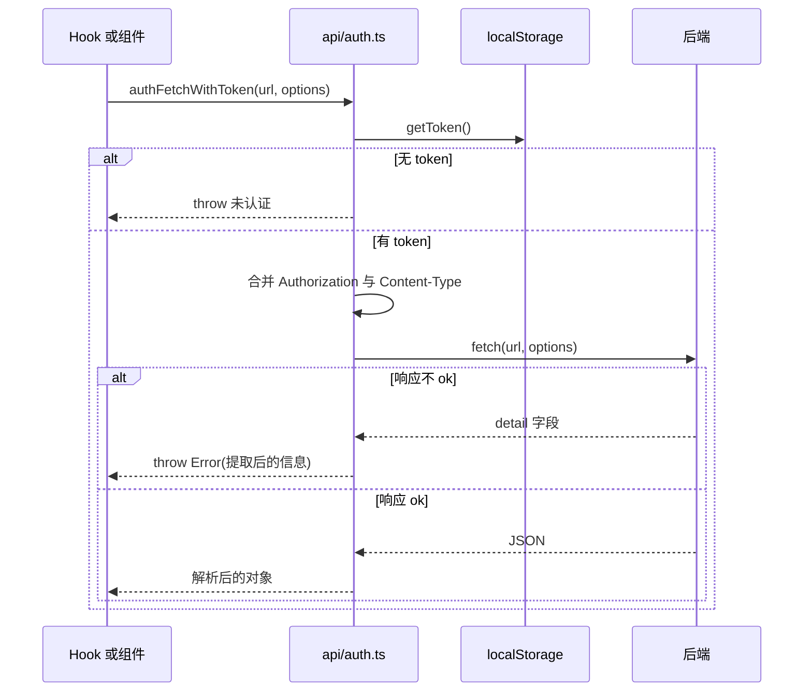
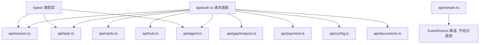

# API 客户端的统一约定

`src/api/` 下有十二个模块，除了 `auth.ts` 提供请求底座，其余都只做一件事：把某个业务域的端点包装成带类型的函数。组件与 Hook 不直接调用 `fetch`，也不自己拼 `Authorization` 头，这两件事都收在 `src/api/auth.ts` 里。

请求层没有引入 axios 之类的库，也没有统一的响应包装类型。每个函数直接声明自己的返回类型，错误通过抛 `Error` 向上传，调用方决定是弹窗、写状态还是静默忽略。 底座函数的约定、各业务域的模块清单、类型层与几处不一致，构成这条链路的全貌。

## 两个请求函数的分工

底座有两个函数。`authFetch` 允许匿名，用于登录与注册（`src/api/auth.ts`）；`authFetchWithToken` 要求必须有 token，否则直接抛错：

```tsx
export async function authFetchWithToken<T>(url: string, options: RequestInit = {}): Promise<T> {
  const token = getToken()
  if (!token) {
    throw new Error('未认证')
  }
```

两者都在调用时现读 token（`src/api/auth.ts`），而不是把 token 缓存在模块变量里。这样登录写入 token 后，下一个请求立刻生效；退出清掉 token 后，后续请求不会带着旧凭证。

内容类型上有两处差别。`authFetch` 默认写死 `Content-Type: application/json`，可以被调用方覆盖（`src/api/auth.ts`）；`authFetchWithToken` 在请求体是 `FormData` 时不设置该头，避免覆盖浏览器生成的 multipart 边界。后者还会把调用方传入的头合并进来。



## 错误信息的提取

两个函数共用同一个提取器（`src/api/auth.ts`）。后端返回的 `detail` 可能是字符串、对象数组或缺失，提取器分别处理：

```tsx
function extractErrorMessage(error: any): string {
  const detail = error.detail
  if (typeof detail === 'string') return detail || '请求失败'
  if (Array.isArray(detail)) {
    return detail.map((e: any) => e.msg || JSON.stringify(e)).join('; ')
  }
  return String(detail || '请求失败')
}
```

数组分支对应 FastAPI 的校验错误格式，每个元素取 `msg` 字段并用分号连接，界面上能直接显示。响应体不是 JSON 时用 `response.json().catch(...)` 兜底成 `{ detail: '请求失败' }`（`src/api/auth.ts`），因此提取器永远能拿到一个对象。

错误一路以 `Error` 向上抛，调用方按场景处理：Hook 里写进状态并弹 `alert`（`src/hooks/useSessionManager.ts`），或在组件里 `console.error` 后保持原状（`src/hooks/useCardManager.ts`）。

## 十二个模块的职责划分

按"资源"切分是 API 层最常见的组织方式：一个后端资源（卡片、会话、任务……）对应一个文件，文件名就是资源名，找调用点时不必先猜它属于哪个大类。切得过粗，单文件会堆满互不相关的端点；切得过细，又会出现大量只有一两个函数的文件。下表的最后一列是规模参考：

| 模块 | 职责 | 导出数 | 行数 |
| --- | --- | --- | --- |
| `src/api/auth.ts` | token 存取、登录注册、当前用户、带 token 请求底座 | 8 | 105 |
| `src/api/agent.ts` | Agent 工具调用类型、历史读取、上下文清空、两条 SSE 流 | 10 | 255 |
| `src/api/gapAnalysis.ts` | 卡片评分、质量分析、聚类报告、缺口计划、探索启动 | 14 | 189 |
| `src/api/session.ts` | 会话增删改查、卡片迁移、导入导出与分享 | 12 | 128 |
| `src/api/hub.ts` | Hub 搜索、用户主页、会话详情、点赞评论与导入 | 10 | 126 |
| `src/api/config.ts` | 模型配置的连接测试、保存与读取 | 3 | 77 |
| `src/api/payment.ts` | 下单、查询订单、取消订单、订单列表 | 7 | 55 |
| `src/api/task.ts` | 任务列表、运行中任务、取消与移除、流地址 | 6 | 33 |
| `src/api/documents.ts` | 文档上传并创建采集任务 | 1 | 33 |
| `src/api/stream.ts` | 采集流的 `EventSource` 帮助函数与消息解析 | 3 | 25 |
| `src/api/cards.ts` | 卡片原始来源读取 | 2 | 19 |

模块之间只允许依赖 `auth.ts`。例如任务模块只导入请求函数与类型（`src/api/task.ts`），卡片模块只导入请求函数（`src/api/cards.ts`）。



## 类型层与返回契约

类型集中在 `src/types/`，按域拆分：认证 28 行、配置 17 行、卡片 14 行、会话 14 行、任务流水线 51 行、Hub 46 行。请求函数用泛型声明返回类型，例如读取原始来源时把后端的 `{ sources: ... }` 包一层（`src/api/cards.ts`）：

```tsx
const data = await authFetchWithToken<{ sources: RawSource[] }>(
  `/api/cards/${cardId}/raw?${params}`,
)
return data.sources || []
```

这种"在 API 层解包"的写法只出现在少数函数上，多数函数直接把数组或对象返回给调用方。`|| []` 兜底说明该字段可能缺失，调用方不必再判空。

`src/api/stream.ts` 是唯一绕过底座的文件，它直接创建 `EventSource` 拼查询串。这条路径没有携带 token，属于早期实现的遗留；当前任务流的实际入口在任务管理 Hook 与 Agent 数据层里（`src/hooks/useTaskManager.ts`）。

## 易错点

| 位置 | 问题 | 建议 |
| --- | --- | --- |
| `src/api/auth.ts` | 非 JSON 响应体用固定文案兜底，服务端文本错误会丢失 | 先读一次 `response.text()`，失败再退回固定文案 |
| `src/api/auth.ts` | 提取器参数类型是 `any`，`detail` 为对象时会被 `String` 成 `[object Object]` | 补对象分支，取 `message` 或 `msg` 字段 |
| `src/api/stream.ts` | `EventSource` 路径不带 token，且与服务端要求的鉴权方式不一致 | 与 Agent 流一样改用 `fetch` 加流式读取 |
| `src/api/auth.ts` | `authFetch` 默认写死 JSON 头，上传类请求需要显式覆盖 | 与另一个函数一样按 `FormData` 判断 |
| `src/api/task.ts` | 会话参数可选时返回全部任务，容易把别的会话数据混进界面 | 调用方始终传会话 ID，或在返回处标注来源 |

## 小结

### 核心概念

* 请求底座有两个函数：允许匿名的 `authFetch` 与强制登录的 `authFetchWithToken`（`src/api/auth.ts`）。
* token 每次调用现读，登录与退出都能立刻影响后续请求（`src/api/auth.ts`）。
* `FormData` 请求不设置 `Content-Type`，避免覆盖 multipart 边界（`src/api/auth.ts`）。
* 错误统一由 `extractErrorMessage` 提取为可读字符串（`src/api/auth.ts`）。
* 十二个业务模块只依赖 `auth.ts`，各自把端点包装成带类型函数（`src/api/cards.ts`、`src/api/task.ts`）。
* 类型集中在 `src/types/`，按域拆成六个文件。

### 设计权衡

| 选择 | 收益 | 代价 |
| --- | --- | --- |
| 不引入请求库 | 依赖少，行为完全可控 | 拦截器、重试、取消要自己写 |
| token 放 `localStorage` 并在调用时读取 | 请求函数无需感知登录状态 | 无法处理过期，只能等 401 |
| 错误直接抛 `Error` | 调用方可以自行决定提示方式 | 缺少错误码，无法按状态分流 |
| API 层解包部分响应 | 调用方少写一层判空 | 解包规则不统一，读代码要逐个确认 |
| 类型按域拆分而不共用包装 | 每个函数的契约一目了然 | 跨域重复的字段结构会各写一遍 |

## 练习

### 基础题

1. 说明两个请求函数在 token 与内容类型上的差别，以及各自适合的场景。
2. 写出 `extractErrorMessage` 处理的三类 `detail` 形态，并说明数组分支为什么用 `msg`。
3. 列出 `src/api/` 下各模块的职责，指出哪些模块允许互相引用。

### 挑战题

4. 给请求底座加上统一的重试与超时，写出需要新增的参数与实现位置，并说明如何避免对写操作重复提交。
5. 把错误从 `Error` 改成带状态码的错误类型，列出需要修改的函数与所有受影响调用点，并说明现有提示逻辑要如何兼容。

## 附：本页引用的路径

| 路径 | 用途 |
| --- | --- |
| /mnt/d/KnowledgeDiver/frontend/ | 前端工程根目录，文中相对路径均相对它 |
| `src/api/auth.ts` | 请求底座、token 与错误提取 |
| `src/api/cards.ts` | 卡片原始来源接口 |
| `src/api/task.ts` | 任务列表与取消移除接口 |
| `src/api/stream.ts` | 采集流的早期 `EventSource` 实现 |
| `src/api/documents.ts` | 文档上传接口 |
| `src/api/session.ts` | 会话相关接口 |
| `src/types/` | 按域拆分的类型定义 |
