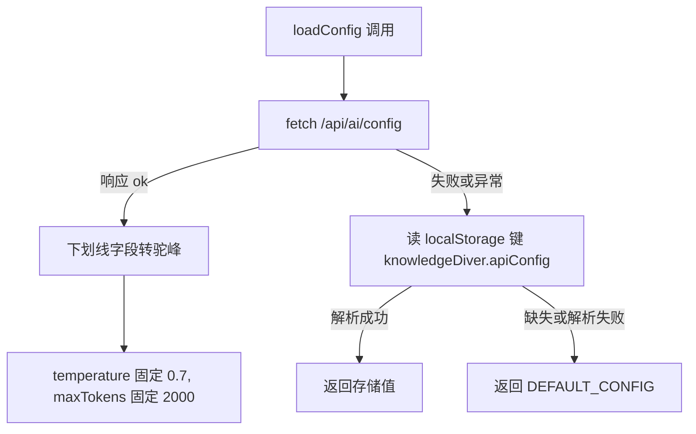
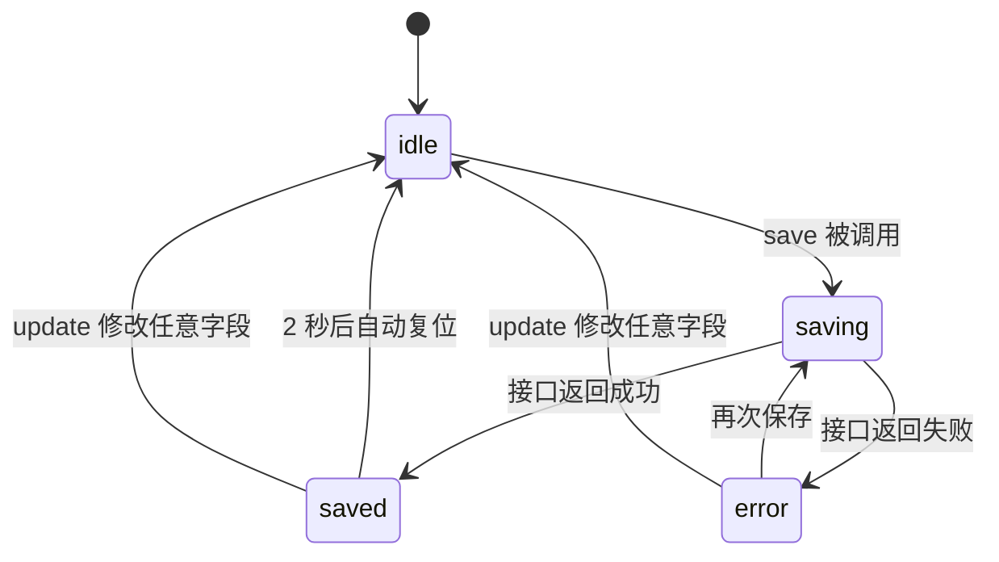

# 配置的读取、校验与保存

模型配置是一个表单，字段有接口地址、密钥、模型名、温度、最大 token 与代理端口，共六项（`src/types/config.ts`）。它同时存在三个地方：后端、浏览器存储与组件状态。`src/hooks/useConfig.ts` 负责三者的同步，`src/api/config.ts` 负责两个端点与本地存储的读写，`src/utils/validation.ts` 提供五个逐项校验函数。

消费方只有一个：配置页组件 `src/components/ApiConfig.tsx`。 读取顺序与温度、token 两个字段的处理是理解成本最高的部分。

## 配置的三级读取顺序

`loadConfig` 先请求后端，失败或响应异常时读浏览器存储，再兜底到默认值（`src/api/config.ts`）。后端成功时会重新组装字段，其中两个字段是写死的：

```tsx
return {
  apiUrl: data.api_url,
  apiKey: data.api_key,
  model: data.model,
  temperature: 0.7,
  maxTokens: 2000,
  proxyPort: data.proxy_port ?? DEFAULT_CONFIG.proxyPort,
}
```

后端返回的下划线命名在这里映射成前端的驼峰命名，密钥与模型名也一并回填。温度与最大 token 不采用后端值，而是固定常量，且最大 token 的常量是 2000，与默认配置里的 4096 不一致（`src/types/config.ts`）。

浏览器存储使用固定键名（`src/api/config.ts`），内容就是配置对象的 JSON。解析失败时只打警告，随后落到默认值。



## Hook 内部的三组状态

`useConfig` 里有五份状态，按用途分三组（`src/hooks/useConfig.ts`）：

| 分组 | 状态 | 初始值 |
| --- | --- | --- |
| 表单数据 | `config` | `DEFAULT_CONFIG` |
| 连接测试 | `testState`、`testError` | `idle` 与 `null` |
| 保存 | `saveState`、`saveError` | `idle` 与 `null` |

挂载时用一个 `mounted` 标志防止卸载后写状态（`src/hooks/useConfig.ts`）：

```tsx
React.useEffect(() => {
  let mounted = true
  (async () => {
    try {
      const loaded = await loadFromStorage()
      if (mounted) setConfig(loaded ?? DEFAULT_CONFIG)
    } catch (err) { console.warn('Config load on mount failed:', err) }
  })()
  return () => { mounted = false }
}, [])
```

这个守卫只出现在挂载加载里。手动重新加载的 `load` 没有守卫（`src/hooks/useConfig.ts`），如果用户在请求返回前离开页面，仍会调用一次状态更新函数（React 18 之后不会再警告，但状态写入无效）。

## 保存流程与状态机

保存有三个状态：进行中、已保存、出错（`src/hooks/useConfig.ts`）。`save` 先把状态置为 `saving`，调用接口，再按结果分流：

```tsx
setSaveState('saving')
const result = await saveToStorage(config)
if (result.success) {
  setSaveState('saved')
  setTimeout(() => setSaveState('idle'), 2000)
} else {
  setSaveState('error')
  setSaveError(result.error ?? '保存失败')
}
```

"已保存"是一个短暂提示，两秒后自动回到空闲。定时器没有保存引用，组件卸载时不会被清理；在提示显示期间离开页面，两秒后仍会触发一次状态更新。

表单编辑会把保存状态重置为空闲（`src/hooks/useConfig.ts`），这样修改字段后提示不会停留在"已保存"。重置默认值只改组件状态，不写后端也不写存储，要落盘还得再点一次保存。



## 校验规则

校验由五个独立函数提供，Hook 把它们组合成一个返回错误列表的函数（`src/hooks/useConfig.ts`）：

```tsx
const validate = (): ValidationResult => {
  const errors: string[] = []
  if (!validateApiUrl(config.apiUrl)) errors.push('API URL 无效')
  if (!validateApiKey(config.apiKey)) errors.push('需要填写 API Key')
  if (!validateTemperature(config.temperature)) errors.push('Temperature 必须在 0 到 2 之间')
  // …另外两项：模型名、最大 token
  return { valid: errors.length === 0, errors }
}
```

代码块是节选，五个校验函数分别对应：

| 字段 | 校验函数 | 规则 | 位置 |
| --- | --- | --- | --- |
| 接口地址 | `validateApiUrl` | 必须能构造出有效 URL | `src/utils/validation.ts` |
| 密钥 | `validateApiKey` | 非空 | `src/utils/validation.ts` |
| 模型名 | `validateModel` | 非空 | `src/utils/validation.ts` |
| 温度 | `validateTemperature` | 取值在 0 到 2 之间 | `src/utils/validation.ts` |
| 最大 token | `validateMaxTokens` | 大于 0 | `src/utils/validation.ts` |

校验是纯函数，读取的是当前闭包里的 `config`，由调用方决定何时触发。它不返回字段到错误的映射，只有一串按顺序拼接的中文提示（`src/hooks/useConfig.ts`），表单要逐项标红需要再拆一层。

## 连接测试

连接测试把整个配置对象发给后端（`src/api/config.ts`），后端返回体的结构有两种约定：

```tsx
const data = await res.json().catch(() => ({} as any))
if (typeof data?.success === 'boolean') {
  if (data.success) return { success: true }
  return { success: false, error: data.error ?? '连接测试失败' }
}
return { success: true }
```

显式的 `success` 布尔值优先；没有这个字段时按成功处理，因为能返回 2xx 且能解析 JSON 已经说明网关通了。网络异常与响应非 2xx 都走失败分支，错误文案取响应文本或 `HTTP 状态码`（`src/api/config.ts`）。

Hook 层把测试状态映射成四个值：`loading` 时置为加载中，成功置为 `success`，失败写入 `testError`（`src/hooks/useConfig.ts`）。与保存一样，"成功"没有自动复位，会一直显示到下一次测试。

## 易错点

| 位置 | 问题 | 建议 |
| --- | --- | --- |
| `src/api/config.ts` | 读取时写死温度 0.7 与最大 token 2000，用户在表单里保存的 4096 会被覆盖 | 采用后端返回值，缺失时再回落到 `DEFAULT_CONFIG` |
| `src/types/config.ts` | 默认最大 token 是 4096，与读取时常量不一致 | 统一为一个常量，两处引用同一来源 |
| `src/api/config.ts` | 配置接口直接调用 `fetch`，不带 token，与其他模块的鉴权方式不一致 | 确认这些端点是否应当放行匿名；若需登录，改用带 token 的请求函数 |
| `src/hooks/useConfig.ts` | `setTimeout` 没有清理，卸载后仍会写一次状态 | 保存定时器引用并在卸载时清除 |
| `src/hooks/useConfig.ts` | 手动重新加载没有 `mounted` 守卫，与挂载加载不一致 | 抽出带守卫的加载函数供两处复用 |
| `src/api/config.ts` | 连接测试把密钥放在请求体里发给自家后端 | 属预期用法，但要确认后端不把密钥写进日志 |

## 小结

### 核心概念

* 配置读取顺序是后端、浏览器存储、默认值三级（`src/api/config.ts`）。
* Hook 内有表单数据、连接测试状态与保存状态三组状态（`src/hooks/useConfig.ts`）。
* 挂载加载用 `mounted` 标志避免卸载后写状态（`src/hooks/useConfig.ts`）。
* 保存有四态状态机，成功后两秒自动复位（`src/hooks/useConfig.ts`）。
* 编辑字段会把保存提示重置为空闲（`src/hooks/useConfig.ts`）。
* 校验由五个纯函数组合，提示是扁平列表（`src/hooks/useConfig.ts`）。

### 设计权衡

| 选择 | 收益 | 代价 |
| --- | --- | --- |
| 读取优先服务端 | 多端配置一致 | 服务端不可用时用本地值，可能与服务端已保存的配置不同 |
| 保存成功后写本地存储 | 离线打开表单能看到上次值 | 两处数据可能不同步，没有版本或时间戳 |
| 保存提示自动复位 | 界面不会长期显示成功 | 需要定时器清理，卸载后仍会触发 |
| 校验返回扁平错误列表 | 调用简单 | 表单无法按字段定位错误 |
| 连接测试按整份配置请求 | 测试的是真实生效参数 | 密钥会经过自家后端 |

## 练习

### 基础题

1. 说明 `loadConfig` 的三级读取顺序，以及每一级的触发条件。
2. 列出 `useConfig` 的五份状态与初始值，并指出哪两份属于同一组。
3. 保存成功后界面在两秒内显示什么，两秒后回到什么状态。

### 挑战题

4. 修掉"读取时覆盖用户保存的温度与 token"的问题，写出需要修改的代码与回落逻辑，并说明如何验证保存 4096 之后刷新页面仍是 4096。
5. 把校验改成按字段返回错误，列出需要修改的函数签名与调用点，并说明表单如何在不引入校验库的前提下完成逐项提示。

## 附：本页引用的路径

| 路径 | 用途 |
| --- | --- |
| /mnt/d/KnowledgeDiver/frontend/ | 前端工程根目录，文中相对路径均相对它 |
| `src/hooks/useConfig.ts` | 配置表单的状态、保存与校验组合 |
| `src/api/config.ts` | 连接测试、保存与三级读取 |
| `src/types/config.ts` | 配置类型与默认值 |
| `src/utils/validation.ts` | 五个逐项校验函数 |
| `src/components/ApiConfig.tsx` | 配置页组件，本 Hook 的唯一消费方 |
