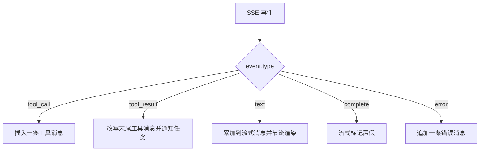
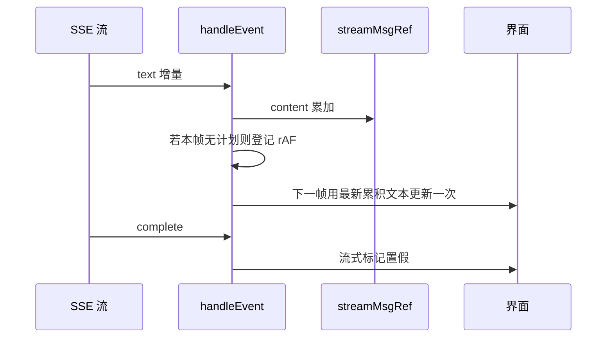

# Agent 数据层与消息历史

Agent 栏有桌面嵌入与移动端抽屉两种形态，两者共用同一个 Hook：`src/hooks/useAgent.ts`，291 行（`src/components/AgentPanel.tsx`、`src/components/AgentDrawer.tsx`）。它对外只暴露四样东西：消息数组、是否流式进行中、发送与清空。

数据来源分成两条：进入会话时拉取历史消息，事件通过 SSE 推来。 消息模型、历史转换、事件处理与渲染节流是这里的内容；SSE 的流解析、超时判定与端点细节见 `src/api/agent.ts`。

## 消息与事件的类型

消息模型有三个角色：用户、Agent 与工具，并额外带工具名、工具是否成功、是否正在流式输出与时间戳四个可选字段（`src/api/agent.ts`）：

```tsx
export interface AgentMessage {
  id: string;
  role: 'user' | 'agent' | 'tool';
  content: string;
  toolName?: string;
  toolSuccess?: boolean;
  isStreaming?: boolean;
  timestamp: number;
}
```

事件是五类判别联合（`src/api/agent.ts`）：工具调用、工具结果、文本增量、完成与错误。工具结果的载荷结构固定，包含工具名、是否成功、摘要与可选数据；摘要由后端生成，前端只在缺少数据时使用它。



## 历史消息的转换

历史接口返回原始的后端消息格式，字段名与前端模型不同（`src/api/agent.ts`）。转换函数做三件事：

| 后端角色 | 处理方式 | 结果 |
| --- | --- | --- |
| `system` | 直接跳过（`src/api/agent.ts`） | 不进入消息列表 |
| `user` | 取内容 | 用户消息（`src/api/agent.ts`） |
| `assistant` 带工具调用 | 每个工具调用生成一条工具消息 | `role: 'tool'`，文案为"调用工具"（`src/api/agent.ts`） |
| `assistant` 带正文 | 取内容 | Agent 消息（`src/api/agent.ts`） |
| `tool` | 取内容并把成功标记置真 | 工具结果消息（`src/api/agent.ts`） |

时间戳是合成的。后端消息不带时间，转换时用当前时间减去消息总数作为起点，再每条递增一秒（`src/api/agent.ts`）：

```tsx
let ts = Date.now() - raw.length * 1000
for (const m of raw) {
  ts += 1000
  ...
}
```

这样界面上相对时间会显示成"若干条消息按秒排列"，与真实发送时间无关，只用于排序稳定。历史读取失败时返回空数组（`src/api/agent.ts`），界面表现为没有历史，不弹错误。

## 工具结果的中文化摘要

后端返回的摘要字段是英文的通用描述，前端按工具名覆盖成中文提示。这类"把机器可读的结果转成人能读的文案"放在数据层做，比散进各个展示组件更好维护：工具到文案的映射只有一份，组件不必理解每种工具返回什么。下面是 `toolSummary` 的骨架（`src/hooks/useAgent.ts`）：

```tsx
const prefix = r.success ? '✅' : '❌'
switch (r.tool) {
  case 'get_card_info': {
    const title = (r.data as Record<string, unknown> | undefined)?.title
    return `${prefix} 已读取卡片「${title || '未知'}」`
  }
  case 'list_cards': {
    const total = (r.data as Record<string, unknown> | undefined)?.total
    return `${prefix} 知识库共 ${total ?? '?'} 张卡片`
  }
  // …其余四个 case 省略
  default:
    return `${prefix} ${r.summary}`
}
```

六个工具各有分支，成功与失败用同一个前缀变量（`src/hooks/useAgent.ts`）：

| 工具名 | 摘要内容 | 位置 |
| --- | --- | --- |
| `get_card_info` | 读取到的卡片标题 | `src/hooks/useAgent.ts` |
| `search_similar_cards` | 相关卡片条数与前五条标题 | `src/hooks/useAgent.ts` |
| `search_by_keyword` | 生成的卡片数与标题 | `src/hooks/useAgent.ts` |
| `expand_from_card` | 扩展生成的卡片数与标题 | `src/hooks/useAgent.ts` |
| `list_cards` | 知识库总卡片数 | `src/hooks/useAgent.ts` |
| `get_linked_cards` | 关联卡片数量或"没有关联" | `src/hooks/useAgent.ts` |

未命中的工具走默认分支，直接用后端摘要（`src/hooks/useAgent.ts`）。数据访问统一写成 `(r.data as Record<string, unknown> | undefined)?.字段`，因为工具返回的结构按工具而变，没有一个共同的类型。

## 事件处理与渲染节流

`handleEvent` 是一个按事件类型分发的回调（`src/hooks/useAgent.ts`），其中三处需要单独说明。

工具调用事件会插到正在流式的消息之前（`src/hooks/useAgent.ts`），这样界面上工具提示出现在正文上方，而不是被追加到末尾。若当前没有流式消息，就直接追加。

工具结果事件改写数组末尾那条同名的工具消息（`src/hooks/useAgent.ts`），并把结果里的任务信息上报给外壳：

```tsx
const last = updated[updated.length - 1]
if (last?.role === 'tool' && last.toolName === event.data.tool) {
  updated[updated.length - 1] = { ...last, content: toolSummary(event.data), toolSuccess: event.data.success }
}
const taskId = (event.data.data as ...)?.task_id
if (taskId && onTaskCreated) onTaskCreated(taskId, keyword, taskType)
```

文本增量不直接写状态，而是累加到一个引用对象上，再用 `requestAnimationFrame` 把渲染压到每帧最多一次（`src/hooks/useAgent.ts`）。注释给出了原因：Markdown 渲染每次都要重新解析全部累积文本。



## 两条订阅路径与发送分支

进入会话时同时做两件事：拉历史消息、订阅后台仍在运行的循环（`src/hooks/useAgent.ts`）。用一个引用记住已加载的会话，避免同一个会话重复拉取；订阅函数先把上一次的订阅中止，再新建控制器。后台循环的首个事件如果是错误，说明没有在跑的循环，直接返回。

消息数组有上限，超过一百条时截取最后一百条（`src/hooks/useAgent.ts`）：

```tsx
useEffect(() => {
  if (messages.length > 100) setMessages(prev => prev.slice(-100))
}, [messages.length > 100 ? messages.length : 0])
```

依赖写成 `messages.length > 100 ? messages.length : 0`，是为了让超过一百条之前这个值恒为 0、效果不重跑，越过阈值后才按长度变化重新运行。注释写明截断是为了避免浏览器内存耗尽。

发送有三条路径（`src/hooks/useAgent.ts`）：

| 场景 | 行为 | 位置 |
| --- | --- | --- |
| 空闲 | 新建用户消息与占位 Agent 消息，走新流 | `src/hooks/useAgent.ts` |
| 流进行中且注入成功 | 只追加用户消息，交给后端桥接 | `src/hooks/useAgent.ts` |
| 流进行中但注入失败 | 中止旧流，按空闲路径重启 | `src/hooks/useAgent.ts` |

走新流之前会中止后台循环订阅，避免两个订阅者抢同一队列（`src/hooks/useAgent.ts`）。取消只调用控制器中止，卸载时同时中止两条流并取消未执行的动画帧。

## 易错点

| 位置 | 问题 | 建议 |
| --- | --- | --- |
| `src/api/agent.ts` | 历史消息时间戳按条数合成，与真实时间无关 | 若后端能提供时间，改为读取真实字段 |
| `src/hooks/useAgent.ts` | 上限效果的依赖表达式只在跨过阈值时变化，恰好等于一百条时不会触发 | 直接依赖 `messages.length`，条件写在回调内 |
| `src/hooks/useAgent.ts` | 工具结果只改写数组末尾同名消息，事件乱序时匹配不到 | 用工具调用 ID 关联而不是靠末尾位置 |
| `src/hooks/useAgent.ts` | 文本累加到引用对象上，不触发渲染，只有 rAF 回调用最新值 | 保留该设计，但不要在其他地方直接读该引用做判断 |
| `src/hooks/useAgent.ts` | 工具结果上报任务时从 `data` 里取值，字段名缺失就回落到工具名当关键词 | 明确约定字段，缺失时不要用工具名冒充关键词 |
| `src/api/agent.ts` | 清空上下文失败只返回假值，调用方仍会清空本地消息 | 失败时保留本地消息或提示用户 |

## 小结

### 核心概念

* Agent 消息有三个角色与四个可选字段（`src/api/agent.ts`）。
* SSE 事件是五类判别联合，工具结果载荷结构固定（`src/api/agent.ts`）。
* 历史转换跳过系统消息，把工具调用展开成独立消息（`src/api/agent.ts`）。
* 工具结果按工具名映射成中文摘要（`src/hooks/useAgent.ts`）。
* 文本增量累加到引用并每帧最多渲染一次（`src/hooks/useAgent.ts`）。
* 发送分空闲、注入成功、注入失败三条路径（`src/hooks/useAgent.ts`）。

### 设计权衡

| 选择 | 收益 | 代价 |
| --- | --- | --- |
| 历史在 API 层转成前端模型 | 组件只认一种消息结构 | 后端格式变化要在转换函数里同步 |
| 工具结果按工具名写中文摘要 | 提示更贴合业务 | 新增工具会落到默认分支，显示英文摘要 |
| 文本增量用引用加 rAF 节流 | 长回复不再逐字符重渲染 | 状态与引用两份数据需要保持一致 |
| 流进行中优先注入 | 用户可在同一循环里追加指令 | 注入失败要能回退到重启路径 |
| 消息数组限制一百条 | 避免长时间会话占满内存 | 更早的历史从界面上消失，需要重进会话 |

## 练习

### 基础题

1. 列出 Agent 消息的四个可选字段，并说明各自在什么事件里被写入。
2. 说明历史消息里工具调用与工具结果分别变成什么角色，系统消息如何处理。
3. 文本增量为什么先写引用再请求动画帧，而不是直接更新状态。

### 挑战题

4. 把工具结果的匹配从"数组末尾"改成按调用 ID 关联，写出需要补充的字段与事件处理改动，并说明乱序到达时如何验证。
5. 设计一个跨会话缓存历史消息的方案，列出缓存键、失效条件与清理策略，并说明一百条上限在新方案下如何处理。

## 附：本页引用的路径

| 路径 | 用途 |
| --- | --- |
| /mnt/d/KnowledgeDiver/frontend/ | 前端工程根目录，文中相对路径均相对它 |
| `src/hooks/useAgent.ts` | Agent 消息状态、事件处理与发送 |
| `src/api/agent.ts` | 消息类型、历史转换与两条 SSE 生成器 |
| `src/components/AgentPanel.tsx` | 桌面嵌入式 Agent 栏 |
| `src/components/AgentDrawer.tsx` | 移动端 Agent 抽屉 |
| `src/types/pipeline.ts` | 任务流水线类型，与工具结果字段相关 |
