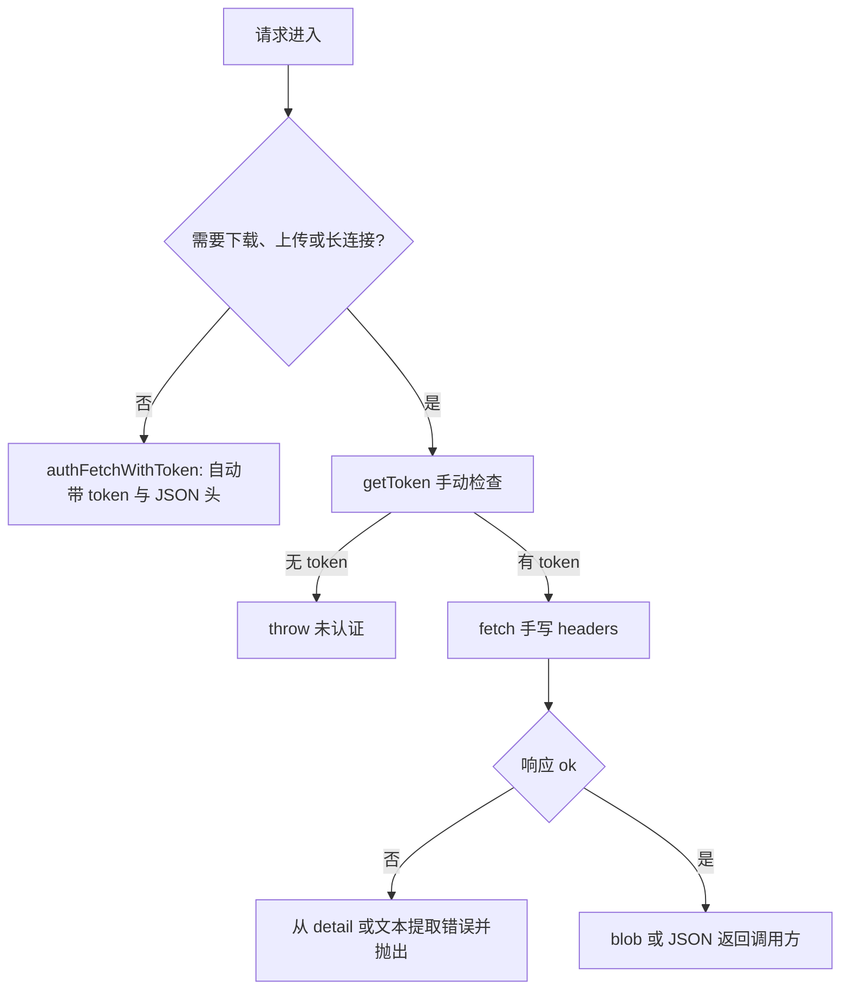
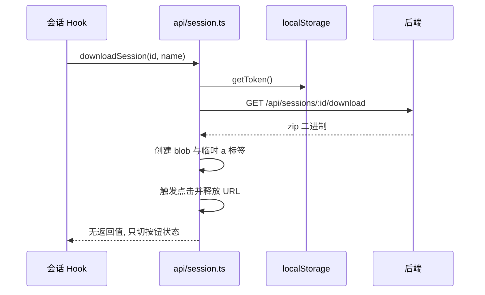

# 分析与运营类接口

除了卡片、会话与任务这些高频接口，前端还接了两组端点：一组做质量分析与缺口探索，一组做社区分享与订单支付。前者返回结构复杂，字段多达十几个；后者偏运营，动作多而返回简单。

这两组接口还暴露了请求层的第二条路径。需要下载文件、上传表单或长期保持连接的请求没有走 `authFetchWithToken`，而是自己读取 token 再调用 `fetch`。 先看分析接口的数据结构，再看第二条路径的写法与它带来的差异。

## 分析接口的输入输出

分析的核心是单卡评分。一个卡片评分包含九个数值字段与两组维度（`src/api/gapAnalysis.ts:3-23`）：

| 字段组 | 内容 | 行号 |
| --- | --- | --- |
| 总分 | `gap_score`、`quality_score` | `src/api/gapAnalysis.ts:5-6` |
| 分项分 | 结构、语义、图谱、置信度四个分数 | `src/api/gapAnalysis.ts:7-10` |
| 内容维度 | 内容、来源、关联三项 | `src/api/gapAnalysis.ts:11-15` |
| 图谱维度 | 中介中心性、聚类系数、社区规模 | `src/api/gapAnalysis.ts:16-20` |

整份分析结果是聚合值加两张榜单（`src/api/gapAnalysis.ts:24-37`）：总数、各分项平均分、最弱卡片数量与占比，以及最弱与最强各一批卡片。请求函数只做参数拼装（`src/api/gapAnalysis.ts:38-47`）：

```tsx
export async function getGapAnalysis(sessionId: string, gapThreshold: number = 0.5): Promise<GapAnalysisResult> {
  const params = new URLSearchParams({ session_id: sessionId, gap_threshold: gapThreshold.toString() })
  return authFetchWithToken<GapAnalysisResult>(`/api/pipeline/gap-analysis?${params}`)
}
```

聚类报告是另一份结果，包含聚类维度、聚类明细与覆盖不足的卡片（`src/api/gapAnalysis.ts:49-85`），并在此之上生成缺口补齐计划，计划项带目标聚类与建议动作（`src/api/gapAnalysis.ts:86-96`）。三个请求函数分别负责取报告、生成计划与启动探索（`src/api/gapAnalysis.ts:97`、`:102`、`:116`）。

## 缺口驱动探索用长请求

探索启动函数把八个参数拼进查询串，其中六个允许调用方覆盖，未传时用默认值（`src/api/gapAnalysis.ts:116-140`）：

| 参数 | 默认值 | 说明 |
| --- | --- | --- |
| `max_sources` | 5 | 每轮最多抓取的来源数 |
| `gap_threshold` | 0.5 | 触发补齐的缺口阈值 |
| `structure_threshold` | 0.5 | 结构分阈值 |
| `max_iterations` | 3 | 最多迭代轮数 |
| `search_level` | `default` | 检索深度 |
| `search_provider` | `bocha` | 检索提供方 |

这个函数不走底座，而是自己读 token 并校验（`src/api/gapAnalysis.ts:130-131`），再发起请求。函数里创建了一个 `AbortController` 并传给请求（`src/api/gapAnalysis.ts:141-145`），但没有任何地方调用它的 `abort`，也没有把外部信号接进来。响应非 2xx 时读文本作为错误信息（`src/api/gapAnalysis.ts:147-150`），与底座的做法一致。



## 第二条请求路径的写法

会话下载是这条路径里最完整的一例（`src/api/session.ts:69-88`）：手动读 token、请求、检查状态、取 `blob`、创建临时链接并触发点击，最后释放对象地址。

```tsx
const blob = await response.blob()
const url = window.URL.createObjectURL(blob)
const a = document.createElement('a')
a.href = url
a.download = `${sessionName}.zip`
document.body.appendChild(a)
a.click()
document.body.removeChild(a)
window.URL.revokeObjectURL(url)
```

下载失败时它直接取 `error.detail` 当字符串用（`src/api/session.ts:76-79`），而底座用的是能处理数组的提取器。文档上传同样是手写路径，用 `FormData` 装文件与会话 ID（`src/api/documents.ts:8-33`），错误只取 `detail` 一次。



其余手写路径的模块还有缺口探索（`src/api/gapAnalysis.ts:130-145`）与文档上传（`src/api/documents.ts:19-27`）。它们的共同点是先做 token 检查、再自己拼头，错误处理各写一遍。

## Hub 与支付接口

Hub 模块是动作最多的一个，十个函数覆盖搜索、用户主页、会话详情、分享、导入、点赞与评论（`src/api/hub.ts:6-126`）：

| 动作 | 函数 | 行号 |
| --- | --- | --- |
| 搜索 | `searchHub` | `src/api/hub.ts:6-24` |
| 读用户主页 | `getUserProfile` | `src/api/hub.ts:32-36` |
| 读用户会话列表 | `getUserSessions` | `src/api/hub.ts:38-50` |
| 读会话详情 | `getHubSession` | `src/api/hub.ts:52-56` |
| 分享与取消分享 | `shareToHub`、`unshareFromHub` | `src/api/hub.ts:58-76` |
| 导入到本地 | `importFromHub` | `src/api/hub.ts:78-86` |
| 点赞与点踩 | `likeHubSession`、`dislikeHubSession` | `src/api/hub.ts:88-100` |
| 评论增删 | `addHubComment`、`deleteHubComment` | `src/api/hub.ts:102-126` |

点赞与点踩的返回结构一致，都是最新的两个计数（`src/api/hub.ts:88-100`），因此组件可以在不重新拉详情的前提下更新数字。

支付模块只有四个函数：下单、查单、取消与列表（`src/api/payment.ts:29-55`）。订单有两种类型：创建结果只带订单号与支付参数（`src/api/payment.ts:3-12`），订单详情在此基础上加创建时间与状态（`src/api/payment.ts:13-28`）。查单返回详情类型，取消与列表返回较轻的结构。

## 易错点

| 位置 | 问题 | 建议 |
| --- | --- | --- |
| `src/api/gapAnalysis.ts:141-145` | 创建了 `AbortController` 却从不调用 `abort`，也没有把外部信号接入 | 把信号做成参数，或在超时后主动中止 |
| `src/api/session.ts:76-79` | 直接读 `detail` 当字符串，后端返回校验数组时会显示成对象字样 | 复用底座的错误提取器 |
| `src/api/documents.ts:29-31` | 与上一处相同的单一 `detail` 处理 | 统一错误提取，避免每个模块各写一遍 |
| `src/api/gapAnalysis.ts:38-47` | 阈值默认 0.5 写在前端，与后端默认值需要保持一致 | 后端默认值变化时同步修改，或在接口文档里声明 |
| `src/api/hub.ts:88-100` | 点赞与点踩各自实现一遍，仅端点不同 | 抽成公共函数，减少重复 |
| `src/api/payment.ts:43-45` | 查单没有轮询或超时约定，调用方要自己循环 | 在 API 层提供带退避的等待函数 |

## 小结

### 核心概念

* 卡片评分由九个数值字段与两组维度组成（`src/api/gapAnalysis.ts:3-23`）。
* 分析结果是聚合值加最弱、最强两张榜单（`src/api/gapAnalysis.ts:24-37`）。
* 缺口探索把六个可覆盖参数拼进查询串（`src/api/gapAnalysis.ts:116-140`）。
* 下载、上传与长请求走手写 `fetch` 加手动 token 检查（`src/api/session.ts:69-88`、`src/api/documents.ts:8-33`）。
* Hub 模块有十个函数，点赞与点踩返回同样的计数结构（`src/api/hub.ts:88-100`）。
* 支付模块四个函数，创建结果与订单详情是两个类型（`src/api/payment.ts:3-28`）。

### 设计权衡

| 选择 | 收益 | 代价 |
| --- | --- | --- |
| 分析接口返回完整维度 | 前端能做细粒度展示 | 类型定义长，字段变动需要同步 |
| 长请求走手写路径 | 可以自定义头与二进制响应 | 与底座重复，错误处理容易分叉 |
| 下载在前端触发点击 | 不需要额外页面或路由 | 临时节点与对象地址要靠手动释放 |
| Hub 动作按端点一一对应 | 组件调用直观 | 相似函数重复，例如点赞与点踩 |
| 支付查单不内置轮询 | API 层保持纯粹 | 每个调用方都要自己写等待逻辑 |

## 练习

### 基础题

1. 列出卡片评分的四组字段，并说明分析结果里最弱比例是怎么构成的。
2. 说明缺口探索的六个可覆盖参数及其默认值。
3. 下载会话的完整步骤有哪几步，哪一步负责释放临时资源。

### 挑战题

4. 把手写 `fetch` 的模块统一到一个带 token 的请求函数上，列出这个函数需要支持的响应类型，并说明 blob 与 `FormData` 如何处理。
5. 给缺口探索加上可取消与超时，写出信号传递路径与超时后的状态处理，并说明界面如何区分"用户取消"与"超时中止"。

## 附：本页引用的路径

| 路径 | 用途 |
| --- | --- |
| /mnt/d/KnowledgeDiver/frontend/ | 前端工程根目录，文中相对路径均相对它 |
| `src/api/gapAnalysis.ts` | 质量分析、聚类报告与缺口探索 |
| `src/api/session.ts` | 会话增删改查、导入导出与分享 |
| `src/api/documents.ts` | 文档上传 |
| `src/api/hub.ts` | 社区搜索、分享与评论 |
| `src/api/payment.ts` | 下单、查单与订单列表 |
| `src/api/auth.ts` | 请求底座与 token 读取 |
| `src/types/hub.ts` | Hub 会话与评论类型 |
| `src/types/pipeline.ts` | 任务与流水线类型 |
