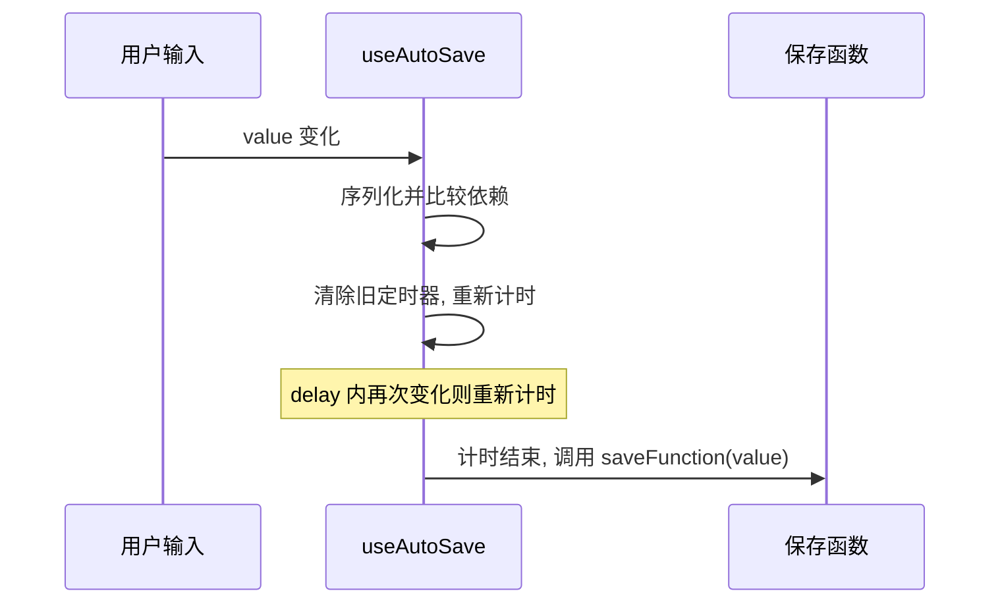
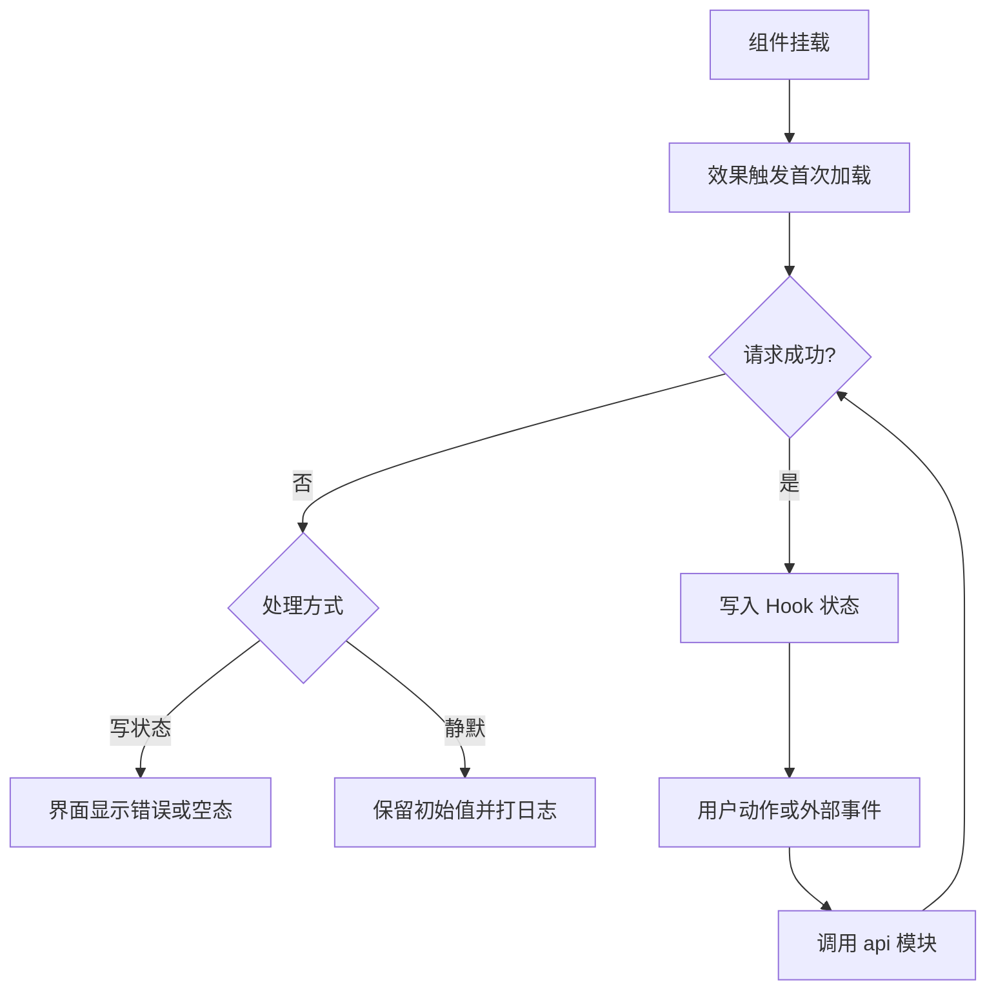

# 数据 Hook 的共同结构与防抖保存

这一层里除了管理会话、卡片与任务的那三个 Hook，还有三个与接口直接打交道的 Hook：`useAgent`（291 行）、`useConfig`（92 行）与 `useAutoSave`（25 行）。它们规模差别很大，但结构上共享同一套骨架：挂载时取一次数据、把请求状态写进自己的状态、对外暴露一个显式重载或动作函数。 这些共同结构抽出来对比之后，最短的那个 Hook——防抖保存——显出它的特殊：依赖设计决定了它是这一层里唯一不会在卸载后写状态的实现。

## 防抖保存的依赖设计

`useAutoSave` 只做一件事：值变化后等一段时间再调用保存函数，期间再次变化就重新计时（这种"只执行最后一次"的策略叫防抖，用来把连续输入合并成一次请求；反过来，每次变化都保存会打出成串请求，还可能被乱序返回的旧响应覆盖新值，而防抖的代价是最后一次修改要等 `delay` 结束才落盘）：

```tsx
const dep = typeof value === 'string' ? value : JSON.stringify(value)
useEffect(() => {
  if (timerRef.current) window.clearTimeout(timerRef.current)
  timerRef.current = window.setTimeout(() => { saveFunction(value) }, delay)
  return () => { if (timerRef.current) window.clearTimeout(timerRef.current) }
// eslint-disable-next-line react-hooks/exhaustive-deps
}, [dep, delay])
```

依赖数组里放的是序列化后的值而不是原值（`src/hooks/useAutoSave.ts`），这样对象每次重建但内容不变时不会重新计时。保存函数与原始值被排除在依赖之外，由关闭了 lint 检查的那一行保证效果只跟着序列化值与延时变化。

清理函数在值变化与卸载时都会清掉定时器（`src/hooks/useAutoSave.ts`），因此不存在卸载后写状态的问题。这一点与配置 Hook 里的两秒提示形成对照。



## 数据 Hook 的共同结构

三个 Hook 的骨架可以拆成四步。

第一步是挂载加载。`useConfig` 用一个 `mounted` 标志保护首次写入（`src/hooks/useConfig.ts`）；`useAgent` 用 `loadedSession` 引用记住已加载的会话，避免重复请求（`src/hooks/useAgent.ts`）。两种写法都解决"异步返回时组件是否还在"或"是否已经加载过"的问题。

第二步是显式重载。`useConfig` 暴露 `load` 供手动刷新（`src/hooks/useConfig.ts`），`useAgent` 在会话变化时由效果重新拉取（`src/hooks/useAgent.ts`）。前者没有挂载守卫（见易错点）。

第三步是状态机。配置层有保存与测试两套四态状态机（`src/hooks/useConfig.ts`），Agent 层用"是否流式进行中"一个布尔值加消息上的流式标记（`src/hooks/useAgent.ts`、`src/api/agent.ts`）。状态粒度不同，但都避免用字符串描述复合情况。

第四步是错误处理。有的写进状态并弹窗（`src/hooks/useSessionManager.ts`），有的只打日志保留旧数据（`src/hooks/useCardManager.ts`），有的直接静默返回空值（`src/api/agent.ts`）。



## 谁触发刷新

数据不是单向流一次就结束，多个动作会回头触发重载。把触发源列出来能看清各 Hook 之间的实际耦合：

| 触发源 | 被调用的加载 | 位置 |
| --- | --- | --- |
| 切换到某个会话 | 卡片列表 | `src/hooks/useSessionManager.ts` |
| 采集任务完成 | 卡片列表与用户积分 | `src/hooks/useTaskManager.ts` |
| 保存卡片编辑 | 卡片列表 | `src/hooks/useCardManager.ts` |
| 批量删除卡片 | 卡片列表 | `src/hooks/useCardManager.ts` |
| 上传文档成功 | 任务表新增一条 | `src/hooks/useTaskManager.ts` |
| 会话导入成功 | 会话列表 | `src/hooks/useSessionManager.ts` |

这些调用都发生在 Hook 内部，由外壳传进来的函数或本 Hook 自己的函数完成。没有观察者或事件订阅，因此读代码时要顺着调用点找刷新时机。

## 未接入的 Hook 与静默失败

`useAutoSave` 目前在源码里找不到消费方（在 `src` 下检索该名字，组件中没有引入），它是一段已实现但未接线的能力。判断它是否可用要单独验证，不要假设保存逻辑已经在跑。

静默失败在这层出现三次，形式各不相同：

| 位置 | 失败表现 | 影响 |
| --- | --- | --- |
| `src/api/agent.ts` | 历史读取返回空数组 | 界面像没有历史，用户无法区分"新会话"与"加载失败" |
| `src/api/agent.ts` | 清空上下文返回假值 | 调用方仍会清空本地消息（`src/hooks/useAgent.ts`） |
| `src/hooks/useConfig.ts` | 配置加载只打警告 | 表单停留在默认值，用户可能直接保存默认配置 |

## 易错点

| 位置 | 问题 | 建议 |
| --- | --- | --- |
| `src/hooks/useAutoSave.ts` | 保存函数被排除在依赖外，父组件传入内联函数时会调用到旧闭包 | 用引用保存最新的保存函数，或要求调用方传稳定引用 |
| `src/hooks/useConfig.ts` | `load` 没有挂载守卫，与首次加载不一致 | 抽出公共加载函数统一加守卫 |
| `src/hooks/useConfig.ts` | 保存提示的两秒定时器没有清理 | 与 `useAutoSave` 一样保存引用并在清理函数里清除 |
| `src/hooks/useAgent.ts` | 会话切换靠引用去重，同一会话重新进入不会重载 | 数据可能被后端改动，提供手动刷新入口 |
| `src/api/agent.ts` | 历史读取失败静默返回空数组 | 区分空历史与失败，至少在控制台标注会话 ID |
| `src/hooks/useAgent.ts` | 清空上下文失败也会清空本地消息 | 只在接口返回成功时清空，或提示"仅清空了界面" |

## 小结

### 核心概念

* `useAutoSave` 用序列化值做依赖，值内容不变时不会重新计时（`src/hooks/useAutoSave.ts`）。
* 防抖定时器在值变化与卸载时都被清理（`src/hooks/useAutoSave.ts`）。
* 数据 Hook 的共同骨架是挂载加载、显式重载、状态机与错误处理四步。
* 挂载守卫有两种写法：`mounted` 标志与已加载会话引用（`src/hooks/useConfig.ts`、`src/hooks/useAgent.ts`）。
* 刷新由多个动作触发，没有事件订阅，需要顺着调用点查找（`src/hooks/useTaskManager.ts`）。
* 静默失败在 Agent 与配置层各出现若干次，界面表现与真实原因不一致。

### 设计权衡

| 选择 | 收益 | 代价 |
| --- | --- | --- |
| 防抖依赖用序列化值 | 对象重建不再触发计时 | 依赖与真实值不同步，保存函数可能过期 |
| 挂载加载加守卫 | 避免异步返回写状态 | 手动重载容易漏掉守卫 |
| 错误按场景分别处理 | 每处提示贴合业务 | 行为不统一，排查时要知道各 Hook 的约定 |
| 静默失败 | 界面不会因为非关键请求报错 | 问题被藏起来，用户与开发者都难以发现 |
| 无事件订阅，刷新靠调用 | 数据流可追踪 | Hook 之间通过回调耦合，扩展时要改装配点 |

## 练习

### 基础题

1. 说明 `useAutoSave` 的依赖数组里有哪些值，为什么用序列化结果。
2. 列出数据 Hook 骨架的四步，并各举一个例子。
3. 说出三处静默失败的位置与它们对界面的影响。

### 挑战题

4. 给 `useAutoSave` 加上"保存函数始终取最新闭包"的能力，写出实现方式并说明它为什么不会破坏防抖效果。
5. 设计一个统一的请求状态封装，让配置层与 Agent 层共用，列出需要抽取的状态与 Hook 接口，并说明现有的弹窗与静默策略如何保留。

## 附：本页引用的路径

| 路径 | 用途 |
| --- | --- |
| /mnt/d/KnowledgeDiver/frontend/ | 前端工程根目录，文中相对路径均相对它 |
| `src/hooks/useAutoSave.ts` | 防抖保存 Hook |
| `src/hooks/useConfig.ts` | 配置加载、保存与测试状态 |
| `src/hooks/useAgent.ts` | Agent 消息与订阅 |
| `src/hooks/useCardManager.ts` | 卡片加载与增删改 |
| `src/hooks/useSessionManager.ts` | 会话加载与导入导出 |
| `src/hooks/useTaskManager.ts` | 任务表与完成后的刷新 |
| `src/api/agent.ts` | Agent 接口与静默返回 |
