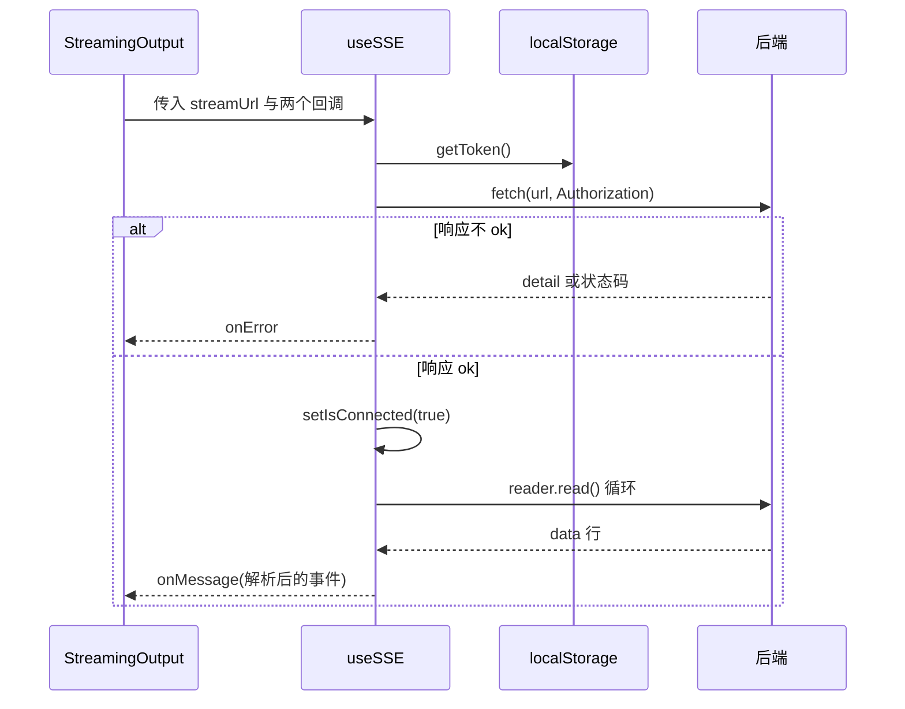
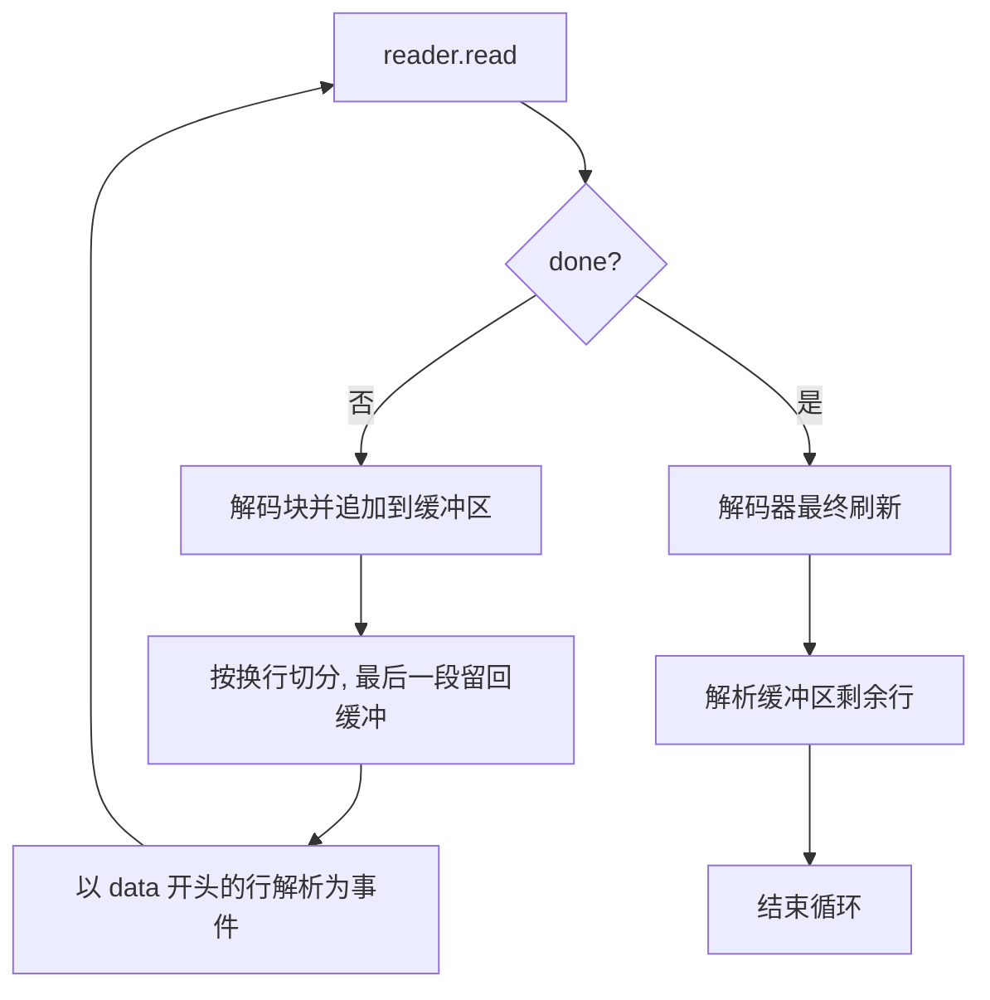

# SSE 客户端与流解析

采集任务的进度靠后端推送的事件流拿到，不走轮询。前端只有一个 Hook 负责读这条流：`src/hooks/useSSE.ts`，124 行，被流式输出组件使用（`src/components/StreamingOutput.tsx`）。

它没有使用浏览器的 `EventSource`（浏览器内置的 SSE 客户端，订阅一条事件流只要一行，但不能自定义请求头，也不便于主动中止），改用 `fetch` 拿到响应体后自己解码、切行、解析——解码用 `TextDecoder` 把响应体的二进制块按 UTF-8 转成字符串，切行与解析都是手写的。这样做的主要原因是鉴权头：`EventSource` 不能自定义请求头，而所有采集流都需要带 token。这里选 SSE 而不是 WebSocket，则是因为数据只需要服务器到浏览器的单向推送：SSE 本质就是一条普通 HTTP 响应，天然穿过代理与防火墙、能复用现有鉴权；WebSocket 是全双工，要额外处理升级握手、心跳与断线重连。代价是 SSE 只能单向，也没有成熟的双向心跳，空闲连接的回收要靠服务端或读超时兜底。 它与 Agent 侧那份流读取实现结构相似，卡死保护上不同：采集流没有超时，Agent 流在 300 秒没有数据时自动中止（`src/api/agent.ts`）。

## 用 fetch 代替 EventSource

连接从一次 `fetch` 开始，token 以请求头方式带上（`src/hooks/useSSE.ts`）：

```tsx
const token = getToken()
const abortController = new AbortController()
const response = await fetch(url, {
  headers: token ? { 'Authorization': `Bearer ${token}` } : {},
  signal: abortController.signal,
})
```

响应非 2xx 时先尝试解析错误体取 `detail`，解析失败则回落到状态码（`src/hooks/useSSE.ts`）。连接建立后立刻把状态置为已连接，再取读取器；没有响应体则抛错。

取消用一个 `AbortController` 实现，清理函数里中止它并把引用置空（`src/hooks/useSSE.ts`），也对外暴露一个手动断开函数。中止触发的异常在捕获处被识别为 `AbortError` 并静默返回，不会走错误回调。



## 解码、切行与缓冲区

读取循环维护一个字符串缓冲（`src/hooks/useSSE.ts`）。每次读到块后解码并追加到缓冲，按换行切分，最后一段不完整的行留在缓冲里等下一次：

```tsx
const lines = buffer.split('
')
buffer = lines.pop() || ''
for (const line of lines) {
  if (line.startsWith('data: ')) {
    try { onMessageRef.current(JSON.parse(line.slice(6))) }
    catch (e) { console.warn('SSE line parse failed:', e) }
  }
}
```

流结束时还有一次特殊处理：先对解码器做最终刷新，再解析缓冲里剩下的内容（`src/hooks/useSSE.ts`）。注释说明了原因：不做这一步会丢掉最后一条事件，界面停在"正在生成"。解析失败只打警告，不中断整个流。



## 回调引用与效果依赖

两个回调被存进引用，并在每次渲染时同步更新（`src/hooks/useSSE.ts`）。读取循环里统一调用引用上的函数，因此父组件传入新的回调函数不会重启连接。

效果的依赖只有地址一项（`src/hooks/useSSE.ts`），地址变化才会重新连接。回调通过引用取最新值，这个组合意味着：地址不变时连接不重建，但每次事件都调用最新的处理函数。

## 与 Agent 侧流读取的差别

Agent 侧另有一份流读取实现（`src/api/agent.ts`），两者结构相似，差别在三处：

| 维度 | `useSSE` | Agent 侧读取函数 |
| --- | --- | --- |
| 形态 | React Hook，依赖地址与清理函数 | 异步生成器，逐条 `yield` 事件 |
| 空数据保护 | 无 | 300 秒无数据自动中止（`src/api/agent.ts`） |
| 结束刷新 | 有缓冲刷新（`src/hooks/useSSE.ts`） | 有同样处理（`src/api/agent.ts`） |
| 错误体 | 解析 `detail`（`src/hooks/useSSE.ts`） | 读文本整体作为错误（`src/api/agent.ts`） |

两份实现都按行切分并跳过不以 `data: ` 开头的内容，也都在解析失败时继续。采集流没有卡死超时，Agent 流有；这是两处最需要注意的差别。

## 易错点

| 位置 | 问题 | 建议 |
| --- | --- | --- |
| `src/hooks/useSSE.ts` | 导入了 `parseSSEMessage` 却在循环里手写解析，导入未被使用 | 删掉导入，或改用该函数统一解析 |
| `src/hooks/useSSE.ts` | 流正常结束后直接跳出循环，没有把连接状态置为假 | 结束分支里同步 `setIsConnected(false)` |
| `src/hooks/useSSE.ts` | 只有中止会被静默；网络中断会走错误回调并置为未连接，但不会自动重连 | 需要重试场景时补退避重连，或明确告知用户 |
| `src/hooks/useSSE.ts` | 缓冲区只有字符串拼接，没有上限；后端若持续推送超长行会占用内存 | 单行长度设上限，超限丢弃并记日志 |
| `src/api/stream.ts` | `startCollection` 用 `EventSource` 且不带 token，当前没有调用点 | 删除或改为与 `useSSE` 一致的实现 |
| `src/hooks/useTaskManager.ts` | 导入了 `startCollection` 但未调用 | 删掉未使用的导入 |

## 小结

### 核心概念

* 采集流用 `fetch` 加读取器实现，因为需要自定义鉴权头（`src/hooks/useSSE.ts`）。
* 每行以 `data: ` 前缀识别，JSON 解析失败只打警告（`src/hooks/useSSE.ts`）。
* 缓冲区保留不完整行，流结束时先刷新解码器再解析剩余内容（`src/hooks/useSSE.ts`）。
* 回调存进引用并按渲染更新，连接只依赖地址（`src/hooks/useSSE.ts`）。
* 中止与卸载都通过 `AbortController`，中止异常静默处理（`src/hooks/useSSE.ts`）。
* Agent 侧有对应实现，多一层 300 秒无数据中止（`src/api/agent.ts`）。

### 设计权衡

| 选择 | 收益 | 代价 |
| --- | --- | --- |
| 不用 `EventSource` | 可以自定义请求头与中止方式 | 需要自己处理切行、解码与结束刷新 |
| 回调放引用 | 父组件换回调不重启连接 | 事件处理逻辑对连接生命周期不可见 |
| 解析失败继续 | 单条坏数据不影响整条流 | 坏数据被静默跳过，排查需要看控制台 |
| 连接只依赖地址 | 行为可预期 | 地址不变时无法通过其他参数重连 |
| 无自动重连 | 实现简单，不会无声重试 | 网络抖动后需要用户重新触发任务 |

## 练习

### 基础题

1. 说明为什么这里用 `fetch` 而不用 `EventSource`。
2. 缓冲区的作用是什么，为什么最后一段要留回缓冲区。
3. 流结束时的那次解码器刷新解决了什么问题。

### 挑战题

4. 给 `useSSE` 加自动重连，写出退避策略、重连上限与状态复位逻辑，并说明如何避免重复插入同一条事件。
5. 把 `useSSE` 与 Agent 侧的读取函数统一成一份实现，列出两份代码的差异点与合并后的接口设计。

## 附：本页引用的路径

| 路径 | 用途 |
| --- | --- |
| /mnt/d/KnowledgeDiver/frontend/ | 前端工程根目录，文中相对路径均相对它 |
| `src/hooks/useSSE.ts` | 采集流读取与连接状态 |
| `src/api/agent.ts` | Agent 侧的流读取与卡死判定 |
| `src/api/stream.ts` | 早期 `EventSource` 帮助函数与消息解析 |
| `src/hooks/useTaskManager.ts` | 采集流地址的来源 |
| `src/components/StreamingOutput.tsx` | 本 Hook 的唯一消费方 |
| `src/types/pipeline.ts` | 事件与阶段类型 |
