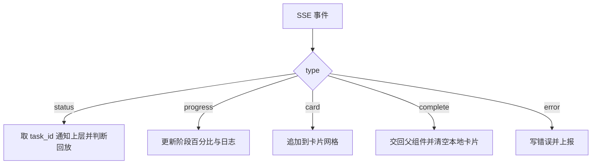
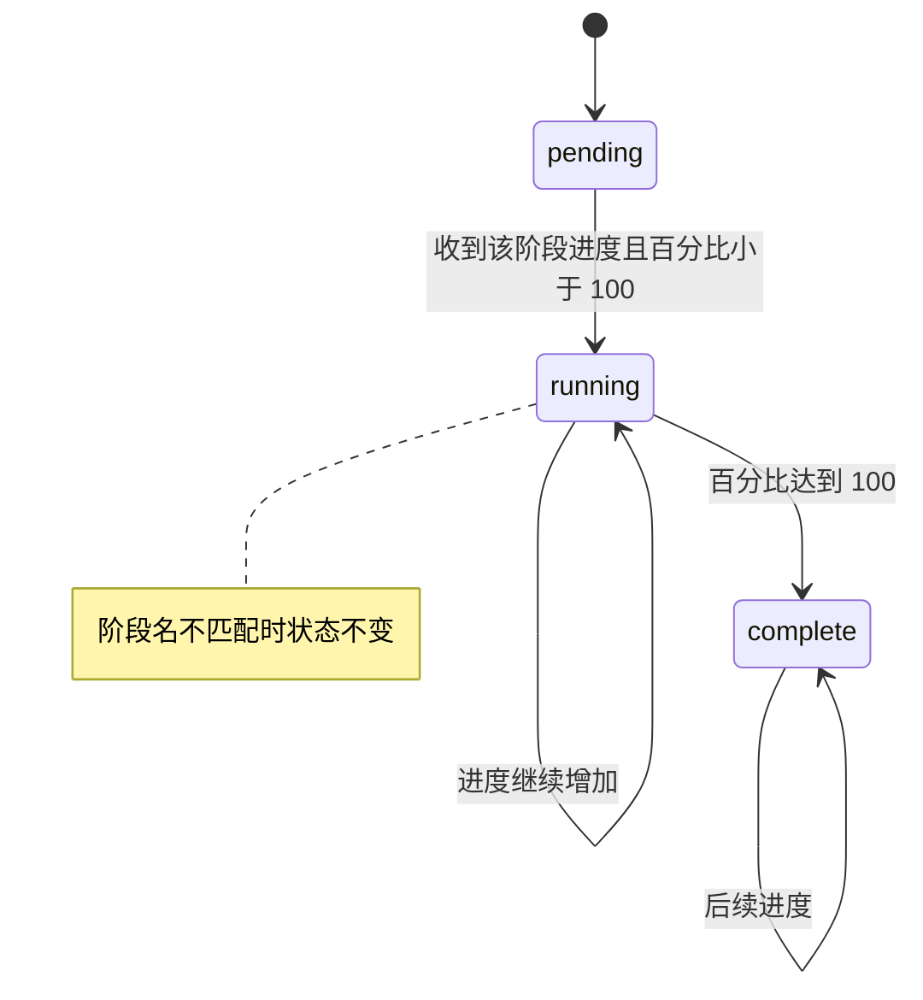

# 采集流水线的事件与阶段状态机

流式输出组件 `src/components/StreamingOutput.tsx`（276 行）是采集任务的界面主体：标题行、终端样式的日志、五个阶段的进度条、AI 生成内容的实时面板与已生成卡片网格。它订阅一条 SSE 流，把事件翻译成这五块界面。

组件的状态比它订阅的 Hook 多得多：七个状态加八个引用（`src/components/StreamingOutput.tsx`）。 事件类型、阶段状态、日志与输出、完成与回放这四段决定了这些状态如何被驱动。

## 五种事件与五个阶段

长任务的状态推送通常按"一组离散阶段 + 一条终态"来设计：进度用有限枚举表达，成功与失败单独收尾，前端才能把任意一个事件映射到确定的界面状态，而不必靠字符串比较去猜。本项目的阶段有五个，加完成与错误共七个取值（`src/types/pipeline.ts`）：

```tsx
export type PipelineStage = 'searching' | 'scraping' | 'summarizing' | 'generating' | 'expanding' | 'complete' | 'error'
```

事件类型有五种：进度、卡片、错误、完成与状态（`src/types/pipeline.ts`）。进度事件的载荷结构最完整，带阶段、文案、进度值、时间戳，以及可选的在处理项与 AI 输出。卡片事件直接携带一张卡片，完成事件带卡片数，状态事件带任务 ID 与状态字符串。

任务类型另有五个取值，其中采集与扩展是这条流最常用的两种（`src/types/pipeline.ts`）。状态字符串与任务状态枚举一致。



## 阶段状态机与进度映射

五个阶段的初始状态都是待开始（`src/components/StreamingOutput.tsx`）。进度事件到达时按阶段名匹配并更新：

```tsx
const progressPercent = Math.round(p.progress * 100)
setStages((prev) => prev.map((s) => {
  if (s.stage === p.stage) {
    const newStatus = progressPercent >= 100 ? 'complete' : 'running'
    return { ...s, progress: progressPercent, status: newStatus, message: p.message }
  }
  return s
}))
```

进度值是零到一的小数，界面用百分比整数显示，到达一百即标记该阶段完成。阶段列表里没有"完成"与"错误"两个取值，因此进度事件若带着这两个阶段名，更新不会命中任何一项。



## 日志与 AI 输出

终端区域显示的是拼接后的日志行。每条进度消息先按阶段名加前缀，再经过一个英文到中文的替换表（`src/components/StreamingOutput.tsx`）。替换表按关键词长度降序匹配，避免短词先替换掉长词的一部分。

写入日志前有两道过滤（`src/components/StreamingOutput.tsx`）：生成阶段的文案不重复写，与其他阶段重复的整行也跳过。行数上限是两百，超出后保留最后两百行。

AI 输出面板按处理项聚合（`src/components/StreamingOutput.tsx`）：

```tsx
const next = { ...prev, [p.current_item!]: p.ai_output! }
const keys = Object.keys(next)
if (keys.length > 20) {
  keys.slice(0, keys.length - 20).forEach(k => delete next[k])
}
```

同一处理项的流式文本反复覆盖同一个键，因此面板数量取决于并发处理项；上限二十条，超出后按插入顺序删除最早的项目。

## 完成与回放

"完成"有两种来源：进度事件里阶段名为完成，以及独立的完成事件。前者只把进度条补齐（`src/components/StreamingOutput.tsx`），后者才触发回调。回调有一次保护，重复的完成事件不会重复上报：

```tsx
const handleComplete = useCallback((finalCards: Card[]) => {
  if (completedRef.current) return
  completedRef.current = true
  onComplete(searchId, finalCards)
}, [onComplete, searchId])
```

卡片由组件自己累积，不从完成事件里取：卡片事件把新卡片加入数组，同时写进一个引用（`src/components/StreamingOutput.tsx`），完成时读引用交给父组件，再清空本地列表。之所以需要引用，是因为完成事件的处理函数与卡片状态之间隔着渲染周期，直接读状态会拿到旧值。

回放是给已经结束的任务准备的。状态事件里出现已完成、已取消或出错时，组件标记为回放（`src/components/StreamingOutput.tsx`），之后完成事件不再上报、自动删除也不会发生，按钮文案从"取消"变成"关闭"。

## 易错点

| 位置 | 问题 | 建议 |
| --- | --- | --- |
| `src/components/StreamingOutput.tsx` | 事件参数写成 `any` 再断言，类型检查在这一层失效 | 直接声明为 `PipelineEvent`，由 Hook 保证类型 |
| `src/components/StreamingOutput.tsx` | 错误事件的数据被断言成 `Error`，服务端若只给字符串则 `message` 为空 | 兼容字符串与对象两种形态 |
| `src/components/StreamingOutput.tsx` | 替换表用 `RegExp` 直接拼接关键词，关键词含正则符号时会误替换 | 转义关键词，或用字符串替换 |
| `src/components/StreamingOutput.tsx` | 阶段名为完成时不更新任何阶段，进度条靠完成事件兜底 | 给完成阶段单独处理，或在事件到达时把全部阶段置满 |
| `src/components/StreamingOutput.tsx` | 回放标记同时存在引用与状态两份，容易不同步 | 只保留状态，读取时用状态或改成单一引用 |
| `src/components/StreamingOutput.tsx` | 取消只断开连接并上报，本地阶段状态保持不变 | 取消时把进行中的阶段标记为已取消或保留日志说明 |

## 小结

### 核心概念

* 流水线有五个阶段与七种取值（`src/types/pipeline.ts`）。
* 事件有进度、卡片、错误、完成与状态五类（`src/types/pipeline.ts`）。
* 进度值乘以一百取整后显示，达到一百标记阶段完成（`src/components/StreamingOutput.tsx`）。
* 日志行去重且上限两百条，AI 输出按处理项聚合并上限二十条（`src/components/StreamingOutput.tsx`）。
* 完成回调只触发一次，卡片从本地累积的引用里取（`src/components/StreamingOutput.tsx`）。
* 回放任务不触发完成回调，按钮改为关闭（`src/components/StreamingOutput.tsx`）。

### 设计权衡

| 选择 | 收益 | 代价 |
| --- | --- | --- |
| 阶段与事件分成两套枚举 | 界面阶段与协议事件各自清晰 | 需要映射，出现新阶段要同步两处 |
| 日志在前端翻译 | 后端文案可以直接展示 | 替换表要维护，长句可能被部分替换 |
| 卡片本地累积再加引用 | 完成回调不依赖渲染时机 | 状态与引用两份数据需要一起维护 |
| 日志与输出都设上限 | 长时间任务不会占满内存 | 更早的内容不可回溯 |
| 回放与实时共用组件 | 少写一个只读视图 | 多出回放标记与分支判断 |

## 练习

### 基础题

1. 列出五类事件与五个界面阶段，并说明进度事件的载荷包含哪些字段。
2. 说明日志写入前的两道过滤分别过滤什么。
3. 完成事件与阶段为完成的进度事件分别做什么。

### 挑战题

4. 让阶段状态在取消时也反映界面上，写出需要新增的阶段取值与渲染改动，并说明如何保证已有回放逻辑不受影响。
5. 把日志翻译表改成配置数据（不写死在组件里），列出数据结构与加载方式，并说明如何避免关键词互相覆盖。

## 附：本页引用的路径

| 路径 | 用途 |
| --- | --- |
| /mnt/d/KnowledgeDiver/frontend/ | 前端工程根目录，文中相对路径均相对它 |
| `src/components/StreamingOutput.tsx` | 流式输出界面与事件处理 |
| `src/types/pipeline.ts` | 阶段、事件与任务类型 |
| `src/hooks/useSSE.ts` | 事件来源 |
| `src/components/ProgressIndicator.tsx` | 阶段进度条 |
| `src/components/GeneratedCard.tsx` | 已生成卡片展示 |
| `src/components/StreamingOutput.css` | 终端与面板样式 |
