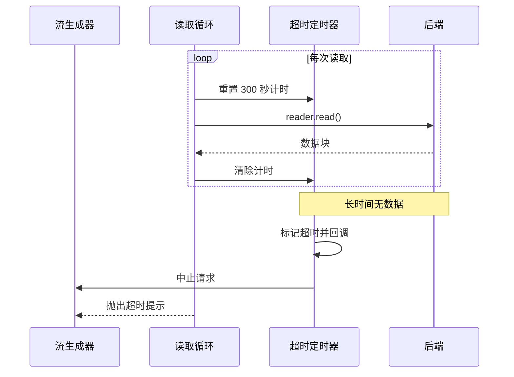
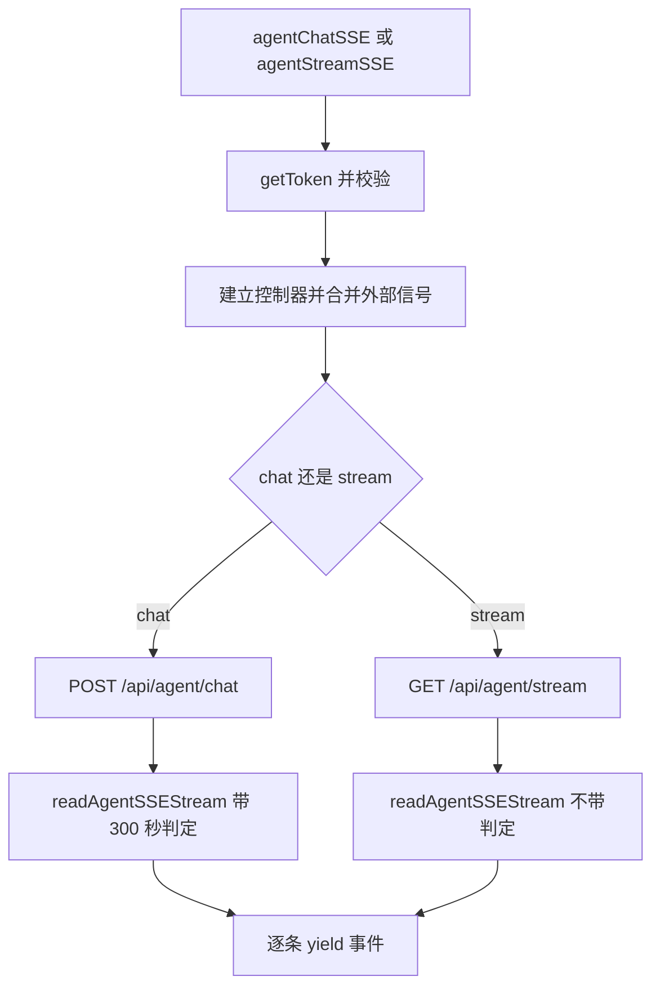

# Agent 流的取消与卡死超时

Agent 的两条流都实现在 `src/api/agent.ts` 里：聊天流是 POST，订阅后台循环流是 GET（`src/api/agent.ts:194-228`、`src/api/agent.ts:230-255`）。它们共用一份读取循环（`src/api/agent.ts:123-192`），差别只在请求方式与错误信息。

与采集流相比，这条链路多了一个明确的时间约束：三百秒没有任何数据就判定卡死并主动中止（`src/api/agent.ts:4`）。 这个判定如何计时、取消信号如何合并，以及 Hook 侧如何避免两个订阅者抢同一队列，是这条链路的关键。

## 三百秒无数据的判定

判定按两次读取之间的间隔计时，不给整条流设总时长。每次进入读取前先重置定时器（`src/api/agent.ts:135-142`）：

```tsx
const armStall = () => {
  if (!stallMs) return
  clearTimeout(stallTimer)
  stallTimer = window.setTimeout(() => {
    stallFired = true
    onStall?.()
  }, stallMs)
}
```

循环里每次 `read` 之前调用一次（`src/api/agent.ts:146`），读到数据后立即清除（`src/api/agent.ts:154`）。因此只要持续有数据，计时会不断被重置，不会误判；一旦卡住，定时器触发，把标记置真并调用回调，回调再中止请求（`src/api/agent.ts:227`）。中止会让正在等待的 `read` 抛异常，读取处根据标记判断是超时还是普通中断，并把提示语换成更明确的一条（`src/api/agent.ts:148-152`）：

```tsx
try { chunk = await reader.read() }
catch (err) {
  if (stallFired) throw new Error(`Agent 响应超时（${(stallMs ?? 0) / 1000}s 无数据），已自动中止`)
  throw err
}
```

无论正常结束还是抛错，定时器都在 `finally` 里清理（`src/api/agent.ts:189-191`）。



## 外部信号与主动中止的合并

两个生成器都接受可选的 `AbortSignal`，内部再建一个控制器，把外部信号与自身的超时中止合并到一起（`src/api/agent.ts:200-207`）：

```tsx
const controller = new AbortController()
const onAbort = () => controller.abort()
signal?.addEventListener('abort', onAbort)
if (signal?.aborted) controller.abort()
```

外部信号已经处于已中止状态时补一次主动中止（`src/api/agent.ts:206`），覆盖"调用前就被取消"的情况。请求结束后在 `finally` 里移除监听（`src/api/agent.ts:228-230`），避免控制器被长期引用。

采集流那个 Hook 用同样的方式处理取消，但只在清理函数里中止（`src/hooks/useSSE.ts:108-112`），没有外部信号参数。两处的差别在于 Agent 流被多处复用，取消源更多。

## 两条生成器的差别

| 维度 | 聊天流 | 订阅后台循环流 |
| --- | --- | --- |
| 方法与端点 | POST `/api/agent/chat`（`src/api/agent.ts:212-221`） | GET `/api/agent/stream`（`src/api/agent.ts:240-246`） |
| 请求体 | 消息与会话 ID | 无，会话 ID 在查询串里 |
| 无 token 时 | 抛"未认证"（`src/api/agent.ts:199-200`） | 同样抛出（`src/api/agent.ts:232-233`） |
| 错误信息 | 读响应文本（`src/api/agent.ts:223-226`） | 只有状态码（`src/api/agent.ts:247`） |
| 卡死判定 | 启用（`src/api/agent.ts:227`） | 未启用（`src/api/agent.ts:248`） |

订阅后台循环这条流没有卡死判定，因为它的语义是"有循环就推、没有就结束"，长期无数据属于正常情况（`src/hooks/useAgent.ts:175`）。



## Hook 侧的取消接线

`useAgent` 持有两个控制器引用：一个给聊天流，一个给后台循环订阅（`src/hooks/useAgent.ts:49-50`）。发送新消息前会中止后台订阅（`src/hooks/useAgent.ts:247-249`），注释写明是为了避免两个订阅者抢同一队列。

取消函数只中止聊天流的控制器（`src/hooks/useAgent.ts:286-288`），后台订阅不受影响。组件卸载时两个都中止，并取消尚未执行的动画帧（`src/hooks/useAgent.ts:207-211`）。聊天流捕获到中止异常时按 `AbortError` 名称识别并静默收尾（`src/hooks/useAgent.ts:260-261`），与超时错误区分开：超时会作为一条错误消息追加到对话里。

## 易错点

| 位置 | 问题 | 建议 |
| --- | --- | --- |
| `src/api/agent.ts:138-141` | 超时回调在中止后仍会触发异常路径，提示依赖标记判断 | 保留标记方案，但把提示语集中到一处常量 |
| `src/api/agent.ts:206` | 只有已中止的情况补一次，其他异常状态未检查 | 属防御性写法，可保留 |
| `src/api/agent.ts:247` | 订阅流错误只有状态码，缺少服务端文案 | 与其他路径一致地读取响应文本 |
| `src/api/agent.ts:230-255` | 订阅流没有卡死判定，服务端异常保持连接时会一直挂着 | 视后端心跳约定决定是否补判定 |
| `src/hooks/useAgent.ts:247-249` | 发送新消息会静默中止后台订阅，正在显示的工具事件会停止刷新 | 中止前记录原因，或保留订阅改为队列合并 |
| `src/hooks/useAgent.ts:260-261` | 所有 `AbortError` 都静默，包括超时中止之外的异常中断 | 保留名称判断，同时把非用户取消的原因写进控制台 |

## 小结

### 核心概念

* 两条 Agent 流共用一份读取循环，差别在请求方式与错误信息（`src/api/agent.ts:194-255`）。
* 卡死判定按两次读取之间的间隔计时，每次读取前重置、读到数据后清除（`src/api/agent.ts:135-154`）。
* 超时后主动中止并抛出带秒数的提示（`src/api/agent.ts:148-152`、`:227`）。
* 外部信号通过监听器合并到内部控制器，并在结束时移除（`src/api/agent.ts:200-207`、`:228-230`）。
* 订阅后台循环流不启用卡死判定（`src/api/agent.ts:248`）。
* Hook 侧两个控制器分别管聊天流与后台订阅（`src/hooks/useAgent.ts:49-50`、`:207-211`）。

### 设计权衡

| 选择 | 收益 | 代价 |
| --- | --- | --- |
| 按读取间隔而非总时长计超时 | 长回答不会被总时长误杀 | 每次读取都要重置定时器，逻辑分散在循环里 |
| 内部控制器合并外部信号 | 一处发起请求，多处可取消 | 监听器要及时移除，否则控制器被引用 |
| 订阅流不设卡死 | 语义简单，空闲即结束 | 服务端异常保持连接时会一直挂着 |
| 中止异常静默 | 用户主动取消不产生错误消息 | 非用户原因的异常中断也被吞掉 |
| 时间常量与后端对齐 | 前后端判定一致 | 后端调整时需要同步修改前端常量 |

## 练习

### 基础题

1. 说明卡死判定的计时起止点，为什么不是给整条流设总时长。
2. 外部信号是怎么合并进内部控制器的，结束时做了什么清理。
3. 两条生成器在错误信息与卡死判定上的差别。

### 挑战题

4. 给订阅后台循环流加上心跳判定，写出心跳事件的形态与前端判定逻辑，并说明怎样避免把"正常空闲"误判为卡死。
5. 把"静默中止"改成能区分用户取消与超时中止，列出需要传递的状态与界面呈现方式。

## 附：本页引用的路径

| 路径 | 用途 |
| --- | --- |
| /mnt/d/KnowledgeDiver/frontend/ | 前端工程根目录，文中相对路径均相对它 |
| `src/api/agent.ts` | 两条流生成器与共用读取循环 |
| `src/hooks/useAgent.ts` | 取消接线与订阅管理 |
| `src/hooks/useSSE.ts` | 采集流的取消实现对照 |
| `src/types/pipeline.ts` | 事件类型定义 |
