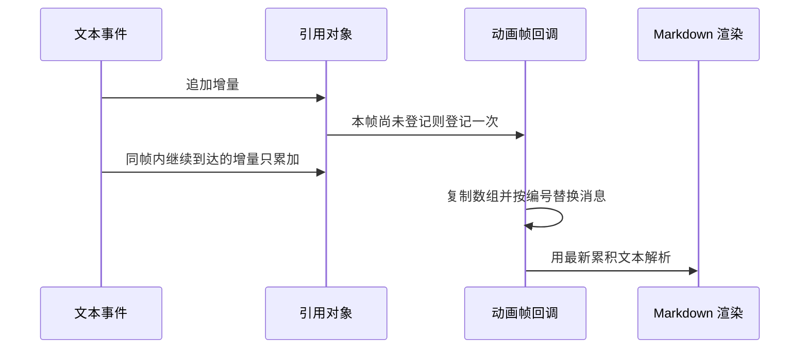
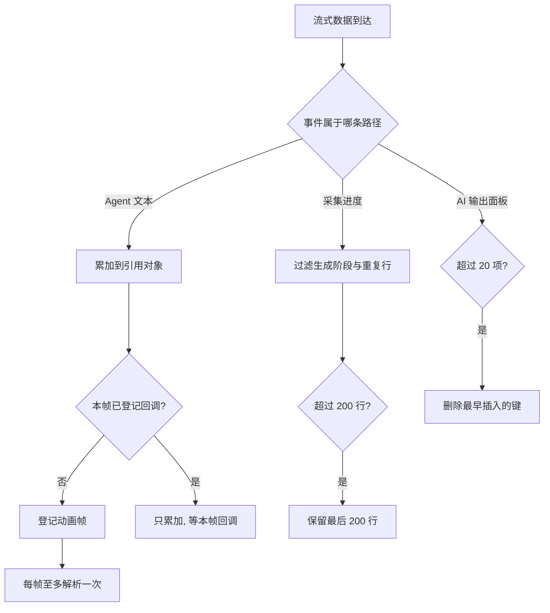

# 流式渲染的节流与上限

一条较长的 Agent 回复在界面上是逐段出现的。后端每生成一小段文本就推一个事件，前端收到后把这段内容追加到对应的消息上。看起来只是往字符串末尾接东西，代价却不在拼接本身：消息用 Markdown 渲染，每次更新都要重新解析累积后的全文，于是文本越长单次解析越贵，而事件在整段回复期间持续到达。

采集任务的日志走的是同一套事件通道，处理方式却不一样——它按事件逐条追加，没有做按帧合并。决定策略的是两个量：事件到达的频率，和单次渲染的成本。按固定时间窗把多次更新合并成一次的策略叫节流，与防抖的区别在于它会周期性地真正执行、而不是只保留最后一次。把三条流式路径放在一起，能看清它们各自被哪个量主导。

## 增量文本的解析成本

Agent 的文本事件处理里，增量先累加到一个引用对象上，渲染交给动画帧回调（`requestAnimationFrame`：浏览器在下一次重绘前调用注册的函数，用它能把更新压到每帧至多一次）：

```tsx
streamMsgRef.current.content += event.data.content
// throttle to max 1 render per frame — ReactMarkdown re-parses
// the full accumulated text on every render, crushing the browser
if (!textRafRef.current) {
  textRafRef.current = requestAnimationFrame(() => {
    textRafRef.current = null
    const msg = streamMsgRef.current
    if (!msg) return
    setMessages(prev => { ... 用 msg.content 覆盖对应消息 ... })
  })
}
```

代码里的注释写明了动机：Markdown 渲染器每次都要重新解析累积的全文（`src/hooks/useAgent.ts`）。不合并的话，一个字符一个事件就会触发一次解析；第 i 次解析的范围约等于当时的文本长度，整段回复累计下来，解析量随长度按平方增长。按帧合并把解析次数压到"每帧至多一次"，把这条平方曲线拉回与时长成正比。

## 引用与状态两份数据

合并的实现用的是"引用存最新、状态存已渲染"的分工：引用对象始终持有最新文本，状态里的消息只在帧回调里被覆盖（`src/hooks/useAgent.ts`）。帧回调做的事情是复制整个消息数组、按编号找到对应消息、替换它的内容。

这个分工带来两个直接后果。中间态不会出现在界面上：一帧内到达的多个增量只渲染最后一次，用户看到的是跳变而不是逐字动画。另一个后果是同一份内容存在两处，读代码时需要判断当前看到的是哪一份——引用里的值比状态里的值新。

帧回调本身也不便宜：每帧复制数组并做一次查找，消息数量越多，这一步的固定开销越大。它把更新频率降下来了，但没有让单次更新的规模变小。



## 采集日志为什么逐条追加

采集流的进度处理做了两道过滤再追加：生成阶段的文案不写入日志，与上一条完全相同的整行也跳过（`src/components/StreamingOutput.tsx`）。追加后如果行数超过两百，只保留最后两百行。

终端区域在渲染时把数组拼成字符串（`src/components/StreamingOutput.tsx`）。拼接虽然发生在每次渲染，但输入长度被两百行上限约束，频率又远低于文本增量，因此不需要按帧合并。

事件条数与渲染次数也不相等。读取回调会一次性处理缓冲区里已经完整的若干行（`src/hooks/useSSE.ts`），同一批事件落在同一次渲染里；分布在两个读取块里的事件才各自触发一次。实际渲染次数因此取决于网络分块方式。



## 三处内存上限

三处上限分散在不同文件里，处理方式一致：超出后保留最新内容。

| 位置 | 上限 | 超出后的处理 |
| --- | --- | --- |
| Agent 消息数组 | 100 条 | 截取最后 100 条（`src/hooks/useAgent.ts`） |
| 采集日志行 | 200 行 | 截取最后 200 行（`src/components/StreamingOutput.tsx`） |
| AI 输出面板 | 20 项 | 删除最早插入的键（`src/components/StreamingOutput.tsx`） |

消息上限那条注释写的是防止无限增长导致浏览器内存溢出（`src/hooks/useAgent.ts`）。代价是早期内容不可回看：一场长任务跑下来，终端里最早几个阶段的输出会被挤掉，而阶段进度条仍在，因为它保存在另一个数组里。

截断发生在追加之后，也就是说每新增一条消息都会触发一次"复制加截取"。数量达到上限后，这个动作的频率等于消息新增频率。

## 列表没有记忆化时的放大

消息列表用映射直接展开，没有做记忆化（记忆化指缓存上一次的结果，输入不变就跳过重算或重渲染，React 里对应 `React.memo` 与 `useMemo`）（`src/components/AgentPanel.tsx`）。在整个前端目录里检索记忆化相关写法没有命中，说明列表项没有独立的比较逻辑。于是任何一次消息数组更新，都会重新渲染列表里的每一条消息。

流式光标让这件事更明显：它与消息内容在同一个元素里（`src/components/AgentPanel.tsx`），光标闪烁引起的变化会带动整条消息重新渲染。移动端抽屉用同样的结构渲染 Agent 消息（`src/components/AgentDrawer.tsx`），因此两种形态的成本特征一致。

按帧合并降低的是更新频率，不是单次更新的条目数。对话越长，单帧里要渲染的消息越多，这正是"节流之后仍然卡"的来源。

## Markdown 解析发生在什么时候

卡片内容的渲染点在主外壳里，插件组合与元素覆盖都写在一处（`src/App.tsx`），它只在选中卡片变化或保存之后重新渲染。因此这条路径的解析成本发生在用户交互时，与推送频率无关。

Agent 那条路径的解析则由推送驱动：每帧合并出一次更新，就重解析一次流式消息的全文。两条路径用同一套插件与渲染器，成本却由完全不同的时机决定。

## 阶段数组与翻译表的重复工作

每次进度事件都会把阶段数组整体映射一遍，生成一个新数组（`src/components/StreamingOutput.tsx`）。阶段数量固定且很少，这个复制目前可以接受；如果阶段变多，就该改成按索引更新。

翻译环节的重复更明显：每条消息进来时都把翻译表按长度降序排序一遍，再为每个条目构造正则做替换（`src/components/StreamingOutput.tsx`）。表是常量，排序结果完全可以提到组件外，正则也可以预先构造。

这两处与流式本身无关，属于"事件驱动路径上顺手做的小计算"。事件一密集，它们的总量就会跟上来。

## 怎么验证这些判断

上面的结论来自静态阅读，能验证的是代码结构与调用点，不能确认实际帧率。要确认量级，可以在浏览器性能面板里观察一次长回复期间的渲染次数与长任务，或临时去掉按帧合并、对比同一段回复的渲染次数变化。日志上限的效果更直接：跑一个阶段较多的任务，看终端里最早阶段是否消失。

## 易错点

| 位置 | 问题 | 建议 |
| --- | --- | --- |
| `src/hooks/useAgent.ts` | 帧回调按编号查找并复制整个数组，消息多时每帧一次全量复制 | 流式消息单独渲染，或对列表项做记忆化 |
| `src/components/AgentPanel.tsx` | 列表未记忆化，任意一条消息变化都会重渲染全部消息 | 给消息项加记忆化，回调保持稳定引用 |
| `src/components/AgentPanel.tsx` | 光标与消息体同元素，闪烁带动整条消息的比较 | 把光标拆成独立元素 |
| `src/components/StreamingOutput.tsx` | 每次渲染都重新拼接日志字符串 | 日志变化时再拼接，或直接渲染数组 |
| `src/components/StreamingOutput.tsx` | 每条消息都重新排序翻译表并构造正则 | 排序结果与正则提到组件外 |
| `src/hooks/useAgent.ts` | 达到上限后每新增一条都触发一次截断复制 | 用环形缓冲，或按需截断 |

## 小结

### 核心概念

* Agent 文本先累加到引用，再用动画帧把渲染压到每帧最多一次（`src/hooks/useAgent.ts`）。
* 不合并时，解析量随回复长度按平方增长；合并后与时长成正比。
* 采集日志按事件追加，生成阶段不写入、完全重复的行跳过，超过两百行保留最新（`src/components/StreamingOutput.tsx`）。
* 三处上限分别是消息一百条、日志两百行、AI 输出二十项。
* 消息列表没有记忆化，单帧成本随对话长度增长（`src/components/AgentPanel.tsx`）。
* 卡片内容的 Markdown 只在交互时解析，Agent 消息的解析由推送驱动（`src/App.tsx`）。

### 设计权衡

| 选择 | 收益 | 代价 |
| --- | --- | --- |
| 按帧合并文本更新 | 长回复不再逐字符重解析 | 引用与状态两份数据，中间态不可见 |
| 采集日志不节流 | 实现简单，进度可见 | 事件密集时渲染次数等于事件数 |
| 上限保留最新 | 内存可控，界面显示最近状态 | 早期内容不可回看 |
| 列表不记忆化 | 代码直白 | 对话变长后单帧成本上升 |
| 插件组合分处声明 | 每处可独立调整 | 升级插件要改多个文件 |

## 练习

### 基础题

1. 说明 Agent 文本为什么必须按帧合并，而采集日志可以按事件追加。
2. 列出三处内存上限的位置与超出后的处理方式。
3. 为什么采集流的渲染次数与事件条数不直接对应。

### 挑战题

4. 给消息列表加记忆化并保证流式消息仍能逐帧更新，写出需要稳定的属性与比较函数，并说明如何验证长对话下的渲染次数下降。
5. 设计一个统一的流式渲染节流工具，让采集日志与 Agent 文本共用，列出接口与背压策略，并说明进度类事件与文本类事件如何区别处理。

## 附：本页引用的路径

| 路径 | 用途 |
| --- | --- |
| /mnt/d/KnowledgeDiver/frontend/ | 前端工程根目录，文中相对路径均相对它 |
| `src/hooks/useAgent.ts` | 文本增量的按帧合并与消息上限 |
| `src/components/StreamingOutput.tsx` | 采集日志、阶段数组与上限 |
| `src/hooks/useSSE.ts` | 读取回调与批量处理 |
| `src/components/AgentPanel.tsx` | 桌面 Agent 消息列表 |
| `src/components/AgentDrawer.tsx` | 移动端 Agent 消息列表 |
| `src/App.tsx` | 卡片内容的 Markdown 渲染 |
